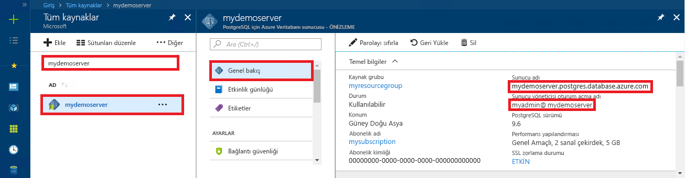

# <a name="azure-database-for-postgresql---single-server-use-net-c-to-connect-and-query-data"></a>PostgreSQL - tek bir sunucu için Azure veritabanı: .NET kullanma (C#) bağlanmak ve veri sorgulamak için
Bu hızlı başlangıçta, C# uygulaması kullanılarak PostgreSQL için Azure Veritabanı'na nasıl bağlanılacağı gösterilmiştir. Hızlı başlangıçta, veritabanında verileri sorgulamak, eklemek, güncelleştirmek ve silmek için SQL deyimlerinin nasıl kullanılacağı da gösterilmiştir. Bu makaledeki adımlarda, C# kullanarak geliştirmeyle ilgili bilgi sahibi olduğunuz ve PostgreSQL için Azure Veritabanı ile çalışmaya yeni başladığınız varsayılır.

## <a name="prerequisites"></a>Önkoşullar
Bu hızlı başlangıçta, başlangıç noktası olarak şu kılavuzlardan birinde oluşturulan kaynaklar kullanılmaktadır:
- [DB Oluşturma - Portal](quickstart-create-server-database-portal.md)
- [DB oluşturma - CLI](quickstart-create-server-database-azure-cli.md)

Şunları da yapmanız gerekir:
- [.NET Framework](https://www.microsoft.com/net/download)'ü yükleyin. NET’i platformunuza (Windows, Ubuntu Linux veya macOS) özel olarak yüklemek için bağlantılı makaledeki adımları izleyin. 
- Kod yazmak ve düzenlemek için [Visual Studio](https://www.visualstudio.com/downloads/) veya Visual Studio Code yükleyin.
- [Npgsql](https://www.nuget.org/packages/Npgsql/) Nuget paketine bir başvuru ekleyin.

## <a name="get-connection-information"></a>Bağlantı bilgilerini alma
PostgreSQL için Azure Veritabanı'na bağlanmak üzere gereken bağlantı bilgilerini alın. Tam sunucu adına ve oturum açma kimlik bilgilerine ihtiyacınız vardır.

1. [Azure Portal](https://portal.azure.com/)’da oturum açın.
2. Azure portalında sol taraftaki menüden **Tüm kaynaklar**'a tıklayın ve oluşturduğunuz sunucuyu (örneğin, **mydemoserver**) arayın.
3. Sunucunun adına tıklayın.
4. Sunucunun **Genel Bakış** panelinden **Sunucu adı** ile **Sunucu yöneticisi oturum açma adı**’nı not alın. Parolanızı unutursanız, bu panelden parolayı da sıfırlayabilirsiniz.
 

## <a name="connect-create-table-and-insert-data"></a>Bağlanma, tablo oluşturma ve veri ekleme
Bağlanıp **CREATE TABLE** ve **INSERT INTO** SQL deyimlerini kullanarak verileri yüklemek için aşağıdaki kodu kullanın. Kod, [Open()](https://www.npgsql.org/doc/api/Npgsql.NpgsqlConnection.html#Npgsql_NpgsqlConnection_Open) yöntemiyle birlikte NpgsqlCommand sınıfını kullanarak PostgreSQL veritabanı ile bağlantı kurar. Ardından kod [CreateCommand()](https://www.npgsql.org/doc/api/Npgsql.NpgsqlConnection.html#Npgsql_NpgsqlConnection_CreateCommand) yöntemini kullanarak CommandText özelliğini ayarlar ve [ExecuteNonQuery()](https://www.npgsql.org/doc/api/Npgsql.NpgsqlCommand.html#Npgsql_NpgsqlCommand_ExecuteNonQuery) yöntemini çağırarak veritabanı komutlarını çalıştırır. 

Host, DBName, User ve Password parametrelerini, sunucuyu ve veritabanını oluştururken belirttiğiniz değerlerle değiştirin. 

```csharp
using System;
using Npgsql;

namespace Driver
{
    public class AzurePostgresCreate
    {
        // Obtain connection string information from the portal
        //
        private static string Host = "mydemoserver.postgres.database.azure.com";
        private static string User = "mylogin@mydemoserver";
        private static string DBname = "mypgsqldb";
        private static string Password = "<server_admin_password>";
        private static string Port = "5432";

        static void Main(string[] args)
        {
            // Build connection string using parameters from portal
            //
            string connString =
                String.Format(
                    "Server={0};Username={1};Database={2};Port={3};Password={4};SSLMode=Prefer",
                    Host,
                    User,
                    DBname,
                    Port,
                    Password);


            using (var conn = new NpgsqlConnection(connString))

            {
                Console.Out.WriteLine("Opening connection");
                conn.Open();

                using (var command = new NpgsqlCommand("DROP TABLE IF EXISTS inventory", conn))
                { 
                    command.ExecuteNonQuery();
                    Console.Out.WriteLine("Finished dropping table (if existed)");

                }

                using (var command = new NpgsqlCommand("CREATE TABLE inventory(id serial PRIMARY KEY, name VARCHAR(50), quantity INTEGER)", conn))
                {
                    command.ExecuteNonQuery();
                    Console.Out.WriteLine("Finished creating table");
                }

                using (var command = new NpgsqlCommand("INSERT INTO inventory (name, quantity) VALUES (@n1, @q1), (@n2, @q2), (@n3, @q3)", conn))
                {
                    command.Parameters.AddWithValue("n1", "banana");
                    command.Parameters.AddWithValue("q1", 150);
                    command.Parameters.AddWithValue("n2", "orange");
                    command.Parameters.AddWithValue("q2", 154);
                    command.Parameters.AddWithValue("n3", "apple");
                    command.Parameters.AddWithValue("q3", 100);
                    
                    int nRows = command.ExecuteNonQuery();
                    Console.Out.WriteLine(String.Format("Number of rows inserted={0}", nRows));
                }
            }

            Console.WriteLine("Press RETURN to exit");
            Console.ReadLine();
        }
    }
}
```

## <a name="read-data"></a>Verileri okuma
**SELECT** SQL deyimini kullanarak bağlanmak ve verileri okumak için aşağıdaki kodu kullanın. Kod, [Open()](https://www.npgsql.org/doc/api/Npgsql.NpgsqlConnection.html#Npgsql_NpgsqlConnection_Open) yöntemiyle birlikte NpgsqlCommand sınıfını kullanarak PostgreSQL ile bağlantı kurar. Ardından kod [CreateCommand()](https://www.npgsql.org/doc/api/Npgsql.NpgsqlConnection.html#Npgsql_NpgsqlConnection_CreateCommand) ve [ExecuteReader()](https://www.npgsql.org/doc/api/Npgsql.NpgsqlCommand.html#Npgsql_NpgsqlCommand_ExecuteReader) yöntemlerini kullanarak veritabanı komutlarını çalıştırır. Daha sonra kod [Read()](https://www.npgsql.org/doc/api/Npgsql.NpgsqlDataReader.html#Npgsql_NpgsqlDataReader_Read) yöntemini kullanarak sonuçlardaki kayda gider. Son olarak kod, [GetInt32()](https://www.npgsql.org/doc/api/Npgsql.NpgsqlDataReader.html#Npgsql_NpgsqlDataReader_GetInt32_System_Int32_) ve [GetString()](https://www.npgsql.org/doc/api/Npgsql.NpgsqlDataReader.html#Npgsql_NpgsqlDataReader_GetString_System_Int32_) yöntemini kullanarak kayıttaki değerleri ayrıştırır.

Host, DBName, User ve Password parametrelerini, sunucuyu ve veritabanını oluştururken belirttiğiniz değerlerle değiştirin. 

```csharp
using System;
using Npgsql;

namespace Driver
{
    public class AzurePostgresRead
    {
        // Obtain connection string information from the portal
        //
        private static string Host = "mydemoserver.postgres.database.azure.com";
        private static string User = "mylogin@mydemoserver";
        private static string DBname = "mypgsqldb";
        private static string Password = "<server_admin_password>";
        private static string Port = "5432";

        static void Main(string[] args)
        {
            // Build connection string using parameters from portal
            //
            string connString =
                String.Format(
                    "Server={0}; User Id={1}; Database={2}; Port={3}; Password={4};SSLMode=Prefer",
                    Host,
                    User,
                    DBname,
                    Port,
                    Password);

            using (var conn = new NpgsqlConnection(connString))
            {

                Console.Out.WriteLine("Opening connection");
                conn.Open();


                using (var command = new NpgsqlCommand("SELECT * FROM inventory", conn))
                {

                    var reader = command.ExecuteReader();
                    while (reader.Read())
                    {
                        Console.WriteLine(
                            string.Format(
                                "Reading from table=({0}, {1}, {2})",
                                reader.GetInt32(0).ToString(),
                                reader.GetString(1),
                                reader.GetInt32(2).ToString()
                                )
                            );
                    }
                }
            }

            Console.WriteLine("Press RETURN to exit");
            Console.ReadLine();
        }
    }
}
```


## <a name="update-data"></a>Verileri güncelleştirme
Bağlanmak ve bir **UPDATE** SQL deyimi kullanarak verileri güncelleştirmek için aşağıdaki kodu kullanın. Kod, [Open()](https://www.npgsql.org/doc/api/Npgsql.NpgsqlConnection.html#Npgsql_NpgsqlConnection_Open) yöntemiyle birlikte NpgsqlCommand sınıfını kullanarak PostgreSQL ile bağlantı kurar. Ardından kod [CreateCommand()](https://www.npgsql.org/doc/api/Npgsql.NpgsqlConnection.html#Npgsql_NpgsqlConnection_CreateCommand) yöntemini kullanarak CommandText özelliğini ayarlar ve [ExecuteNonQuery()](https://www.npgsql.org/doc/api/Npgsql.NpgsqlCommand.html#Npgsql_NpgsqlCommand_ExecuteNonQuery) yöntemini çağırarak veritabanı komutlarını çalıştırır.

Host, DBName, User ve Password parametrelerini, sunucuyu ve veritabanını oluştururken belirttiğiniz değerlerle değiştirin. 

```csharp
using System;
using Npgsql;

namespace Driver
{
    public class AzurePostgresUpdate
    {
        // Obtain connection string information from the portal
        //
        private static string Host = "mydemoserver.postgres.database.azure.com";
        private static string User = "mylogin@mydemoserver";
        private static string DBname = "mypgsqldb";
        private static string Password = "<server_admin_password>";
        private static string Port = "5432";

        static void Main(string[] args)
        {
            // Build connection string using parameters from portal
            //
            string connString =
                String.Format(
                    "Server={0}; User Id={1}; Database={2}; Port={3}; Password={4};SSLMode=Prefer",
                    Host,
                    User,
                    DBname,
                    Port,
                    Password);

            using (var conn = new NpgsqlConnection(connString))
            {

                Console.Out.WriteLine("Opening connection");
                conn.Open();

                using (var command = new NpgsqlCommand("UPDATE inventory SET quantity = @q WHERE name = @n", conn))
                {
                    command.Parameters.AddWithValue("n", "banana");
                    command.Parameters.AddWithValue("q", 200);
                    
                    int nRows = command.ExecuteNonQuery();
                    Console.Out.WriteLine(String.Format("Number of rows updated={0}", nRows));
                }
            }

            Console.WriteLine("Press RETURN to exit");
            Console.ReadLine();
        }
    }
}


```


## <a name="delete-data"></a>Verileri silme
**DELETE** SQL deyimini kullanarak bağlanmak ve verileri silmek için aşağıdaki kodu kullanın. 

Kod, [Open()](https://www.npgsql.org/doc/api/Npgsql.NpgsqlConnection.html#Npgsql_NpgsqlConnection_Open) yöntemiyle birlikte NpgsqlCommand sınıfını kullanarak PostgreSQL veritabanı ile bağlantı kurar. Ardından kod [CreateCommand()](https://www.npgsql.org/doc/api/Npgsql.NpgsqlConnection.html#Npgsql_NpgsqlConnection_CreateCommand) yöntemini kullanarak CommandText özelliğini ayarlar ve [ExecuteNonQuery()](https://www.npgsql.org/doc/api/Npgsql.NpgsqlCommand.html#Npgsql_NpgsqlCommand_ExecuteNonQuery) yöntemini çağırarak veritabanı komutlarını çalıştırır.

Host, DBName, User ve Password parametrelerini, sunucuyu ve veritabanını oluştururken belirttiğiniz değerlerle değiştirin. 

```csharp
using System;
using Npgsql;

namespace Driver
{
    public class AzurePostgresDelete
    {
        // Obtain connection string information from the portal
        //
        private static string Host = "mydemoserver.postgres.database.azure.com";
        private static string User = "mylogin@mydemoserver";
        private static string DBname = "mypgsqldb";
        private static string Password = "<server_admin_password>";
        private static string Port = "5432";

        static void Main(string[] args)
        {
            // Build connection string using parameters from portal
            //
            string connString =
                String.Format(
                    "Server={0}; User Id={1}; Database={2}; Port={3}; Password={4};SSLMode=Prefer",
                    Host,
                    User,
                    DBname,
                    Port,
                    Password);

            using (var conn = new NpgsqlConnection(connString))
            {
                Console.Out.WriteLine("Opening connection");
                conn.Open();

                using (var command = new NpgsqlCommand("DELETE FROM inventory WHERE name = @n", conn))
                {
                    command.Parameters.AddWithValue("n", "orange");

                    int nRows = command.ExecuteNonQuery();
                    Console.Out.WriteLine(String.Format("Number of rows deleted={0}", nRows));
                }
            }

            Console.WriteLine("Press RETURN to exit");
            Console.ReadLine();
        }
    }
}

```

## <a name="next-steps"></a>Sonraki adımlar
> [!div class="nextstepaction"]
> [Dışarı Aktarma ve İçeri Aktarma seçeneğini kullanarak veritabanınızı geçirme](./howto-migrate-using-export-and-import.md)
