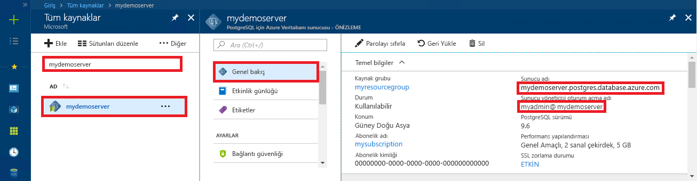

# <a name="azure-database-for-postgresql-use-go-language-to-connect-and-query-data"></a>PostgreSQL için Azure Veritabanı: Bağlanmak ve veri sorgulamak için Go dilini kullanma
Bu hızlı başlangıçta, [Go](https://golang.org/) dilinde (golang) yazılmış kod kullanılarak PostgreSQL için Azure Veritabanı’na nasıl bağlanılacağı gösterilmiştir. Ayrıca veritabanında veri sorgulamak, eklemek, güncelleştirmek ve silmek için SQL deyimlerini nasıl kullanacağınız da gösterilmiştir. Bu makalede, Go kullanarak geliştirmeyle ilgili bilgi sahibi olduğunuz ve PostgreSQL için Azure Veritabanı ile çalışmaya yeni başladığınız varsayılır.

## <a name="prerequisites"></a>Ön koşullar
Bu hızlı başlangıçta, başlangıç noktası olarak şu kılavuzlardan birinde oluşturulan kaynaklar kullanılmaktadır:
- [DB Oluşturma - Portal](quickstart-create-server-database-portal.md)
- [DB Oluşturma - Azure CLI](quickstart-create-server-database-azure-cli.md)

## <a name="install-go-and-pq-connector"></a>Go ve pq bağlayıcısını yükleme
Makinenize [Go](https://golang.org/doc/install)’yu ve [Pure Go Postgres sürücüsünü (pq)](https://github.com/lib/pq) yükleyin. Platformunuza bağlı olarak, uygun adımları izleyin:

### <a name="windows"></a>Windows
1. [Yükleme yönergelerine](https://golang.org/doc/install) uygun olarak Microsoft Windows için Go’yu [indirin](https://golang.org/dl/) ve yükleyin.
2. Başlat menüsünden komut istemini başlatın.
3. Projeniz için`mkdir  %USERPROFILE%\go\src\postgresqlgo` gibi bir klasör oluşturun.
4. Dizini değiştirerek proje klasörünüze geçin; örneğin, `cd %USERPROFILE%\go\src\postgresqlgo`.
5. GOPATH için ortam değişkenini kaynak kod dizinine işaret edecek şekilde ayarlayın. `set GOPATH=%USERPROFILE%\go`.
6. `go get github.com/lib/pq` komutunu çalıştırarak [Pure Go Postgres sürücüsünü (pq)](https://github.com/lib/pq) yükleyin.

   Özetle, Go’yu yükleyin ve ardından komut isteminde şu komutları çalıştırın:
   ```cmd
   mkdir  %USERPROFILE%\go\src\postgresqlgo
   cd %USERPROFILE%\go\src\postgresqlgo
   set GOPATH=%USERPROFILE%\go
   go get github.com/lib/pq
   ```

### <a name="linux-ubuntu"></a>Linux (Ubuntu)
1. Bash kabuğunu başlatın. 
2. `sudo apt-get install golang-go` komutunu çalıştırarak Go'yu yükleyin.
3. Giriş dizininizde projeniz için `mkdir -p ~/go/src/postgresqlgo/` gibi bir klasör oluşturun.
4. Dizini değiştirerek klasöre geçin; örneğin, `cd ~/go/src/postgresqlgo/`.
5. GOPATH ortam değişkenini geçerli bir kaynak dizine, örneğin geçerli giriş dizininizin go klasörüne işaret edecek şekilde ayarlayın. Bash kabuğunda `export GOPATH=~/go` komutunu çalıştırarak geçerli kabuk oturumu için GOPATH olarak go dizinini ayarlayın.
6. `go get github.com/lib/pq` komutunu çalıştırarak [Pure Go Postgres sürücüsünü (pq)](https://github.com/lib/pq) yükleyin.

   Özetle şu bash komutlarını çalıştırın:
   ```bash
   sudo apt-get install golang-go
   mkdir -p ~/go/src/postgresqlgo/
   cd ~/go/src/postgresqlgo/
   export GOPATH=~/go/
   go get github.com/lib/pq
   ```

### <a name="apple-macos"></a>Apple macOS
1. Platformunuza uygun [yükleme yönergelerine](https://golang.org/doc/install) göre Go’yu indirip yükleyin. 
2. Bash kabuğunu başlatın. 
3. Giriş dizininizde projeniz için `mkdir -p ~/go/src/postgresqlgo/` gibi bir klasör oluşturun.
4. Dizini değiştirerek klasöre geçin; örneğin, `cd ~/go/src/postgresqlgo/`.
5. GOPATH ortam değişkenini geçerli bir kaynak dizine, örneğin geçerli giriş dizininizin go klasörüne işaret edecek şekilde ayarlayın. Bash kabuğunda `export GOPATH=~/go` komutunu çalıştırarak geçerli kabuk oturumu için GOPATH olarak go dizinini ayarlayın.
6. `go get github.com/lib/pq` komutunu çalıştırarak [Pure Go Postgres sürücüsünü (pq)](https://github.com/lib/pq) yükleyin.

   Özetle, Go’yu yükleyin ve ardından şu bash komutlarını çalıştırın:
   ```bash
   mkdir -p ~/go/src/postgresqlgo/
   cd ~/go/src/postgresqlgo/
   export GOPATH=~/go/
   go get github.com/lib/pq
   ```

## <a name="get-connection-information"></a>Bağlantı bilgilerini alma
PostgreSQL için Azure Veritabanı'na bağlanmak üzere gereken bağlantı bilgilerini alın. Tam sunucu adına ve oturum açma kimlik bilgilerine ihtiyacınız vardır.

1. [Azure Portal](https://portal.azure.com/)’da oturum açın.
2. Azure portalında sol taraftaki menüden **Tüm kaynaklar**'a tıklayın ve oluşturduğunuz sunucuyu (örneğin, **mypgserver-20170401**) arayın.
3. **mypgserver-20170401** sunucu adına tıklayın.
4. Sunucunun **Genel Bakış** sayfasını seçin. **Sunucu adını** ve **Sunucu yöneticisi oturum açma adını** not edin.
 
5. Sunucunuzun oturum açma bilgilerini unuttuysanız **Genel Bakış** sayfasına gidip Sunucu yöneticisi oturum açma adını görüntüleyin. Gerekirse parolayı sıfırlayın.

## <a name="build-and-run-go-code"></a>Go kodunu derleme ve çalıştırma 
1. Golang kodlarını yazmak için Microsoft Windows’da Not Defteri, Ubuntu’da [VI](http://manpages.ubuntu.com/manpages/xenial/man1/nvi.1.html#contenttoc5) veya [Nano](https://www.nano-editor.org/), macOS’da TextEdit gibi düz metin düzenleyicilerini kullanabilirsiniz. Daha zengin bir Tümleşik Geliştirme Ortamı (IDE) tercih ediyorsanız [Atom](https://atom.io/), Jetbrains [Gogland](https://www.jetbrains.com/go/) veya Microsoft [Visual Studio Code](https://code.visualstudio.com/) kullanmayı deneyebilirsiniz.
2. Aşağıdaki bölümde bulunan Golang kodunu metin dosyalarına yapıştırın ve \*.go dosya uzantısıyla proje klasörünüze kaydedin; örneğin, Windows'da `%USERPROFILE%\go\src\postgresqlgo\createtable.go` yolu veya Linux'ta `~/go/src/postgresqlgo/createtable.go` yolu.
3. Kodda `HOST`, `DATABASE`, `USER` ve `PASSWORD` sabitlerini bulun ve örnek değerleri kendi değerlerinizle değiştirin.  
4. Komut istemini veya bash kabuğunu başlatın. Dizini değiştirerek proje klasörünüze geçin. Örneğin; Windows’da `cd %USERPROFILE%\go\src\postgresqlgo\`. Linux'ta `cd ~/go/src/postgresqlgo/`. Belirtilen IDE ortamlarından bazıları kabuk komutları gerektirmeden hata ayıklama ve çalışma zamanı özellikleri sunar.
5. Uygulamayı derlemek ve çalıştırmak için `go run createtable.go` komutunu yazarak kodu çalıştırın. 
6. Alternatif olarak, kodu yerel bir uygulamada derlemek için `go build createtable.go` komutunu kullanın, ardından uygulamayı çalıştırmak için `createtable.exe`’yi başlatın.

## <a name="connect-and-create-a-table"></a>Bağlanma ve tablo oluşturma
**CREATE TABLE** SQL deyimini kullanarak bir tabloyu bağlamak ve oluşturmak ve ardından **INSERT INTO** SQL deyimlerini kullanarak tabloya satırlar eklemek için aşağıdaki kodu kullanın.

Kod üç paketi içeri aktarır: [sql paketi](https://golang.org/pkg/database/sql/), PostgreSQL sunucusuyla iletişim kuran sürücü olarak [pq paketi](http://godoc.org/github.com/lib/pq) ve komut satırında yazdırılan girdi ve çıktı için [fmt paketi](https://golang.org/pkg/fmt/).

Kod, [sql.Open()](http://godoc.org/github.com/lib/pq#Open) yöntemini çağırarak PostgreSQL için Azure Veritabanı veritabanına bağlanır ve [db.Ping()](https://golang.org/pkg/database/sql/#DB.Ping) yöntemini kullanarak bağlantıyı kontrol eder. İşlem boyunca, veritabanı sunucusu için bağlantı havuzunu tutan bir [veritabanı tanıtıcı](https://golang.org/pkg/database/sql/#DB) kullanılır. Kod, birkaç SQL komutunu çalıştırmak için birkaç kez [Exec()](https://golang.org/pkg/database/sql/#DB.Exec) yöntemini çağırır. Her seferinde özel bir checkError() yöntemi hata oluşup olmadığını kontrol eder ve hata oluşmuşsa acil çıkış yapar.

`HOST`, `DATABASE`, `USER` ve `PASSWORD` parametrelerini kendi değerlerinizle değiştirin. 

```go
package main

import (
    "database/sql"
    "fmt"
    _ "github.com/lib/pq"
)

const (
    // Initialize connection constants.
    HOST     = "mypgserver-20170401.postgres.database.azure.com"
    DATABASE = "mypgsqldb"
    USER     = "mylogin@mypgserver-20170401"
    PASSWORD = "<server_admin_password>"
)

func checkError(err error) {
    if err != nil {
        panic(err)
    }
}

func main() {
    // Initialize connection string.
    var connectionString string = fmt.Sprintf("host=%s user=%s password=%s dbname=%s sslmode=require", HOST, USER, PASSWORD, DATABASE)

    // Initialize connection object.
    db, err := sql.Open("postgres", connectionString)
    checkError(err)

    err = db.Ping()
    checkError(err)
    fmt.Println("Successfully created connection to database")

    // Drop previous table of same name if one exists.
    _, err = db.Exec("DROP TABLE IF EXISTS inventory;")
    checkError(err)
    fmt.Println("Finished dropping table (if existed)")

    // Create table.
    _, err = db.Exec("CREATE TABLE inventory (id serial PRIMARY KEY, name VARCHAR(50), quantity INTEGER);")
    checkError(err)
    fmt.Println("Finished creating table")

    // Insert some data into table.
    sql_statement := "INSERT INTO inventory (name, quantity) VALUES ($1, $2);"
    _, err = db.Exec(sql_statement, "banana", 150)
    checkError(err)
    _, err = db.Exec(sql_statement, "orange", 154)
    checkError(err)
    _, err = db.Exec(sql_statement, "apple", 100)
    checkError(err)
    fmt.Println("Inserted 3 rows of data")
}
```

## <a name="read-data"></a>Verileri okuma
Bağlanmak ve **SELECT** SQL deyimi kullanarak verileri okumak için aşağıdaki kodu kullanın. 

Kod üç paketi içeri aktarır: [sql paketi](https://golang.org/pkg/database/sql/), PostgreSQL sunucusuyla iletişim kuran sürücü olarak [pq paketi](http://godoc.org/github.com/lib/pq) ve komut satırında yazdırılan girdi ve çıktı için [fmt paketi](https://golang.org/pkg/fmt/).

Kod, [sql.Open()](http://godoc.org/github.com/lib/pq#Open) yöntemini çağırarak PostgreSQL için Azure Veritabanı veritabanına bağlanır ve [db.Ping()](https://golang.org/pkg/database/sql/#DB.Ping) yöntemini kullanarak bağlantıyı kontrol eder. İşlem boyunca, veritabanı sunucusu için bağlantı havuzunu tutan bir [veritabanı tanıtıcı](https://golang.org/pkg/database/sql/#DB) kullanılır. [db. Query()](https://golang.org/pkg/database/sql/#DB.Query) yöntemi çağrılarak select sorgusu çalıştırılır ve ortaya çıkan satırlar [rows](https://golang.org/pkg/database/sql/#Rows) türünden bir değişkende tutulur. Kod, [rows.Scan()](https://golang.org/pkg/database/sql/#Rows.Scan) yöntemini kullanarak geçerli satırdaki sütun veri değerlerini okur ve [rows.Next()](https://golang.org/pkg/database/sql/#Rows.Next) yineleyicisini kullanarak başka satır kalmayana dek satırları döndürür. Her satırın sütun değerleri konsol çıkışına yazdırılır. Her seferinde hata oluşup olmadığını kontrol etmek ve hata oluşmuşsa acil çıkış yapmak için özel bir checkError() yöntemi kullanılır.

`HOST`, `DATABASE`, `USER` ve `PASSWORD` parametrelerini kendi değerlerinizle değiştirin. 

```go
package main

import (
    "database/sql"
    "fmt"
    _ "github.com/lib/pq"
)

const (
    // Initialize connection constants.
    HOST     = "mypgserver-20170401.postgres.database.azure.com"
    DATABASE = "mypgsqldb"
    USER     = "mylogin@mypgserver-20170401"
    PASSWORD = "<server_admin_password>"
)

func checkError(err error) {
    if err != nil {
        panic(err)
    }
}

func main() {

    // Initialize connection string.
    var connectionString string = fmt.Sprintf("host=%s user=%s password=%s dbname=%s sslmode=require", HOST, USER, PASSWORD, DATABASE)

    // Initialize connection object.
    db, err := sql.Open("postgres", connectionString)
    checkError(err)

    err = db.Ping()
    checkError(err)
    fmt.Println("Successfully created connection to database")

    // Read rows from table.
    var id int
    var name string
    var quantity int

    sql_statement := "SELECT * from inventory;"
    rows, err := db.Query(sql_statement)
    checkError(err)

    for rows.Next() {
        switch err := rows.Scan(&id, &name, &quantity); err {
        case sql.ErrNoRows:
            fmt.Println("No rows were returned")
        case nil:
            fmt.Printf("Data row = (%d, %s, %d)\n", id, name, quantity)
        default:
            checkError(err)
        }
    }
}
```

## <a name="update-data"></a>Verileri güncelleştirme
Bağlanmak ve bir **UPDATE** SQL deyimi kullanarak verileri güncelleştirmek için aşağıdaki kodu kullanın.

Kod üç paketi içeri aktarır: [sql paketi](https://golang.org/pkg/database/sql/), Postgres sunucusuyla iletişim kuran sürücü olarak [pq paketi](http://godoc.org/github.com/lib/pq) ve komut satırında yazdırılan girdi ve çıktı için [fmt paketi](https://golang.org/pkg/fmt/).

Kod, [sql.Open()](http://godoc.org/github.com/lib/pq#Open) yöntemini çağırarak PostgreSQL için Azure Veritabanı veritabanına bağlanır ve [db.Ping()](https://golang.org/pkg/database/sql/#DB.Ping) yöntemini kullanarak bağlantıyı kontrol eder. İşlem boyunca, veritabanı sunucusu için bağlantı havuzunu tutan bir [veritabanı tanıtıcı](https://golang.org/pkg/database/sql/#DB) kullanılır. Kod, tabloyu güncelleştiren SQL deyimini çalıştırmak için [Exec()](https://golang.org/pkg/database/sql/#DB.Exec) yöntemini çağırır. Hata oluşup olmadığını kontrol etmek ve hata oluşmuşsa acil çıkış yapmak için özel bir checkError() yöntemi kullanılır.

`HOST`, `DATABASE`, `USER` ve `PASSWORD` parametrelerini kendi değerlerinizle değiştirin. 
```go
package main

import (
  "database/sql"
  _ "github.com/lib/pq"
  "fmt"
)

const (
    // Initialize connection constants.
    HOST     = "mypgserver-20170401.postgres.database.azure.com"
    DATABASE = "mypgsqldb"
    USER     = "mylogin@mypgserver-20170401"
    PASSWORD = "<server_admin_password>"
)

func checkError(err error) {
    if err != nil {
        panic(err)
    }
}

func main() {
    
    // Initialize connection string.
    var connectionString string = 
        fmt.Sprintf("host=%s user=%s password=%s dbname=%s sslmode=require", HOST, USER, PASSWORD, DATABASE)

    // Initialize connection object.
    db, err := sql.Open("postgres", connectionString)
    checkError(err)

    err = db.Ping()
    checkError(err)
    fmt.Println("Successfully created connection to database")

    // Modify some data in table.
    sql_statement := "UPDATE inventory SET quantity = $2 WHERE name = $1;"
    _, err = db.Exec(sql_statement, "banana", 200)
    checkError(err)
    fmt.Println("Updated 1 row of data")
}
```

## <a name="delete-data"></a>Verileri silme
**DELETE** SQL deyimini kullanarak bağlanmak ve verileri silmek için aşağıdaki kodu kullanın. 

Kod üç paketi içeri aktarır: [sql paketi](https://golang.org/pkg/database/sql/), Postgres sunucusuyla iletişim kuran sürücü olarak [pq paketi](http://godoc.org/github.com/lib/pq) ve komut satırında yazdırılan girdi ve çıktı için [fmt paketi](https://golang.org/pkg/fmt/).

Kod, [sql.Open()](http://godoc.org/github.com/lib/pq#Open) yöntemini çağırarak PostgreSQL için Azure Veritabanı veritabanına bağlanır ve [db.Ping()](https://golang.org/pkg/database/sql/#DB.Ping) yöntemini kullanarak bağlantıyı kontrol eder. İşlem boyunca, veritabanı sunucusu için bağlantı havuzunu tutan bir [veritabanı tanıtıcı](https://golang.org/pkg/database/sql/#DB) kullanılır. Kod, tablodan bir satır silen SQL deyimini çalıştırmak için [Exec()](https://golang.org/pkg/database/sql/#DB.Exec) yöntemini çağırır. Hata oluşup olmadığını kontrol etmek ve hata oluşmuşsa acil çıkış yapmak için özel bir checkError() yöntemi kullanılır.

`HOST`, `DATABASE`, `USER` ve `PASSWORD` parametrelerini kendi değerlerinizle değiştirin. 
```go
package main

import (
  "database/sql"
  _ "github.com/lib/pq"
  "fmt"
)

const (
    // Initialize connection constants.
    HOST     = "mypgserver-20170401.postgres.database.azure.com"
    DATABASE = "mypgsqldb"
    USER     = "mylogin@mypgserver-20170401"
    PASSWORD = "<server_admin_password>"
)

func checkError(err error) {
    if err != nil {
        panic(err)
    }
}

func main() {
    
    // Initialize connection string.
    var connectionString string = 
        fmt.Sprintf("host=%s user=%s password=%s dbname=%s sslmode=require", HOST, USER, PASSWORD, DATABASE)

    // Initialize connection object.
    db, err := sql.Open("postgres", connectionString)
    checkError(err)

    err = db.Ping()
    checkError(err)
    fmt.Println("Successfully created connection to database")

    // Delete some data from table.
    sql_statement := "DELETE FROM inventory WHERE name = $1;"
    _, err = db.Exec(sql_statement, "orange")
    checkError(err)
    fmt.Println("Deleted 1 row of data")
}
```

## <a name="next-steps"></a>Sonraki adımlar
> [!div class="nextstepaction"]
> [Dışarı Aktarma ve İçeri Aktarma seçeneğini kullanarak veritabanınızı geçirme](./howto-migrate-using-export-and-import.md)
