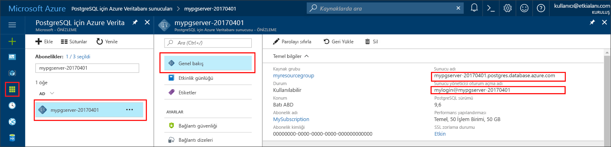

# <a name="azure-database-for-postgresql-use-nodejs-to-connect-and-query-data"></a>PostgreSQL için Azure veritabanı: Bağlanmak ve veri sorgulamak için node.js kullanma
Bu hızlı başlangıçta, [Node.js](https://nodejs.org/) uygulaması kullanılarak PostgreSQL için Azure Veritabanı'na nasıl bağlanılacağı gösterilmiştir. Hızlı başlangıçta, veritabanında verileri sorgulamak, eklemek, güncelleştirmek ve silmek için SQL deyimlerinin nasıl kullanılacağı da gösterilmiştir. Bu makaledeki adımlarda, Node.js kullanarak geliştirmeyle ilgili bilgi sahibi olduğunuz ve PostgreSQL için Azure Veritabanı ile çalışmaya yeni başladığınız varsayılır.

## <a name="prerequisites"></a>Önkoşullar
Bu hızlı başlangıçta, başlangıç noktası olarak şu kılavuzlardan birinde oluşturulan kaynaklar kullanılmaktadır:
- [DB Oluşturma - Portal](quickstart-create-server-database-portal.md)
- [DB oluşturma - CLI](quickstart-create-server-database-azure-cli.md)

Şunları da yapmanız gerekir:
- [Node.js](https://nodejs.org)’yi yükleme

## <a name="install-pg-client"></a>pg istemcisini yükleme
Node.js için bir PostgreSQL istemcisi olan [pg](https://www.npmjs.com/package/pg)’yi yükleyin.

Bunu yapmak için komut satırından JavaScript’e yönelik düğüm paketi yöneticisini (npm) çalıştırarak pg istemcisini yükleyin.
```bash
npm install pg
```

Yüklü paketleri listeleyerek yüklemeyi doğrulayın.
```bash
npm list
```

## <a name="get-connection-information"></a>Bağlantı bilgilerini alma
PostgreSQL için Azure Veritabanı'na bağlanmak üzere gereken bağlantı bilgilerini alın. Tam sunucu adına ve oturum açma kimlik bilgilerine ihtiyacınız vardır.

1. [Azure Portal](https://portal.azure.com/)’da oturum açın.
2. Azure portalında sol taraftaki menüden **Tüm kaynaklar**'a tıklayın ve oluşturduğunuz sunucuyu (örneğin, **mydemoserver**) arayın.
3. Sunucunun adına tıklayın.
4. Sunucunun **Genel Bakış** panelinden **Sunucu adı** ile **Sunucu yöneticisi oturum açma adı**’nı not alın. Parolanızı unutursanız, bu panelden parolayı da sıfırlayabilirsiniz.
 

## <a name="running-the-javascript-code-in-nodejs"></a>Node.js’de JavaScript kodunu çalıştırma
`node` yazarak Node.js’yi Bash kabuğundan, Terminal’den veya Windows Komut İstemi’nden başlatabilir, ardından isteme kopyalayıp yapıştırarak örnek JavaScript kodunu etkili bir şekilde çalıştırabilirsiniz. Alternatif olarak, JavaScript kodunu bir metin dosyasına kaydedebilir ve `node filename.js` öğesini, bunu çalıştıracak bir parametre olarak dosya adıyla başlatabilirsiniz.

## <a name="connect-create-table-and-insert-data"></a>Bağlanma, tablo oluşturma ve veri ekleme
Aşağıdaki kodu kullanarak bağlanın ve **CREATE TABLE** ve **INSERT INTO** SQL deyimlerini kullanarak verileri yükleyin.
[pg.Client](https://github.com/brianc/node-postgres/wiki/Client) nesnesi, PostgreSQL sunucusuyla arabirim oluşturmak için kullanılır. [pg.Client.connect()](https://github.com/brianc/node-postgres/wiki/Client#method-connect) işlevi, sunucuyla bağlantı kurmak için kullanılır. [pg.Client.query()](https://github.com/brianc/node-postgres/wiki/Query) işlevi, PostgreSQL veritabanına karşı SQL sorgusunu yürütmek için kullanılır. 

host, dbname, user ve password parametrelerini, sunucuyu ve veritabanını oluştururken belirttiğiniz değerlerle değiştirin.

```javascript
const pg = require('pg');

const config = {
    host: '<your-db-server-name>.postgres.database.azure.com',
    // Do not hard code your username and password.
    // Consider using Node environment variables.
    user: '<your-db-username>',     
    password: '<your-password>',
    database: '<name-of-database>',
    port: 5432,
    ssl: true
};

const client = new pg.Client(config);

client.connect(err => {
    if (err) throw err;
    else {
        queryDatabase();
    }
});

function queryDatabase() {
    const query = `
        DROP TABLE IF EXISTS inventory;
        CREATE TABLE inventory (id serial PRIMARY KEY, name VARCHAR(50), quantity INTEGER);
        INSERT INTO inventory (name, quantity) VALUES ('banana', 150);
        INSERT INTO inventory (name, quantity) VALUES ('orange', 154);
        INSERT INTO inventory (name, quantity) VALUES ('apple', 100);
    `;

    client
        .query(query)
        .then(() => {
            console.log('Table created successfully!');
            client.end(console.log('Closed client connection'));
        })
        .catch(err => console.log(err))
        .then(() => {
            console.log('Finished execution, exiting now');
            process.exit();
        });
}
```

## <a name="read-data"></a>Verileri okuma
**SELECT** SQL deyimini kullanarak bağlanmak ve verileri okumak için aşağıdaki kodu kullanın. [pg.Client](https://github.com/brianc/node-postgres/wiki/Client) nesnesi, PostgreSQL sunucusuyla arabirim oluşturmak için kullanılır. [pg.Client.connect()](https://github.com/brianc/node-postgres/wiki/Client#method-connect) işlevi, sunucuyla bağlantı kurmak için kullanılır. [pg.Client.query()](https://github.com/brianc/node-postgres/wiki/Query) işlevi, PostgreSQL veritabanına karşı SQL sorgusunu yürütmek için kullanılır. 

host, dbname, user ve password parametrelerini, sunucuyu ve veritabanını oluştururken belirttiğiniz değerlerle değiştirin. 

```javascript
const pg = require('pg');

const config = {
    host: '<your-db-server-name>.postgres.database.azure.com',
    // Do not hard code your username and password.
    // Consider using Node environment variables.
    user: '<your-db-username>',     
    password: '<your-password>',
    database: '<name-of-database>',
    port: 5432,
    ssl: true
};

const client = new pg.Client(config);

client.connect(err => {
    if (err) throw err;
    else { queryDatabase(); }
});

function queryDatabase() {
  
    console.log(`Running query to PostgreSQL server: ${config.host}`);

    const query = 'SELECT * FROM inventory;';

    client.query(query)
        .then(res => {
            const rows = res.rows;

            rows.map(row => {
                console.log(`Read: ${JSON.stringify(row)}`);
            });

            process.exit();
        })
        .catch(err => {
            console.log(err);
        });
}
```

## <a name="update-data"></a>Verileri güncelleştirme
**UPDATE** SQL deyimini kullanarak bağlanmak ve verileri okumak için aşağıdaki kodu kullanın. [pg.Client](https://github.com/brianc/node-postgres/wiki/Client) nesnesi, PostgreSQL sunucusuyla arabirim oluşturmak için kullanılır. [pg.Client.connect()](https://github.com/brianc/node-postgres/wiki/Client#method-connect) işlevi, sunucuyla bağlantı kurmak için kullanılır. [pg.Client.query()](https://github.com/brianc/node-postgres/wiki/Query) işlevi, PostgreSQL veritabanına karşı SQL sorgusunu yürütmek için kullanılır. 

host, dbname, user ve password parametrelerini, sunucuyu ve veritabanını oluştururken belirttiğiniz değerlerle değiştirin. 

```javascript
const pg = require('pg');

const config = {
    host: '<your-db-server-name>.postgres.database.azure.com',
    // Do not hard code your username and password.
    // Consider using Node environment variables.
    user: '<your-db-username>',     
    password: '<your-password>',
    database: '<name-of-database>',
    port: 5432,
    ssl: true
};

const client = new pg.Client(config);

client.connect(err => {
    if (err) throw err;
    else {
        queryDatabase();
    }
});

function queryDatabase() {
    const query = `
        UPDATE inventory 
        SET quantity= 1000 WHERE name='banana';
    `;

    client
        .query(query)
        .then(result => {
            console.log('Update completed');
            console.log(`Rows affected: ${result.rowCount}`);
        })
        .catch(err => {
            console.log(err);
            throw err;
        });
}
```

## <a name="delete-data"></a>Verileri silme
Bağlanmak ve **DELETE** SQL deyimi kullanarak verileri okumak için aşağıdaki kodu kullanın. [pg.Client](https://github.com/brianc/node-postgres/wiki/Client) nesnesi, PostgreSQL sunucusuyla arabirim oluşturmak için kullanılır. [pg.Client.connect()](https://github.com/brianc/node-postgres/wiki/Client#method-connect) işlevi, sunucuyla bağlantı kurmak için kullanılır. [pg.Client.query()](https://github.com/brianc/node-postgres/wiki/Query) işlevi, PostgreSQL veritabanına karşı SQL sorgusunu yürütmek için kullanılır. 

Ana bilgisayar, veritabanı adı, kullanıcı ve parola parametrelerini, sunucuyu ve veritabanını oluştururken belirttiğiniz değerlerle değiştirin. 

```javascript
const pg = require('pg');

const config = {
    host: '<your-db-server-name>.postgres.database.azure.com',
    // Do not hard code your username and password.
    // Consider using Node environment variables.
    user: '<your-db-username>',     
    password: '<your-password>',
    database: '<name-of-database>',
    port: 5432,
    ssl: true
};

const client = new pg.Client(config);

client.connect(err => {
    if (err) {
        throw err;
    } else {
        queryDatabase();
    }
});

function queryDatabase() {
    const query = `
        DELETE FROM inventory 
        WHERE name = 'apple';
    `;

    client
        .query(query)
        .then(result => {
            console.log('Delete completed');
            console.log(`Rows affected: ${result.rowCount}`);
        })
        .catch(err => {
            console.log(err);
            throw err;
        });
}
```

## <a name="next-steps"></a>Sonraki adımlar
> [!div class="nextstepaction"]
> [Dışarı Aktarma ve İçeri Aktarma seçeneğini kullanarak veritabanınızı geçirme](./howto-migrate-using-export-and-import.md)
