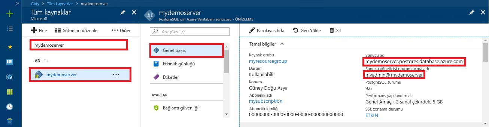

# <a name="azure-database-for-postgresql---single-server-use-php-to-connect-and-query-data"></a>PostgreSQL - tek bir sunucu için Azure veritabanı: Bağlanmak ve veri sorgulamak için PHP kullanma
Bu hızlı başlangıçta, [PHP](https://secure.php.net/manual/intro-whatis.php) uygulaması kullanılarak PostgreSQL için Azure Veritabanı’na nasıl bağlanılacağı gösterilmiştir. Hızlı başlangıçta, veritabanında verileri sorgulamak, eklemek, güncelleştirmek ve silmek için SQL deyimlerinin nasıl kullanılacağı da gösterilmiştir. Bu makaledeki adımlarda, PHP kullanarak geliştirmeyle ilgili bilgi sahibi olduğunuz ve PostgreSQL için Azure Veritabanı ile çalışmaya yeni başladığınız varsayılır.

## <a name="prerequisites"></a>Önkoşullar
Bu hızlı başlangıçta, başlangıç noktası olarak şu kılavuzlardan birinde oluşturulan kaynaklar kullanılmaktadır:
- [DB Oluşturma - Portal](quickstart-create-server-database-portal.md)
- [DB Oluşturma - Azure CLI](quickstart-create-server-database-azure-cli.md)

## <a name="install-php"></a>PHP’yi yükleme
PHP’yi kendi sunucunuza yükleyin veya PHP içeren bir Azure [web uygulaması](../app-service/overview.md) oluşturun.

### <a name="windows"></a>Windows
- [PHP 7.1.4 iş parçacığı güvenli olmayan (x64) sürümünü](https://windows.php.net/download#php-7.1) indirin
- PHP’yi yükleyin ve diğer yapılandırmalar için [PHP kılavuzuna](https://secure.php.net/manual/install.windows.php) bakın
- Kod, PHP yüklemesine dahil olan **pgsql** sınıfını (ext/php_pgsql.dll) kullanır. 
- Genellikle `C:\Program Files\PHP\v7.1\php.ini` konumunda bulunan php.ini yapılandırma dosyasını düzenleyerek **pgsql** uzantısını etkinleştirin. Yapılandırma dosyası, `extension=php_pgsql.so` metnine sahip bir satır içermelidir. Gösterilmiyorsa metni ekleyip dosyayı kaydedin. Metin varsa, ancak metne noktalı virgül ön ekiyle açıklama eklenmişse noktalı virgülü kaldırarak metindeki açıklamayı silin.

### <a name="linux-ubuntu"></a>Linux (Ubuntu)
- [PHP 7.1.4 iş parçacığı güvenli olmayan (x64) sürümünü](https://secure.php.net/downloads.php) indirin 
- PHP'yi yükleyin ve diğer yapılandırmalar için [PHP kılavuzuna](https://secure.php.net/manual/install.unix.php) bakın
- Kod, **pgsql** sınıfını (php_pgsql.so) kullanır. `sudo apt-get install php-pgsql` öğesini çalıştırarak yükleyin.
- `/etc/php/7.0/mods-available/pgsql.ini` yapılandırma dosyasını düzenleyerek **pgsql** uzantısını etkinleştirin. Yapılandırma dosyası, `extension=php_pgsql.so` metnine sahip bir satır içermelidir. Gösterilmiyorsa metni ekleyip dosyayı kaydedin. Metin varsa, ancak metne noktalı virgül ön ekiyle açıklama eklenmişse noktalı virgülü kaldırarak metindeki açıklamayı silin.

### <a name="macos"></a>MacOS
- [PHP 7.1.4 sürümünü](https://secure.php.net/downloads.php) indirin
- PHP'yi yükleyin ve diğer yapılandırmalar için [PHP kılavuzuna](https://secure.php.net/manual/install.macosx.php) bakın

## <a name="get-connection-information"></a>Bağlantı bilgilerini alma
PostgreSQL için Azure Veritabanı'na bağlanmak üzere gereken bağlantı bilgilerini alın. Tam sunucu adına ve oturum açma kimlik bilgilerine ihtiyacınız vardır.

1. [Azure Portal](https://portal.azure.com/)’da oturum açın.
2. Azure portalında sol taraftaki menüden **Tüm kaynaklar**'a tıklayın ve oluşturduğunuz sunucuyu (örneğin, **mydemoserver**) arayın.
3. Sunucunun adına tıklayın.
4. Sunucunun **Genel Bakış** panelinden **Sunucu adı** ile **Sunucu yöneticisi oturum açma adı**’nı not alın. Parolanızı unutursanız, bu panelden parolayı da sıfırlayabilirsiniz.
 

## <a name="connect-and-create-a-table"></a>Bağlanma ve tablo oluşturma
**CREATE TABLE** SQL deyimini kullanarak bir tabloyu bağlamak ve oluşturmak ve ardından **INSERT INTO** SQL deyimlerini kullanarak tabloya satırlar eklemek için aşağıdaki kodu kullanın.

Kod, PostgreSQL için Azure Veritabanı’na bağlanmak amacıyla [pg_connect()](https://secure.php.net/manual/en/function.pg-connect.php) yöntemini çağırır. Ardından birkaç komutu çalıştırmak için birkaç kez [pg_query()](https://secure.php.net/manual/en/function.pg-query.php) yöntemini ve her seferinde bir hata oluşursa ayrıntıları kontrol etmek için [pg_last_error()](https://secure.php.net/manual/en/function.pg-last-error.php) yöntemini çağırır. Daha sonra bağlantıyı kapatmak için [pg_close()](https://secure.php.net/manual/en/function.pg-close.php) yöntemini çağırır.

`$host`, `$database`, `$user` ve `$password` parametrelerini kendi değerlerinizle değiştirin. 

```php
<?php
    // Initialize connection variables.
    $host = "mydemoserver.postgres.database.azure.com";
    $database = "mypgsqldb";
    $user = "mylogin@mydemoserver";
    $password = "<server_admin_password>";

    // Initialize connection object.
    $connection = pg_connect("host=$host dbname=$database user=$user password=$password") 
        or die("Failed to create connection to database: ". pg_last_error(). "<br/>");
    print "Successfully created connection to database.<br/>";

    // Drop previous table of same name if one exists.
    $query = "DROP TABLE IF EXISTS inventory;";
    pg_query($connection, $query) 
        or die("Encountered an error when executing given sql statement: ". pg_last_error(). "<br/>");
    print "Finished dropping table (if existed).<br/>";

    // Create table.
    $query = "CREATE TABLE inventory (id serial PRIMARY KEY, name VARCHAR(50), quantity INTEGER);";
    pg_query($connection, $query) 
        or die("Encountered an error when executing given sql statement: ". pg_last_error(). "<br/>");
    print "Finished creating table.<br/>";

    // Insert some data into table.
    $name = '\'banana\'';
    $quantity = 150;
    $query = "INSERT INTO inventory (name, quantity) VALUES ($1, $2);";
    pg_query($connection, $query) 
        or die("Encountered an error when executing given sql statement: ". pg_last_error(). "<br/>");

    $name = '\'orange\'';
    $quantity = 154;
    $query = "INSERT INTO inventory (name, quantity) VALUES ($name, $quantity);";
    pg_query($connection, $query) 
        or die("Encountered an error when executing given sql statement: ". pg_last_error(). "<br/>");

    $name = '\'apple\'';
    $quantity = 100;
    $query = "INSERT INTO inventory (name, quantity) VALUES ($name, $quantity);";
    pg_query($connection, $query) 
        or die("Encountered an error when executing given sql statement: ". pg_last_error()). "<br/>";

    print "Inserted 3 rows of data.<br/>";

    // Closing connection
    pg_close($connection);
?>
```

## <a name="read-data"></a>Verileri okuma
**SELECT** SQL deyimini kullanarak bağlanmak ve verileri okumak için aşağıdaki kodu kullanın. 

 Kod, PostgreSQL için Azure Veritabanı’na bağlanmak amacıyla [pg_connect()](https://secure.php.net/manual/en/function.pg-connect.php) yöntemini çağırır. Ardından sonuçları bir sonuç kümesinde tutarak SELECT komutunu çalıştırmak için [pg_query()](https://secure.php.net/manual/en/function.pg-query.php) yöntemini ve bir hata oluşursa ayrıntıları kontrol etmek için [pg_last_error()](https://secure.php.net/manual/en/function.pg-last-error.php) yöntemini çağırır.  Sonuç kümesini okumak için döngüde satır başına bir kez [pg_fetch_row()](https://secure.php.net/manual/en/function.pg-fetch-row.php) yöntemi çağrılır ve her dizi konumunda sütun başında bir veri değeri olacak şekilde `$row` dizisinde satır verileri alınır.  Sonuç kümesini boşaltmak için [pg_free_result()](https://secure.php.net/manual/en/function.pg-free-result.php) yöntemi çağrılır. Daha sonra bağlantıyı kapatmak için [pg_close()](https://secure.php.net/manual/en/function.pg-close.php) yöntemini çağırır.

`$host`, `$database`, `$user` ve `$password` parametrelerini kendi değerlerinizle değiştirin. 

```php
<?php
    // Initialize connection variables.
    $host = "mydemoserver.postgres.database.azure.com";
    $database = "mypgsqldb";
    $user = "mylogin@mydemoserver";
    $password = "<server_admin_password>";
    
    // Initialize connection object.
    $connection = pg_connect("host=$host dbname=$database user=$user password=$password")
                or die("Failed to create connection to database: ". pg_last_error(). "<br/>");

    print "Successfully created connection to database. <br/>";

    // Perform some SQL queries over the connection.
    $query = "SELECT * from inventory";
    $result_set = pg_query($connection, $query) 
        or die("Encountered an error when executing given sql statement: ". pg_last_error(). "<br/>");
    while ($row = pg_fetch_row($result_set))
    {
        print "Data row = ($row[0], $row[1], $row[2]). <br/>";
    }

    // Free result_set
    pg_free_result($result_set);

    // Closing connection
    pg_close($connection);
?>
```

## <a name="update-data"></a>Verileri güncelleştirme
**UPDATE** SQL deyimini kullanarak bağlanmak ve verileri güncelleştirmek için aşağıdaki kodu kullanın.

Kod, PostgreSQL için Azure Veritabanı’na bağlanmak amacıyla [pg_connect()](https://secure.php.net/manual/en/function.pg-connect.php) yöntemini çağırır. Ardından bir komut çalıştırmak için [pg_query()](https://secure.php.net/manual/en/function.pg-query.php) yöntemini ve bir hata oluşursa ayrıntıları kontrol etmek için [pg_last_error()](https://secure.php.net/manual/en/function.pg-last-error.php) yöntemini çağırır. Daha sonra bağlantıyı kapatmak için [pg_close()](https://secure.php.net/manual/en/function.pg-close.php) yöntemini çağırır.

`$host`, `$database`, `$user` ve `$password` parametrelerini kendi değerlerinizle değiştirin. 

```php
<?php
    // Initialize connection variables.
    $host = "mydemoserver.postgres.database.azure.com";
    $database = "mypgsqldb";
    $user = "mylogin@mydemoserver";
    $password = "<server_admin_password>";

    // Initialize connection object.
    $connection = pg_connect("host=$host dbname=$database user=$user password=$password")
                or die("Failed to create connection to database: ". pg_last_error(). ".<br/>");

    print "Successfully created connection to database. <br/>";

    // Modify some data in table.
    $new_quantity = 200;
    $name = '\'banana\'';
    $query = "UPDATE inventory SET quantity = $new_quantity WHERE name = $name;";
    pg_query($connection, $query) 
        or die("Encountered an error when executing given sql statement: ". pg_last_error(). ".<br/>");
    print "Updated 1 row of data. </br>";

    // Closing connection
    pg_close($connection);
?>
```


## <a name="delete-data"></a>Verileri silme
Bağlanmak ve **DELETE** SQL deyimi kullanarak verileri okumak için aşağıdaki kodu kullanın. 

 Kod, PostgreSQL için Azure Veritabanı’na bağlanmak amacıyla [pg_connect()](https://secure.php.net/manual/en/function.pg-connect.php) yöntemini çağırır. Ardından bir komut çalıştırmak için [pg_query()](https://secure.php.net/manual/en/function.pg-query.php) yöntemini ve bir hata oluşursa ayrıntıları kontrol etmek için [pg_last_error()](https://secure.php.net/manual/en/function.pg-last-error.php) yöntemini çağırır. Daha sonra bağlantıyı kapatmak için [pg_close()](https://secure.php.net/manual/en/function.pg-close.php) yöntemini çağırır.

`$host`, `$database`, `$user` ve `$password` parametrelerini kendi değerlerinizle değiştirin. 

```php
<?php
    // Initialize connection variables.
    $host = "mydemoserver.postgres.database.azure.com";
    $database = "mypgsqldb";
    $user = "mylogin@mydemoserver";
    $password = "<server_admin_password>";

    // Initialize connection object.
    $connection = pg_connect("host=$host dbname=$database user=$user password=$password")
            or die("Failed to create connection to database: ". pg_last_error(). ". </br>");

    print "Successfully created connection to database. <br/>";

    // Delete some data from table.
    $name = '\'orange\'';
    $query = "DELETE FROM inventory WHERE name = $name;";
    pg_query($connection, $query) 
        or die("Encountered an error when executing given sql statement: ". pg_last_error(). ". <br/>");
    print "Deleted 1 row of data. <br/>";

    // Closing connection
    pg_close($connection);
?>
```

## <a name="next-steps"></a>Sonraki adımlar
> [!div class="nextstepaction"]
> [Dışarı Aktarma ve İçeri Aktarma seçeneğini kullanarak veritabanınızı geçirme](./howto-migrate-using-export-and-import.md)
