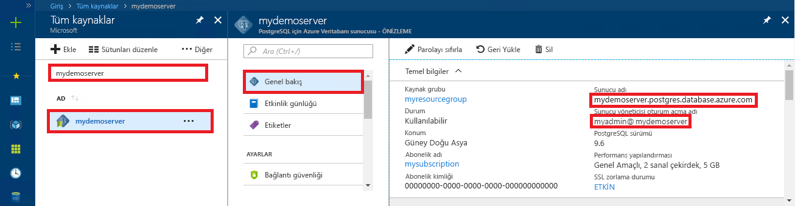

<a id="azure-database-for-postgresql-use-python-to-connect-and-query-data" class="xliff"></a>

# PostgreSQL için Azure Veritabanı: Bağlanmak ve veri sorgulamak için Python'ı kullanma
Bu hızlı başlangıç kılavuzunda, PostgreSQL için Azure Veritabanı'na bağlanmak üzere [Python](https://python.org)'ı kullanma ve ardından SQL deyimlerini kullanarak macOS, Ubuntu, Linux ve Windows platformlarındaki veritabanı verilerini sorgulama, ekleme, güncelleştirme ve silme işlemlerinin nasıl yapılacağı açıklanmıştır. Bu makaledeki adımlarda, Python kullanarak geliştirmeyle ilgili bilgi sahibi olduğunuz ve PostgreSQL için Azure Veritabanı ile çalışmaya yeni başladığınız varsayılır.

<a id="prerequisites" class="xliff"></a>

## Önkoşullar
Bu hızlı başlangıçta, başlangıç noktası olarak şu kılavuzlardan birinde oluşturulan kaynaklar kullanılmaktadır:
- [DB Oluşturma - Portal](quickstart-create-server-database-portal.md)
- [DB oluşturma - CLI](quickstart-create-server-database-azure-cli.md)

Şunları da yapmanız gerekir:
- [Python](https://www.python.org/downloads/)'ı yükleme
- [PIP](https://pip.pypa.io/en/stable/installing/) paketini yükleme ([python.org](https://python.org) adresinden indirilen Python 2 >=2.7.9 veya Python 3 >=3.4 ikililerini kullanıyorsanız PIP zaten yüklüdür ancak paketi yükseltmeniz gerekir.)

<a id="install-the-python-connection-libraries-for-postgresql" class="xliff"></a>

## PostgreSQL için Python bağlantı kitaplıklarını yükleme
Veritabanına bağlanmanızı ve bu veritabanını sorgulamanızı sağlayan [psycopg2](http://initd.org/psycopg/docs/install.html) paketini yükleyin. psycopg2 paketi, en yaygın platformlar (Linux, OSX, Windows) için [wheel](http://pythonwheels.com/) paketi biçiminde [PyPI'de mevcuttur](https://pypi.python.org/pypi/psycopg2/). Bu nedenle tüm bağımlılıklar da dahil olmak üzere modülün ikili sürümünü almak için pip install komutunu kullanabilirsiniz:

```cmd
pip install psycopg2
```
PIP'nin güncel bir sürümünü kullandığınızdan emin olun. (PIP'yi yükseltmek için şunun gibi bir komut kullanabilirsiniz: `pip install -U pip`)

<a id="get-connection-information" class="xliff"></a>

## Bağlantı bilgilerini alma
PostgreSQL için Azure Veritabanı'na bağlanmak üzere gereken bağlantı bilgilerini alın. Tam sunucu adına ve oturum açma kimlik bilgilerine ihtiyacınız vardır.

1. [Azure Portal](https://portal.azure.com/)’da oturum açın.
2. Azure portalında sol taraftaki menüden **Tüm kaynaklar**’a tıklayın ve kısa süre önce oluşturduğunuz **mypgserver-20170401** sunucusunu aratın.
3. **mypgserver-20170401** sunucu adına tıklayın.
4. Sunucunun **Genel Bakış** sayfasını seçin. **Sunucu adını** ve **Sunucu yöneticisi oturum açma adını** not edin.
 
5. Sunucunuzun oturum açma bilgilerini unuttuysanız **Genel Bakış** sayfasına giderek Sunucu yöneticisi oturum açma adını görüntüleyin ve gerekirse parolayı sıfırlayın.
   
<a id="connect-create-table-and-insert-data" class="xliff"></a>

## Bağlanma, tablo oluşturma ve veri ekleme
Bağlanmak ve **INSERT** SQL deyimiyle [psycopg2.connect](http://initd.org/psycopg/docs/connection.html) işlevini kullanarak verileri yüklemek için aşağıdaki kodu kullanın. PostgreSQL veritabanında SQL sorgusu yürütmek için [cursor.execute](http://initd.org/psycopg/docs/cursor.html#execute) işlevi kullanılır. host, dbname, user ve password parametrelerini, sunucuyu ve veritabanını oluştururken belirttiğiniz değerlerle değiştirin.

```Python
import psycopg2

# Update connection string information obtained from the portal
host = "mypgserver-20170401.postgres.database.azure.com"
user = "mylogin@mypgserver-20170401"
dbname = "mypgsqldb"
password = "<server_admin_password>"

# Construct connection string
conn_string = "host={0} user={1} dbname={2} password={3}".format(host, user, dbname, password)
conn = psycopg2.connect(conn_string) 
print "Connection established"

cursor = conn.cursor()

# Drop previous table of same name if one exists
cursor.execute("DROP TABLE IF EXISTS inventory;")
print "Finished dropping table (if existed)"

# Create table
cursor.execute("CREATE TABLE inventory (id serial PRIMARY KEY, name VARCHAR(50), quantity INTEGER);")
print "Finished creating table"

# Insert some data into table
cursor.execute("INSERT INTO inventory (name, quantity) VALUES (%s, %s);", ("banana", 150))
cursor.execute("INSERT INTO inventory (name, quantity) VALUES (%s, %s);", ("orange", 154))
cursor.execute("INSERT INTO inventory (name, quantity) VALUES (%s, %s);", ("apple", 100))
print "Inserted 3 rows of data"

conn.commit()
```

<a id="read-data" class="xliff"></a>

## Verileri okuma
**SELECT** SQL deyimi ile [cursor.execute](http://initd.org/psycopg/docs/cursor.html#execute) işlevini kullanarak, eklenen verileri okumak için aşağıdaki kodu kullanın. Bu işlev bir sorguyu kabul eder ve [cursor.fetchall()](http://initd.org/psycopg/docs/cursor.html#cursor.fetchall) kullanılarak yinelenebilen bir sonuç kümesi döndürür. host, dbname, user ve password parametrelerini, sunucuyu ve veritabanını oluştururken belirttiğiniz değerlerle değiştirin.

```Python
import psycopg2

# Update connection string information obtained from the portal
host = "mypgserver-20170401.postgres.database.azure.com"
user = "mylogin@mypgserver-20170401"
dbname = "mypgsqldb"
password = "<server_admin_password>"

# Construct connection string
conn_string = "host={0} user={1} dbname={2} password={3}".format(host, user, dbname, password)
conn = psycopg2.connect(conn_string) 
print "Connection established"

cursor = conn.cursor()

# Fetch all rows from table
cursor.execute("SELECT * FROM inventory;")
rows = cursor.fetchall()

# Print all rows
for row in rows:
    print "Data row = (%s, %s, %s)" %(str(row[0]), str(row[1]), str(row[2]))

conn.commit()
```

<a id="update-data" class="xliff"></a>

## Verileri güncelleştirme
**UPDATE** SQL deyimiyle [cursor.execute](http://initd.org/psycopg/docs/cursor.html#execute) işlevini kullanarak, eklediğiniz inventory satırını güncelleştirmek için aşağıdaki kodu kullanın. host, dbname, user ve password parametrelerini, sunucuyu ve veritabanını oluştururken belirttiğiniz değerlerle değiştirin.

```Python
import psycopg2

# Update connection string information obtained from the portal
host = "mypgserver-20170401.postgres.database.azure.com"
user = "mylogin@mypgserver-20170401"
dbname = "mypgsqldb"
password = "<server_admin_password>"

# Construct connection string
conn_string = "host={0} user={1} dbname={2} password={3}".format(host, user, dbname, password)
conn = psycopg2.connect(conn_string) 
print "Connection established"

cursor = conn.cursor()

# Update a data row in the table
cursor.execute("UPDATE inventory SET quantity = %s WHERE name = %s;", (200, "banana"))
print "Updated 1 row of data"

conn.commit()
```

<a id="delete-data" class="xliff"></a>

## Verileri silme
**DELETE** SQL deyimiyle [cursor.execute](http://initd.org/psycopg/docs/cursor.html#execute) işlevini kullanarak, daha önce eklediğiniz bir inventory öğesini silmek için aşağıdaki kodu kullanın. host, dbname, user ve password parametrelerini, sunucuyu ve veritabanını oluştururken belirttiğiniz değerlerle değiştirin.

```Python
import psycopg2

# Update connection string information obtained from the portal
host = "mypgserver-20170401.postgres.database.azure.com"
user = "mylogin@mypgserver-20170401"
dbname = "mypgsqldb"
password = "<server_admin_password>"

# Construct connection string
conn_string = "host={0} user={1} dbname={2} password={3}".format(host, user, dbname, password)
conn = psycopg2.connect(conn_string) 
print "Connection established"

cursor = conn.cursor()

# Delete data row from table
cursor.execute("DELETE FROM inventory WHERE name = %s;", ("orange",))
print ("Deleted 1 row of data")

conn.commit()
```

<a id="next-steps" class="xliff"></a>

## Sonraki adımlar
> [!div class="nextstepaction"]
> [Dışarı Aktarma ve İçeri Aktarma seçeneğini kullanarak veritabanınızı geçirme](./howto-migrate-using-export-and-import.md)

