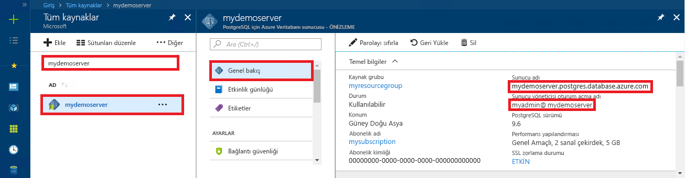

# <a name="azure-database-for-postgresql-use-ruby-to-connect-and-query-data"></a>PostgreSQL için Azure veritabanı: Bağlanmak ve veri sorgulamak için Ruby kullanma
Bu hızlı başlangıçta, [Ruby](https://www.ruby-lang.org) uygulaması kullanılarak PostgreSQL için Azure Veritabanı’na nasıl bağlanılacağı gösterilmiştir. Hızlı başlangıçta, veritabanında verileri sorgulamak, eklemek, güncelleştirmek ve silmek için SQL deyimlerinin nasıl kullanılacağı da gösterilmiştir. Bu makaledeki adımlarda, Ruby kullanarak geliştirmeyle ilgili bilgi sahibi olduğunuz ve PostgreSQL için Azure Veritabanı ile çalışmaya yeni başladığınız varsayılır.

## <a name="prerequisites"></a>Önkoşullar
Bu hızlı başlangıçta, başlangıç noktası olarak şu kılavuzlardan birinde oluşturulan kaynaklar kullanılmaktadır:
- [DB Oluşturma - Portal](quickstart-create-server-database-portal.md)
- [DB Oluşturma - Azure CLI](quickstart-create-server-database-azure-cli.md)

Ayrıca yüklü gerekir:
- [Ruby](https://www.ruby-lang.org/en/downloads/)
- Ruby pg, Ruby için PostgreSQL modülünü

## <a name="get-connection-information"></a>Bağlantı bilgilerini alma
PostgreSQL için Azure Veritabanı'na bağlanmak üzere gereken bağlantı bilgilerini alın. Tam sunucu adına ve oturum açma kimlik bilgilerine ihtiyacınız vardır.

1. [Azure Portal](https://portal.azure.com/)’da oturum açın.
2. Azure portalında sol taraftaki menüden **Tüm kaynaklar**'a tıklayın ve oluşturduğunuz sunucuyu (örneğin, **mydemoserver**) arayın.
3. Sunucunun adına tıklayın.
4. Sunucunun **Genel Bakış** panelinden **Sunucu adı** ile **Sunucu yöneticisi oturum açma adı**’nı not alın. Parolanızı unutursanız, bu panelden parolayı da sıfırlayabilirsiniz.
 

> [!NOTE]
> `@` Url olarak kodlanmış sembol Azure Postgres kullanıcı rolünüzün `%40` bağlantı dizelerindeki. 

## <a name="connect-and-create-a-table"></a>Bağlanma ve tablo oluşturma
**CREATE TABLE** SQL deyimini kullanarak bir tabloyu bağlamak ve oluşturmak ve ardından **INSERT INTO** SQL deyimlerini kullanarak tabloya satırlar eklemek için aşağıdaki kodu kullanın.

Kod, PostgreSQL için Azure Veritabanı’na bağlanmak amacıyla [new()](https://www.rubydoc.info/gems/pg/PG%2FConnection:initialize) oluşturucusuna sahip [PG::Connection](https://www.rubydoc.info/gems/pg/PG/Connection) nesnesini kullanır. Ardından DROP, CREATE TABLE ve INSERT INTO komutlarını çalıştırmak için [exec()](https://www.rubydoc.info/gems/pg/PG/Connection#exec-instance_method) yöntemini çağırır. Kod, [PG::Error](https://www.rubydoc.info/gems/pg/PG/Error) sınıfını kullanarak hataları kontrol eder. Ardından bağlantıyı sonlandırılmadan önce kapatmak için [close()](https://www.rubydoc.info/gems/pg/PG/Connection#lo_close-instance_method) yöntemini çağırır.

`host`, `database`, `user` ve `password` dizelerini kendi değerlerinizle değiştirin. 


```ruby
require 'pg'

begin
    # Initialize connection variables.
    host = String('mydemoserver.postgres.database.azure.com')
    database = String('postgres')
    user = String('mylogin%40mydemoserver')
    password = String('<server_admin_password>')

    # Initialize connection object.
    connection = PG::Connection.new(:host => host, :user => user, :dbname => database, :port => '5432', :password => password)
    puts 'Successfully created connection to database'

    # Drop previous table of same name if one exists
    connection.exec('DROP TABLE IF EXISTS inventory;')
    puts 'Finished dropping table (if existed).'

    # Drop previous table of same name if one exists.
    connection.exec('CREATE TABLE inventory (id serial PRIMARY KEY, name VARCHAR(50), quantity INTEGER);')
    puts 'Finished creating table.'

    # Insert some data into table.
    connection.exec("INSERT INTO inventory VALUES(1, 'banana', 150)")
    connection.exec("INSERT INTO inventory VALUES(2, 'orange', 154)")
    connection.exec("INSERT INTO inventory VALUES(3, 'apple', 100)")
    puts 'Inserted 3 rows of data.'

rescue PG::Error => e
    puts e.message 
    
ensure
    connection.close if connection
end
```

## <a name="read-data"></a>Verileri okuma
**SELECT** SQL deyimini kullanarak bağlanmak ve verileri okumak için aşağıdaki kodu kullanın. 

Kod, PostgreSQL için Azure Veritabanı’na bağlanmak amacıyla [new()](https://www.rubydoc.info/gems/pg/PG%2FConnection:initialize) oluşturucusuna sahip [PG::Connection](https://www.rubydoc.info/gems/pg/PG/Connection) nesnesini kullanır. Ardından sonuçları sonuç kümesinde tutarak SELECT komutunu çalıştırmak için [exec()](https://www.rubydoc.info/gems/pg/PG/Connection#exec-instance_method) yöntemini çağırır. Sonuç kümesi koleksiyonu, `resultSet.each do` döngüsü kullanılarak ve geçerli satır değerleri `row` değişkeninde tutularak yinelenir. Kod, [PG::Error](https://www.rubydoc.info/gems/pg/PG/Error) sınıfını kullanarak hataları kontrol eder. Ardından bağlantıyı sonlandırılmadan önce kapatmak için [close()](https://www.rubydoc.info/gems/pg/PG/Connection#lo_close-instance_method) yöntemini çağırır.

`host`, `database`, `user` ve `password` dizelerini kendi değerlerinizle değiştirin. 

```ruby
require 'pg'

begin
    # Initialize connection variables.
    host = String('mydemoserver.postgres.database.azure.com')
    database = String('postgres')
    user = String('mylogin%40mydemoserver')
    password = String('<server_admin_password>')

    # Initialize connection object.
    connection = PG::Connection.new(:host => host, :user => user, :database => dbname, :port => '5432', :password => password)
    puts 'Successfully created connection to database.'

    resultSet = connection.exec('SELECT * from inventory;')
    resultSet.each do |row|
        puts 'Data row = (%s, %s, %s)' % [row['id'], row['name'], row['quantity']]
    end

rescue PG::Error => e
    puts e.message 
    
ensure
    connection.close if connection
end
```

## <a name="update-data"></a>Verileri güncelleştirme
Bağlanmak ve **UPDATE** SQL deyimi kullanarak verileri güncelleştirmek için aşağıdaki kodu kullanın.

Kod, PostgreSQL için Azure Veritabanı’na bağlanmak amacıyla [new()](https://www.rubydoc.info/gems/pg/PG%2FConnection:initialize) oluşturucusuna sahip [PG::Connection](https://www.rubydoc.info/gems/pg/PG/Connection) nesnesini kullanır. Ardından UPDATE komutunu çalıştırmak için [exec()](https://www.rubydoc.info/gems/pg/PG/Connection#exec-instance_method) yöntemini çağırır. Kod, [PG::Error](https://www.rubydoc.info/gems/pg/PG/Error) sınıfını kullanarak hataları kontrol eder. Ardından bağlantıyı sonlandırılmadan önce kapatmak için [close()](https://www.rubydoc.info/gems/pg/PG/Connection#lo_close-instance_method) yöntemini çağırır.

`host`, `database`, `user` ve `password` dizelerini kendi değerlerinizle değiştirin. 

```ruby
require 'pg'

begin
    # Initialize connection variables.
    host = String('mydemoserver.postgres.database.azure.com')
    database = String('postgres')
    user = String('mylogin%40mydemoserver')
    password = String('<server_admin_password>')

    # Initialize connection object.
    connection = PG::Connection.new(:host => host, :user => user, :dbname => database, :port => '5432', :password => password)
    puts 'Successfully created connection to database.'

    # Modify some data in table.
    connection.exec('UPDATE inventory SET quantity = %d WHERE name = %s;' % [200, '\'banana\''])
    puts 'Updated 1 row of data.'

rescue PG::Error => e
    puts e.message 
    
ensure
    connection.close if connection
end
```


## <a name="delete-data"></a>Verileri silme
Bağlanmak ve **DELETE** SQL deyimi kullanarak verileri okumak için aşağıdaki kodu kullanın. 

Kod, PostgreSQL için Azure Veritabanı’na bağlanmak amacıyla [new()](https://www.rubydoc.info/gems/pg/PG%2FConnection:initialize) oluşturucusuna sahip [PG::Connection](https://www.rubydoc.info/gems/pg/PG/Connection) nesnesini kullanır. Ardından UPDATE komutunu çalıştırmak için [exec()](https://www.rubydoc.info/gems/pg/PG/Connection#exec-instance_method) yöntemini çağırır. Kod, [PG::Error](https://www.rubydoc.info/gems/pg/PG/Error) sınıfını kullanarak hataları kontrol eder. Ardından bağlantıyı sonlandırılmadan önce kapatmak için [close()](https://www.rubydoc.info/gems/pg/PG/Connection#lo_close-instance_method) yöntemini çağırır.

`host`, `database`, `user` ve `password` dizelerini kendi değerlerinizle değiştirin. 

```ruby
require 'pg'

begin
    # Initialize connection variables.
    host = String('mydemoserver.postgres.database.azure.com')
    database = String('postgres')
    user = String('mylogin%40mydemoserver')
    password = String('<server_admin_password>')

    # Initialize connection object.
    connection = PG::Connection.new(:host => host, :user => user, :dbname => database, :port => '5432', :password => password)
    puts 'Successfully created connection to database.'

    # Modify some data in table.
    connection.exec('DELETE FROM inventory WHERE name = %s;' % ['\'orange\''])
    puts 'Deleted 1 row of data.'

rescue PG::Error => e
    puts e.message 
    
ensure
    connection.close if connection
end
```

## <a name="next-steps"></a>Sonraki adımlar
> [!div class="nextstepaction"]
> [Dışarı Aktarma ve İçeri Aktarma seçeneğini kullanarak veritabanınızı geçirme](./howto-migrate-using-export-and-import.md)
