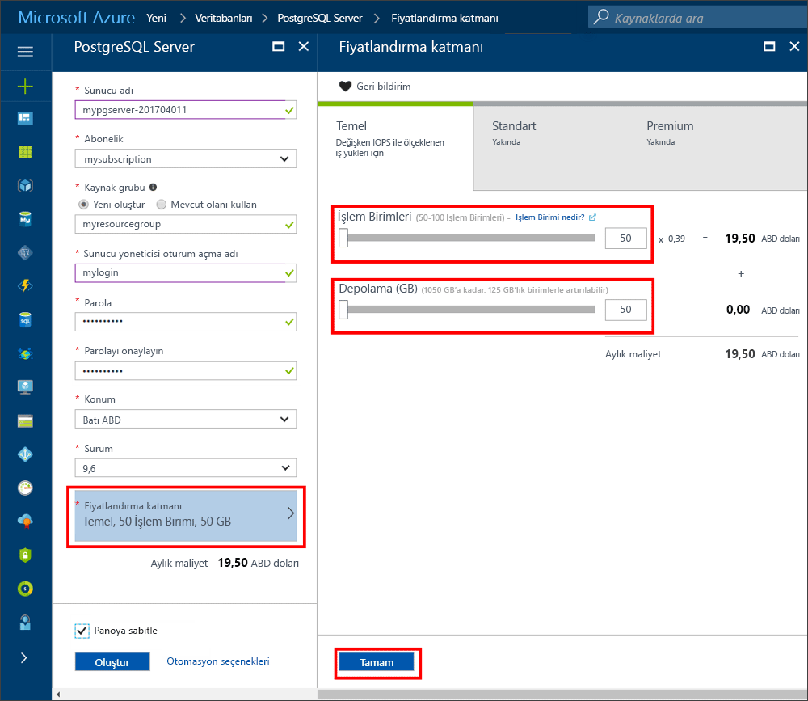
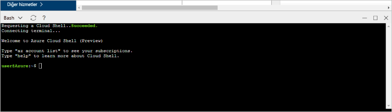

# <a name="create-an-azure-database-for-postgresql-in-the-azure-portal"></a>Azure portalında PostgreSQL için Azure Veritabanı oluşturma

PostgreSQL için Azure Veritabanı, bulutta son derece kullanılabilir olan PostgreSQL veritabanları çalıştırmanızı, yönetmenizi ve ölçeklendirmenizi sağlayan ve yönetilen bir hizmettir. Bu hızlı başlangıçta, Azure portalını kullanarak nasıl PostgreSQL için Azure Veritabanı sunucusu oluşturacağınız gösterilir.

Azure aboneliğiniz yoksa başlamadan önce [ücretsiz](https://azure.microsoft.com/free/) bir hesap oluşturun.

## <a name="log-in-to-the-azure-portal"></a>Azure portalında oturum açma

[Azure Portal](https://portal.azure.com)’da oturum açın.

## <a name="create-an-azure-database-for-postgresql"></a>PostgreSQL için Azure Veritabanı oluşturma

PostgreSQL için Azure Veritabanı sunucusu, tanımlı bir dizi [işlem ve depolama kaynağı](./concepts-compute-unit-and-storage.md) ile oluşturulur. Sunucu, [Azure kaynak grubu](../azure-resource-manager/resource-group-overview.md) içinde oluşturulur.

PostgreSQL için Azure veritabanı sunucusu oluşturmak üzere şu adımları uygulayın:
1.  Azure portalının sol üst köşesinde bulunan **Yeni** düğmesine tıklayın.
2.  **Yeni** sayfasından **Veritabanları**’nı seçin ve **Veritabanları** sayfasından **PostgreSQL için Azure Veritabanı**’nı seçin.
 

3.  Yeni sunucu ayrıntıları formunu, bir önceki resimde gösterildiği gibi aşağıdaki bilgilerle doldurun:
    - Sunucu adı: **mypgserver-20170401** (bir sunucu DNS adıyla eşleşir ve bu nedenle sunucunun genel olarak benzersiz olması gerekir) 
    - Abonelik: Birden fazla aboneliğiniz varsa kaynağın mevcut olduğu ve faturalandırıldığı uygun aboneliği seçin.
    - Kaynak grubu: **myresourcegroup**
    - Tercih ettiğiniz sunucu yöneticisi oturum açma adı ve parolası
    - Konum
    - PostgreSQL Sürümü

  > [!IMPORTANT]
  > Burada belirttiğiniz sunucu yöneticisi kullanıcı adı ve parolası, bu hızlı başlangıcın sonraki bölümlerinde sunucuda ve veritabanlarında oturum açmak için gereklidir. Bu bilgileri daha sonra kullanmak üzere aklınızda tutun veya kaydedin.

4.  Yeni veritabanınıza ait hizmet katmanını ve performans düzeyini belirtmek için **Fiyatlandırma katmanı**’na tıklayın. Bu hızlı başlangıç için **Temel** Katman’ı, **50 İşlem Birimini** ve dahili depolamanın **50 GB**’sini seçin.
 
5.  **Tamam**’a tıklayın.
6.  Sunucuyu sağlamak için **Oluştur**’a tıklayın. Sağlama birkaç dakika sürer.

  > [!TIP]
  > Dağıtımlarınızın kolayca izlenmesini sağlamak için **Panoya sabitle** seçeneğini işaretleyin.

7.  Araç çubuğunda **Bildirimler**’e tıklayarak dağıtım işlemini izleyin.
 
   
  Varsayılan olarak, **postgres** veritabanı sunucunuz altında oluşturulur. [Postgres](https://www.postgresql.org/docs/9.6/static/app-initdb.html) veritabanı; kullanıcılar, yardımcı programlar ve üçüncü taraf uygulamalar tarafından kullanılmak üzere geliştirilmiş varsayılan bir veritabanıdır. 

## <a name="configure-a-server-level-firewall-rule"></a>Sunucu düzeyinde güvenlik duvarı kuralı oluşturma

PostgreSQL için Azure Veritabanı hizmeti, sunucu düzeyinde bir güvenlik duvarı oluşturur. Bu güvenlik duvarı, belirli IP adresleri için güvenlik duvarını açmak üzere bir güvenlik duvarı kuralı oluşturulmadıkça, dış uygulama ve araçların sunucuya ve sunucu üzerindeki herhangi bir veritabanına bağlanmasını engeller. 

1.  Dağıtım tamamlandıktan sonra, sol taraftaki menünden **Tüm Kaynaklar**’a tıklayın ve yeni oluşturduğunuz sunucuyu aramak için **mypgserver-20170401** adını yazın. Arama sonucunda listelenen sunucu adına tıklayın. Sunucunuzun **Genel bakış** sayfası açılır ve daha fazla yapılandırma seçenekleri sunulur.
 
 

2.  Sunucu dikey penceresinde, **Bağlantı Güvenliği**’ni seçin. 
3.  **Kural Adı** altında metin kutusuna tıklayın ve IP aralığını bağlantı için beyaz listeye alacak yeni bir güvenlik duvarı kuralı ekleyin. Bu hızlı başlangıç için **Rule Name = AllowAllIps**, **Start IP = 0.0.0.0** ve **End IP = 255.255.255.255** yazarak tüm IP’lere izin verip **Kaydet**’e tıklayın. Ağınızdan bağlanabilmek için bir IP aralığını kapsayan güvenlik duvarı kuralı ayarlayabilirsiniz.

 

4.  **Kaydet**’e ve ardından **X**’e tıklayarak **Bağlantı Güvenliği** sayfasını kapatın.

  > [!NOTE]
  > Azure PostgreSQL sunucusu, 5432 bağlantı noktası üzerinden iletişim kurar. Kurumsal ağ içinden bağlanmaya çalışıyorsanız, ağınızın güvenlik duvarı tarafından 5432 numaralı bağlantı noktası üzerinden giden trafiğe izin verilmiyor olabilir. Bu durumda, BT departmanınız 5432 numaralı bağlantı noktasını açmadığı sürece Azure SQL Veritabanı sunucunuza bağlanamazsınız.
  >

## <a name="get-the-connection-information"></a>Bağlantı bilgilerini alma

PostgreSQL için Azure Veritabanımızı oluşturduğumuzda, varsayılan **postgres** veritabanı da oluşturulur. Veritabanı sunucunuza bağlanmak için ana bilgisayar bilgilerini ve erişim kimlik bilgilerini sağlamanız gerekir.

1. Azure portalında sol taraftaki menüden **Tüm kaynaklar**’a tıklayın ve kısa süre önce oluşturduğunuz **mypgserver-20170401** sunucusunu aratın.

  

2. **mypgserver-20170401** sunucu adına tıklayın.
3. Sunucunun **Genel Bakış** sayfasını seçin. **Sunucu adını** ve **Sunucu yöneticisi oturum açma adını** not edin.

 

## <a name="connect-to-postgresql-database-using-psql-in-cloud-shell"></a>Cloud Shell’de psql’i kullanarak PostgreSQL veritabanına bağlanma

Şimdi PostgreSQL için Azure Veritabanı sunucusuna bağlanmak üzere psql komut satır yardımcı programını kullanalım. 
1. Sol gezinme bölmesindeki terminal simgesiyle Azure Cloud Shell’i başlatın.

   

2. Azure Cloud Shell, tarayıcınızda açılarak bash komutları yazmanıza imkan tanır.

   

3. Cloud Shell isteminde, psql komut satırını yazarak PostgreSQL için Azure Veritabanı sunucunuza bağlanın. Aşağıdaki biçim, [psql](https://www.postgresql.org/docs/9.6/static/app-psql.html) yardımcı programıyla PostgreSQL için Azure Veritabanı sunucusuna bağlanmak amacıyla kullanılır:
   ```bash
   psql --host=<myserver> --port=<port> --username=<server admin login> --dbname=<database name>
   ```

   Örneğin aşağıdaki komut, erişim kimlik bilgilerini kullanarak **mypgserver-20170401.postgres.database.azure.com** PostgreSQL sunucunuzda **postgres** adlı varsayılan veritabanına bağlanır. Bağlanırken her zaman **5432** bağlantı noktasını kullanın. İstendiğinde sunucu yönetici parolanızı girin. Burada gösterildiği gibi, lütfen komutta --anahtarları arasında boşluk kullanın, ama eşittir işaretleriyle parametre değerleri arasında boşluk kullanmayın.

   ```bash
   psql --host=mypgserver-20170401.postgres.database.azure.com --port=5432 --username=mylogin@mypgserver-20170401 --dbname=postgres
   ```
4.  Sunucuya bağlandıktan sonra, istemde boş bir veritabanı oluşturun.
```bash
CREATE DATABASE mypgsqldb;
```

5.  İstemde, bağlantıyı yeni oluşturulan **mypgsqldb** veritabanına geçirmek için aşağıdaki komutu yürütün.
```bash
\c mypgsqldb
```

## <a name="connect-to-postgresql-database-using-pgadmin"></a>pgAdmin’i kullanarak PostgreSQL veritabanına bağlanma

_pgAdmin_ GUI aracını kullanarak Azure PostgreSQL sunucusuna bağlanmak için
1.  İstemci bilgisayarınızda _pgAdmin_ uygulamasını başlatın. _pgAdmin_’i http://www.pgadmin.org/ adresinden yükleyebilirsiniz.
2.  **Hızlı Bağlantılar** menüsünden **Yeni Sunucu Ekle**’yi seçin.
3.  **Oluştur - Sunucu** iletişim kutusunun **Genel** sekmesinde, sunucu için **Azure PostgreSQL Sunucusu** gibi benzersiz ve kolay bir ad girin.

4.  **Oluştur - Sunucu** iletişim kutusunun **Bağlantı** sekmesinde belirtilen ayarları kullanın ve **Kaydet**’e tıklayın.
   
    - **Ana Bilgisayar Adı/Adresi**: mypgserver-20170401.postgres.database.azure.com 
        - Tam sunucu adı.
    - **Bağlantı noktası:** 5432
        - Bu veritabanı sunucusu tarafından kullanılan bağlantı noktası numarası 5432'dir.
    - **Bakım Veritabanı**: postgres 
        - Sistem tarafından oluşturulan varsayılan veritabanı adı.
    - **Kullanıcı Adı:** mylogin@mypgserver-20170401 
        - Bu hızlı başlangıçta daha önce elde edilen Sunucu yöneticisi oturum açma bilgileri (user@mypgserver).
    - **Parola**: Bu hızlı başlangıçta daha önce sunucuyu oluştururken seçtiğiniz parola.
    - **SSL Modu**: Gerekli kıl
        - Tüm Azure PostgreSQL sunucuları, varsayılan olarak SSL’yi zorunla tutma seçeneği AÇIK konumundayken oluşturulur. SSL’yi zorunlu tutma seçeneğini KAPALI konumuna getirmek için [SSL’yi zorunlu tutma](./concepts-ssl-connection-security.md) bölümündeki ayrıntıları inceleyin.
5.  **Kaydet** düğmesine tıklayın.
6.  Tarayıcı sol bölmesinde **Sunucu Grupları**’nı genişletin. **Azure PostgreSQL Sunucusu** adlı sunucunuzu seçin.
7.  Bağlandığınız **Sunucu**’yu ve ardından altındaki **Veritabanları**’nı seçin. 
8.  Veritabanı oluşturmak için **Veritabanları**’na sağ tıklayın.
9.  Veritabanı adı için **mypgsqldb**’yi ve sahibi için sunucu yöneticisi oturum açma bilgileri olarak **mylogin**’i seçin.
10. Boş bir veritabanı oluşturmak için **Kaydet**’e tıklayın.
11. **Tarayıcı**’da **Sunucu**’yu genişletin. Oluşturduğunuz sunucuyu genişletin ve altındaki **mypgsqldb** veritabanını bulun.
 


## <a name="clean-up-resources"></a>Kaynakları temizleme
[Azure kaynak grubunu](../azure-resource-manager/resource-group-overview.md) silerek hızlı başlangıçta oluşturduğunuz tüm kaynakları temizleyin.

> [!TIP]
> Bu koleksiyondaki diğer hızlı başlangıçlar, bu hızlı başlangıcı temel alır. Sonraki hızlı başlangıçlarla çalışmaya devam etmeyi planlıyorsanız bu hızlı başlangıçta oluşturulan kaynakları temizlemeyin. Devam etmeyi planlamıyorsanız Azure portalında bu hızlı başlangıç ile oluşturulan tüm kaynakları silmek için aşağıdaki adımları kullanın.

1.  Azure portalında sol taraftaki menüden, **Kaynak grupları**’na ve ardından **myresourcegroup**’a tıklayın.
2.  Kaynak grubu sayfanızda **Sil**’e tıklayın, metin kutusuna **myresourcegroup** yazıp Sil’e tıklayın.

Yalnızca yeni oluşturulan sunucuyu silmek istiyorsanız:
1.  Azure portalında sol taraftaki menüden PostgreSQL sunucuları’na tıklayın ve kısa süre önce oluşturduğunuz sunucuyu aratın
2.  Genel bakış sayfasında,  üst bölmesinde Sil düğmesine tıklayın
3.  Silmek istediğiniz sunucu adını onaylayın ve altındaki etkilenen veritabanlarını gösterin. Metin kutusuna **mypgserver-20170401** yazıp Sil’e tıklayın.

## <a name="next-steps"></a>Sonraki adımlar
> [!div class="nextstepaction"]
> [Dışarı Aktarma ve İçeri Aktarma seçeneğini kullanarak veritabanınızı geçirme](./howto-migrate-using-export-and-import.md)

