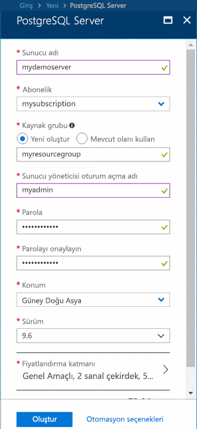
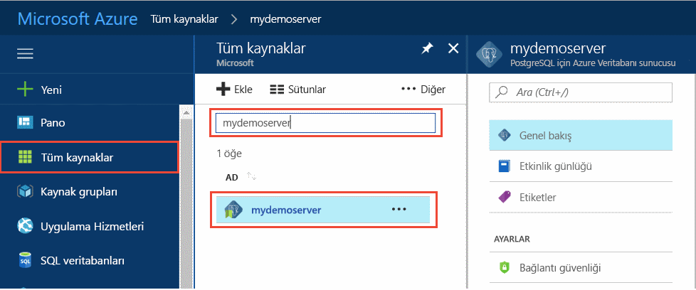
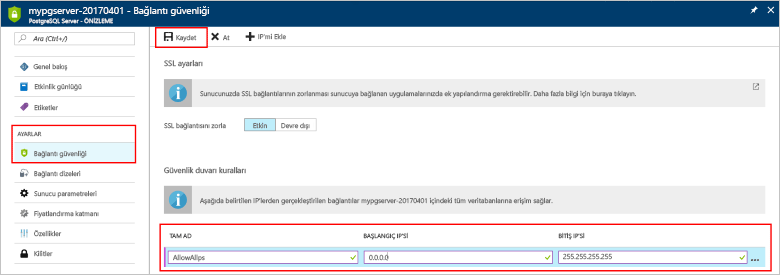
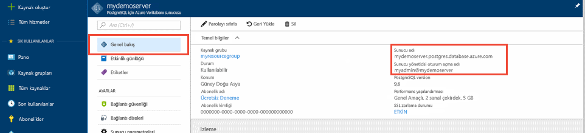
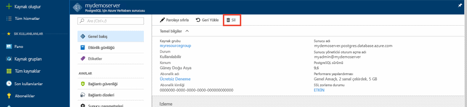

# <a name="quickstart-create-an-azure-database-for-postgresql-server-in-the-azure-portal"></a>Hızlı Başlangıç: Azure portalında PostgreSQL için Azure Veritabanı sunucusu oluşturma

PostgreSQL için Azure Veritabanı, bulutta son derece kullanılabilir olan PostgreSQL veritabanlarını çalıştırmak, yönetmek ve ölçeklendirmek için kullandığınız, yönetilen bir hizmettir. Bu Hızlı Başlangıçta, Azure portalı kullanarak yaklaşık beş dakika içinde PostgreSQL için Azure Veritabanı sunucusunun nasıl oluşturulduğu gösterilir.

Azure aboneliğiniz yoksa başlamadan önce [ücretsiz bir Azure hesabı](https://azure.microsoft.com/free/) oluşturun.

## <a name="sign-in-to-the-azure-portal"></a>Azure portalında oturum açın
Web tarayıcınızı açın ve [portala](https://portal.azure.com/) gidin. Portalda oturum açmak için kimlik bilgilerinizi girin. Varsayılan görünüm hizmet panonuzu içerir.

## <a name="create-an-azure-database-for-postgresql-server"></a>PostgreSQL için Azure Veritabanı sunucusu oluşturma

PostgreSQL için Azure Veritabanı sunucusu, yapılandırılmış bir dizi [işlem ve depolama kaynağı](./concepts-pricing-tiers.md) ile oluşturulur. Sunucu, [Azure kaynak grubu](../azure-resource-manager/resource-group-overview.md) içinde oluşturulur.

PostgreSQL için Azure Veritabanı sunucusu oluşturmak için şu adımları uygulayın:
1. Portalın sol üst köşesinde bulunan **Kaynak oluştur** düğmesini (+) seçin.

2. **Veritabanları** > **PostgreSQL için Azure Veritabanı**'nı seçin.

    

3. Yeni sunucu ayrıntıları formunu aşağıdaki bilgilerle doldurun:

    

    Ayar|Önerilen Değer|Açıklama
    ---|---|---
    Sunucu adı |*mydemoserver*|PostgreSQL için Azure Veritabanı sunucunuzu tanıtan benzersiz bir ad. Girdiğiniz sunucu adına *postgres.database.azure.com* etki alanı adı eklenir. Sunucunuz yalnızca küçük harf, sayı ve kısa çizgi (-) karakterini içerebilir. En az 3, en çok 63 karakterden oluşmalıdır.
    Abonelik|Aboneliğinizin adı|Sunucunuz için kullanmak istediğiniz Azure aboneliği. Birden fazla aboneliğiniz varsa kaynağın faturalandırıldığı aboneliği seçin.
    Kaynak grubu|*myresourcegroup*| Yeni bir kaynak grubu adı veya aboneliğinizde var olan bir kaynak grubu.
    Kaynak seçme | *Boş* | Sıfırdan yeni bir sunucu oluşturmak için *Boş*’u seçin. (Mevcut bir PostgreSQL için Azure Veritabanı sunucusunun bir coğrafi yedeğinden bir sunucu oluşturuyorsanız, *Yedek* seçeneğini belirleyin).
    Sunucu yöneticisi oturum açma |*myadmin*| Sunucuya bağlanırken kullanılacak kendi oturum açma hesabınız. Yönetici oturum açma adı **azure_superuser**, **azure_pg_admin**, **admin**, **administrator**, **root**, **guest** veya **public** olamaz. Bu ad **pg_** ile başlayamaz.
    Parola |Parolanız| Sunucu yönetici hesabı için yeni bir parola. 8 ile 128 arasında karakter içermelidir. Parolanız şu kategorilerin üçünden karakterler içermelidir: İngilizce büyük harfler, İngilizce küçük harfler, sayılar (0-9) ve alfasayısal olmayan karakterler (!, $, #, %, vs.).
    Location|Kullanıcılarınıza en yakın bölge| Kullanıcılarınız için en yakın olan konum.
    Version|En son ana sürüm| Belirli gereksinimleriniz olmadığı sürece, en son PostgreSQL ana sürümü.
    Fiyatlandırma katmanı | **Genel Amaçlı**, **5. Nesil**, **2 sanal çekirdek**, **5 GB**, **7 gün**, **Coğrafi Olarak Yedekli** | Yeni sunucunuz için işlem, depolama ve yedekleme yapılandırmaları. **Fiyatlandırma katmanı**'nı seçin. Ardından, **Genel Amaçlı** sekmesini seçin. *5. Nesil*, *2 sanal çekirdek*, *5 GB* ve *7 gün*; **İşlem Nesli**, **Sanal Çekirdek**, **Depolama** ve **Yedekleme Bekletme Dönemi** için varsayılan değerlerdir. Bu kaydırıcıları olduğu gibi bırakabilirsiniz. Coğrafi olarak yedekli depolamada sunucu yedeklerinizi etkinleştirmek için, **Fazladan Yedek Seçenekleri**’nde **Coğrafi Olarak Yedeklemeli**’yi seçin. Bu fiyatlandırma katmanı seçimini kaydetmek için **Tamam**’ı seçin. Sonraki ekran görüntüsü bu seçimleri yakalar.

   > [!NOTE]
   > Temel fiyatlandırma katmanını kullanarak göz önünde bulundurun hafif işlem ve g/ç iş yükünüz için yeterli olup olmadığını. Temel fiyatlandırma katmanında oluşturulan sunucular daha sonra genel amaçlı veya bellek için iyileştirilmiş ölçeklendirilemiyor olduğunu unutmayın. Bkz: [fiyatlandırma sayfası](https://azure.microsoft.com/pricing/details/postgresql/) daha fazla bilgi için.
   > 

    

4. Sunucuyu sağlamak için **Oluştur**’u seçin. Bu işlem birkaç dakika sürebilir.

5. Araç çubuğunda, dağıtım sürecini izlemek için **Bildirimler** simgesini (zil) seçin. Dağıtım tamamlandığında, bu sunucu için Azure portalı panonuzda sunucunun **Genel bakış** sayfasına bir kısayol ekleyen **Panoya sabitle** öğesini seçebilirsiniz. **Kaynağa git**’i seçmek sunucunun **Genel bakış** sayfasını açar.

    
   
   Varsayılan olarak, sunucunuzun altında bir **postgres** veritabanı oluşturulur. [Postgres](https://www.postgresql.org/docs/9.6/static/app-initdb.html) veritabanı; kullanıcılar, yardımcı programlar ve üçüncü taraf uygulamaları tarafından kullanılmak üzere geliştirilmiş, varsayılan bir veritabanıdır. (Diğer varsayılan veritabanı: **azure_maintenance**. İşlevi, yönetilen hizmet işlemlerini kullanıcı eylemlerinden ayırmaktır. Bu veritabanına erişemezsiniz.)

## <a name="configure-a-server-level-firewall-rule"></a>Sunucu düzeyinde güvenlik duvarı kuralı oluşturma

PostgreSQL için Azure Veritabanı, sunucu düzeyinde bir güvenlik duvarı oluşturur. Bu güvenlik duvarı, belirli IP adresleri için güvenlik duvarını açmak üzere bir kural oluşturmadığınız sürece, dış uygulama ve araçların sunucuya ve sunucu üzerindeki herhangi bir veritabanına bağlanmasını engeller. 

1. Dağıtım tamamlandıktan sonra sunucunuzu bulun. Gerekirse arama yapabilirsiniz. Örneğin, soldaki menüden **Tüm kaynaklar**'ı seçin. Yeni oluşturulan sunucunuzu aramak için sunucunuzun adını (örnekte **demosunucum**) yazın. Arama sonuçları listesinden sunucunuzun adını seçin. Sunucunuzun **Genel bakış** sayfası açılır ve daha fazla yapılandırma seçenekleri sunulur.
 
    

2. Sunucu sayfasında **Bağlantı güvenliği**’ni seçin.

3. **Güvenlik duvarı kuralları** altında, **Kural Adı** sütunundaki boş metin kutusunu seçerek güvenlik duvarı kuralı oluşturmaya başlayın. 

   Metin kutularını bir adla ve sunucunuza erişecek olan istemcilerin başlangıç ve bitiş IP aralığıyla doldurun. Tek bir IP ise, başlangıç IP’si ve bitiş IP’si için aynı değeri kullanın.

   
     

4. **Bağlantı güvenliği** sayfasının üst araç çubuğunda **Kaydet**’i seçin. Devam etmeden önce bağlantı güvenliği güncelleştirmesinin başarıyla tamamlandığını belirten bildirim görünene kadar bekleyin.

    > [!NOTE]
    > PostgreSQL sunucusu için Azure Veritabanınıza yönelik bağlantılar 5432 bağlantı noktası üzerinden iletişim kurar. Kurumsal ağ içinden bağlanmaya çalışıyorsanız, ağınızın güvenlik duvarı tarafından 5432 numaralı bağlantı noktası üzerinden giden trafiğe izin verilmiyor olabilir. Bu durumda, BT departmanınız 5432 numaralı bağlantı noktasını açmadığı sürece sunucunuza bağlanamazsınız.
    >

## <a name="get-the-connection-information"></a>Bağlantı bilgilerini alma

PostgreSQL için Azure Veritabanı sunucunuzu oluşturduğunuzda, **postgres** adlı varsayılan veritabanı da oluşturulur. Veritabanı sunucunuza bağlanmak için tam sunucu adını ve yönetici oturum açma kimlik bilgileri gerekir. Bu değerleri Hızlı Başlangıç makalesinde daha önce not almış olabilirsiniz. Almadıysanız, portaldaki sunucuya **Genel Bakış** sayfasında sunucu adını ve oturum açma bilgilerini kolayca bulabilirsiniz.

Sunucunuzun **Genel Bakış** sayfasını açın. **Sunucu adını** ve **Sunucu yöneticisi oturum açma adını** not alın. İmlecinizi her alanın üzerine getirin; metnin sağ tarafında Kopyala simgesi görünür. Değerleri kopyalamak için gerektiği gibi Kopyala simgesini seçin.

 

## <a name="connect-to-the-postgresql-database-using-psql"></a>Psql’yi kullanarak PostgreSQL veritabanına bağlanma

PostgreSQL sunucusu için Azure veritabanınıza çeşitli uygulamalar kullanarak bağlanabilirsiniz. İstemci bilgisayarınızda PostgreSQL yüklüyse, [psql](https://www.postgresql.org/docs/current/static/app-psql.html)’nin yerel bir örneğini kullanarak Azure PostgreSQL sunucusuna bağlanabilirsiniz. Şimdi psql komut satırı yardımcı programını kullanarak Azure PostgreSQL sunucusuna bağlanalım.

1. Bir kabukta, psql komut satırını yazarak PostgreSQL için Azure Veritabanı sunucunuzdaki bir veritabanına bağlanın.

    [psql](https://www.postgresql.org/docs/current/static/app-psql.html) yardımcı programıyla PostgreSQL için Azure Veritabanı sunucusuna bağlanırken aşağıdaki biçimi kullanın:
    ```bash
    psql --host=<yourserver> --port=<port> --username=<server admin login> --dbname=<database name>
    ```

    Örneğin, aşağıdaki komut bir örnek sunucuya bağlanır:

    ```bash
    psql --host=mydemoserver.postgres.database.azure.com --port=5432 --username=myadmin@mydemoserver --dbname=postgres
    ```

    psql parametresi |Değer|Açıklama
    ---|---|---
    --host | Sunucu adı | PostgreSQL için Azure Veritabanı sunucusunu oluştururken kullandığınız sunucu adı değeri. Gösterilen örnek sunucu: **demosunucum.postgres.database.azure.com.** Örnekte gösterildiği gibi tam etki alanı adını kullanın (**\*. postgres.database.azure.com**). Sunucu adınızı anımsamıyorsanız bağlantı bilgilerini almak için bir önceki bölümdeki adımları izleyin. 
    --port | 5432 | PostgreSQL için Azure Veritabanı sunucusuna bağlanırken kullanılacak bağlantı noktası. 
    --username | Sunucu yöneticisi oturum açma adı |PostgreSQL için Azure Veritabanı sunucusunu oluştururken girdiğiniz sunucu yöneticisi oturum açma kullanıcı adı. Kullanıcı adınızı anımsamıyorsanız bağlantı bilgilerini almak için bir önceki bölümdeki adımları izleyin. Biçim *kullanıcıadı\@servername*.
    --dbname | *postgres* | İlk bağlantı için sistem tarafından oluşturulan, varsayılan veritabanı adı. Daha sonra kendi veritabanınızı oluşturun.

    Kendi parametre değerleriniz ile psql komutunu çalıştırdıktan sonra sunucu yöneticisi parolasını girmeniz istenir. Bu parola, sunucuyu oluştururken belirttiğiniz parolayla aynıdır. 

    psql parametresi |Önerilen değer|Açıklama
    ---|---|---
    password | Yönetici parolanız | Yazılan parola karakterleri Bash isteminde gösterilmez. Tüm karakterleri yazdıktan sonra, kimlik doğrulaması yapmak ve bağlanmak için Enter tuşuna basın.

    Bağlantı kurduktan sonra, psql yardımcı programı sql komutlarını girdiğiniz bir postgres istemi görüntüler. Kullandığınız psql ile PostgreSQL için Azure Veritabanı sunucu sürümü farklı olabileceğinden, ilk bağlantı çıkışında bir uyarı gösterilebilir. 
    
    Örnek psql çıktısı:
    ```bash
    psql (9.5.7, server 9.6.2)
    WARNING: psql major version 9.5, server major version 9.6.
        Some psql features might not work.
    SSL connection (protocol: TLSv1.2, cipher: ECDHE-RSA-AES256-SHA384, bits: 256, compression: off)
    Type "help" for help.
   
    postgres=> 
    ```

    > [!TIP]
    > Güvenlik duvarı istemcinizin IP adreslerine izin verecek biçimde yapılandırılmamışsa aşağıdaki hata oluşur:
    > 
    > "psql: Önemli: konak için pg_hba.conf girdisi yok `<IP address>`, "myadmin" kullanıcısı "postgres" veritabanı, FATAL üzerinde SSL: SSL bağlantısı gereklidir. SSL seçeneklerini belirtin ve yeniden deneyin.
    > 
    > Hatayı gidermek için sunucu yapılandırmasının bu makaledeki “Sunucu düzeyinde güvenlik duvarı kuralı yapılandırma” bölümünde yer alan adımlarla eşleştiğinden emin olun.

2. Aşağıdaki komutu yazarak istemde "mypgsqldb" adlı boş bir veritabanı oluşturun:
    ```bash
    CREATE DATABASE mypgsqldb;
    ```
    Komutun bitmesi birkaç dakika sürebilir. 

3. İstemde, bağlantıyı yeni oluşturulan **mypgsqldb** veritabanına geçirmek için aşağıdaki komutu yürütün:
    ```bash
    \c mypgsqldb
    ```

4. `\q` yazın ve ardından Enter tuşunu seçerek psql'den çıkın. 

Psql aracılığıyla PostgreSQL için Azure Veritabanı sunucusuna bağlandınız ve boş bir kullanıcı veritabanı oluşturdunuz. Başka bir ortak araç olan pgAdmin’i kullanarak bağlanmak için sonraki bölüme geçin.

## <a name="connect-to-the-postgresql-server-using-pgadmin"></a>pgAdmin kullanarak PostgreSQL Sunucusu’na bağlanma

pgAdmin, PostgreSQL ile kullanılan açık kaynak bir araçtır. pgAdmin'i [pgAdmin web sitesinden](https://www.pgadmin.org/) yükleyebilirsiniz. Kullandığınız pgAdmin sürümü bu Hızlı Başlangıçta kullanılan sürümden farklı olabilir. Ek yönergeler gerekiyorsa pgAdmin belgelerini okuyun.

1. İstemci bilgisayarınızda pgAdmin uygulamasını açın.

2. Araç çubuğundan **Nesne**’ye gidin, **Oluştur** seçeneğinin üzerine gelip **Sunucu**’yu seçin.

3. **Oluştur - Sunucu** iletişim kutusunun **Genel** sekmesinde, sunucu için **mydemoserver** gibi benzersiz ve kolay bir ad girin.

    

4. **Oluştur - Sunucu** iletişim kutusunun **Bağlantı** sekmesinde ayarlar tablosunu doldurun.

   

    pgAdmin parametresi |Değer|Açıklama
    ---|---|---
    Konak adı/adresi | Sunucu adı | PostgreSQL için Azure Veritabanı sunucusunu oluştururken kullandığınız sunucu adı değeri. Örnek sunucumuz: **mydemoserver.postgres.database.azure.com.** Örnekte gösterildiği gibi tam etki alanı adını kullanın (**\*. postgres.database.azure.com**). Sunucu adınızı anımsamıyorsanız bağlantı bilgilerini almak için bir önceki bölümdeki adımları izleyin. 
    Bağlantı noktası | 5432 | PostgreSQL için Azure Veritabanı sunucusuna bağlanırken kullanılacak bağlantı noktası. 
    Bakım veritabanı | *postgres* | Sistem tarafından oluşturulan varsayılan veritabanı adı.
    Kullanıcı adı | Sunucu yöneticisi oturum açma adı | PostgreSQL için Azure Veritabanı sunucusunu oluştururken girdiğiniz sunucu yöneticisi oturum açma kullanıcı adı. Kullanıcı adını anımsamıyorsanız bağlantı bilgilerini almak için bir önceki bölümdeki adımları izleyin. Biçim *kullanıcıadı\@servername*.
    Parola | Yönetici parolanız | Bu Hızlı Başlangıçta daha önce sunucuyu oluştururken seçtiğiniz parola.
    Rol | Boş bırakın | Bu noktada bir rol adı sağlamanız gerekmez. Alanı boş bırakın.
    SSL modu | *Gerektirme* | pgAdmin’in SSL sekmesinde SSL modunu ayarlayabilirsiniz. Tüm PostgreSQL için Azure Veritabanı sunucuları, varsayılan olarak SSL’yi zorunlu tutma seçeneği açık şekilde oluşturulur. SSL'yi zorunlu tutma seçeneğini kapatmak için bkz. [SSL'yi zorunlu tutma](./concepts-ssl-connection-security.md).
    
5. **Kaydet**’i seçin.

6. Sol taraftaki **Tarayıcı** bölmesinde **Sunucular** düğümünü genişletin. Sunucunuzu (örneğin, **mydemoserver**) seçin. Bu sunucuya bağlanmak için tıklayın.

7. Sunucu düğümünü ve ardından onun altındaki **Veritabanları**’nı genişletin. Liste mevcut *postgres* veritabanınızı ve oluşturduğunuz diğer veritabanlarını içermelidir. PostgreSQL için Azure Veritabanı ile sunucu başına birden çok veritabanı oluşturabilirsiniz.

8. **Veritabanları**’na sağ tıklayın, **Oluştur** menüsünü seçin ve sonra da **Veritabanı**’nı seçin.

9. **Veritabanı** alanına, **mypgsqldb2** gibi tercih ettiğiniz veritabanı adını yazın.

10. Liste kutusundan veritabanı için **Sahip**’i seçin. Sunucu yöneticinizin oturum açma adını (örnekteki **my admin** gibi) seçin.

    

11. Yeni ve boş bir veritabanı oluşturmak için **Kaydet**’i seçin.

12. **Tarayıcı** bölmesinde, oluşturduğunuz veritabanını sunucu adınızın altındaki veritabanları listesinde görebilirsiniz.


## <a name="clean-up-resources"></a>Kaynakları temizleme
Hızlı başlangıç bölümünde oluşturduğunuz kaynakları iki yoldan biriyle temizleyebilirsiniz. Kaynak grubundaki tüm kaynakları içeren [Azure kaynak grubunu](../azure-resource-manager/resource-group-overview.md) silebilirsiniz. Diğer kaynakları korumak istiyorsanız yalnızca sunucu kaynağını silin.

> [!TIP]
> Bu koleksiyondaki diğer Hızlı Başlangıçlar, bu Hızlı Başlangıcı temel alır. Hızlı başlangıçlarla çalışmaya devam etmeyi planlıyorsanız bu hızlı başlangıçta oluşturulan kaynakları temizlemeyin. Devam etmeyi planlamıyorsanız, portalda bu hızlı başlangıç ile oluşturulmuş olan kaynakları silmek için aşağıdaki adımları izleyin.

Yeni oluşturulan sunucu dahil olmak üzere kaynak grubunun tamamını silmek için:
1. Portalda kaynak grubunuzu bulun. Soldaki menüden **Kaynak grupları**'nı seçin. Ardından, kaynak grubunuzun adını (örnekteki **myresourcegroup** gibi) seçin.

2. Kaynak grubunuzun sayfasında **Sil**’i seçin. Kaynak grubunuzun adını (örnekteki **myresourcegroup** gibi) metin kutusuna yazarak silmeyi onaylayın. **Sil**’i seçin.

Yalnızca yeni oluşturulan sunucuyu silmek için:
1. Sunucunuz açık değilse portalda sunucuyu bulun. Soldaki menüden **Tüm kaynaklar**'ı seçin. Ardından, oluşturduğunuz sunucuyu arayın.

2. **Genel Bakış** sayfasında **Sil**’i seçin.

    

3. Silmek istediğiniz sunucu adını onaylayın ve altındaki etkilenen veritabanlarını görüntüleyin. Metin kutusuna sunucunuzun adını (örnekteki **demosunucum** gibi) yazın. **Sil**’i seçin.

## <a name="next-steps"></a>Sonraki adımlar
> [!div class="nextstepaction"]
> [Dışarı Aktarma ve İçeri Aktarma seçeneğini kullanarak veritabanınızı geçirme](./howto-migrate-using-export-and-import.md)
