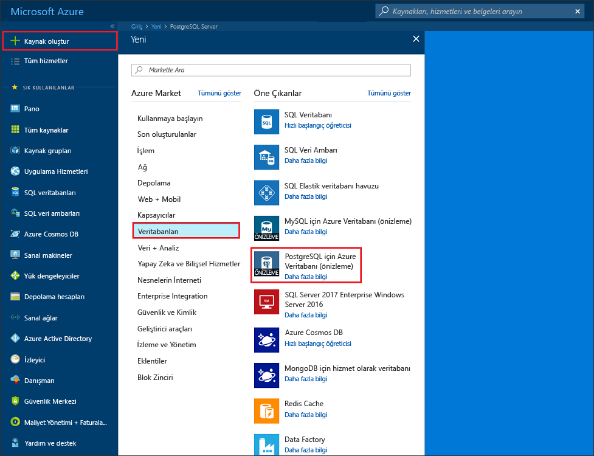
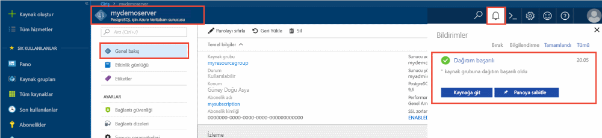
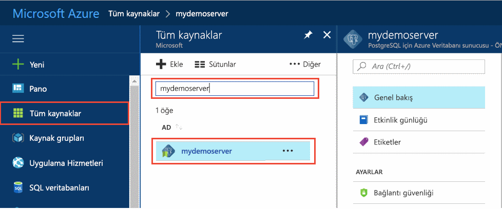
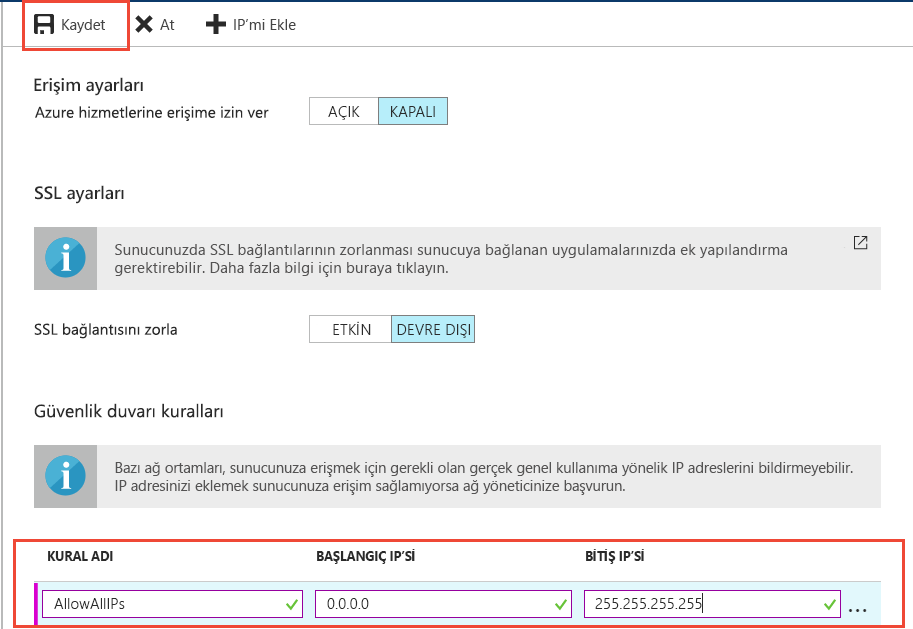
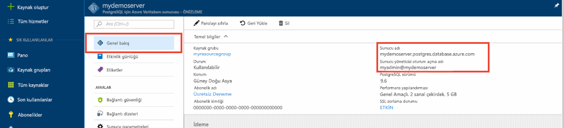
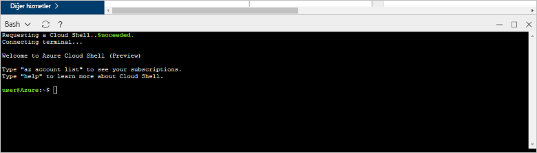

# <a name="tutorial-design-an-azure-database-for-postgresql---single-server-using-the-azure-portal"></a>Öğretici: -Tek sunucu Azure portalını kullanarak PostgreSQL için Azure veritabanı tasarlama

PostgreSQL için Azure Veritabanı, bulutta son derece kullanılabilir olan PostgreSQL veritabanları çalıştırmanızı, yönetmenizi ve ölçeklendirmenizi sağlayan ve yönetilen bir hizmettir. Azure portalını kullanarak, sunucunuzu kolayca yönetebilir ve bir veritabanı tasarlayabilirsiniz.

Bu öğreticide, Azure portalını kullanarak şu işlemleri gerçekleştirmeyi öğreneceksiniz:
> [!div class="checklist"]
> * PostgreSQL için Azure Veritabanı sunucusu oluşturma
> * Sunucu güvenlik duvarını yapılandırma
> * Veritabanı oluşturmak için [**psql**](https://www.postgresql.org/docs/9.6/static/app-psql.html) yardımcı programını kullanma
> * Örnek verileri yükleme
> * Verileri sorgulama
> * Verileri güncelleştirme
> * Verileri geri yükleme

## <a name="prerequisites"></a>Önkoşullar
Azure aboneliğiniz yoksa başlamadan önce [ücretsiz](https://azure.microsoft.com/free/) bir hesap oluşturun.

## <a name="create-an-azure-database-for-postgresql"></a>PostgreSQL için Azure Veritabanı oluşturma

PostgreSQL için Azure Veritabanı sunucusu, tanımlı bir dizi [işlem ve depolama kaynağı](./concepts-compute-unit-and-storage.md) ile oluşturulur. Sunucu, [Azure kaynak grubu](../azure-resource-manager/resource-group-overview.md) içinde oluşturulur.

PostgreSQL için Azure veritabanı sunucusu oluşturmak üzere şu adımları uygulayın:
1. Azure portalının sol üst köşesinde bulunan **Kaynak oluştur** öğesine tıklayın.
2. **Yeni** sayfasından **Veritabanları**’nı seçin ve **Veritabanları** sayfasından **PostgreSQL için Azure Veritabanı**’nı seçin.
   

3. Seçin **tek sunucu** dağıtım seçeneği.

   

4. Doldurun **Temelleri** formunu aşağıdaki bilgilerle:

    

    Ayar|Önerilen Değer|Açıklama
    ---|---|---
    Abonelik|Aboneliğinizin adı|Sunucunuz için kullanmak istediğiniz Azure aboneliği. Birden fazla aboneliğiniz varsa kaynağın faturalandırıldığı aboneliği seçin.
    Kaynak grubu|*myresourcegroup*| Yeni bir kaynak grubu adı veya aboneliğinizde var olan bir kaynak grubu.
    Sunucu adı |*mydemoserver*|PostgreSQL için Azure Veritabanı sunucunuzu tanıtan benzersiz bir ad. Girdiğiniz sunucu adına *postgres.database.azure.com* etki alanı adı eklenir. Sunucunuz yalnızca küçük harf, sayı ve kısa çizgi (-) karakterini içerebilir. En az 3, en çok 63 karakterden oluşmalıdır.
    Veri kaynağı | *Yok.* | Seçin *hiçbiri* sıfırdan yeni bir sunucu oluşturmak için. (Mevcut bir PostgreSQL için Azure Veritabanı sunucusunun bir coğrafi yedeğinden bir sunucu oluşturuyorsanız, *Yedek* seçeneğini belirleyin).
    Yönetici kullanıcı adı |*myadmin*| Sunucuya bağlanırken kullanılacak kendi oturum açma hesabınız. Yönetici oturum açma adı **azure_superuser**, **azure_pg_admin**, **admin**, **administrator**, **root**, **guest** veya **public** olamaz. Bu ad **pg_** ile başlayamaz.
    Parola |Parolanız| Sunucu yönetici hesabı için yeni bir parola. 8 ile 128 arasında karakter içermelidir. Parolanız şu kategorilerin üçünden karakterler içermelidir: İngilizce büyük harfler, İngilizce küçük harfler, sayılar (0-9) ve alfasayısal olmayan karakterler (!, $, #, %, vs.).
    Location|Kullanıcılarınıza en yakın bölge| Kullanıcılarınız için en yakın olan konum.
    Version|En son ana sürüm| Belirli gereksinimleriniz olmadığı sürece, en son PostgreSQL ana sürümü.
    İşlem ve depolama | **Genel Amaçlı**, **5. Nesil**, **2 sanal çekirdek**, **5 GB**, **7 gün**, **Coğrafi Olarak Yedekli** | Yeni sunucunuz için işlem, depolama ve yedekleme yapılandırmaları. Seçin **yapılandırma sunucusu**. Ardından, **Genel Amaçlı** sekmesini seçin. *5 gen*, *4 sanal çekirdek*, *100 GB*, ve *7 gün* için varsayılan değerler **işlem nesli**,  **Sanal çekirdek**, **depolama**, ve **yedekleme Bekletme dönemi**. Bu kaydırıcıları veya onları ayarlamanız bırakabilirsiniz. Coğrafi olarak yedekli depolamada sunucu yedeklerinizi etkinleştirmek için, **Fazladan Yedek Seçenekleri**’nde **Coğrafi Olarak Yedeklemeli**’yi seçin. Bu fiyatlandırma katmanı seçimini kaydetmek için **Tamam**’ı seçin. Sonraki ekran görüntüsü bu seçimleri yakalar.

   > [!NOTE]
   > Temel fiyatlandırma katmanını kullanarak göz önünde bulundurun hafif işlem ve g/ç iş yükünüz için yeterli olup olmadığını. Temel fiyatlandırma katmanında oluşturulan sunucular daha sonra genel amaçlı veya bellek için iyileştirilmiş ölçeklendirilemiyor olduğunu unutmayın. Bkz: [fiyatlandırma sayfası](https://azure.microsoft.com/pricing/details/postgresql/) daha fazla bilgi için.
   > 

    

    > [!TIP]
    > İle **otomatik büyüme** etkin iş yükünüzü etkilemeden, ayrılmış bir sınır yaklaştığı olduğunda depolama sunucunuzu artırır.

5. Seçin **gözden + Oluştur** için yaptığınız seçimleri gözden geçirin. Sunucuyu sağlamak için **Oluştur**’u seçin. Bu işlem birkaç dakika sürebilir.

6. Araç çubuğunda, dağıtım sürecini izlemek için **Bildirimler** simgesini (zil) seçin. Dağıtım tamamlandığında, bu sunucu için Azure portalı panonuzda sunucunun **Genel bakış** sayfasına bir kısayol ekleyen **Panoya sabitle** öğesini seçebilirsiniz. **Kaynağa git**’i seçmek sunucunun **Genel bakış** sayfasını açar.

    
   
   Varsayılan olarak, sunucunuzun altında bir **postgres** veritabanı oluşturulur. [Postgres](https://www.postgresql.org/docs/9.6/static/app-initdb.html) veritabanı; kullanıcılar, yardımcı programlar ve üçüncü taraf uygulamaları tarafından kullanılmak üzere geliştirilmiş, varsayılan bir veritabanıdır. (Diğer varsayılan veritabanı: **azure_maintenance**. İşlevi, yönetilen hizmet işlemlerini kullanıcı eylemlerinden ayırmaktır. Bu veritabanına erişemezsiniz.)


## <a name="configure-a-server-level-firewall-rule"></a>Sunucu düzeyinde güvenlik duvarı kuralı oluşturma

PostgreSQL için Azure Veritabanı hizmeti, sunucu düzeyinde bir güvenlik duvarı kullanır. Varsayılan olarak bu güvenlik duvarı, belirli bir IP adresi aralığı için güvenlik duvarını açmak üzere bir güvenlik duvarı kuralı oluşturulmadıkça, tüm dış uygulama ve araçların sunucuya ve sunucu üzerindeki herhangi bir veritabanına bağlanmasını engeller. 

1. Dağıtım tamamlandıktan sonra, sol taraftaki menüden **Tüm Kaynaklar**’a tıklayın ve yeni oluşturduğunuz sunucuyu aramak için **demosunucum** adını yazın. Arama sonucunda listelenen sunucu adına tıklayın. Sunucunuzun **Genel bakış** sayfası açılır ve daha fazla yapılandırma seçenekleri sunulur.

   

2. Sunucu sayfasında **Bağlantı güvenliği**’ni seçin. 

3. **Kural Adı** altında metin kutusuna tıklayın ve IP aralığını bağlantı için beyaz listeye alacak yeni bir güvenlik duvarı kuralı ekleyin. IP aralığınızı girin. **Kaydet**’e tıklayın.

   

4. **Kaydet**’e ve ardından **X** düğmesine tıklayarak **Bağlantı güvenliği** sayfasını kapatın.

   > [!NOTE]
   > Azure PostgreSQL sunucusu, 5432 bağlantı noktası üzerinden iletişim kurar. Kurumsal ağ içinden bağlanmaya çalışıyorsanız, ağınızın güvenlik duvarı tarafından 5432 numaralı bağlantı noktası üzerinden giden trafiğe izin verilmiyor olabilir. Bu durumda BT departmanınız 5432 numaralı bağlantı noktasını açmadığı sürece Azure SQL Veritabanı sunucunuza bağlanamazsınız.
   >

## <a name="get-the-connection-information"></a>Bağlantı bilgilerini alma

PostgreSQL sunucusu için Azure Veritabanını oluşturduğunuzda, varsayılan **postgres** veritabanı da oluşturulmuştur. Veritabanı sunucunuza bağlanmak için ana bilgisayar bilgilerini ve erişim kimlik bilgilerini sağlamanız gerekir.

1. Azure portalında sol taraftaki menüden **Tüm kaynaklar**’a tıklayın ve kısa süre önce oluşturduğunuz sunucuyu aratın.

   

2. **demosunucum** sunucu adına tıklayın.

3. Sunucunun **Genel Bakış** sayfasını seçin. **Sunucu adını** ve **Sunucu yöneticisi oturum açma adını** not edin.

   


## <a name="connect-to-postgresql-database-using-psql-in-cloud-shell"></a>Cloud Shell’de psql’i kullanarak PostgreSQL veritabanına bağlanma

Şimdi PostgreSQL sunucusu için Azure Veritabanına bağlanmak üzere [psql](https://www.postgresql.org/docs/9.6/static/app-psql.html) komut satırı yardımcı programını kullanalım. 
1. Sol gezinme bölmesindeki terminal simgesiyle Azure Cloud Shell’i başlatın.

   

2. Azure Cloud Shell, tarayıcınızda açılarak bash komutları yazmanıza imkan tanır.

   

3. Cloud Shell isteminde, psql komutlarını kullanarak PostgreSQL için Azure Veritabanı sunucunuza bağlanın. Aşağıdaki biçim, [psql](https://www.postgresql.org/docs/9.6/static/app-psql.html) yardımcı programıyla PostgreSQL için Azure Veritabanı sunucusuna bağlanmak amacıyla kullanılır:
   ```bash
   psql --host=<myserver> --port=<port> --username=<server admin login> --dbname=<database name>
   ```

   Örneğin aşağıdaki komut, erişim kimlik bilgilerini kullanarak **mydemoserver.postgres.database.azure.com** PostgreSQL sunucunuzda **postgres** adlı varsayılan veritabanına bağlanır. İstendiğinde sunucu yönetici parolanızı girin.

   ```bash
   psql --host=mydemoserver.postgres.database.azure.com --port=5432 --username=myadmin@mydemoserver --dbname=postgres
   ```

## <a name="create-a-new-database"></a>Yeni veritabanı oluşturma
Sunucuya bağlandıktan sonra, istemde boş bir veritabanı oluşturun.
```bash
CREATE DATABASE mypgsqldb;
```

İstemde, bağlantıyı yeni oluşturulan **mypgsqldb** veritabanına geçirmek için aşağıdaki komutu yürütün.
```bash
\c mypgsqldb
```
## <a name="create-tables-in-the-database"></a>Veritabanında tablo oluşturma
Artık PostgreSQL için Azure Veritabanına nasıl bağlanacağınızı bildiğinize göre bazı temel görevleri tamamlayabilirsiniz:

İlk olarak, bir tablo oluşturun ve bu tabloya bazı veriler yükleyin. Bu SQL kodunu kullanarak stok bilgilerini izleyen bir tablo oluşturalım:
```sql
CREATE TABLE inventory (
    id serial PRIMARY KEY, 
    name VARCHAR(50), 
    quantity INTEGER
);
```

Şimdi şunu yazarak tablo listesinde yeni oluşturulan tabloyu görebilirsiniz:
```sql
\dt
```

## <a name="load-data-into-the-tables"></a>Tablolara veri yükleme
Bir tablonuz olduğuna göre içine bazı veriler ekleyin. Açık komut istemi penceresinde, birkaç veri satırı eklemek için şu sorguyu çalıştırın.
```sql
INSERT INTO inventory (id, name, quantity) VALUES (1, 'banana', 150); 
INSERT INTO inventory (id, name, quantity) VALUES (2, 'orange', 154);
```

Daha önce oluşturduğunuz stok tablosunda artık iki satırlık örnek verileriniz vardır.

## <a name="query-and-update-the-data-in-the-tables"></a>Tablolardaki verileri sorgulama ve güncelleştirme
Stok veritabanı tablosundan bilgileri almak için şu sorguyu yürütün. 
```sql
SELECT * FROM inventory;
```

Tablodaki verileri de güncelleştirebilirsiniz.
```sql
UPDATE inventory SET quantity = 200 WHERE name = 'banana';
```

Verileri alırken güncelleştirilmiş değerleri görebilirsiniz.
```sql
SELECT * FROM inventory;
```

## <a name="restore-data-to-a-previous-point-in-time"></a>Verileri önceki bir noktaya geri yükleme
Bu tabloyu yanlışlıkla sildiğinizi düşünün. Bu, kolayca kurtaramayacağınız bir durumdur. PostgreSQL için Azure Veritabanı sunucunuzun yedeğinin olduğu herhangi bir noktaya dönerek (yapılandırdığınız yedekleme bekletme dönemine göre belirlenir) bu noktayı yeni bir sunucuya geri yükleyebilirsiniz. Bu yeni sunucuyu silinen verilerinizi kurtarmak için kullanabilirsiniz. Aşağıdaki adımlar, **demosunucum** sunucusunu envanter tablosu eklenmeden önceki bir noktaya geri yükler.

1. Sunucunuza yönelik PostgreSQL için Azure Veritabanı **Genel Bakış** sayfasında araç çubuğundaki **Geri Yükle** seçeneğine tıklayın. **Geri Yükle** sayfası açılır.

   

2. **Geri Yükleme** formunu gerekli bilgiler ile doldurun:

   

   - **Geri yükleme noktası**: Bir-sunucu değiştirilmeden önce gerçekleşen belirli bir noktaya seçin
   - **Hedef sunucu**: Geri yüklemek istediğiniz yeni bir sunucu adı sağlayın
   - **Konum**: Bölgeyi seçemezsiniz, varsayılan olarak, kaynak sunucuyla aynıdır
   - **Fiyatlandırma katmanı**: Bir sunucuyu geri yüklerken bu değeri değiştiremezsiniz. Kaynak sunucuyla aynıdır. 
3. Sunucuyu, [tablo silinmeden önceki belirli bir noktaya geri yüklemek için](./howto-restore-server-portal.md) **Tamam**’a tıklayın. Sunucunun farklı bir zaman noktasına geri yüklenmesi, [fiyatlandırma katmanınızın](./concepts-pricing-tiers.md) bekletme dönemi içinde olmak şartıyla, belirttiğiniz zaman noktasından itibaren özgün sunucu ile aynı yeni bir kopya sunucu oluşturur.

## <a name="next-steps"></a>Sonraki adımlar
Bu öğreticide, aşağıdakileri yapmak için Azure portalını ve diğer yardımcı programları nasıl kullanacağınızı öğrendiniz:
> [!div class="checklist"]
> * PostgreSQL için Azure Veritabanı sunucusu oluşturma
> * Sunucu güvenlik duvarını yapılandırma
> * Veritabanı oluşturmak için [**psql**](https://www.postgresql.org/docs/9.6/static/app-psql.html) yardımcı programını kullanma
> * Örnek verileri yükleme
> * Verileri sorgulama
> * Verileri güncelleştirme
> * Verileri geri yükleme

Ardından, benzer görevleri yapmak için Azure CLI'yı kullanmayı öğrenmek için şu öğreticiyi gözden geçirin: [PostgreSQL için Azure CLI kullanarak ilk Azure veritabanınızı tasarlama](tutorial-design-database-using-azure-cli.md)
