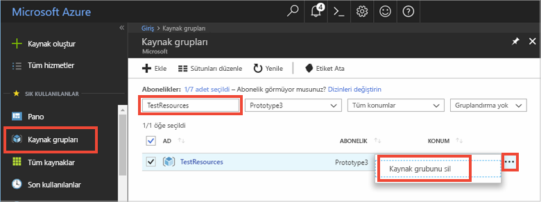

# <a name="quickstart-use-azure-redis-cache-with-a-net-core-app"></a>Hızlı başlangıç: .NET Core uygulaması ile Azure Redis Cache kullanma


Bu hızlı başlangıçta, .NET Core ile Microsoft Azure Redis Cache kullanmaya nasıl başlayacağınız gösterilmektedir. Microsoft Azure Redis Cache popüler açık kaynak Redis Cache’i temel alır. Microsoft tarafından yönetilen güvenli, ayrılmış bir Redis Cache’e erişmenizi sağlar. Azure Redis Cache kullanılarak oluşturulan bir önbelleğe Microsoft Azure’daki her uygulamadan erişilebilir.

Bu hızlı başlangıçta, .NET Core konsol uygulamasında C\# kodu ile [StackExchange.Redis](https://github.com/StackExchange/StackExchange.Redis) istemcisini kullanacaksınız. Bir önbellek oluşturacak, .NET Core istemci uygulamasını yapılandıracaksınız. Daha sonra, önbelleğe nesneler ekleyecek ve önbellekteki nesneleri güncelleştireceksiniz. 

Bu hızlı başlangıçtaki adımları tamamlamak için herhangi bir kod düzenleyicisini kullanabilirsiniz. Ancak, Windows, macOS ve Linux platformlarında sağlanan [Visual Studio Code](https://code.visualstudio.com/) mükemmel bir seçenektir.


[!INCLUDE [quickstarts-free-trial-note](../../includes/quickstarts-free-trial-note.md)]

## <a name="prerequisites"></a>Ön koşullar

* [.Net SDK 2.0](https://www.microsoft.com/net/learn/get-started/windows) veya üzeri.
* StackExchange.Redis istemcisi [.NET Framework 4 veya üst sürümünü](https://www.microsoft.com/net/download/dotnet-framework-runtime) gerektirir.

## <a name="create-a-cache"></a>Bir önbellek oluşturma
[!INCLUDE [redis-cache-create](../../includes/redis-cache-create.md)]

[!INCLUDE [redis-cache-access-keys](../../includes/redis-cache-access-keys.md)]

**ANA BİLGİSAYAR ADI** ve **Birincil** erişim anahtarı bilgilerini not edin. Daha sonra *CacheConnection* gizli dizisini oluşturmak için bu değerleri kullanacaksınız.


## <a name="create-a-console-app"></a>Konsol uygulaması oluşturma

Yeni bir komut penceresi açın ve aşağıdaki komutu yürüterek yeni bir .NET Core konsol uygulaması oluşturun:

```
dotnet new console -o Redistest
```

Komut pencerenizde yeni *Redistest* proje dizinine geçin.


## <a name="add-secret-manager-to-the-project"></a>Projeye Gizli Dizi Yöneticisi ekleme

Bu bölümde, projenize [Gizli Dizi Yöneticisi aracını](https://docs.microsoft.com/aspnet/core/security/app-secrets) ekleyeceksiniz. Gizli Dizi Yöneticisi aracı, geliştirme işine yönelik hassas verileri proje ağacınızın dışında depolar. Bu yaklaşım, uygulama gizli dizilerini kaynak kodunun içinde yanlışlıkla paylaşmayı önlemeye yardımcı olur.

*Redistest.csproj* dosyanızı açın. *Microsoft.Extensions.SecretManager.Tools* öğesini dahil etmek için bir `DotNetCliToolReference` öğesi ekleyin. Ayrıca, aşağıda gösterildiği gibi bir `UserSecretsId` öğesi ekleyin ve dosyayı kaydedin.

```xml
<Project Sdk="Microsoft.NET.Sdk">

  <PropertyGroup>
    <OutputType>Exe</OutputType>
    <TargetFramework>netcoreapp2.0</TargetFramework>
    <UserSecretsId>Redistest</UserSecretsId>
  </PropertyGroup>
  <ItemGroup>
    <DotNetCliToolReference Include="Microsoft.Extensions.SecretManager.Tools" Version="2.0.0" />
  </ItemGroup>
</Project>
```

Aşağıdaki komutu yürüterek *Microsoft.Extensions.Configuration.UserSecrets* paketini projeye ekleyin:

```
dotnet add package Microsoft.Extensions.Configuration.UserSecrets
```

Paketlerinizi geri yüklemek için aşağıdaki komutu yürütün:

```
dotnet restore
```

Komut pencerenizde aşağıdaki komutu yürüterek, önbellek adınız ve birincil erişim anahtarınız için yer tutucuları (açılı ayraçlar dahil) değiştirdikten sonra *CacheConnection* adlı yeni bir gizli diziyi depolayın:

```
dotnet user-secrets set CacheConnection "<cache name>.redis.cache.windows.net,abortConnect=false,ssl=true,password=<primary-access-key>"
```

Aşağıdaki `using` deyimini *Program.cs* dosyasına ekleyin:

```csharp
using Microsoft.Extensions.Configuration;
```

Aşağıdaki üyeleri, *Program.cs* dosyasında `Program` sınıfına ekleyin. Bu kod, Redis Cache bağlantı dizesi için kullanıcı gizli dizisine erişmek üzere bir yapılandırma başlatır.

```csharp
        private static IConfigurationRoot Configuration { get; set; }
        const string SecretName = "CacheConnection";

        private static void InitializeConfiguration()
        {
            var builder = new ConfigurationBuilder()
                .AddUserSecrets<Program>();

            Configuration = builder.Build();
        }
```

## <a name="configure-the-cache-client"></a>Önbellek istemcisini yapılandırma

Bu bölümde, .NET için [StackExchange.Redis](https://github.com/StackExchange/StackExchange.Redis) istemcisini kullanmak üzere konsol uygulamasını yapılandıracaksınız.

Komut pencerenizde, *Redistest* proje dizininde aşağıdaki komutu yürütün:

```
dotnet add package StackExchange.Redis
```

Yükleme tamamlandıktan sonra *StackExchange.Redis* önbellek istemcisi, projenizle kullanılabilir olur.


## <a name="connect-to-the-cache"></a>Önbelleğe bağlanma

Aşağıdaki `using` deyimini *Program.cs* dosyasına ekleyin:

```csharp
using StackExchange.Redis;
```

Azure Redis Cache bağlantısı `ConnectionMultiplexer` sınıfı tarafından yönetilir. Bu sınıf, istemci uygulamanız genelinde paylaşılmalı ve yeniden kullanılmalıdır. Her işlem için yeni bir bağlantı oluşturmayın. 

*Program.cs* dosyasında, konsol uygulamanızın `Program` sınıfına aşağıdaki üyeleri ekleyin:

```csharp
        private static Lazy<ConnectionMultiplexer> lazyConnection = new Lazy<ConnectionMultiplexer>(() =>
        {
            string cacheConnection = Configuration[SecretName];
            return ConnectionMultiplexer.Connect(cacheConnection);
        });

        public static ConnectionMultiplexer Connection
        {
            get
            {
                return lazyConnection.Value;
            }
        }
```

Uygulamanızda bir `ConnectionMultiplexer` örneğini paylaşmaya ilişkin bu yaklaşım, bağlı bir örnek döndüren bir statik özelliği kullanır. Kod yalnızca tek bir bağlı `ConnectionMultiplexer` örneği başlatmak için iş parçacığı güvenli bir yol sağlar. `abortConnect` false olarak ayarlanır; başka bir deyişle, Azure Redis Cache’e bağlantı kurulmasa bile çağrı başarılır olur. `ConnectionMultiplexer` temel özelliklerinden biri ağ sorunu ya da diğer nedenler çözümlendiğinde önbellek bağlantısını otomatik olarak geri yüklemesidir.

*CacheConnection* gizli dizisinin değerine, Gizli Dizi Yöneticisi yapılandırma sağlayıcısı kullanılarak erişilir ve bu gizli dizi, parola parametresi olarak kullanılır.

## <a name="executing-cache-commands"></a>Önbellek komutlarını yürütme

*Program.cs* dosyasında, konsol uygulamanıza yönelik `Program` sınıfının `Main` yordamı için aşağıdaki kodu ekleyin:

```csharp
        static void Main(string[] args)
        {
            InitializeConfiguration();

            // Connection refers to a property that returns a ConnectionMultiplexer
            // as shown in the previous example.
            IDatabase cache = lazyConnection.Value.GetDatabase();

            // Perform cache operations using the cache object...

            // Simple PING command
            string cacheCommand = "PING";
            Console.WriteLine("\nCache command  : " + cacheCommand);
            Console.WriteLine("Cache response : " + cache.Execute(cacheCommand).ToString());

            // Simple get and put of integral data types into the cache
            cacheCommand = "GET Message";
            Console.WriteLine("\nCache command  : " + cacheCommand + " or StringGet()");
            Console.WriteLine("Cache response : " + cache.StringGet("Message").ToString());

            cacheCommand = "SET Message \"Hello! The cache is working from a .NET Core console app!\"";
            Console.WriteLine("\nCache command  : " + cacheCommand + " or StringSet()");
            Console.WriteLine("Cache response : " + cache.StringSet("Message", "Hello! The cache is working from a .NET Core console app!").ToString());

            // Demostrate "SET Message" executed as expected...
            cacheCommand = "GET Message";
            Console.WriteLine("\nCache command  : " + cacheCommand + " or StringGet()");
            Console.WriteLine("Cache response : " + cache.StringGet("Message").ToString());

            // Get the client list, useful to see if connection list is growing...
            cacheCommand = "CLIENT LIST";
            Console.WriteLine("\nCache command  : " + cacheCommand);
            Console.WriteLine("Cache response : \n" + cache.Execute("CLIENT", "LIST").ToString().Replace("id=", "id="));

            lazyConnection.Value.Dispose();
        }
```

*Program.cs* dosyasını kaydedin.

Azure Redis Cache’ler, bir Redis Cache’teki verileri mantıksal olarak ayırmak için yapılandırılabilir sayıda veritabanına (varsayılan değer 16) sahiptir. Kod, DB 0 adlı varsayılan veritabanına bağlanır. Daha fazla bilgi için bkz. [Redis veritabanı nedir?](cache-faq.md#what-are-redis-databases) ve [Varsayılan Redis sunucu yapılandırması](cache-configure.md#default-redis-server-configuration).

`StringSet` ve `StringGet` yöntemleri kullanılarak önbellek öğeleri depolanabilir ve alınabilir.

Redis, Redis dizeleri kadar veri depolar, ancak bu dizeler önbellekte .NET nesneleri depolarken kullanılabilecek seri hale getirilmiş ikili veriler dahil, birçok veri türünü içerebilir.

Uygulamayı derlemek için komut pencerenizde aşağıdaki komutu yürütün:

```
dotnet build
```

Ardından aşağıdaki komutla uygulamayı çalıştırın:

```
dotnet run
```

Aşağıdaki örnekte, `Message` anahtarının Azure portaldaki Redis Konsolu kullanılarak ayarlanan, önceden önbelleğe alınmış bir değer içerdiğini görebilirsiniz. Uygulama, önbelleğe alınan bu değeri güncelleştirdi. Ayrıca uygulama, `PING` ve `CLIENT LIST` komutlarını da yürüttü.


## <a name="work-with-net-objects-in-the-cache"></a>Önbellekte .NET nesneleriyle çalışma

Azure Redis Cache temel veri türlerinin yanı sıra .NET nesnelerini de önbelleğe alabilir, ancak bir .NET nesnesini önbelleğe alabilmek için seri hale getirilmesi gerekir. Bu .NET nesne serileştirmesi uygulama geliştiricisinin sorumluluğundadır ve geliştiriciye seri hale getirici tercihinde esneklik sağlar.

Nesneleri seri hale getirmenin basit bir yolu, [Newtonsoft.Json](https://www.nuget.org/packages/Newtonsoft.Json/)’da `JsonConvert` seri hale getirme yöntemlerini kullanmak ve JSON’a ve JSON’dan seri hale getirmektir. Bu bölümde, önbelleğe bir .NET nesnesi ekleyeceksiniz.

*Newtonsoft.json* paketini uygulamaya eklemek için aşağıdaki komutu yürütün:

```
dotnet add package Newtonsoft.json
```

Aşağıdaki `using` deyimini *Program.cs* dosyasının üst kısmına ekleyin:

```charp
using Newtonsoft.Json;
```

Aşağıdaki `Employee` sınıf tanımını *Program.cs* dosyasına ekleyin:

```csharp
        class Employee
        {
            public string Id { get; set; }
            public string Name { get; set; }
            public int Age { get; set; }

            public Employee(string EmployeeId, string Name, int Age)
            {
                this.Id = EmployeeId;
                this.Name = Name;
                this.Age = Age;
            }
        }
```

*Program.cs* dosyasındaki `Main()` yordamının alt kısmına ve `Dispose()` için çağrı yapılmadan önce aşağıdaki kod satırlarını önbelleğe ekleyin ve seri hale getirilmiş bir .NET nesnesi alın:

```csharp
            // Store .NET object to cache
            Employee e007 = new Employee("007", "Davide Columbo", 100);
            Console.WriteLine("Cache response from storing Employee .NET object : " + 
                cache.StringSet("e007", JsonConvert.SerializeObject(e007)));

            // Retrieve .NET object from cache
            Employee e007FromCache = JsonConvert.DeserializeObject<Employee>(cache.StringGet("e007"));
            Console.WriteLine("Deserialized Employee .NET object :\n");
            Console.WriteLine("\tEmployee.Name : " + e007FromCache.Name);
            Console.WriteLine("\tEmployee.Id   : " + e007FromCache.Id);
            Console.WriteLine("\tEmployee.Age  : " + e007FromCache.Age + "\n");
```

*Program.cs* dosyasını kaydedin ve uygulamayı aşağıdaki komut ile yeniden derleyin:

```
dotnet build
```

.NET nesnelerinin seri duruma getirilmesini test etmek için aşağıdaki komut ile uygulamayı çalıştırın:

```
dotnet run
```


## <a name="clean-up-resources"></a>Kaynakları temizleme

Sonraki öğreticiyle devam edecekseniz, bu hızlı başlangıçta oluşturulan kaynakları tutabilir ve sonraki öğreticide yeniden kullanabilirsiniz.

Aksi takdirde, hızlı başlangıç örnek uygulamasını tamamladıysanız ücret yansıtılmaması için bu hızlı başlangıçta oluşturulan Azure kaynaklarını silebilirsiniz. 

> [!IMPORTANT]
> Bir kaynak grubunu silme işlemi geri alınamaz ve kaynak grubunun ve içindeki tüm kaynaklar kalıcı olarak silinir. Yanlış kaynak grubunu veya kaynakları yanlışlıkla silmediğinizden emin olun. Bu örneği, tutmak istediğiniz kaynakları içeren mevcut bir kaynak grubunda barındırmak için kaynaklar oluşturduysanız, kaynak grubunu silmek yerine her kaynağı kendi ilgili dikey penceresinden tek tek silebilirsiniz.
>

[Azure portalında](https://portal.azure.com) oturum açın ve **Kaynak grupları**’na tıklayın.

**Ada göre filtrele...** metin kutusuna kaynak grubunuzun adını girin. Bu makaledeki yönergelerde *TestResources* adlı bir kaynak grubu kullanılmıştır. Sonuç listesindeki kaynak grubunuzda **...** ve sonra **Kaynak grubunu sil**’e tıklayın.



Kaynak grubunun silinmesini onaylamanız istenir. Onaylamak için kaynak grubunuzun adını yazın ve **Sil**’e tıklayın.

Birkaç dakika sonra kaynak grubu ve içerdiği kaynakların tümü silinir.


<a name="next-steps"></a>

## <a name="next-steps"></a>Sonraki adımlar

Bu hızlı başlangıçta, bir .NET Core uygulamasından Azure Redis Cache’in nasıl kullanılacağını öğrendiniz. Bir ASP.NET web uygulaması ile Redis Cache’i kullanmaya ilişkin sonraki hızlı başlangıç ile devam edin.

> [!div class="nextstepaction"]
> [Azure Redis Cache kullanan bir ASP.NET web uygulaması oluşturun.](./cache-web-app-howto.md)


