# <a name="quickstart-create-a-aspnet-web-app-with-redis-cache"></a>Hızlı Başlangıç: Redis Cache ile ASP.NET Web Uygulaması oluşturma


## <a name="introduction"></a>Giriş

Bu hızlı başlangıçta, Visual Studio 2017 kullanılarak ASP.NET web uygulamasının nasıl oluşturulacağı ve Azure App Service’e nasıl dağıtılacağı gösterilmektedir. Örnek uygulama, verileri depolamak ve önbellekten almak için Azure Redis Cache’e bağlanır. Hızlı başlangıcı tamamladığınızda, Azure’da barındırılan, Azure Redis Cache’i okuyan ve Azure Redis Cache’e yazan çalışan bir web uygulamasına sahip olursunuz.

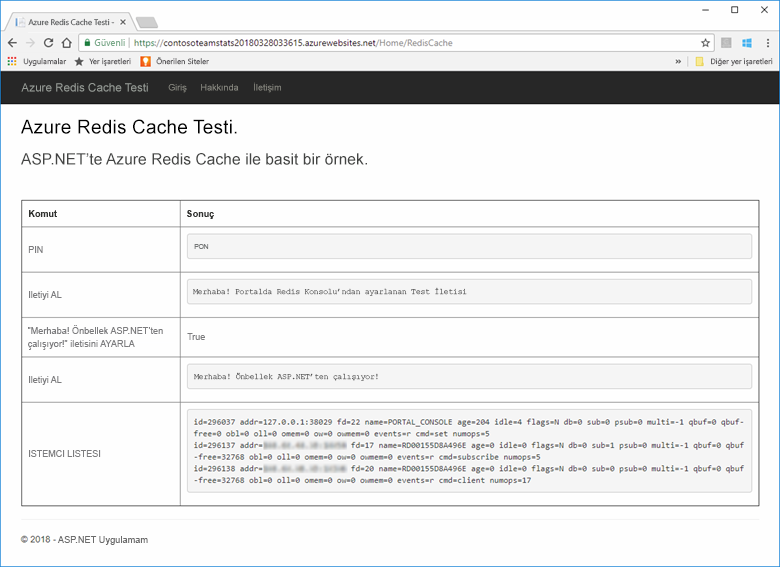

[!INCLUDE [quickstarts-free-trial-note](../../includes/quickstarts-free-trial-note.md)]

## <a name="prerequisites"></a>Ön koşullar

Bu hızlı başlangıcı tamamlamak için aşağıdaki önkoşullara sahip olmanız gerekir:

* [Visual Studio 2017](https://www.visualstudio.com/downloads/)’yi aşağıdaki iş yükleri ile yükleyin:
    * ASP.NET ve web geliştirme
    * Azure Geliştirme

## <a name="create-the-visual-studio-project"></a>Visual Studio projesini oluşturma

Visual Studio’yu açın ve **Dosya**, **Yeni**, **Proje**’yi tıklayın.

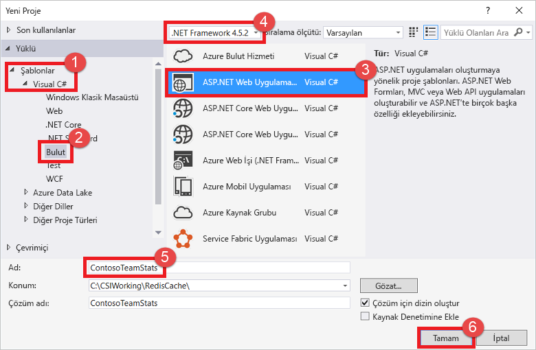

Yeni Proje iletişim kutusunda aşağıdaki adımları uygulayın:

1. **Şablonlar** listesinde **Visual C#** düğümünü genişletin
1. **Bulut**’u seçin
1. **ASP.NET Web Uygulaması**’na tıklayın
1. **.NET Framework 4.5.2** veya daha yüksek bir sürümün seçili olduğundan emin olun
1. **Ad** metin kutusunda projeye bir ad verin; bu örnek için **ContosoTeamStats** adını kullandık
1. **Tamam**’a tıklayın.

Yeni ASP.NET Web Uygulaması ekranı sunulur:


Proje türü olarak **MVC**’yi seçin.

**Kimlik Doğrulama** ayarları için **Kimlik Doğrulaması Yok** seçeneğinin belirtildiğinden emin olun. Visual Studio sürümünüze bağlı olarak, varsayılan değer başka bir şeye ayarlanmış olabilir. Değiştirmek için **Kimlik Doğrulamasını Değiştir**’e tıklayıp **Kimlik Doğrulaması Yok**’u seçin.

Projeyi oluşturmak için **Tamam**'a tıklayın.

## <a name="create-a-cache"></a>Bir önbellek oluşturma

Daha sonra, uygulama için önbellek oluşturursunuz.

[!INCLUDE [redis-cache-create](../../includes/redis-cache-create.md)]

[!INCLUDE [redis-cache-access-keys](../../includes/redis-cache-access-keys.md)]

Bilgisayarınızda *CacheSecrets.config* adlı bir dosya oluşturun ve örnek uygulamanızın kaynak kodu ile denetlenmeyecek bir konuma yerleştirin. Bu hızlı başlangıç için *CacheSecrets.config* dosyası şu konumda bulunur: *C:\AppSecrets\CacheSecrets.config*.

*CacheSecrets.config* dosyasını düzenleyin ve aşağıdaki içerikleri ekleyin:

```xml
<appSettings>
    <add key="CacheConnection" value="<cache-name>.redis.cache.windows.net,abortConnect=false,ssl=true,password=<access-key>"/>
</appSettings>
```

`<cache-name>` adını, önbellek ana bilgisayar adınızla değiştirin.

`<access-key>` adını, önbelleğinizin birincil anahtarıyla değiştirin.

> [!TIP]
> Siz birincil erişim anahtarını yeniden oluştururken alternatif anahtar olarak anahtar döndürme sırasında ikincil erişim anahtarı kullanılır.
>

Dosyayı kaydedin.

## <a name="update-the-mvc-application"></a>MVC uygulamasını güncelleştirme

Bu bölümde, Azure Redis Cache’e karşı basit bir test görüntüleyecek yeni bir görünümü desteklemek için uygulamayı güncelleştirirsiniz.

* [Önbellek için uygulama ayarı ile web.config dosyasını güncelleştirme](#Update-the-webconfig-file-with-an-app-setting-for-the-cache)
* [StackExchange.Redis istemcisini kullanmak için uygulamayı yapılandırma](#configure-the-application-to-use-stackexchangeredis)
* [HomeController ve Düzeni güncelleştirme](#update-the-homecontroller-and-layout)
* [Yeni RedisCache görünümü ekleme](#add-a-new-rediscache-view)

### <a name="update-the-webconfig-file-with-an-app-setting-for-the-cache"></a>Önbellek için uygulama ayarı ile web.config dosyasını güncelleştirme

Uygulamayı yerel olarak çalıştırdığınızda, Azure Redis Cache örneğinize bağlanmak için *CacheSecrets.config* içindeki bilgiler kullanılır. Daha sonra bu uygulamayı Azure’a dağıtacaksınız. O aşamada, uygulamanın bu dosya yerine önbellek bağlantı bilgilerini almak için kullanacağı Azure’daki bir uygulama ayarını yapılandıracaksınız. *CacheSecrets.config*, uygulamanızla Azure’a dağıtılmadığından bunu yalnızca uygulamayı yerel olarak test ederken kullanırsınız. Önbellek verilerinize kötü amaçlı erişimi önlemek için bu bilgileri olabildiğince güvende tutmak istersiniz.

**Çözüm Gezgini**’nde, *web.config* dosyasına çift tıklayarak dosyayı açarsınız.

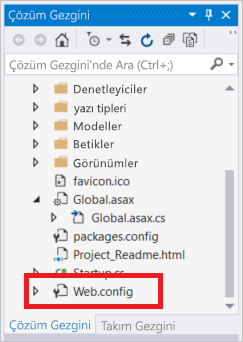

*web.config* dosyasında `<appSetting>` öğesini bulun ve şu `file` özniteliğini ekleyin. Farklı bir dosya adı veya konumu kullandıysanız, örnekte gösterilenlerin yerine bu değerleri koyun.

* Önce: `<appSettings>`
* Sonra: ` <appSettings file="C:\AppSecrets\CacheSecrets.config">`

ASP.NET çalışma zamanı, `<appSettings>` öğesindeki biçimlendirmeye sahip harici dosyasının içeriğini birleştirir. Belirtilen dosya bulunamazsa, çalışma zamanı dosya özniteliğini yok sayar. Gizli anahtarlarınız (önbelleğinize bağlantı dizisi) uygulamanız için kaynak kodun bir parçası olarak dahil edilmez. Web uygulamanızı Azure’a dağıtırken, *CacheSecrests.config* dosyası dağıtılmaz.

### <a name="configure-the-application-to-use-stackexchangeredis"></a>StackExchange.Redis kullanmak için uygulamayı yapılandırma

Visual Studio’da [StackExchange.Redis](https://github.com/StackExchange/StackExchange.Redis) NuGet paketi kullanmak üzere uygulamayı yapılandırmak için **Araçlar > NuGet Paket Yöneticisi > Paket Yöneticisi Konsolu** seçeneklerine tıklayın.

`Package Manager Console` penceresinden aşağıdaki komutu çalıştırın:

```powershell
Install-Package StackExchange.Redis
```

NuGet paketi, StackExchange.Redis Cache istemcisiyle Azure Redis Cache’e erişmek üzere istemci uygulamanız için gerekli derleme başvurularını ekler. `StackExchange.Redis` istemci kitaplığının tanımlayıcı adlı bir sürümünü kullanmak istiyorsanız `StackExchange.Redis.StrongName` paketini yükleyin.

### <a name="update-the-homecontroller-and-layout"></a>HomeController ve Düzeni güncelleştirme

**Çözüm Gezgini**’nde, **Denetleyiciler** klasörünü genişletin ve *HomeController.cs* dosyasını açın.

Önbellek istemci ve uygulama ayarlarını desteklemek için dosyanın üst kısmına şu iki `using` deyimini ekleyin.

```csharp
using System.Configuration;
using StackExchange.Redis;
```

Yeni önbelleğe karşı bazı komutları yürüten yeni bir `RedisCache` eylemini desteklemek için `HomeController` sınıfına aşağıdaki yöntemi ekleyin.

```csharp
    public ActionResult RedisCache()
    {
        ViewBag.Message = "A simple example with Azure Redis Cache on ASP.NET.";

        var lazyConnection = new Lazy<ConnectionMultiplexer>(() =>
        {
            string cacheConnection = ConfigurationManager.AppSettings["CacheConnection"].ToString();
            return ConnectionMultiplexer.Connect(cacheConnection);
        });

        // Connection refers to a property that returns a ConnectionMultiplexer
        // as shown in the previous example.
        IDatabase cache = lazyConnection.Value.GetDatabase();

        // Perform cache operations using the cache object...

        // Simple PING command
        ViewBag.command1 = "PING";
        ViewBag.command1Result = cache.Execute(ViewBag.command1).ToString();

        // Simple get and put of integral data types into the cache
        ViewBag.command2 = "GET Message";
        ViewBag.command2Result = cache.StringGet("Message").ToString();

        ViewBag.command3 = "SET Message \"Hello! The cache is working from ASP.NET!\"";
        ViewBag.command3Result = cache.StringSet("Message", "Hello! The cache is working from ASP.NET!").ToString();

        // Demostrate "SET Message" executed as expected...
        ViewBag.command4 = "GET Message";
        ViewBag.command4Result = cache.StringGet("Message").ToString();

        // Get the client list, useful to see if connection list is growing...
        ViewBag.command5 = "CLIENT LIST";
        ViewBag.command5Result = cache.Execute("CLIENT", "LIST").ToString().Replace(" id=", "\rid=");

        lazyConnection.Value.Dispose();

        return View();
    }
```

**Çözüm Gezgini**’nde **Görünümler**>**Paylaşılan** klasörünü genişletin ve *_Layout.cshtml* dosyasını açın.

Değiştir:

```csharp
@Html.ActionLink("Application name", "Index", "Home", new { area = "" }, new { @class = "navbar-brand" })
```

Yerine konan:

```csharp
@Html.ActionLink("Azure Redis Cache Test", "RedisCache", "Home", new { area = "" }, new { @class = "navbar-brand" })
```

### <a name="add-a-new-rediscache-view"></a>Yeni RedisCache görünümü ekleme

**Çözüm Gezgini**’nde **Görünümler** klasörünü genişletin ve **Giriş** klasörüne sağ tıklayın. **Ekle** > **Görünüm...** seçeneğini belirleyin.

Görünüm Ekle iletişim kutusuna Görünüm Adı için **RedisCache** girin ve **Ekle**’ye tıklayın.

*RedisCache.cshtml* dosyasındaki kodu aşağıdaki kodla değiştirin:

```csharp
@{
    ViewBag.Title = "Azure Redis Cache Test";
}

<h2>@ViewBag.Title.</h2>
<h3>@ViewBag.Message</h3>
<br /><br />
<table border="1" cellpadding="10">
    <tr>
        <th>Command</th>
        <th>Result</th>
    </tr>
    <tr>
        <td>@ViewBag.command1</td>
        <td><pre>@ViewBag.command1Result</pre></td>
    </tr>
    <tr>
        <td>@ViewBag.command2</td>
        <td><pre>@ViewBag.command2Result</pre></td>
    </tr>
    <tr>
        <td>@ViewBag.command3</td>
        <td><pre>@ViewBag.command3Result</pre></td>
    </tr>
    <tr>
        <td>@ViewBag.command4</td>
        <td><pre>@ViewBag.command4Result</pre></td>
    </tr>
    <tr>
        <td>@ViewBag.command5</td>
        <td><pre>@ViewBag.command5Result</pre></td>
    </tr>
</table>
```

## <a name="run-the-app-locally"></a>Uygulamayı yerel olarak çalıştırma

Varsayılan olarak proje, test ve hata ayıklama için uygulamayı [IIS Express](https://docs.microsoft.com/iis/extensions/introduction-to-iis-express/iis-express-overview)’te yerel olarak barındırmak üzere yapılandırılır.

Visual Studio’daki menüde **Hata Ayıklama** > **Hata Ayıklamayı Başlat** seçeneklerine tıklayarak test ve hata ayıklama için uygulamayı derleyip başlatın.

Tarayıcıda, gezinti çubuğundaki **Azure Redis Cache Testi**’ne tıklayın.

Aşağıdaki örnekte, `Message` anahtarının portaldaki Redis Konsolu kullanılarak ayarlanan, önceden önbelleğe alınmış bir değer içerdiğini görebilirsiniz. Uygulama, önbelleğe alınan bu değeri güncelleştirdi. Ayrıca uygulama, `PING` ve `CLIENT LIST` komutlarını da yürüttü.

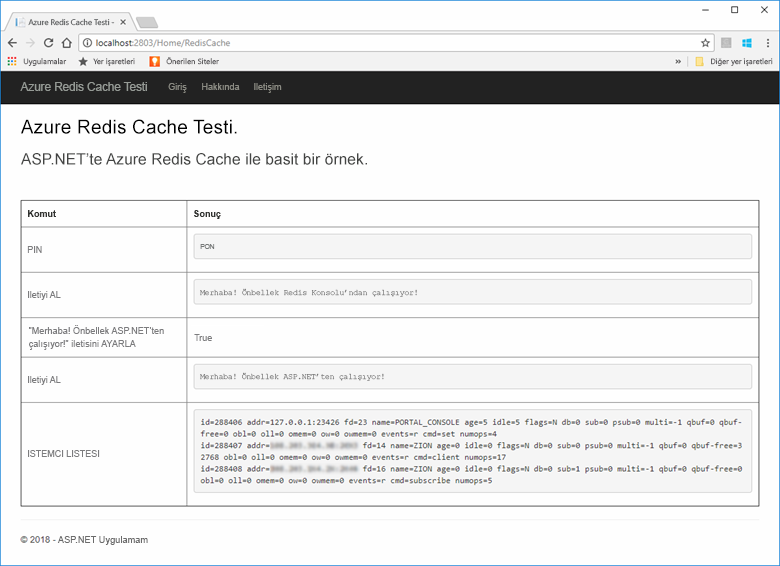

## <a name="publish-and-run-in-azure"></a>Azure’da yayımlama ve çalıştırma

Uygulamayı yerel olarak başarıyla test ettikten sonra Azure’a dağıtacak ve bulutta çalıştıracaksınız.

### <a name="publish-the-app-to-azure"></a>Uygulamayı Azure’da yayımlama

Visual Studio’da, Çözüm Gezgini’ndeki proje düğümüne sağ tıklayın ve Yayımla’yı seçin.

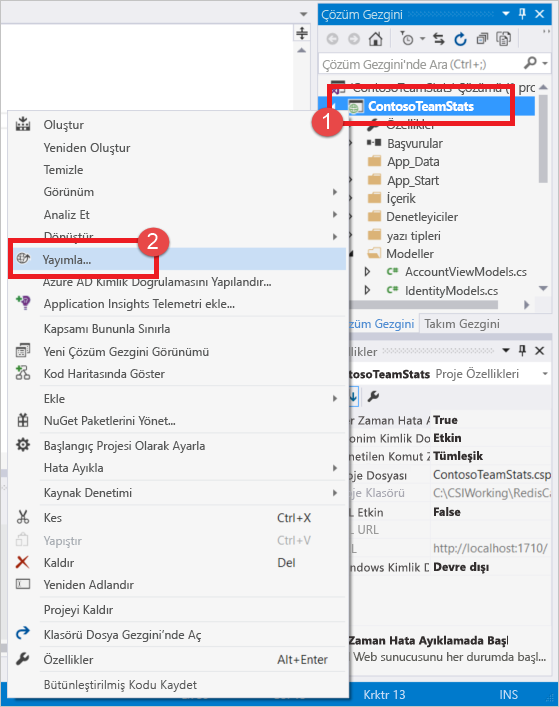

**Microsoft Azure App Service**’e tıklayın, **Yeni Oluştur**’u seçin ve **Yayımla**’ya tıklayın.

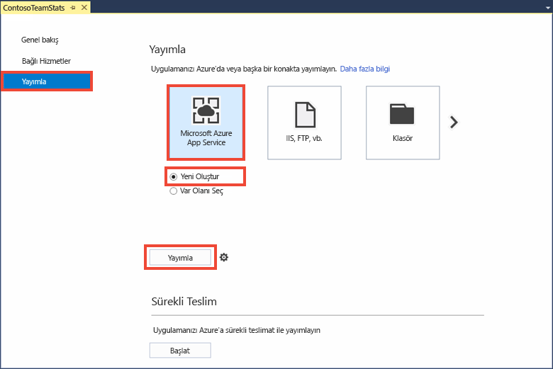

**Uygulama Hizmetini Oluştur** iletişim kutusunda aşağıdaki değişiklikleri yapın:

| Ayar | Önerilen Değer | Açıklama |
| ------- | :---------------: | ----------- |
| **Uygulama Adı** | Varsayılanı kullan | Uygulama adı, Azure’a dağıtıldığında uygulama için ana bilgisayar adı olacaktır. Gerekirse adı benzersiz hale getirmek için ada bir zaman damgası soneki eklenebilir. |
| **Abonelik** | Azure aboneliğinizi seçme | Bu abonelik için tüm ilgili barındırma ücretleri alınır. Birden çok Azure aboneliğiniz varsa, istediğiniz aboneliğin seçildiğini doğrulayın.|
| **Kaynak Grubu** | Önbelleği oluşturduğunuz aynı kaynak grubunu kullanın. Örneğin, *TestResourceGroup*. | Kaynak grubu, tüm kaynakları bir grup olarak yönetmek istediğinizde kullanışlıdır. Daha sonra uygulamayı silmek istediğinizde, grubu silmeniz yeterli olacaktır. |
| **App Service Planı** | **Yeni**’ye tıklayın ve *TestingPlan* adlı yeni bir App Service Planı oluşturun. <br />Önbelleğinizi oluştururken kullandığınız aynı **Konumu** kullanın. <br />Boyut için **Serbest**’i seçin. | App Service planı, bir web uygulamasının birlikte çalıştırılacağı işlem kaynakları kümesini tanımlar. |

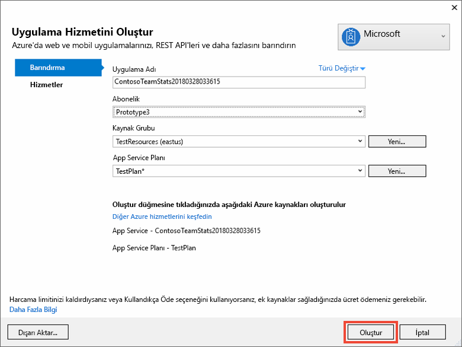

App Service barındırma ayarlarını yapılandırdıktan sonra **Oluştur**’a tıklayarak uygulamanız için yeni bir Uygulama Hizmeti oluşturun.

Azure’da yayımlama durumunu görmek için Visual Studio’da **Çıktı** penceresini izleyin. Yayımlama başarıyla tamamlandığında, App Service URL’si aşağıda gösterildiği gibi günlüğe kaydedilir:

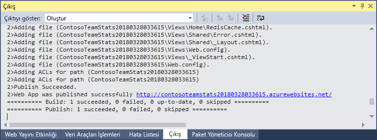

### <a name="add-the-app-setting-for-the-cache"></a>Önbellek için uygulama ayarını ekleme

Yeni App Service için yayımlama tamamlandıktan sonra yeni bir uygulama ayarı ekleyin. Bu ayar, önbellek bağlantı bilgilerini depolamak için kullanılır. Yeni oluşturduğunuz App Service’i bulmak için Azure portalının üst kısmındaki arama çubuğuna uygulama adını yazın.

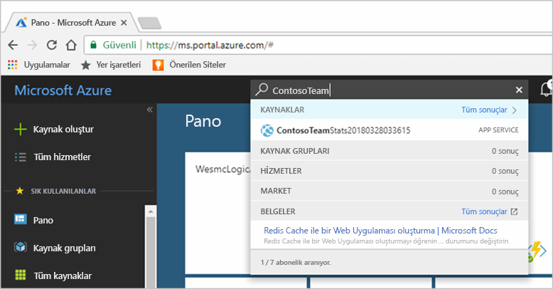

Önbelleğe bağlanmak için kullanılacak uygulama için **CacheConnection** adlı yeni bir uygulama ayarı ekleyin. *CacheSecrets.config* dosyanızda, `CacheConnection` için yapılandırdığınız aynı değeri kullanın. Değer, önbellek ana bilgisayar adını ve erişim anahtarını içerir.

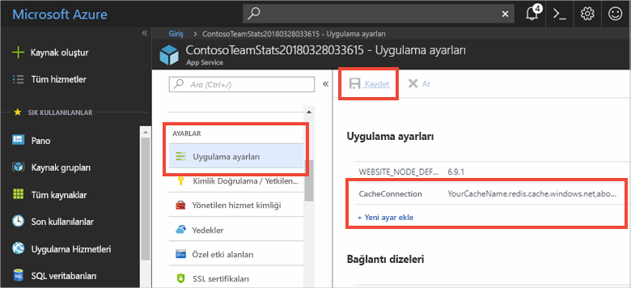

### <a name="run-the-app-in-azure"></a>Azure’da uygulamayı çalıştırma

Tarayıcınızda, App Service için URL'ye gidin. URL, Visual Studio’da Çıktı penceresinde yayımlama işleminin sonuçlarında gösterilir. Ayrıca Azure portalında, oluşturduğunuz App Service’in Genel Bakış sayfasında da sağlanır.

Önbellek erişimini test etmek için gezinti çubuğunda **Azure Redis Cache Testi**’ne tıklayın.


## <a name="clean-up-resources"></a>Kaynakları temizleme

Sonraki öğreticiyle devam edecekseniz, bu hızlı başlangıçta oluşturulan kaynakları tutabilir ve sonraki öğreticide yeniden kullanabilirsiniz.

Aksi takdirde, hızlı başlangıç örnek uygulamasını tamamladıysanız ücret yansıtılmaması için bu hızlı başlangıçta oluşturulan Azure kaynaklarını silebilirsiniz. 

> [!IMPORTANT]
> Bir kaynak grubunu silme işlemi geri alınamaz ve kaynak grubunun ve içindeki tüm kaynaklar kalıcı olarak silinir. Yanlış kaynak grubunu veya kaynakları yanlışlıkla silmediğinizden emin olun. Bu örneği, tutmak istediğiniz kaynakları içeren mevcut bir kaynak grubunda barındırmak için kaynaklar oluşturduysanız, kaynak grubunu silmek yerine her kaynağı kendi ilgili dikey penceresinden tek tek silebilirsiniz.
>

[Azure portalında](https://portal.azure.com) oturum açın ve **Kaynak grupları**’na tıklayın.

**Ada göre filtrele...** metin kutusuna kaynak grubunuzun adını girin. Bu makaledeki yönergelerde *TestResources* adlı bir kaynak grubu kullanılmıştır. Sonuç listesindeki kaynak grubunuzda **...** ve sonra **Kaynak grubunu sil**’e tıklayın.

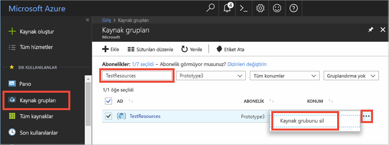

Kaynak grubunun silinmesini onaylamanız istenir. Onaylamak için kaynak grubunuzun adını yazın ve **Sil**’e tıklayın.

Birkaç dakika sonra kaynak grubu ve içerdiği kaynakların tümü silinir.

## <a name="next-steps"></a>Sonraki adımlar

Sonraki öğreticide, bir uygulamanın performansını artırmak için daha gerçek bir senaryoda Azure Redis Cache’i kullanacaksınız. ASP.NET ve veritabanı ile edilgen önbellekli düzeni kullanarak puan tablosu sonuçlarını önbelleğe almak için bu uygulamayı güncelleştirirsiniz.

> [!div class="nextstepaction"]
> [ASP.NET üzerinde edilgen önbellekli puan tablosu oluşturma](cache-web-app-cache-aside-leaderboard.md)
