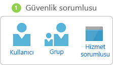
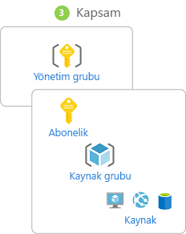
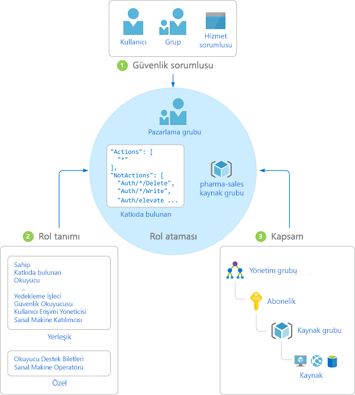

# Rol tabanlı erişim denetimi (RBAC) nedir?

Bulut kaynakları için erişim yönetimi, bulutu kullanan tüm kuruluşlar için kritik öneme sahip bir işlevdir. Rol tabanlı erişim denetimi (RBAC) Azure kaynaklarına erişebilen kişileri, bu kişilerin bu kaynaklarla yapabileceklerini ve erişebildikleri alanları yönetmenize yardımcı olur.

RBAC, [Azure Resource Manager](../azure-resource-manager/resource-group-overview.md)'ı temel alan, Azure kaynakları için ayrıntılı erişim yönetimi sağlayan bir yetkilendirme sistemidir.

## RBAC ile ne yapabilirim?

Aşağıda RBAC ile gerçekleştirebileceğiniz işlemlere örnekler verilmiştir:

- Bir kullanıcıya abonelikteki sanal makineleri yönetme, başka bir kullanıcıya ise sanal ağları yönetme izni verme
- Bir DBA grubuna abonelikteki SQL veritabanlarını yönetme izni verme
- Bir kullanıcının sanal makineler, web siteleri ve alt ağlar gibi bir kaynak grubundaki tüm kaynakları yönetmesine izin verme
- Bir uygulamaya bir kaynak grubundaki tüm kaynaklara erişim izni verme

## RBAC kullanımı için en iyi yöntem

RBAC kullanarak ekibiniz içinde görevleri ayırabilir, bu işlere gerek duyan kişilere sadece erişim miktarını verebilirsiniz. Herkese Azure aboneliğiniz veya kaynaklarınızda sınırsız izin vermek yerine belirli eylemlere yalnızca belirli kapsamlarda izin verebilirsiniz.

Erişim denetimi stratejinizi planlarken en iyi yöntem, kullanıcılara yalnızca işlerini yapmak için gerekli olan ayrıcalığı tanımaktır. Aşağıdaki diyagramda RBAC kullanımı için önerilen model gösterilmiştir.

## RBAC nasıl çalışır?

RBAC özelliğini kullanarak kaynaklara erişimi denetlemek için rol ataması oluşturmanız gerekir. Bu kavram izinlerin uygulanma şeklini belirlediğinden oldukça önemlidir. Rol ataması üç öğeden oluşur: güvenlik sorumlusu, rol tanımı ve kapsam.

### Güvenlik sorumlusu

A *güvenlik sorumlusu* bir kullanıcı, Grup, hizmet sorumlusu veya Azure kaynaklarına erişmek isteyen yönetilen kimlik temsil eden bir nesnedir.

- Kullanıcı: Azure Active Directory'de bir profile sahip olan kişidir. Diğer kiracılardaki kullanıcılara da rol atayabilirsiniz. Diğer kuruluşlardaki kullanıcılar hakkında bilgi almak için bkz. [Azure Active Directory B2B](../active-directory/b2b/what-is-b2b.md).
- Grup: Azure Active Directory'de oluşturulan kullanıcı kümesidir. Bir gruba rol atadığınızda ilgili gruptaki tüm kullanıcılar o role sahip olur. 
- Hizmet sorumlusu: Uygulamalar veya hizmetler tarafından belirli Azure kaynaklarına erişmek için kullanılan güvenlik kimliğidir. Bunu bir uygulamanın *kullanıcı kimliği* (kullanıcı adı ve parola veya sertifika) olarak düşünebilirsiniz.
- Yönetilen kimlik - bir kimliği Azure Active Directory'de, otomatik olarak Azure tarafından yönetilir. Tipik olarak kullandığınız [yönetilen kimlikleri](../active-directory/managed-identities-azure-resources/overview.md) Azure Hizmetleri için kimlik doğrulaması için kimlik bilgilerini yönetmek için bulut uygulamaları geliştirirken.

### Rol tanımı

*Rol tanımı*, izinlerden oluşan bir koleksiyondur. Bazen yalnızca *rol* olarak da adlandırılır. Rol tanımı; okuma, yazma ve silme gibi gerçekleştirilebilecek işlemleri listeler. Roller sahip gibi üst düzey veya sanal makine okuyucusu gibi sınırlı olabilir.

Azure'da kullanabileceğiniz birçok [yerleşik rol](built-in-roles.md) bulunur. Dört temel yerleşik rol aşağıda listelenmiştir. İlk üçü tüm kaynak türleri için geçerlidir.

- [Sahip](built-in-roles.md#owner): Erişimi başkalarına verme hakkı dahil olmak üzere tüm kaynaklara tam erişime sahiptir.
- [Katkıda bulunan](built-in-roles.md#contributor): Her türlü Azure kaynağını oluşturup yönetebilir ancak başkalarına erişim izni veremez.
- [Okuyucu](built-in-roles.md#reader): Var olan Azure kaynaklarını görüntüleyebilirsiniz.
- [Kullanıcı Erişimi Yöneticisi](built-in-roles.md#user-access-administrator): Azure kaynaklarına kullanıcı erişimini yönetmenizi sağlar.

Yerleşik rollerin diğerleri belirli Azure kaynakları için yönetim özellikleri sunar. Örneğin [Sanal Makine Katılımcısı](built-in-roles.md#virtual-machine-contributor) rolü, kullanıcının sanal makine oluşturmasını ve yönetmesini sağlar. Yerleşik roller kuruluşunuzun ihtiyaçlarını karşılamıyorsa kendi [özel rollerinizi](custom-roles.md) oluşturabilirsiniz.

Azure, bir nesne içindeki verilere erişim izni vermenizi sağlayan veri işlemlerini (şu anda önizleme sürümündedir) kullanıma sunmuştur. Örneğin kullanıcının bir depolama hesabında verileri okuma erişimi varsa bu kullanıcı ilgili depolama hesabındaki blobları veya iletileri okuyabilir. Daha fazla bilgi için bkz. [Rol tanımlarını anlama](role-definitions.md).

### Kapsam

*Kapsam*, erişimin geçerli olduğu sınırları belirtir. Bir rol atadığınızda kapsam tanımlayarak izin verilen eylemleri sınırlandırabilirsiniz. Bu özellik bir kullanıcıyı yalnızca bir kaynak grubu için [Web Sitesi Katılımcısı](built-in-roles.md#website-contributor) yapmak istediğiniz durumlarda kullanışlıdır.

Azure'da [yönetim grubu](../azure-resource-manager/management-groups-overview.md), abonelik, kaynak grubu veya kaynak olmak üzere birden fazla seviyede kapsam belirtebilirsiniz. Kapsamlar üst-alt öğe ilişkisiyle yapılandırılmıştır.

Üst kapsamda verdiğiniz erişim izinleri alt kapsamlar tarafından devralınır. Örneğin:

- [Sahip](built-in-roles.md#owner) rolünü yönetim grubu kapsamında bir kullanıcıya atarsanız bu kullanıcı yönetim grubundaki tüm aboneliklerde bulunan nesneleri yönetebilir.
- [Okuyucu](built-in-roles.md#reader) rolünü bir gruba abonelik kapsamında atadığınızda grubun üyeleri aboneliğin içindeki tüm kaynak gruplarını ve kaynakları görüntüleyebilir.
- [Katkıda bulunan](built-in-roles.md#contributor) rolünü bir uygulamaya kaynak grubu kapsamında atadığınızda ilgili grup bu kaynak grubundaki her türlü kaynağı yönetebilir ancak abonelikteki diğer kaynak gruplarını yönetemez.

### Rol atamaları

A *rol ataması* bir kullanıcı, Grup, hizmet sorumlusu veya yönetilen kimlik erişim verme amacıyla belirli bir kapsamda bir rol tanımı ekleme işlemidir. Erişim, rol ataması oluşturularak sağlanır ve rol ataması kaldırıldığında iptal edilir.

Aşağıdaki diyagramda rol ataması örneği gösterilmektedir. Bu örnekte Marketing grubuna pharma-sales kaynak grubu için [Katkıda bulunan](built-in-roles.md#contributor) rolü atanmıştır. Bu da Marketing grubundaki kullanıcıların pharma-sales kaynak grubunda tüm Azure kaynaklarını oluşturma veya yönetme işlemlerini gerçekleştirebileceği anlamına gelir. Başka bir rol atamasına sahip olmayan Marketing kullanıcılarının pharma-sales kaynak grubu dışındaki kaynaklara erişimi yoktur.

Rol atamalarını oluşturmak için Azure portal, Azure CLI, Azure PowerShell, Azure SDK'ları veya REST API'lerini kullanabilirsiniz. Her abonelikte en fazla 2000 rol ataması gerçekleştirebilirsiniz. Rol ataması oluşturmak ve kaldırmak için `Microsoft.Authorization/roleAssignments/*` iznine sahip olmanız gerekir. Bu izin, [Sahip](built-in-roles.md#owner) veya [Kullanıcı Erişimi Yöneticisi](built-in-roles.md#user-access-administrator) rolleriyle verilir.

## Reddetme atamaları

Daha önce, RBAC reddetme seçeneği olmayan yalnızca izin verme modeliydi ama şimdi RBAC sınırlı bir yoldan reddetme atamalarını da destekliyor. Bir rol ataması için benzer bir *atamasını Reddet* kümesini ekler Reddetme eylemleri bir kullanıcı, Grup, hizmet sorumlusu veya erişimi engelleme amacıyla belirli bir kapsamda yönetilen kimlik. Bir rol ataması eylemler kümesini tanımlayan *izin*Reddet atama eylemler kümesini tanımlayan korurken *izin*. Başka bir deyişle, reddetme atamaları kullanıcıların belirtilen eylemleri gerçekleştirmesini (rol ataması izin vermiş olsa bile) engeller. Reddetme atamaları rol atamalarından daha önceliklidir. Şu anda, reddetme atamaları **salt okunurdu** ve yalnızca Azure tarafından ayarlanabilir. Daha fazla bilgi için [anlayın Reddet atamaları](deny-assignments.md) ve [görünümü Reddet atamaları Azure portalını kullanarak](deny-assignments-portal.md).

## RBAC kullanıcının bir kaynağa erişimi olduğunu nasıl saptar?

Aşağıdakiler, RBAC'nin yönetim düzleminde bir kaynağa erişiminizin olup olmadığını saptamak için kullandığı üst düzey adımlardır. Bunları anlamak, bir erişim sorununu gidermeye çalışırken işinize yarayabilir.

1. Kullanıcı (veya hizmet sorumlusu) Azure Resource Manager için bir belirteç alır.

    Belirteç kullanıcının grup üyeliğini (geçişli grup üyelikleri de dahil) içerir.

1. Kullanıcı, belirteci de ekleyerek Azure Resource Manager'a bir REST API çağrısı yapar.

1. Azure Resource Manager, üzerinde eylem gerçekleştirilen kaynak için geçerli olan tüm rol atamalarını ve reddetme atamalarını alır.

1. Azure Resource Manager, rol atamalarını bu kullanıcıya veya onun grubuna uygulananlarla daraltır ve kullanıcının bu kaynak için hangi role sahip olduğunu saptar.

1. Azure Resource Manager, API çağrısındaki eylemin bu kaynak için kullanıcının sahip olduğu rollere eklenip eklenmediğini saptar.

1. Kullanıcının istenen kapsamda eylemi içeren rolü yoksa, erişim verilmez. Aksi takdirde, Azure Resource Manager bir reddetme atamasının geçerli olup olmadığını denetler.

1. Reddetme ataması geçerliyse, erişim engellenir. Aksi takdirde erişim izni verilir.

## Sonraki adımlar

- [Hızlı başlangıç: RBAC ve Azure portalı kullanarak bir kullanıcıya erişim izni verme](quickstart-assign-role-user-portal.md)
- [RBAC ve Azure portalı kullanarak erişimi yönetme](role-assignments-portal.md)
- [Azure'daki farklı rolleri anlama](rbac-and-directory-admin-roles.md)
- [Kurumsal Bulut Benimsemesi: Azure'da kaynak erişimi yönetimi](/azure/architecture/cloud-adoption/getting-started/azure-resource-access)
