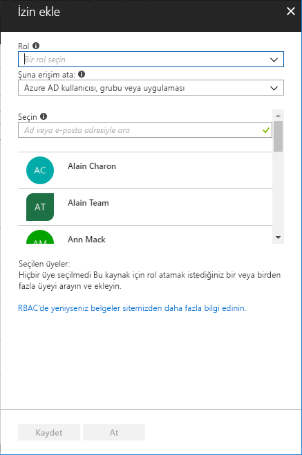

# Hızlı Başlangıç: RBAC ve Azure portalı kullanarak kullanıcıya erişim izni verme

Rol tabanlı erişim denetimi (RBAC) Azure'da kaynaklara erişimi yönetmek için kullanılan yöntemdir. Bu hızlı başlangıçta, bir kaynak grubunda sanal makineler oluşturması ve bunları yönetmesi için bir kullanıcıya erişim vereceksiniz.

Azure aboneliğiniz yoksa başlamadan önce [ücretsiz bir hesap](https://azure.microsoft.com/free/?WT.mc_id=A261C142F) oluşturun.

## Azure'da oturum açma

http://portal.azure.com adresinden Azure portalında oturum açın.

## Kaynak grubu oluşturma

1. Gezinti bölmesinde **Kaynak grupları**'nı seçin.

1. **Kaynak grubu** dikey penceresini açmak için **Ekle**'yi seçin.

   

1. **Kaynak grubu adı** olarak **rbac-quickstart-resource-group** ifadesini girin.

1. Bir abonelik ve bir konum seçin.

1. Kaynak grubunu oluşturmak için **Oluştur**'u seçin.

1. Kaynak grupları listesini yenilemek için **Yenile**'yi seçin.

   Yeni kaynak grubu kaynak grupları listenizde görünür.

   

## Erişim verme

RBAC'de erişim vermek için bir rol ataması oluşturmanız gerekir.

1. **Kaynak grupları** listesinde yeni **rbac-quickstart-resource-group** kaynak grubunu seçin.

1. Geçerli rol atamaları listesini görmek için **Erişim denetimi (IAM)** öğesini seçin.

   

1. **Ekle**'yi seçerek **İzin ekle** bölmesini açın.

   Rol atamak için gerekli izinlere sahip değilseniz **Ekle** seçeneği görüntülenmez.

   

1. Aşağı açılan **Rol** listesinden **Sanal Makine Katılımcısı**'nı seçin.

1. **Seç** listesinde kendinizi ve başka bir kullanıcıyı seçin.

1. Rol atamasını oluşturmak için **Kaydet**'i seçin.

   Birkaç saniye sonra kullanıcıya rbac-quickstart-resource-group kaynak grubu kapsamında Sanal Makine Katılımcısı rolü atanır.

   

## Erişimi kaldırma

RBAC'de erişimi kaldırmak için rol atamasını kaldırmanız gerekir.

1. Rol atamaları listesinde, rolü Sanal Makine Katılımcısı olan kullanıcının yanına bir onay işareti koyun.

1. **Kaldır**'ı seçin.

   

1. Açılan rol atamasını kaldırma mesajında **Evet**'i seçin.

## Temizleme

1. Gezinti bölmesinde **Kaynak grupları**'nı seçin.

1. Kaynak grubunu açmak için **rbac-quickstart-resource-group** seçeneğini belirleyin.

1. Kaynak grubunu silmek için **Kaynak grubunu sil**'i seçin.

   

1. **Silmek istediğinizden emin misiniz** dikey penceresine **rbac-quickstart-resource-group** olan kaynak grubu adını yazın.

1. Kaynak grubunu silmek için **Sil**'i seçin.

## Sonraki adımlar

> [!div class="nextstepaction"]
> [Öğretici: RBAC ve PowerShell kullanarak kullanıcıya erişim izni verme](tutorial-role-assignments-user-powershell.md)

