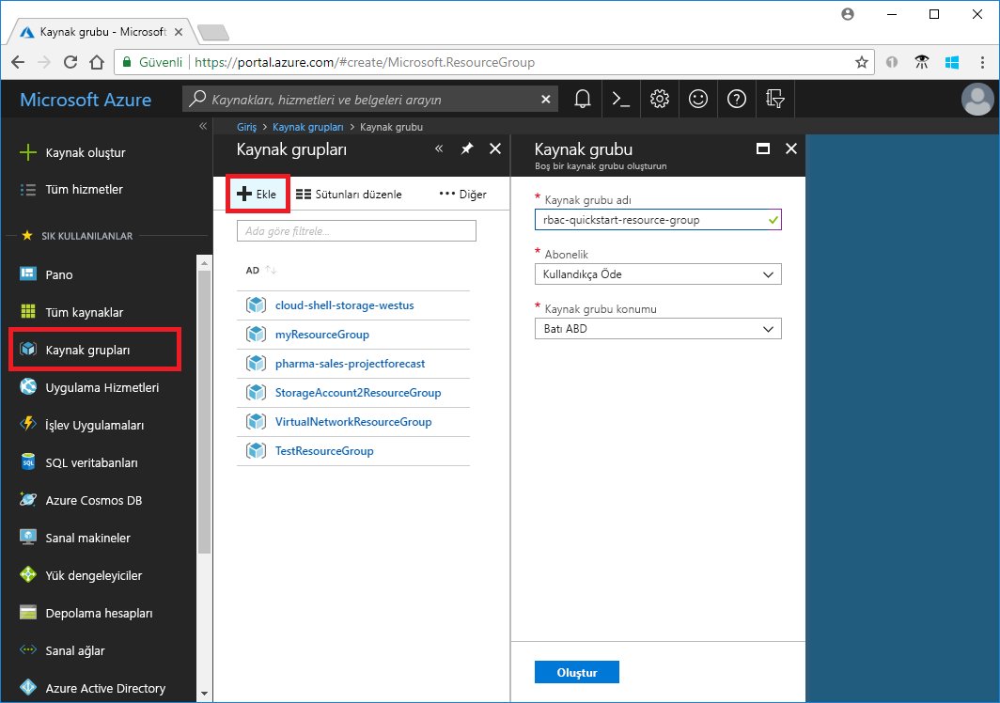
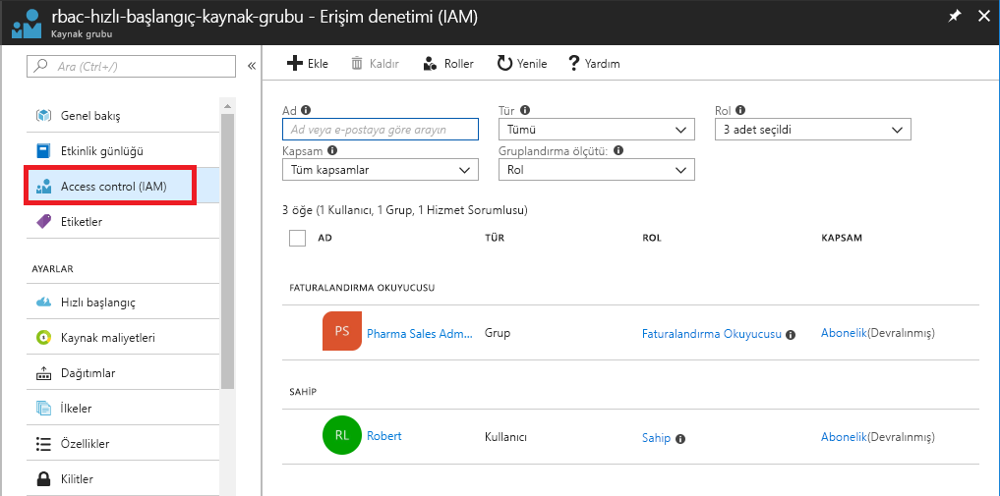
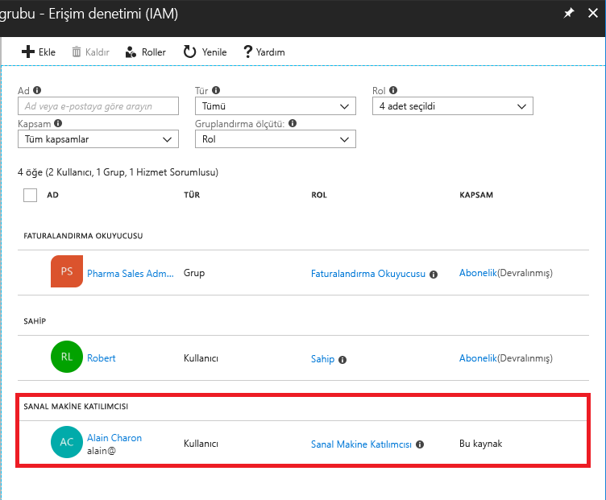
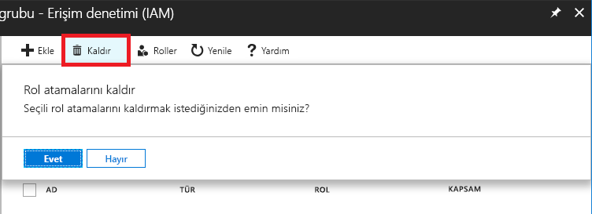
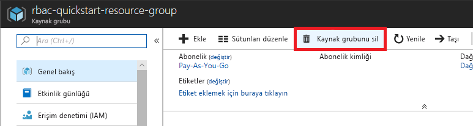

# Öğretici: RBAC ve Azure portalını kullanarak Azure kaynaklarına kullanıcı erişimi

[Rol tabanlı erişim denetimi (RBAC)](overview.md) Azure kaynaklarına erişimi yönetme yoludur. Bu öğreticide, bir kullanıcı oluşturun ve bir kaynak grubundaki sanal makineleri yönetme erişimi verin.

Bu öğreticide şunların nasıl yapıldığını öğreneceksiniz:

> [!div class="checklist"]
> * Bir kaynak grubu kapsamındaki bir kullanıcı için erişim izni ver
> * Erişimi kaldırma

Azure aboneliğiniz yoksa başlamadan önce [ücretsiz bir hesap](https://azure.microsoft.com/free/?WT.mc_id=A261C142F) oluşturun.

## Azure'da oturum açma

[https://portal.azure.com](https://portal.azure.com ) adresinden Azure portalında oturum açın.

## Kaynak grubu oluşturma

1. Gezinti listesinde **kaynak grupları**.

1. Tıklayın **Ekle** açmak için **kaynak grubu** dikey penceresi.

   

1. İçin **kaynak grubu adı**, girin **rbac-resource-group**.

1. Bir abonelik ve bir konum seçin.

1. Tıklayın **Oluştur** kaynak grubu oluşturun.

1. Tıklayın **Yenile** kaynak grupları listesini yenileyin.

   Yeni kaynak grubu kaynak grupları listenizde görünür.

   

## Erişim verme

RBAC'de erişim vermek için bir rol ataması oluşturmanız gerekir.

1. Listesinde **kaynak grupları**, yeni **rbac-resource-group** kaynak grubu.

1. Tıklayın **erişim denetimi (IAM)** .

1. Tıklayın **rol atamaları** rol atamaları geçerli listesini görmek için sekmesinde.

   

1. Tıklayın **Ekle** > **rol ataması Ekle** Ekle rol ataması bölmesini açmak için.

   Rol atama izinleri yoksa, rol ataması Ekle seçeneğini devre dışı bırakılır.

   

   

1. Aşağı açılan **Rol** listesinden **Sanal Makine Katılımcısı**'nı seçin.

1. **Seç** listesinde kendinizi ve başka bir kullanıcıyı seçin.

1. Tıklayın **Kaydet** rol ataması oluşturmak için.

   Birkaç dakika sonra kullanıcıya rbac kaynak grubunun kaynak grubu kapsamında bir sanal makine Katılımcısı rolü atanır.

   

## Erişimi kaldırma

RBAC'de erişimi kaldırmak için rol atamasını kaldırmanız gerekir.

1. Rol atamalarını listesinde, sanal makine Katılımcısı rolü kullanıcıyla yanında bir onay işareti ekleyin.

1. Tıklayın **Kaldır**.

   

1. Görünür kaldırma rol ataması iletisinde tıklayın **Evet**.

## Temizleme

1. Gezinti listesinde **kaynak grupları**.

1. Tıklayın **rbac-resource-group** kaynak grubunu açın.

1. Tıklayın **kaynak grubunu Sil** kaynak grubu silinemedi.

   

1. Üzerinde **silmek istediğinizden emin misiniz** dikey penceresinde, kaynak grubu adını yazın: **rbac-resource-group**.

1. Tıklayın **Sil** kaynak grubu silinemedi.

## Sonraki adımlar

> [!div class="nextstepaction"]
> [Öğretici: RBAC ve Azure PowerShell kullanarak Azure kaynaklarına kullanıcı erişimi](tutorial-role-assignments-user-powershell.md)

