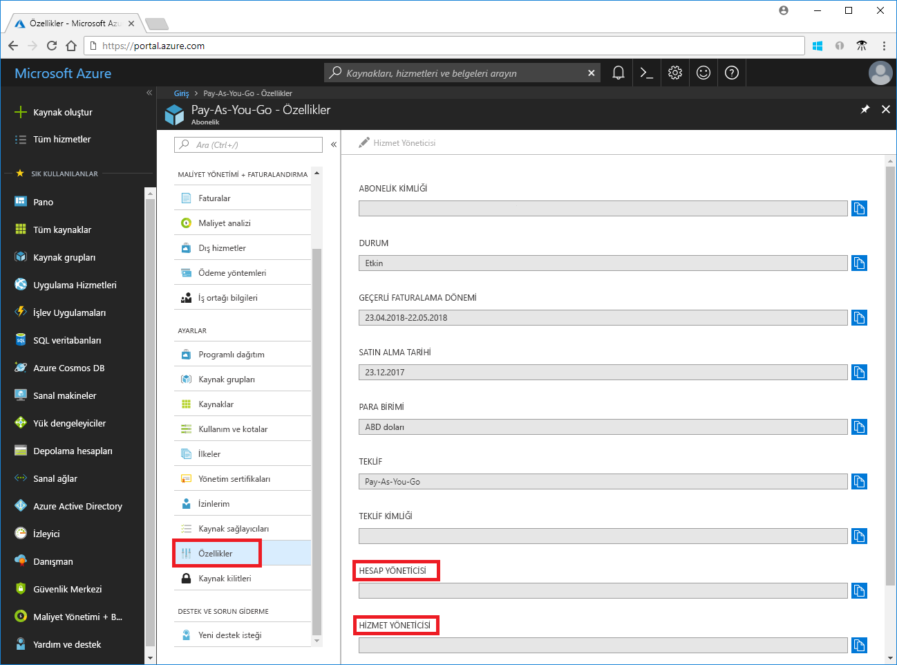
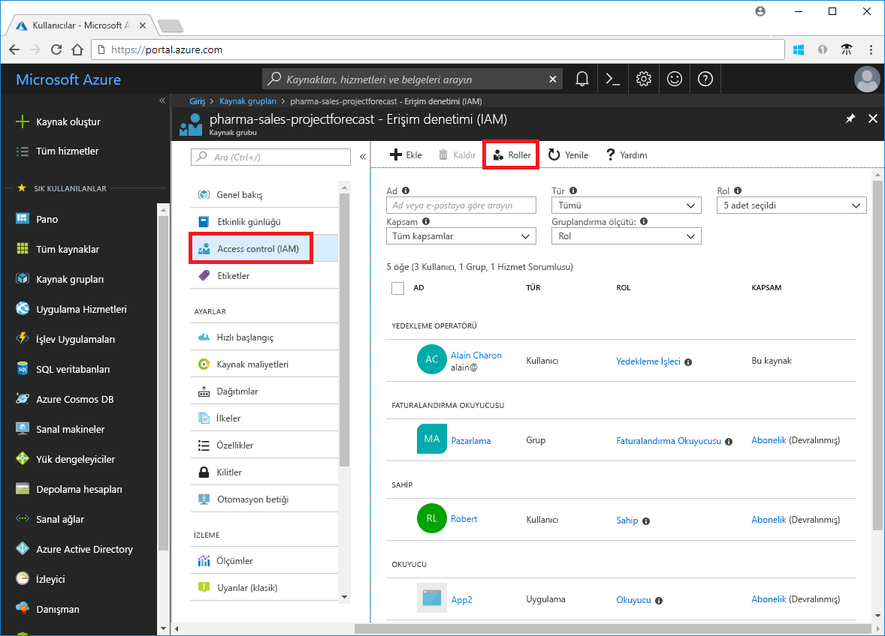
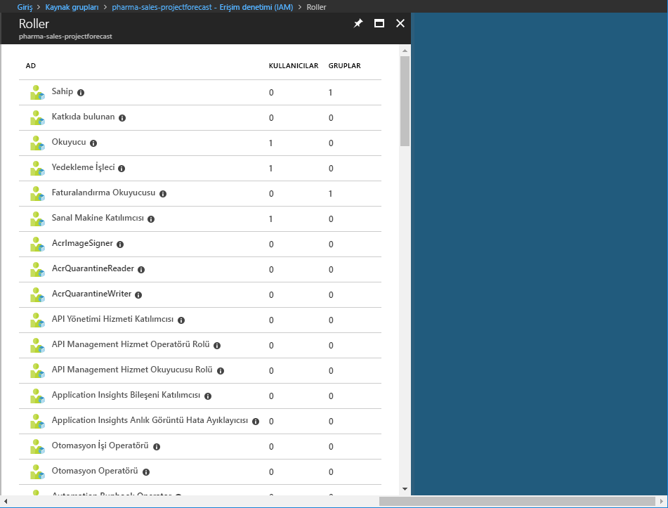

# Azure farklı rolleri anlama

Azure'da yeniyseniz tüm Azure rollerinde anlaşılması zor bulabilirsiniz. Bu makalede, aşağıdaki rolleri ve her zaman kullanacağınız açıklayan yardımcı olur:
- Klasik Abonelik Yöneticisi rolleri
- Azure rol tabanlı erişim denetimi (RBAC) rolleri
- Azure Active Directory (Azure AD) yönetici rolleri

## Rollerin nasıl ilişkili olduğunu

Rolleri azure'da daha iyi anlamak için bu geçmişi bazıları öğrenmenize yardımcı olur. Azure başlangıçta yayımlandığında, kaynaklara erişimi yalnızca üç yönetici rolleri ile yönetildiği sırada: Hesap Yöneticisi, Hizmet Yöneticisi ve ortak yönetici. Daha sonra Azure kaynakları için rol tabanlı erişim denetimi (RBAC) eklendi. Azure RBAC, üzerinde oluşturulmuş yeni bir yetkilendirme sistemidir [Azure Resource Manager](../azure-resource-manager/resource-group-overview.md) , Azure kaynaklarına ayrıntılı erişim yönetimi sağlar. RBAC, birçok yerleşik roller içerir, farklı kapsamların atanabilir ve kendi özel roller oluşturmanızı da sağlar. Azure AD'de, kullanıcılar, gruplar ve etki alanları gibi kaynakları yönetmek için birkaç Azure AD yönetici rollerini vardır.

Aşağıdaki diyagramda, Klasik Abonelik Yöneticisi rolleri, Azure RBAC rolleri ve Azure AD yönetici rollerini nasıl ilişkili olduğunu, üst düzey bir görünümüdür.

## Klasik abonelik yöneticileri

Hesap Yöneticisi, Hizmet Yöneticisi ve ortak yönetici azure'da Klasik Abonelik Yöneticisi rolleri var. Klasik abonelik yöneticileri, Azure aboneliği için tam erişime sahiptir. Bunlar, kaynakların Azure portalı, Azure Resource Manager API'lerini ve klasik dağıtım modeli API'lerini kullanarak yönetebilirsiniz. Hesap Yöneticisi ve Hizmet Yöneticisi, Azure'a kaydolmak için kullandığınız hesabı otomatik olarak ayarlanır. Ardından, ek ortak Yöneticiler eklenebilir. Hizmet Yöneticisi ve ortak Yöneticiler abonelik kapsamında bir sahip rolü (Azure RBAC rolü) atanmış kullanıcılar eşdeğer erişimi var. Aşağıdaki tabloda bu üç Klasik Abonelik Yönetim rolleri arasındaki farkları açıklar.

| Klasik abonelik yöneticisi | Sınır | İzinler | Notlar |
| --- | --- | --- | --- |
| Hesap Yöneticisi | Azure hesabı başına 1 | <ul><li>Erişim [Azure hesap Merkezi](https://account.azure.com/Subscriptions)</li><li>Bir hesaptaki tüm abonelikleri Yönet</li><li>Yeni Abonelik Oluştur</li><li>Aboneliklerinizi iptal edin</li><li>Bir abonelik için faturalama değiştirme</li><li>Hizmet yöneticisini değiştiremez</li></ul> | Kavramsal olarak, fatura aboneliğin sahibi.|
| Hizmet Yöneticisi | Azure aboneliği başına 1 | <ul><li>Hizmetleri yönetme [Azure portalı](https://portal.azure.com)</li><li>Ortak yönetici rolüne kullanıcı atayın</li></ul> | Varsayılan olarak yeni bir abonelik için Hesap Yöneticisi ayrıca hizmet yöneticisidir. Hizmet Yöneticisi, abonelik kapsamında sahip rolüne atanan kullanıcı eşdeğer erişebilir. |
| Ortak Yönetici | Abonelik başına 200 | <ul><li>Aynı ayrıcalıklar Hizmet Yöneticisi olarak erişecek ancak ilişkisini aboneliklerin Azure dizinleriyle değiştiremez</li><li>Ortak yönetici rolüne kullanıcı atayın, ancak hizmet yöneticisini değiştiremez</li></ul> | Ortak yönetici, abonelik kapsamında sahip rolüne atanan kullanıcı eşdeğer erişebilir. |

Azure portalında, Hizmet Yöneticisi ve Hesap Yöneticisi, aboneliğinizin özelliklerini görüntüleyerek atanan kişi görebilirsiniz.

Ekleme veya abonelik yöneticileri değiştirme hakkında daha fazla bilgi için bkz. [ekleme veya değiştirme Azure aboneliği yöneticileri](../billing/billing-add-change-azure-subscription-administrator.md) Azure faturalama belgelerinde.

### Azure hesabı ve Azure abonelikleri

Bir Azure hesabı, faturalandırma ilişkisine temsil eder. Bir Azure hesabı, bir kullanıcı kimliği, bir veya daha fazla Azure aboneliği ve Azure kaynakları kümesi ' dir. Hesabı oluşturan kişi bu hesabında oluşturulan tüm abonelikler için hesap yöneticinize anlamına gelir. Bu kişi ayrıca Hizmet Yöneticisi abonelik için varsayılandır.

Azure abonelikleri Azure kaynaklarına erişimi düzenlemenize yardımcı olur. Ayrıca kaynak kullanımının nasıl raporlandığını, faturalandırıldığını ve ödendiği denetlemenize yardımcı olur. Her abonelikte, farklı Abonelikleriniz ve farklı planlarınız office, departman, proje ve benzeri tarafından denetlenebilmesi bir farklı faturalama ve ödeme Kurulum olabilir. Her hizmetin bir aboneliği aittir ve abonelik Kimliğini programlı işlemler için gerekli olabilir.

Hesaplar ve abonelikler yönetilen [Azure hesap Merkezi](https://account.azure.com/Subscriptions).
## Azure RBAC rolleri

Azure RBAC işlem ve depolama gibi Azure kaynaklarına ayrıntılı erişim yönetimi sağlayan bir sistemdir. Azure RBAC 60'tan fazla yerleşik rolleri içerir. Dört temel RBAC rolü var. İlk üç tüm kaynak türleri için geçerlidir:

| Azure RBAC rolü | İzinler | Notlar |
| --- | --- | --- |
| [Sahibi](built-in-roles.md#owner) | <ul><li>Tüm kaynaklar için tam erişim</li><li>Diğer temsilci erişimi</li></ul> | Hizmet Yöneticisi ve ortak Yöneticiler abonelik kapsamında bir sahip rolü atanmış olan Tüm kaynak türlerine uygulanır. |
| [Katılımcı](built-in-roles.md#contributor) | <ul><li>Oluşturma ve tüm Azure kaynaklarınızın türlerini yönetme</li><li>Diğerleri için erişim izni veremez</li></ul> | Tüm kaynak türlerine uygulanır. |
| [Okuyucu](built-in-roles.md#reader) | <ul><li>Azure kaynaklarını görüntüleme</li></ul> | Tüm kaynak türlerine uygulanır. |
| [Kullanıcı erişimi Yöneticisi](built-in-roles.md#user-access-administrator) | <ul><li>Azure kaynaklarına kullanıcı erişimini yönetme</li></ul> |  |

Yerleşik rollerin geri kalanı, belirli bir Azure kaynak yönetimi sağlar. Örneğin, [sanal makine Katılımcısı](built-in-roles.md#virtual-machine-contributor) oluşturmak ve sanal makineleri yönetmek kullanıcı rolü sağlar. Tüm yerleşik roller listesi için bkz. [yerleşik roller](built-in-roles.md).

RBAC, yalnızca Azure portalı ve Azure Resource Manager API'leri destekler. Kullanıcılar, gruplar ve RBAC rollerini atanan uygulamaları kullanamaz [Azure Klasik dağıtım modeli API'lerini](../azure-resource-manager/resource-manager-deployment-model.md).

Rol atamaları RBAC kullanarak Azure portalında görünen **erişim denetimi (IAM)** dikey penceresi. Bu dikey pencere, abonelik, kaynak grupları ve çeşitli kaynakları gibi portalı boyunca bulunabilir.

Tıkladığınızda **rolleri** seçeneği, yerleşik ve özel rollerin listesini görürsünüz.

## Azure AD yönetici rolleri

Rolleri gibi bir dizinde Azure AD kaynaklarını yönetmek için kullanılan azure AD Yöneticisi oluşturma veya kullanıcıları Düzenle, diğerlerine yönetici rolleri atama, kullanıcı parolalarını sıfırlama, kullanıcı lisanslarını yönetmek ve etki alanlarını yönetme. Aşağıdaki tabloda, birkaç önemli Azure AD yönetici rollerini açıklanmaktadır.

| Azure AD Yönetici rolü | İzinler | Notlar |
| --- | --- | --- |
| [Genel yönetici](../active-directory/active-directory-assign-admin-roles-azure-portal.md#company-administrator) | <ul><li>Azure Active Directory'ye federe hizmetlerinin yanı sıra Azure Active Directory, tüm yönetim özelliklerine erişimi yönetme</li><li>Diğerlerine yönetici rolleri atama</li><li>Tüm kullanıcılar ve tüm yöneticiler için parola sıfırlama</li></ul> | Azure Active Directory kiracısı için kaydolan kişi genel yönetici olur. |
| [Kullanıcı Yöneticisi](../active-directory/active-directory-assign-admin-roles-azure-portal.md#user-account-administrator) | <ul><li>Oluşturabilir ve kullanıcıların ve grupların tüm özelliklerini yönetebilir</li><li>Destek biletlerini yönetebilir</li><li>Hizmet durumunu izleme</li><li>Kullanıcılar, Yardım Masası yöneticileri ve diğer kullanıcı yöneticileri için parolaları değiştirme</li></ul> |  |
| [Yardım Masası Yöneticisi](../active-directory/active-directory-assign-admin-roles-azure-portal.md#helpdesk-administrator) | <ul><li>Kullanıcıların ve diğer Yardım Masası yöneticilerinin parolalarını değiştirme</li><li>Hizmet isteklerini yönetme</li><li>Hizmet durumunu izleme</li></ul> |  |
| [Faturalama Yöneticisi](../active-directory/active-directory-assign-admin-roles-azure-portal.md#billing-administrator) | <ul><li>Satın alma işlemleri yapın</li><li>Abonelikleri yönetme</li><li>Destek biletlerini yönetebilir</li><li>İzleyicilerin sistem durumu hizmeti</li></ul> |  |

Tüm Azure AD yönetici rollerinin bir listesi için bkz. [Azure Active Directory'de yönetici rolleri atama](/azure/active-directory/active-directory-assign-admin-roles-azure-portal).

Azure portalında Azure AD yönetici rolleri atayabilir **Azure Active Directory** dikey penceresi.

## Azure RBAC rolleri ve Azure AD yönetici rolleri arasındaki farklar

Yüksek düzeyde, Azure RBAC rolleri, izinler, Azure Active Directory kaynaklarını yönetmek için Azure AD yönetici rollerini kontrol ederken, Azure kaynaklarını yönetmek için izinler denetler. Aşağıdaki tabloda farklılıklar karşılaştırır.

| Azure RBAC rolleri | Azure AD yönetici rolleri |
| --- | --- |
| Azure kaynaklarına erişimi yönetme | Azure Active Directory kaynaklarına erişimi yönetme |
| Özel roller destekler | Kendi rollerinizi oluşturulamıyor |
| Kapsamı birden çok düzeyde (Yönetim grubu, abonelik, kaynak grubu, kaynak) belirtilebilir. | Kiracı düzeyinde kapsamdır |
| Rol bilgilerini Azure portalında Azure CLI, Azure PowerShell, Azure Resource Manager şablonları erişilebilir, REST API | Rol bilgilerinin Azure Yönetim Portalı, Office 365 Yönetim Portalı'nda Microsoft Graph AzureAD PowerShell erişilebilir. |

### Azure RBAC rolleri ve Azure AD yönetici rollerini örtüşme?

Varsayılan olarak, Azure RBAC rolleri ve Azure AD yönetici rollerini Azure ve Azure'u kapsayan değil AD. Ancak, genel yönetici erişimleri seçerek yükseltir, **genel yönetici Azure aboneliklerini ve Yönetim gruplarını yönetebilir** geçiş Azure portalında genel yönetici verilecek [ Kullanıcı erişimi Yöneticisi](built-in-roles.md#user-access-administrator) belirli bir kiracının tüm Aboneliklerde rol (RBAC rolü). Kullanıcı erişimi yöneticisi rolü, diğer kullanıcılara Azure kaynaklarına erişim verme kullanıcı sağlar. Bu anahtar, bir abonelik erişebilmek yararlı olabilir. Daha fazla bilgi için [Azure AD yönetici erişimini yükseltme](elevate-access-global-admin.md).

Çeşitli Azure AD yönetici rollerini yayılma Azure AD ve Microsoft Office 365 genel yönetici ve kullanıcı yönetici rolleri gibi. Örneğin, genel yönetici rolünün bir üyesi varsa, Azure AD'de genel yönetici özelliklerine sahip ve Office 365 gibi Microsoft Exchange ve Microsoft SharePoint için değişiklikler. Bununla birlikte, varsayılan olarak, genel yönetici Azure kaynaklarına erişimi yok.

## Sonraki adımlar

- [Rol tabanlı erişim denetimi (RBAC) nedir?](overview.md)
- [Azure Active Directory'de yönetici rolleri atama](/azure/active-directory/active-directory-assign-admin-roles-azure-portal)
- [Ekleme veya Azure aboneliği yöneticileri değiştirme](/azure/billing/billing-add-change-azure-subscription-administrator)
