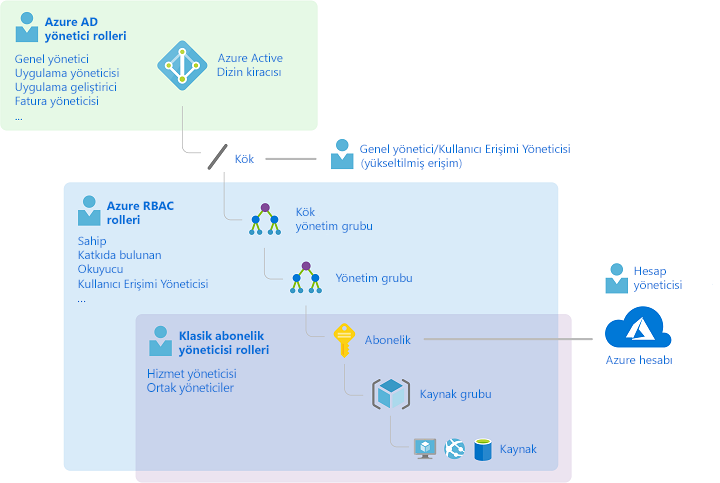
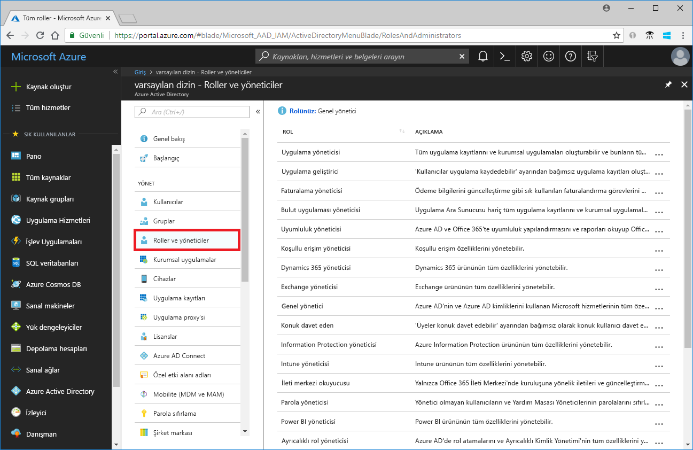
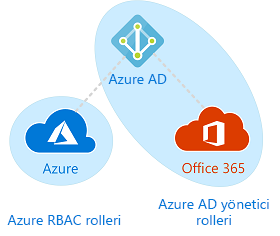

# Klasik abonelik yönetici rolleri, Azure RBAC rolleri ve Azure AD yönetici rolleri

Azure'da yeniyseniz farklı rolleri kavrama konusunda zorluk yaşıyor olabilirsiniz. Bu makalede aşağıdaki roller ve bunları kullanacağınız zamanlar açıklanmaktadır:
- Klasik abonelik yönetici rolleri
- Azure rol tabanlı erişim denetimi (RBAC) rolleri
- Azure Active Directory (Azure AD) yönetici rolleri

## Roller arasındaki ilişki

Azure'un geçmişine göz atmanız rolleri daha iyi anlamanıza yardımcı olabilir. Azure başlangıçta yayımlandığında, kaynaklara erişimi yalnızca üç yönetici rolleri ile yönetiliyor: Hesap Yöneticisi, Hizmet Yöneticisi ve ortak yönetici. Sonradan Azure kaynakları için rol tabanlı erişim denetimi (RBAC) özelliği eklendi. Azure RBAC, Azure kaynakları için daha ayrıntılı bir erişim yönetimi sunan daha yeni bir yetkilendirme sistemidir. RBAC farklı kapsamlarda atanabilen birçok yerleşik role sahiptir ve kendi özel rollerinizi oluşturmanıza imkan tanır. Azure AD'deki kullanıcılar, gruplar veya etki alanları gibi kaynakları yönetmek için birden fazla Azure AD yönetici rolü bulunur.

Aşağıdaki diyagramda klasik abonelik yönetici rolleri, Azure RBAC rolleri ve Azure AD yönetici rolleri arasındaki ilişki yüksek düzeyde gösterilmiştir.

## Klasik abonelik yönetici rolleri

Hesap Yöneticisi, Hizmet Yöneticisi ve Ortak Yönetici, Azure'daki üç klasik abonelik yönetici rolüdür. Klasik abonelik yöneticileri, Azure aboneliğinde tam erişime sahiptir. Bu yöneticiler Azure portal, Azure Resource Manager API'leri ve klasik dağıtım modeli API'leri aracılığıyla kaynakları yönetebilir. Azure'a kaydolmak için kullanılan hesap otomatik olarak hem Hesap Yöneticisi hem de Hizmet Yöneticisi olarak ayarlanır. Kayıt işleminin ardından ek Ortak Yöneticiler eklenebilir. Hizmet Yöneticisi ve Ortak Yöneticiler, abonelik kapsamında Sahip rolü (bir Azure RBAC rolüdür) atanmış olan kullanıcılarla eşit düzeyde erişime sahiptir. Aşağıdaki tabloda bu üç klasik abonelik yönetici rolü arasındaki farklar gösterilmiştir.

| Klasik abonelik yöneticisi | Sınır | İzinler | Notlar |
| --- | --- | --- | --- |
| Hesap Yöneticisi | Azure hesabı başına 1 | <ul><li>[Azure Hesap Merkezi](https://account.azure.com/Subscriptions)'ne erişme</li><li>Hesaptaki tüm abonelikleri yönetme</li><li>Yeni abonelik oluşturma</li><li>Abonelikleri iptal etme</li><li>Aboneliğin faturalama bilgilerini değiştirme</li><li>Hizmet Yöneticisini değiştirme</li></ul> | Kavramsal açıdan aboneliğin faturalama sahibidir. Hesap Yöneticisi’nin Azure portala erişim yoktur. |
| Hizmet Yöneticisi | Azure aboneliği başına 1 | <ul><li>[Azure portal](https://portal.azure.com)'da hizmetleri yönetme</li><li>Ortak Yönetici rolüne kullanıcı atama</li></ul> | Yeni bir abonelikte Hesap Yöneticisi varsayılan olarak Hizmet Yöneticisi olur. Hizmet Yöneticisi, abonelik kapsamında Sahip rolü atanmış olan kullanıcıyla eşit düzeyde erişime sahiptir. Hizmet Yöneticisi’nin Azure portala tam erişimi vardır. |
| Ortak Yönetici | Abonelik başına 200 | <ul><li>Hizmet Yöneticisi ile aynı erişim ayrıcalıklarına sahiptir, ancak aboneliklerin Azure dizinleriyle ilişkisini değiştiremez</li><li>Ortak Yönetici rolüne kullanıcı atayabilir ancak Hizmet Yöneticisini değiştiremez</li></ul> | Ortak Yönetici, abonelik kapsamında Sahip rolü atanmış olan kullanıcıyla eşit düzeyde erişime sahiptir. |

Azure portalında ortak Yöneticiler yönetebilir veya Hizmet Yöneticisi kullanarak görüntüleme **Klasik yöneticileri** sekmesi.

Azure portalında görüntülemek veya hizmet yöneticisini değiştiremez veya Hesap Yöneticisi aboneliğinizin özellikler dikey penceresinde görüntüleyin.

Daha fazla bilgi için [Azure Klasik abonelik yöneticileri](classic-administrators.md).

### Azure hesabı ve Azure abonelikleri

Azure hesabı bir faturalama ilişkisini temsil eder. Azure hesabı bir kullanıcı kimliğinden, bir veya daha fazla Azure aboneliğinden ve ilgili Azure kaynakları kümesinden oluşur. Hesabı oluşturan kişi, bu hesapta oluşturulan tüm aboneliklerin Hesap Yöneticisi olur. Bu kişi ayrıca aboneliğin varsayılan Hizmet Yöneticisi de olur.

Azure abonelikleri, Azure kaynaklarına erişimi düzenlemenize de yardımcı olur. Ayrıca kaynak kullanımının nasıl raporlandığını, faturalandırıldığını ve ödendiği denetlemenize yardımcı olur. Her abonelik farklı bir faturalandırma ve ödeme ayarına sahip olabilir, bu nedenle ofise, departmana, projeye vs. göre farklı abonelikleriniz ve farklı planlarınız olabilir. Her hizmet bir aboneliğe aittir ve programlama işlemleri için abonelik kimliği gerekebilir.

Hesaplar ve abonelikler [Azure Hesap Merkezi](https://account.azure.com/Subscriptions)'nden yönetilir.

## Azure RBAC rolleri

Azure RBAC, [Azure Resource Manager](../azure-resource-manager/resource-group-overview.md)'ı temel alan, işlem ve depolama gibi Azure kaynakları için ayrıntılı erişim yönetimi sağlayan bir yetkilendirme sistemidir. Azure RBAC'de 70'in üzerinde yerleşik rol bulunur. Dört temel RBAC rolü vardır. İlk üçü tüm kaynak türleri için geçerlidir:

| Azure RBAC rolü | İzinler | Notlar |
| --- | --- | --- |
| [Sahip](built-in-roles.md#owner) | <ul><li>Tüm kaynaklara tam erişim</li><li>Diğer kullanıcılara erişim yetkisi verme</li></ul> | Hizmet Yöneticisine ve Ortak Yöneticilere abonelik kapsamında Sahip rolü atanır Tüm kaynak türleri için geçerlidir. |
| [Katılımcı](built-in-roles.md#contributor) | <ul><li>Her türlü Azure kaynağını oluşturma ve yönetme</li><li>Başkalarına erişim izni veremez</li></ul> | Tüm kaynak türleri için geçerlidir. |
| [Okuyucu](built-in-roles.md#reader) | <ul><li>Azure kaynaklarını görüntüleme</li></ul> | Tüm kaynak türleri için geçerlidir. |
| [Kullanıcı Erişimi Yöneticisi](built-in-roles.md#user-access-administrator) | <ul><li>Azure kaynaklarına kullanıcı erişimini yönetme</li></ul> |  |

Yerleşik rollerin diğerleri belirli Azure kaynakları için yönetim özellikleri sunar. Örneğin [Sanal Makine Katılımcısı](built-in-roles.md#virtual-machine-contributor) rolü, kullanıcının sanal makine oluşturmasını ve yönetmesini sağlar. Tüm yerleşik roller listesi için bkz. [Azure kaynakları için yerleşik roller](built-in-roles.md).

RBAC yalnızca Azure portal ve Azure Resource Manager API'leri tarafından desteklenir. RBAC rolü atanmış olan kullanıcılar, gruplar ve uygulamalar [Azure klasik dağıtım modeli API'lerini](../azure-resource-manager/resource-manager-deployment-model.md) kullanamaz.

Azure portalda RBAC kullanan rol atamaları **Erişim denetimi (IAM)** dikey penceresinde görünür. Bu dikey pencere, Yönetim grupları, abonelikler, kaynak grupları ve çeşitli kaynaklar gibi portalı boyunca bulunabilir.

Tıkladığınızda **rolleri** sekmesi, yerleşik ve özel rollerin listesini görürsünüz.

Daha fazla bilgi için [RBAC ve Azure portalını kullanarak Azure kaynaklarına erişimi yönetme](role-assignments-portal.md).

## Azure AD yönetici rolleri

Azure AD yönetici rolleri kullanıcı oluşturma veya düzenleme, başkalarına yönetici rolleri atama, kullanıcı parolalarını sıfırlama, kullanıcı lisanslarını yönetme ve etki alanlarını yönetme gibi bir dizin içindeki Azure AD kaynaklarını yönetmek için kullanılır. Aşağıdaki tabloda önemli Azure AD yönetici rollerinin birkaç tanesi gösterilmiştir.

| Azure AD yönetici rolü | İzinler | Notlar |
| --- | --- | --- |
| [Genel Yönetici](../active-directory/users-groups-roles/directory-assign-admin-roles.md#company-administrator) | <ul><li>Azure Active Directory'deki tüm yönetim özelliklerine ve Azure Active Directory'yi federasyona ekleyen hizmetlere erişimi yönetme</li><li>Diğer kullanıcılara yönetici rolü atama</li><li>Tüm kullanıcıların ve diğer yöneticilerin parolasını sıfırlama</li></ul> | Azure Active Directory'ye kaydolan kullanıcı, Genel Yönetici olur. |
| [Kullanıcı Yöneticisi](../active-directory/users-groups-roles/directory-assign-admin-roles.md#user-administrator) | <ul><li>Kullanıcı ve grup oluşturma ve bunların tüm özelliklerini yönetme</li><li>Destek biletlerini yönetme</li><li>Hizmet durumunu izleme</li><li>Kullanıcıların, Yardım Masası yöneticilerinin ve Kullanıcı Yöneticilerinin parolalarını değiştirme</li></ul> |  |
| [Faturalama Yöneticisi](../active-directory/users-groups-roles/directory-assign-admin-roles.md#billing-administrator) | <ul><li>Satın alma gerçekleştirme</li><li>Abonelikleri yönetme</li><li>Destek biletlerini yönetme</li><li>Hizmet durumunu izleme</li></ul> |  |

Azure portalda Azure AD yönetici rollerinin listesini **Roller ve yöneticiler** dikey penceresinde görebilirsiniz. Tüm Azure AD yönetici rollerinin bir listesi için bkz. [Azure Active Directory'de Yönetici rolü izinleri](../active-directory/users-groups-roles/directory-assign-admin-roles.md).

## Azure RBAC rolleri ile Azure AD yönetici rolleri arasındaki farklar

Genel anlamda Azure RBAC rolleri, Azure kaynaklarını yönetme izinlerini yönetirken Azure AD yönetici rolleri, Azure Active Directory kaynaklarını yönetme izinlerini denetler. Farkların bazıları aşağıdaki tabloda karşılaştırılmıştır.

| Azure RBAC rolleri | Azure AD yönetici rolleri |
| --- | --- |
| Azure kaynaklarına erişimi yönetme | Azure Active Directory kaynaklarına erişimi yönetme |
| Özel rolleri destekler | Kendi rollerinizi oluşturamazsınız |
| Birden fazla düzeyde (yönetim grubu, abonelik, kaynak grubu, kaynak) kapsam belirtilebilir | Kapsam kiracı düzeyindedir |
| Rol bilgilerine Azure portal, Azure CLI, Azure PowerShell, Azure Resource Manager şablonları, REST API'si aracılığıyla erişilebilir | Rol bilgilerinin Azure Yönetim Portalı, Microsoft 365 Yönetici merkezinde, Microsoft Graph AzureAD PowerShell erişilebilir. |

### Azure RBAC rolleri ile Azure AD yönetici rolleri arasında çakışma var mı?

Azure RBAC rolleri ve Azure AD yönetici rolleri varsayılan olarak Azure ve Azure AD'yi kapsamaz. Ancak bir Genel Yöneticinin, Azure portalda **Genel yönetici Azure Aboneliklerini ve Yönetim Gruplarını yönetebilir**'i seçerek erişim kapsamını genişletmesi halinde Genel Yöneticiye ilgili kiracının tüm aboneliklerinde [Kullanıcı Erişimi Yöneticisi](built-in-roles.md#user-access-administrator) rolü (bir RBAC rolüdür) verilir. Kullanıcı Erişimi Yöneticisi, kullanıcının diğer kullanıcılara Azure kaynaklarına erişim izni vermesini sağlar. Bu seçenek bir aboneliğe yeniden erişim elde etmek konusunda faydalı olabilir. Daha fazla bilgi için bkz. [Azure AD yöneticisi olarak erişimi yükseltme](elevate-access-global-admin.md).

Genel Yönetici ve Kullanıcı Yöneticisi rolleri gibi Azure AD ve Microsoft Office 365'i kapsayan birden fazla Azure AD yönetici rolü vardır. Örneğin Genel Yönetici rolüne üye olduğunuzda Azure AD ve Office 365'te Microsoft Exchange ve Microsoft SharePoint'te değişiklik yapma gibi genel yönetici özelliklerine sahip olursunuz. Ancak Genel Yönetici varsayılan olarak Azure kaynaklarına erişim sahibi değildir.

## Sonraki adımlar

- [Azure kaynakları için rol tabanlı erişim denetimi (RBAC) nedir?](overview.md)
- [Azure Active Directory'deki yönetici rolü izinleri](../active-directory/users-groups-roles/directory-assign-admin-roles.md)
- [Azure Klasik abonelik yöneticileri](classic-administrators.md)
