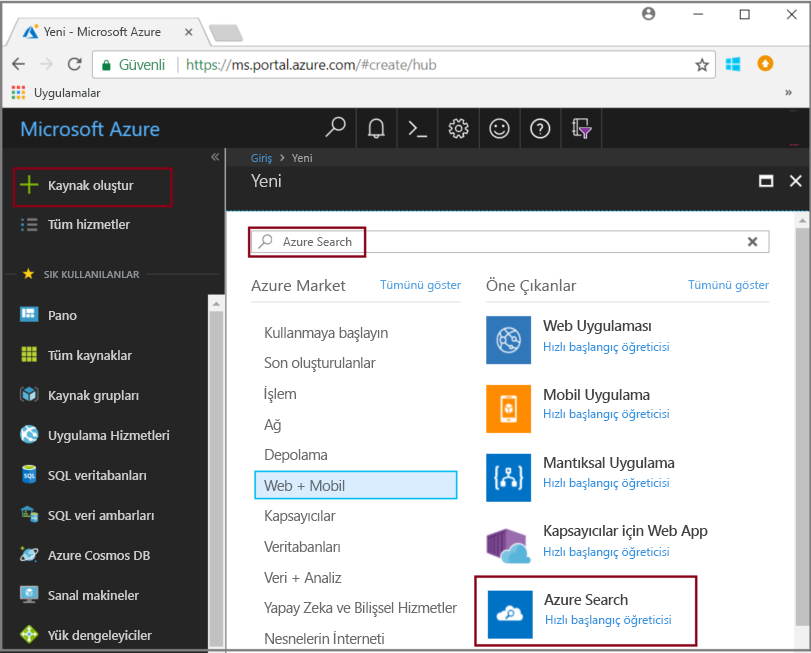
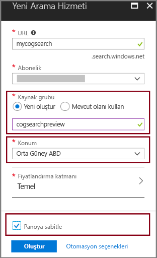

# Hızlı Başlangıç: Becerileri ve örnek verileri kullanarak bilişsel arama işlem hattı oluşturma

Bilişsel arama (önizleme), Azure Search dizin oluşturma işlem hattına veri ayıklama, doğal dil işleme (NLP) ve görüntü işleme becerileri ekleyerek aranamayan veya yapılandırılmamış içeriği daha aranabilir hale getirir. Varlık tanıma veya görüntü analizi gibi bir beceri tarafından oluşturulan bilgiler, Azure Search’te bir dizine eklenir.

Bu hızlı başlangıçta, tek bir kod satırı yazmadan önce [Azure portalındaki](https://portal.azure.com) zenginleştirme işlem hattını deneyin:

* Azure Blob depolamada örnek verileri kullanmaya başlama
* Dizin oluşturma ve zenginleştirme için [Veri içeri aktarma sihirbazı](search-import-data-portal.md)’nı yapılandırma 
* Sihirbazı çalıştırma (bir varlık becerisi, kişileri, konumu ve kuruluşları algılar)
* Zenginleştirilmiş verileri sorgulamak için [Arama gezgini](search-explorer.md)’ni kullanın.

Aşağıdaki bölgelerde oluşturulan bir Azure Search hizmetinde bilişsel aramayı deneyebilirsiniz:

* Orta Güney ABD
* Batı Avrupa

Azure aboneliğiniz yoksa başlamadan önce [ücretsiz bir hesap](https://azure.microsoft.com/free/?WT.mc_id=A261C142F) oluşturun.

> [!NOTE]
> Bilişsel Arama, genel önizleme aşamasındadır. Şu anda becerileri yürütme ve görüntü ayıklama ve normalleştirme ücretsiz olarak sunulmaktadır. İlerleyen zamanlarda bu özelliklerin fiyatları duyurulacaktır. 

## Ön koşullar

[“Bilişsel arama nedir?”](cognitive-search-concept-intro.md) zenginleştirme mimarisi ve bileşenleri sunar. 

Bu senaryoda özel olarak Azure hizmetleri kullanılır. İhtiyaç duyduğunuz hizmetleri oluşturma, hazırlığın bir parçasını oluşturur.

+ Azure Blob depolama, kaynak veriler sağlar.
+ Azure Search, veri alımı ve dizin oluşturmayı, bilişsel arama zenginleştirmesini ve tam metin arama sorgularını işler.

### Azure Search ayarlama

İlk olarak, Azure Search hizmetine kaydolun. 

1. [Azure portalına](https://portal.azure.com) gidin ve Azure hesabınızı kullanarak oturum açın.

1. **Kaynak oluştur**’a tıklayın, Azure Search’ü arayın ve **Oluştur**’a tıklayın. İlk kez bir arama hizmeti ayarlıyorsanız ve daha fazla yardıma ihtiyacınız varsa bkz. [Portalda Azure Search hizmeti oluşturma](search-create-service-portal.md).

  

1. Kaynak grubu için, bu hızlı başlangıçta oluşturduğunuz tüm kaynakları içerecek bir kaynak grubu oluşturun. Böylece, hızlı başlangıcı tamamladıktan sonra kaynakları temizlemeniz kolaylaşır.

1. Konum için **Orta Güney ABD**’yi veya **Batı Avrupa**’yı seçin. Şu anda önizleme yalnızca bu bölgelerde kullanılabilir.

1. Fiyatlandırma katmanı için, **Ücretsiz** bir hizmet oluşturarak öğreticileri ve hızlı başlangıçları tamamlayabilirsiniz. Kendi verilerinizi kullanarak daha ayrıntılı araştırma yapmak için **Temel** veya **Standart** gibi bir [ücretli hizmet](https://azure.microsoft.com/pricing/details/search/) oluşturun. 

  Ücretsiz hizmet; 3 dizin, 16 MB maksimum blob boyutu ve 2 dizinleme dakikası ile sınırlıdır ve bu da bilişsel aramanın tüm yeteneklerini uygulamak için yeterli değildir. Farklı katmanlara ilişkin sınırları gözden geçirmek için bkz. [Hizmet Sınırları](search-limits-quotas-capacity.md).

  > [!NOTE]
  > Bilişsel arama genel önizleme aşamasındadır. Beceri kümesi yürütme şu anda ücretsiz katman da dahil olmak üzere tüm katmanlarda kullanılabilir. İlerleyen zamanlarda bu özelliğin fiyatlandırması duyurulacaktır.

1. Hizmet bilgilerine hızlı erişim için hizmeti panoya sabitleyin.

  

### Azure Blob hizmetini ayarlama ve örnek veriler yükleme

Zenginleştirme işlem hattı, [Azure Search dizin oluşturucuları](search-indexer-overview.md) tarafından desteklenen Azure veri kaynaklarından çekme işlemi yapar. Bu alıştırmada, birden çok içerik türünü göstermek için blob depolama kullanırız.

1. Farklı türlerden oluşan küçük bir dosya kümesini içeren [örnek verileri indirin](https://1drv.ms/f/s!As7Oy81M_gVPa-LCb5lC_3hbS-4). 

1. Azure Blob depolamaya kaydolun, bir depolama hesabı oluşturun, Depolama Gezgini’nde oturum açın ve bir kapsayıcı oluşturun. Tüm adımlardaki yönergeler için bkz. [Azure Depolama Gezgini Hızlı Başlangıcı](../storage/blobs/storage-quickstart-blobs-storage-explorer.md).

1. Azure Depolama Gezgini’ni kullanarak, oluşturduğunuz kapsayıcıda **Karşıya Yükle**’ye tıklayarak örnek dosyaları karşıya yükleyin.

  

## Zenginleştirme işlem hattı oluşturma

Azure Search hizmeti panosu sayfasına geri dönün ve komut çubuğundaki **Verileri İçeri Aktar**’a tıklayarak dört adımda zenginleştirmeyi ayarlayın.

### 1. Adım: Veri kaynağı oluşturma

**Verilerinize bağlanın** > **Azure Blob depolama** bölümünde, oluşturduğunuz hesabı ve kapsayıcıyı seçin. Veri kaynağına bir ad verin ve geri kalanı için varsayılan değerleri kullanın. 

   

**Tamam**'a tıklayarak veri kaynağını oluşturun.

**Verileri içeri aktar** sihirbazını kullanmanın bir avantajı, dizininizi de oluşturabilmesidir. Veri kaynağı oluşturulduğunda sihirbaz aynı anda bir dizin şeması oluşturur. Dizin oluşturulması birkaç saniye sürebilir.

### 2. Adım: Bilişsel yetenekler ekleme

Daha sonra dizin oluşturma işlem hattına zenginleştirme adımları ekleyin. Portal size görüntü analizi ve metin analizi için önceden tanımlanmış bilişsel beceriler sunar. Portalda beceri kümesi, tek bir kaynak alanının üzerinde çalışır. Bu küçük bir hedef gibi görünebilir, ancak Azure blobları için `content` alanı, blob belgesinin çoğunu içerir (örneğin, Word belgesi veya PowerPoint destesi). Aynı şekilde bir blobun tüm içeriği de bu alanda bulunduğundan bu alan ideal bir giriştir.

Bazen tarayıcı tarafından oluşturulan bir PDF gibi çoğunlukla taranmış görüntülerden oluşan dosyaların metinsel gösterimini ayıklamak istersiniz. Azure Search, belgedeki ekli görüntülerin içeriklerini otomatik olarak ayıklayabilir. Bunu yapmak için **OCR’yi etkinleştirip tüm metni merged_content alanına birleştirin** seçeneğini belirleyin. Bu işlem otomatik olarak, belgeden ayıklanmış metin ile birlikte belgede eklenmiş olan görüntülerin metinsel gösterimini içeren bir `merged_content` alanı oluşturur. Bu seçeneği belirlediğinizde `Source data field`, `merged_content` olarak ayarlanır.

**Bilişsel beceriler ekle** bölümünde, doğal dil işleme gerçekleştiren becerileri seçin. Bu hızlı başlangıç için, kişiler, kuruluşlar ve konumlar için varlık tanımayı seçin.

**Tamam**’a tıklayarak tanımı kabul edin.
   
  

Doğal dil işleme becerileri, örnek veri kümesindeki metin içeriği üzerinde çalışır. Herhangi bir görüntü işleme seçeneği belirlemediysek, örnek veri kümesinde bulunan JPEG dosyaları bu hızlı başlangıçta işlenmeyecektir. 

### 3. Adım: Dizini yapılandırma

Veri kaynağıyla oluşturulan dizini hatırlıyor musunuz? Bu adımda, bunun şemasını görüntüleyebilir ve olası tüm ayarları düzeltebilirsiniz. 

Bu hızlı başlangıç, makul varsayılanlar ayarlanması konusunda iyi bir iş çıkarır: 

+ Her dizinin bir adı olmalıdır. Bu veri kaynağı türü için varsayılan ad, *azureblob-index* şeklindedir.

+ Her belgenin bir anahtarı olmalıdır. Sihirbaz, benzersiz değerler içeren bir alan seçer. Bu hızlı başlangıçta anahtar, *metadata_storage_path* şeklindedir.

+ Her alan koleksiyonu, alanın değerlerini açıklayan bir veri tipini içeren alanlara sahiptir ve her alan, arama senaryosunda nasıl kullanıldığını açıklayan dizin özniteliklerine sahip olmalıdır. 

Bir beceri kümesi tanımlamış olduğunuzdan sihirbaz, kaynak veri alanını istediğinizi ve beceriler tarafından çıktı alanlarının oluşturulduğunu varsayar. Bu nedenle portal, `content`, `people`, `organizations` ve `locations` için dizin alanları ekler. Sihirbazın bu alanlar için otomatik olarak Alınabilir ve Aranabilir seçeneklerini etkinleştirmesine dikkat edin.

**Dizini özelleştir** bölümünde, alanlardaki özniteliklerin bir dizinde nasıl kullanıldığını görmek için bu öznitelikleri gözden geçirin. Aranabilir seçeneği, bir alanın aranabileceğini belirtir. Alınabilir seçeneği, alanın sonuçlarda döndürülebileceği anlamına gelir. 

`content` alanından Alınabilir seçeneğinin işaretini kaldırın. Bloblarda bu alan binlerce satıra ulaşabilir ve **Arama gezgini** gibi bir araçta okunması zor olur.

**Tamam**’a tıklayarak dizin tanımını kabul edin.

  

> [!NOTE]
> Kalabalığı önlemek için, kullanılmayan alanlar ekran görüntüsünden kesilmiştir. Portalda ilerlerseniz listeniz ek alanları gösterir.

### 4. Adım: Dizin oluşturucuyu yapılandırma

Dizin oluşturucu, dizin oluşturma işlemini destekleyen, yüksek düzeyli bir kaynaktır. Veri kaynağı adını, dizini ve yürütme sıklığını belirtir. **Verileri içeri aktar** sihirbazının nihai sonucunda her zaman art arda çalıştırabileceğiniz bir dizin oluşturucu elde edilir.

**Dizin Oluşturucu** sayfasında, dizin oluşturucuya bir ad verin ve "bir kez çalıştır" varsayılan ayarını kullanarak hemen çalıştırın. 

  

**Tamam**’a tıklayarak verileri içeri aktarın, zenginleştirin ve dizinini oluşturun.

  

Dizin oluşturma ve zenginleştirme zaman alabilir; ilk keşif için daha küçük veri kümelerinin önerilmesinin nedeni budur. Azure portalının Bildirimler sayfasında dizin oluşturmayı izleyebilirsiniz. 

## Arama gezgininde sorgulama

Bir dizin oluşturulduktan sonra, dizinden belgeleri döndürmek için sorgular gönderebilirsiniz. Portalda **Arama gezgini**’ni kullanarak sorgular çalıştırın ve sonuçları görüntüleyin. 

1. Arama hizmeti panosu sayfasında, komut çubuğunda **Arama gezgini**’ne tıklayın.

1. Oluşturduğunuz dizini seçmek için üst kısımdaki **Dizini değiştir**'e tıklayın.

1. Dizini sorgulamak için "John F. Kennedy" gibi bir arama dizesi girin.

Sonuçlar JSON olarak döndürülür, bu nedenle özellikle de Azure bloblardan gelen büyük belgelerde ayrıntılı ve okuması zor olabilir. 

Sonuçları kolayca tarayamazsanız, belgeler içinde arama yapmak için CTRL-F tuşlarını kullanın. Bu sorgu için, JSON içinde "John F. Kennedy" aramasını yaparak o arama teriminin örneklerini görüntüleyebilirsiniz. 

CTRL-F tuş birleşimi, belirli bir sonuç kümesinde kaç tane belgenin bulunduğunu belirlemenize de yardımcı olabilir. Her değer belge için benzersiz olduğundan Azure blobları için portal, anahtar olarak "metadata_storage_path" öğesini seçer. CTRL-F kullanarak, "metadata_storage_path" araması yapıp belgelerin sayısını alın. Bu sorgu için sonuç kümesindeki iki belge, "John F. Kennedy" terimini içerir.

  

## Paketler

Şimdi ilk zenginleştirilmiş dizin oluşturma çalışmanızı tamamladınız. Bu hızlı başlangıcın amacı, kendi verilerinizi kullanarak hızlı şekilde bir bilişsel arama çözümünün prototipini oluşturabilmeniz için sihirbazda size yol göstermek ve önemli kavramları tanıtmaktır.

Topladığınız bazı temel kavramlar, Azure veri kaynaklarına bağımlılık içerir. Bilişsel arama zenginleştirmesi, dizin oluşturuculara bağlıdır ve dizin oluşturucular, Azure’a ve kaynağa özgüdür. Bu hızlı başlangıçta Azure Blob depolama kullanılsa da, başka Azure veri kaynakları da mümkündür. Daha fazla bilgi için bkz. [Azure Search’te dizin oluşturucular](search-indexer-overview.md).

Başka bir önemli kavram da, becerilerin giriş alanları üzerinde çalışmasıdır. Portalda, tüm yetenekler için tek kaynak alan seçmeniz gerekir. Kodda girişler, başka alanlar olabilir veya bir yukarı akış becerisinin çıktısı olabilir.

 Bir beceriye yönelik girişler, bir dizindeki çıktı alanına eşlenir. Dahili olarak portal, [ek açıklamalar](cognitive-search-concept-annotations-syntax.md) ayarlar ve işlemlerin sırasını ve genel akışı oluşturan bir [beceri kümesini](cognitive-search-defining-skillset.md) tanımlar. Bu adımlar portalda gizlenir, ancak kod yazmaya başladığınızda bu kavramlar önemli hale gelir.

Son olarak, görüntüleme sonuçlarının dizinin sorgulanmasıyla elde edildiğini öğrendiniz. Sonunda Azure Search, [basit](https://docs.microsoft.com/rest/api/searchservice/simple-query-syntax-in-azure-search) veya [tamamen genişletilmiş sorgu sözdizimi](https://docs.microsoft.com/rest/api/searchservice/lucene-query-syntax-in-azure-search) kullanarak sorgulayabileceğiniz, aranabilir bir dizin sağlar. Zenginleştirilmiş alanlar içeren bir dizin de diğerlerine benzer. Standart veya [özel çözümleyiciler](search-analyzers.md), [puanlama profilleri](https://docs.microsoft.com/rest/api/searchservice/add-scoring-profiles-to-a-search-index), [eş anlamlılar](search-synonyms.md), [ayrıntılı filtreler](search-filters-facets.md), coğrafi arama veya başka bir Azure Search özelliğine yer vermek istiyorsanız bunu yapabilirsiniz.

## Kaynakları temizleme

Keşfiniz sonlandığında temizlemenin en hızlı yolu, Azure Search hizmetini ve Azure Blob hizmetini içeren kaynak grubunu silmektir.  

Her iki hizmeti de aynı gruba koyduğunuz varsayılarak, şimdi bu çalışmada oluşturduğunuz depolanan içerikler ve hizmetler de dahil olmak üzere, kaynak grubunun içindeki her şeyi silmek için kaynak grubunu silin. Portalda kaynak grubu adı, her bir hizmetin Genel Bakış sayfasındadır.

## Sonraki adımlar

Farklı beceriler ve kaynak veri alanları ile sihirbazı yeniden çalıştırarak dizin oluşturma ve zenginleştirme ile deneme yapabilirsiniz. Adımları yinelemek için, dizini ve dizin oluşturucuyu silin, ardından dizin oluşturucuyu yeni seçimlerle yeniden oluşturun.

+ **Genel Bakış** > **Dizinler** bölümünde, oluşturduğunuz dizini seçin ve sonra **Sil**’e tıklayın.

+ **Genel Bakış**’ta **Dizin Oluşturucular** kutucuğuna çift tıklayın. Oluşturduğunuz dizin oluşturucuyu bulup silin.

Alternatif olarak, oluşturduğunuz örnek veri ve hizmetleri yeniden kullanın ve sonraki öğreticide aynı görevleri programlama yoluyla nasıl gerçekleştireceğinizi öğrenin. 

> [!div class="nextstepaction"]
> [Öğretici: Bilişsel arama REST API’lerini öğrenme](cognitive-search-tutorial-blob.md)