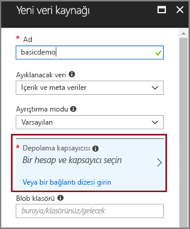
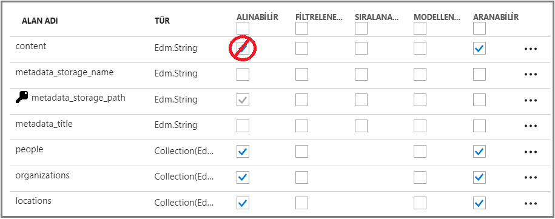
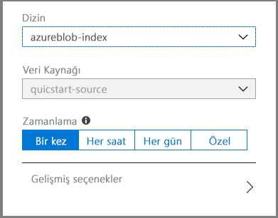
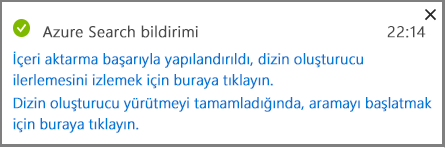
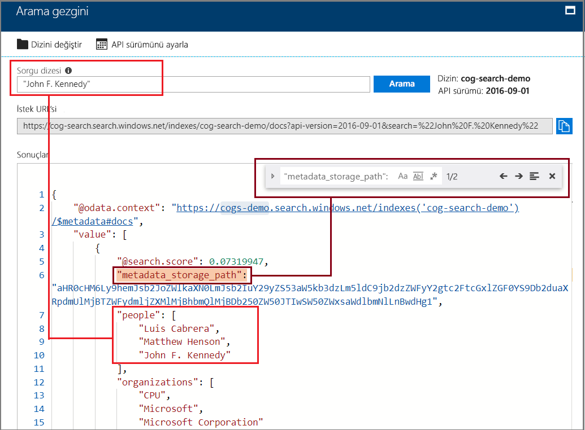

# Hızlı Başlangıç: Bilişsel beceriler ve örnek verileri kullanarak bir yapay ZEKA dizinleme işlem hattı oluşturma

Azure arama ile tümleştirilir [Bilişsel Hizmetler](https://azure.microsoft.com/services/cognitive-services/)unsearchable veya yapılandırılmamış içerik yapmanın, bir Azure Search dizini oluşturma ardışık düzeni içerik ayıklama, doğal dil işlemeyi (NLP) ve görüntü işleme yetenekleri ekleme aranabilir. 

Birçok Bilişsel hizmetler kaynakları - gibi [OCR](cognitive-search-skill-ocr.md), [dil algılama](cognitive-search-skill-language-detection.md), [varlık tanıma](cognitive-search-skill-entity-recognition.md) - dizileri dizin bir işleme iliştirilebilir. Bilişsel hizmetler, yapay ZEKA algoritması, temel Azure Search'te tam metin araması çözümlerinde, yapılar ve kullanılabilir metinsel içeriği döndüren kaynak verilerdeki desenleri, özellikleri ve özelliklerini bulmak için kullanılır.

Bu hızlı başlangıçta, ilk zenginleştirme hattınızı oluşturma [Azure portalında](https://portal.azure.com) tek satırlık bir kod yazmadan önce:

> [!div class="checklist"]
> * Azure Blob depolamada örnek verileri kullanmaya başlama
> * Yapılandırma [ **verileri içeri aktarma** ](search-import-data-portal.md) bilişsel dizin oluşturma ve zenginleştirme Sihirbazı 
> * Sihirbazı çalıştırma (bir varlık becerisi, kişileri, konumu ve kuruluşları algılar)
> * Kullanım [ **arama Gezgini** ](search-explorer.md) zenginleştirilmiş verileri sorgulamak için

Bu hızlı başlangıçta ücretsiz hizmet üzerinde çalışır, ancak ücretsiz işlem sayısı günde 20 belgeleri sınırlıdır. Bu hızlı başlangıçta, aynı gün içinde birden çok kez çalıştırmak istiyorsanız, daha fazla çalıştırma sığacak şekilde ayarlamak daha küçük bir dosya kullanın.

> [!NOTE]
> İşlem, daha fazla belgelerin eklenmesi veya daha fazla yapay ZEKA algoritmalarının ekleme sıklığı artırarak kapsamı genişletin gibi Faturalanabilir bir Bilişsel hizmetler kaynağı eklemek gerekir. API'leri, Bilişsel hizmetler ve Azure Search'te belge çözme aşamasının bir parçası olarak görüntü ayıklama çağırırken ücretler tahakkuk. Metin ayıklama belgelerden için ücretlendirme yoktur.
>
> Yerleşik yetenek yürütülmesi sırasında mevcut ücretlendirilir [Bilişsel hizmetler ödeme-olarak-, Git fiyat](https://azure.microsoft.com/pricing/details/cognitive-services/) . Görüntü ayıklama fiyatlandırma üzerinden ücretlendirilir Önizleme fiyatlandırması üzerinde açıklandığı [Azure fiyatlandırma sayfasını arama](https://go.microsoft.com/fwlink/?linkid=2042400). [Daha fazla bilgi](cognitive-search-attach-cognitive-services.md) edinin.

Azure aboneliğiniz yoksa başlamadan önce [ücretsiz bir hesap](https://azure.microsoft.com/free/?WT.mc_id=A261C142F) oluşturun.

## Önkoşullar

[Azure Search hizmeti oluşturma](search-create-service-portal.md) veya [mevcut bir hizmet bulma](https://ms.portal.azure.com/#blade/HubsExtension/BrowseResourceBlade/resourceType/Microsoft.Search%2FsearchServices) geçerli aboneliğinizdeki. Bu Hızlı Başlangıç için ücretsiz bir hizmet kullanabilirsiniz.

[Bilişsel Hizmetler](https://azure.microsoft.com/services/cognitive-services/) yapay ZEKA sağlar. Bu hızlı başlangıçta, bu kaynakları satır içi, işlem hattı belirtirken ekleme adımlarını içerir. Hesaplarını önceden ayarlamak gerekli değildir.

Azure Hizmetleri dizinleme işlem hattına yönelik girişleri sağlamanız gerekir. Tarafından desteklenen herhangi bir veri kaynağını kullanabilen [Azure Search dizin oluşturucularında](search-indexer-overview.md) dışında Azure tablo depolama, desteklenmeyen AI dizinleme. Bu hızlı başlangıçta kullanılmaktadır [Azure Blob Depolama](https://azure.microsoft.com/services/storage/blobs/) kaynak veri dosyaları için kapsayıcı olarak. 

### Azure Blob hizmetini ayarlama ve örnek veriler yükleme

1. Farklı türlerden oluşan küçük bir dosya kümesini içeren [örnek verileri indirin](https://1drv.ms/f/s!As7Oy81M_gVPa-LCb5lC_3hbS-4). 

1. [Azure Blob Depolama için kaydolun](https://docs.microsoft.com/azure/storage/common/storage-quickstart-create-account?tabs=azure-portal), depolama hesabı oluşturma, Blob Hizmetleri sayfalarını açın ve bir kapsayıcı oluşturun.  Azure Search ile aynı bölgede depolama hesabı oluşturun.

1. Oluşturduğunuz kapsayıcıya tıklayın **karşıya** önceki bir adımda indirdiğiniz örnek dosyalarını karşıya yüklemek için.

   

## Zenginleştirme işlem hattı oluşturma

Azure Search Hizmeti Pano sayfasına dönün ve **verileri içeri aktarma** dört adımda bilişsel zenginleştirme ayarlamak için komut çubuğunda.

  

### 1. Adım: Veri kaynağı oluşturma

İçinde **verilerinize bağlanın**, seçin **Azure Blob Depolama**, kapsayıcı oluşturduğunuz ve hesabı seçin. Veri kaynağına bir ad verin ve geri kalanı için varsayılan değerleri kullanın. 

  

Bir sonraki sayfasına devam edin.

  

### 2. Adım: Bilişsel yetenekler Ekle

Daha sonra dizin oluşturma işlem hattına zenginleştirme adımları ekleyin. Bilişsel hizmetler kaynağı yoksa 20 işlem günlük sağlayan ücretsiz bir sürümü için kaydolabilirsiniz. Bu sihirbazı çalıştırdıktan sonra günlük ayrılan çoğunlukla kullanılacak böylece örnek verileri 14 dosyasından oluşur.

1. Genişletin **ekleme Bilişsel Hizmetler** kaynaklama Bilişsel hizmetler API'leri için seçenekleri görmek için. Bu öğreticinin amaçları doğrultusunda, kullandığınız **ücretsiz** kaynak.

   

2. Genişletin **ekleme Zenginleştirmelerinin** ve doğal dil işleme gerçekleştirme yetenekleri seçin. Bu hızlı başlangıç için, kişiler, kuruluşlar ve konumlar için varlık tanımayı seçin.

   

   Portal, OCR işleme ve metin analizi için yerleşik yetenekler sunar. Portalda beceri kümesi, tek bir kaynak alanının üzerinde çalışır. Bu küçük bir hedef gibi görünebilir, ancak Azure blobları için `content` alanı, blob belgesinin çoğunu içerir (örneğin, Word belgesi veya PowerPoint destesi). Aynı şekilde bir blobun tüm içeriği de bu alanda bulunduğundan bu alan ideal bir giriştir.

3. Bir sonraki sayfasına devam edin.

   

> [!NOTE]
> Doğal dil işleme becerileri, örnek veri kümesindeki metin içeriği üzerinde çalışır. Biz OCR seçeneğini seçmediyseniz olduğundan, bu hızlı başlangıçta örnek veri kümesinde bulunan JPEG ve PNG dosyaları işlenmez. 

### 3. Adım: Dizini yapılandırma

Sihirbaz, genellikle varsayılan bir dizin çıkarabilir. Bu adımda oluşturulan dizin şemasını görüntülemek ve potansiyel olarak tüm ayarları gözden geçirin. Aşağıda varsayılan dizini için tanıtım Blob veri kümesi oluşturulur.

Bu hızlı başlangıç, makul varsayılanlar ayarlanması konusunda iyi bir iş çıkarır: 

+ Varsayılan ad *azureblob dizin* veri kaynağı türüne göre. 

+ Varsayılan alanlar, özgün kaynak veri alanına dayalı (`content`), çıktı alanlarını artı (`people`, `organizations`, ve `locations`) tarafından bilişsel işlem hattı oluşturdunuz. Varsayılan veri türleri, meta verileri ve veri örnekleme algılanır.

+ Varsayılan anahtar *metadata_storage_path* (Bu alan, benzersiz değerler içeren).

+ Varsayılan öznitelikler **alınabilir** ve **aranabilir** bu alanlar için. **Aranabilir** bir alan aranabilir gösterir. **Alınabilir** bunu döndürülmesi sonuçlarında anlamına gelir. Sihirbaz, bunun nedeni, bir beceri kümesi oluşturulan alınabilir ve aranabilir olması için bu alanları istediğinizi varsayar.

  

Soru işareti ve üst çizgi olduğuna dikkat **alınabilir** tarafından özniteliği `content` alan. Metin ağırlıklı blob belgeler için `content` alan dosyasının potansiyel olarak binlerce satır çalışan toplu içerir. Dosya içeriği için istemci kodu geçirilecek gerekiyorsa emin **alınabilir** seçili kalır. Aksi takdirde, bu öznitelik üzerinde temizlemeniz `content` , ayıklanan öğelerini (`people`, `organizations`, ve `locations`) amacınız için yeterlidir.

Bir alan olarak işaretleme **alınabilir** alan gelmez *gerekir* arama sonuçlarında mevcut olması. Kullanarak arama sonuçlarını bileşim tam olarak denetleyebilirsiniz **$select** sorgu parametresi için hangi alanların dahil edileceğini belirtin. Metin ağırlıklı alanları için `content`, **$select** parametresi, çözümünüz için yönetilebilir arama sonuçları, istemci kodu sağlarken, uygulamanızın İnsan kullanıcılara sağlayan tüm bilgilere erişim için gerekli aracılığıyla **alınabilir** özniteliği.
  
Bir sonraki sayfasına devam edin.

  

### 4. Adım: Dizin oluşturucuyu yapılandırma

Dizin oluşturucu, dizin oluşturma işlemini destekleyen, yüksek düzeyli bir kaynaktır. Bu veri kaynağı adı, hedef dizin ve yürütme sıklığı belirtir. **Verileri içeri aktar** sihirbazının nihai sonucunda her zaman art arda çalıştırabileceğiniz bir dizin oluşturucu elde edilir.

İçinde **dizin oluşturucu** sayfasında, varsayılan adı kabul edin ve kullanın **bir kez çalıştır** zamanlama hemen çalıştırmak için seçenek. 

  

Tıklayın **Gönder** oluşturmak ve aynı anda dizin oluşturucuyu çalıştırmak için.

## Dizin oluşturma İzleyicisi

Zenginleştirme adımları metin tabanlı tipik dizin daha tamamlanması daha uzun sürer. İlerleme durumunu izleyebilmeniz için sihirbazın genel bakış sayfasında dizin oluşturucu listesini açın. Kendi kendine gezintiye genel bakış sayfasında ve tıklayın Git **dizin oluşturucular**.

Uyarı JPG ve PNG dosyaları görüntü dosyaları ve biz bu işlem hattından OCR beceri atlanmış oluşur. Kesme bildirimleri da bulabilirsiniz. Azure arama, ücretsiz katmanda 32.000 karakter ayıklama sınırlar.

  

Dizin oluşturma ve zenginleştirme zaman alabilir; ilk keşif için daha küçük veri kümelerinin önerilmesinin nedeni budur. 

## Arama gezgininde sorgulama

Bir dizin oluşturulduktan sonra, dizinden belgeleri döndürmek için sorgular gönderebilirsiniz. Portalda **Arama gezgini**’ni kullanarak sorgular çalıştırın ve sonuçları görüntüleyin. 

1. Arama hizmeti panosu sayfasında, komut çubuğunda **Arama gezgini**’ne tıklayın.

1. Oluşturduğunuz dizini seçmek için üst kısımdaki **Dizini değiştir**'e tıklayın.

1. Gibi dizini sorgulamak için bir arama dizesi girin `search=Microsoft&searchFields=organizations`.

Sonuçlar JSON olarak döndürülür, bu nedenle özellikle de Azure bloblardan gelen büyük belgelerde ayrıntılı ve okuması zor olabilir. Sonuçları kolayca tarayamazsanız, belgeler içinde arama yapmak için CTRL-F tuşlarını kullanın. Bu sorgu için özel terimleri JSON içinde arama yapabilirsiniz. 

CTRL-F tuş birleşimi, belirli bir sonuç kümesinde kaç tane belgenin bulunduğunu belirlemenize de yardımcı olabilir. Her değer belge için benzersiz olduğundan Azure blobları için portal, anahtar olarak "metadata_storage_path" öğesini seçer. CTRL-F kullanarak, "metadata_storage_path" araması yapıp belgelerin sayısını alın. 

  

## Paketler

Artık, ilk bilişsel zenginleştirilmiş dizinleme alıştırma tamamladınız. Bu hızlı başlangıcın amacı, kendi verilerinizi kullanarak hızlı şekilde bir bilişsel arama çözümünün prototipini oluşturabilmeniz için sihirbazda size yol göstermek ve önemli kavramları tanıtmaktır.

Topladığınız bazı temel kavramlar, Azure veri kaynaklarına bağımlılık içerir. Bilişsel arama zenginleştirmesi, dizin oluşturuculara bağlıdır ve dizin oluşturucular, Azure’a ve kaynağa özgüdür. Bu hızlı başlangıçta Azure Blob depolama kullanılsa da, başka Azure veri kaynakları da mümkündür. Daha fazla bilgi için bkz. [Azure Search’te dizin oluşturucular](search-indexer-overview.md).

Başka bir önemli kavram da, becerilerin giriş alanları üzerinde çalışmasıdır. Portalda, tüm yetenekler için tek kaynak alan seçmeniz gerekir. Kodda girişler, başka alanlar olabilir veya bir yukarı akış becerisinin çıktısı olabilir.

 Bir beceriye yönelik girişler, bir dizindeki çıktı alanına eşlenir. Dahili olarak portal, [ek açıklamalar](cognitive-search-concept-annotations-syntax.md) ayarlar ve işlemlerin sırasını ve genel akışı oluşturan bir [beceri kümesini](cognitive-search-defining-skillset.md) tanımlar. Bu adımlar portalda gizlenir, ancak kod yazmaya başladığınızda bu kavramlar önemli hale gelir.

Son olarak, görüntüleme sonuçlarının dizinin sorgulanmasıyla elde edildiğini öğrendiniz. Sonunda Azure Search, [basit](https://docs.microsoft.com/rest/api/searchservice/simple-query-syntax-in-azure-search) veya [tamamen genişletilmiş sorgu sözdizimi](https://docs.microsoft.com/rest/api/searchservice/lucene-query-syntax-in-azure-search) kullanarak sorgulayabileceğiniz, aranabilir bir dizin sağlar. Zenginleştirilmiş alanlar içeren bir dizin de diğerlerine benzer. Standart veya [özel çözümleyiciler](search-analyzers.md), [puanlama profilleri](https://docs.microsoft.com/rest/api/searchservice/add-scoring-profiles-to-a-search-index), [eş anlamlılar](search-synonyms.md), [ayrıntılı filtreler](search-filters-facets.md), coğrafi arama veya başka bir Azure Search özelliğine yer vermek istiyorsanız bunu yapabilirsiniz.

## Kaynakları temizleme

Keşfiniz sonlandığında temizlemenin en hızlı yolu, Azure Search hizmetini ve Azure Blob hizmetini içeren kaynak grubunu silmektir.  

Her iki hizmeti de aynı gruba koyduğunuz varsayılarak, şimdi bu çalışmada oluşturduğunuz depolanan içerikler ve hizmetler de dahil olmak üzere, kaynak grubunun içindeki her şeyi silmek için kaynak grubunu silin. Portalda kaynak grubu adı, her bir hizmetin Genel Bakış sayfasındadır.

## Sonraki adımlar

Bilişsel hizmetler kaynağı nasıl sağladığınız bağlı olarak, dizin oluşturma ve zenginleştirme ile farklı becerileri ve kaynak veri alanları ile sihirbazını yeniden çalıştırarak denemeler yapabilirsiniz. Adımları yinelemek için, dizini ve dizin oluşturucuyu silin, ardından dizin oluşturucuyu yeni seçimlerle yeniden oluşturun.

+ **Genel Bakış** > **Dizinler** bölümünde, oluşturduğunuz dizini seçin ve sonra **Sil**’e tıklayın.

+ **Genel Bakış**’ta **Dizin Oluşturucular** kutucuğuna çift tıklayın. Oluşturduğunuz dizin oluşturucuyu bulup silin.

Alternatif olarak, oluşturduğunuz örnek veri ve hizmetleri yeniden kullanın ve sonraki öğreticide aynı görevleri programlama yoluyla nasıl gerçekleştireceğinizi öğrenin. 

> [!div class="nextstepaction"]
> [Öğretici: Bilişsel arama REST API'leri öğrenin](cognitive-search-tutorial-blob.md)
