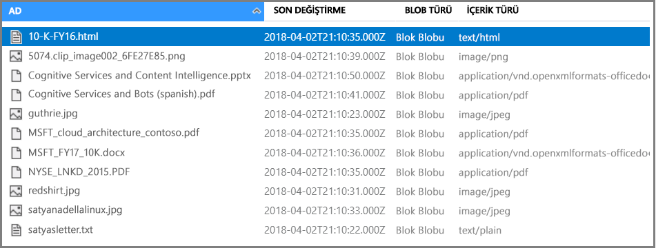

# <a name="c-tutorial-call-cognitive-services-apis-in-an-azure-search-indexing-pipeline"></a>C#Öğretici: Bir Azure Search dizini oluşturma ardışık düzen Bilişsel hizmetler API'lerini çağırma

Bu öğreticide, *bilişsel becerileri* kullanarak Azure Search’te programlama veri zenginleştirmesi mekanizmasını öğrenirsiniz. Beceriler, doğal dil işlemeyi (NLP) ve Bilişsel hizmetler görüntü analizi özelliklerini tarafından desteklenir. Beceri kümesi oluşturma ve yapılandırma yoluyla, metin ve resim veya taranan dosyanın metin temsilleridir ayıklayabilirsiniz. Ayrıca, dil, varlıklar, anahtar ifadeleri ve daha da algılayabilir. Son ek zengin bir yapay ZEKA destekli dizini oluşturma ardışık düzeni tarafından oluşturulan bir Azure Search dizini içeriğinde sonucudur.

Bu öğreticide, aşağıdaki görevleri gerçekleştirmek için .NET SDK'yı kullanın:

> [!div class="checklist"]
> * Bir dizine giden yolda örnek verileri zenginleştiren dizin oluşturma işlem hattı oluşturma
> * Yerleşik yetenek Uygula: optik karakter tanıma, metin birleştirme, dil algılama, metin bölme, varlık tanıma, anahtar ifade ayıklama
> * Bir beceri kümesindeki çıktılara girişleri eşleyerek becerilerin nasıl birbirine zincirleneceğini öğrenme
> * İstekleri yürütme ve sonuçları gözden geçirme
> * Daha fazla geliştirme için dizini ve dizin oluşturucuları sıfırlama

Çıktı, Azure Search üzerinde tam metin araması yapılabilir bir dizindir. [Eş anlamlılar](search-synonyms.md), [puanlama profilleri](https://docs.microsoft.com/rest/api/searchservice/add-scoring-profiles-to-a-search-index), [çözümleyiciler](search-analyzers.md) ve [filtreler](search-filters.md) gibi diğer standart özelliklerle dizini geliştirebilirsiniz.

Bu öğreticide ücretsiz hizmet üzerinde çalışır, ancak ücretsiz işlem sayısı günde 20 belgeleri sınırlıdır. Bu öğreticide, aynı gün içinde birden çok kez çalıştırmak istiyorsanız, daha fazla çalıştırma sığacak şekilde ayarlamak daha küçük bir dosya kullanın.

> [!NOTE]
> İşlem, daha fazla belgelerin eklenmesi veya daha fazla yapay ZEKA algoritmalarının ekleme sıklığı artırarak kapsamı genişletin gibi Faturalanabilir bir Bilişsel hizmetler kaynağı eklemek gerekir. API'leri, Bilişsel hizmetler ve Azure Search'te belge çözme aşamasının bir parçası olarak görüntü ayıklama çağırırken ücretler tahakkuk. Metin ayıklama belgelerden için ücretlendirme yoktur.
>
> Yerleşik yetenek yürütülmesi sırasında mevcut ücretlendirilir [Bilişsel hizmetler ödeme-olarak-, Git fiyat](https://azure.microsoft.com/pricing/details/cognitive-services/) . Görüntü ayıklama fiyatlandırma üzerinde açıklanmıştır [Azure fiyatlandırma sayfasını arama](https://go.microsoft.com/fwlink/?linkid=2042400).

Azure aboneliğiniz yoksa başlamadan önce [ücretsiz bir hesap](https://azure.microsoft.com/free/?WT.mc_id=A261C142F) oluşturun.

## <a name="prerequisites"></a>Önkoşullar

Bu öğreticide, aşağıdaki hizmetleri, araçları ve verileri kullanılır. 

+ [Bir Azure depolama hesabı oluşturma](https://docs.microsoft.com/azure/storage/common/storage-quickstart-create-account) örnek verileri depolamak için. Azure Search ile aynı bölgede depolama hesabı olduğundan emin olun.

+ [Örnek verileri](https://1drv.ms/f/s!As7Oy81M_gVPa-LCb5lC_3hbS-4) farklı türlerde küçük bir dosya kümesinden oluşur. 

+ [Visual Studio yükleme](https://visualstudio.microsoft.com/) IDE kullanılacak.

+ [Azure Search hizmeti oluşturma](search-create-service-portal.md) veya [mevcut bir hizmet bulma](https://ms.portal.azure.com/#blade/HubsExtension/BrowseResourceBlade/resourceType/Microsoft.Search%2FsearchServices) geçerli aboneliğinizdeki. Bu öğretici için ücretsiz bir hizmet kullanabilirsiniz.

## <a name="get-a-key-and-url"></a>Bir anahtarı ve URL alma

Azure Search hizmetiniz ile etkileşim kurmak için hizmet URL'si ve erişim anahtarı gerekir. İkisini de içeren bir arama hizmeti oluşturulur. Bu nedenle aboneliğinize Azure Search hizmetini eklediyseniz gerekli bilgileri almak için aşağıdaki adımları izleyin:

1. [Azure portalında oturum açın](https://portal.azure.com/)ve arama hizmetinizdeki **genel bakış** sayfa olduğunda URL'yi alın. Örnek uç nokta `https://mydemo.search.windows.net` şeklinde görünebilir.

1. İçinde **ayarları** > **anahtarları**, hizmette tam haklarına yönelik bir yönetici anahtarını alın. Bir gece yarısında gerektiği durumlarda iş sürekliliği için sağlanan iki birbirinin yerine yönetici anahtarı mevcuttur. Ekleme, değiştirme ve silme nesneler için istekleri birincil veya ikincil anahtar kullanabilirsiniz.

   

İstek başına geçerli bir anahtara sahip olmak, isteği gönderen uygulama ve bunu işleyen hizmet arasında güven oluşturur.

## <a name="prepare-sample-data"></a>Örnek verileri hazırlama

Zenginleştirme işlem hattı, Azure veri kaynaklarından çekme işlemi yapar. Kaynak veriler, [Azure Search dizin oluşturucunun](search-indexer-overview.md) desteklenen bir veri kaynağı türünden gelmelidir. Azure tablo depolama için bilişsel arama desteklenmiyor. Bu alıştırmada, birden çok içerik türünü göstermek için blob depolama kullanırız.

1. [Azure portalında oturum açın](https://portal.azure.com), Azure depolama hesabınıza gidin, tıklayın **Blobları**ve ardından **+ kapsayıcı**.

1. [Bir Blob kapsayıcısı oluşturursunuz](https://docs.microsoft.com/azure/storage/blobs/storage-quickstart-blobs-portal) örnek verileri içerecek şekilde. Genel erişim düzeyi geçerli değerleri birini ayarlayabilirsiniz. Bu öğreticide, kapsayıcı adı "temel-demo-data-pr" olduğunu varsayar.

1. Kapsayıcıyı oluşturduktan sonra dosyayı açın ve seçin **karşıya** karşıya yüklemek için komut çubuğunda [örnek verileri](https://1drv.ms/f/s!As7Oy81M_gVPa-LCb5lC_3hbS-4).

   

1. Örnek dosyalar yüklendikten sonra Blob depolamanız için bir bağlantı dizesi ve kapsayıcı adını alın. Bunu yapabilirsiniz Azure portalında depolama hesabınıza gidin, seçme **erişim anahtarları**ve ardından kopyalama **bağlantı dizesi** alan.

   Bağlantı dizesi, aşağıdaki örneğe benzer bir URL olmalıdır:

      ```http
      DefaultEndpointsProtocol=https;AccountName=cogsrchdemostorage;AccountKey=<your account key>;EndpointSuffix=core.windows.net
      ```

Paylaşılan erişim imzası sağlama gibi, bağlantı dizesini belirtmenin başka birçok yolu vardır. Veri kaynağı kimlik bilgileri hakkında daha fazla bilgi edinmek için bkz. [Azure Blob Depolama Alanı dizinini oluşturma](search-howto-indexing-azure-blob-storage.md#Credentials).

## <a name="set-up-your-environment"></a>Ortamınızı ayarlama

Visual Studio açılırken ve .NET Core üzerinde çalışabilen yeni bir konsol uygulaması projesi oluşturarak başlayın.

### <a name="install-nuget-packages"></a>NuGet paketlerini yükleme

[Azure Search .NET SDK'sı](https://aka.ms/search-sdk) dizinleri, veri kaynakları, dizin oluşturucular ve olanakları, karşıya yükleme ve belgeleri yönetmek ve tüm ile uğraşmak zorunda kalmadan sorgular yürütün yönetmelerine olanak sağlayan birkaç istemci kitaplıklarını içerir HTTP ve JSON ayrıntıları. Bu istemci kitaplıklarının tümü NuGet paketleri olarak dağıtılır.

Bu proje için 9 sürümünü yüklemeniz gerekir `Microsoft.Azure.Search` NuGet paketi ve en son `Microsoft.Extensions.Configuration.Json` NuGet paketi.

Yükleme `Microsoft.Azure.Search` NuGet paketini Visual Studio'da Paket Yöneticisi konsolu kullanarak. Paket Yöneticisi Konsolu'nu seçin açmak için **Araçları** > **NuGet Paket Yöneticisi** > **Paket Yöneticisi Konsolu**. Çalıştırılacak komut almak için gidin [Microsoft.Azure.Search NuGet paketi sayfası](https://www.nuget.org/packages/Microsoft.Azure.Search), sürüm 9'i seçin ve Kopyala Paket Yöneticisi komutu. Paket Yöneticisi konsolunda şu komutu çalıştırın.

Yüklenecek `Microsoft.Extensions.Configuration.Json` NuGet paketini Visual Studio'da seçim **Araçları** > **NuGet Paket Yöneticisi** > **çözüm için NuGet paketlerini Yönet...** . Gözat'ı seçin ve arama `Microsoft.Extensions.Configuration.Json` NuGet paketi. Bunu bulduktan sonra paketi seçin, projenizi seçin, sürüm en son kararlı bir sürüm olduğunu doğrulayın ve ardından Yükle'yi seçebilirsiniz.

## <a name="add-azure-search-service-information"></a>Azure arama hizmeti bilgilerini ekleme

Azure Search hizmetinize bağlanmak için arama hizmeti bilgilerini projenize eklemeniz gerekir. Çözüm Gezgini'nde projenize sağ tıklayın ve seçin **Ekle** > **yeni öğe...**  . Dosya adı `appsettings.json` seçip **Ekle**. 

Bu dosya, çıktı dizininde eklenmesi gerekir. Bunu yapmak için sağ tıklayın `appsettings.json` seçip **özellikleri**. Değiştirin **çıkış dizinine Kopyala** için **yeni kopyasını**.

Kopyalama JSON yeni JSON dosyanızda aşağıdaki.

```json
{
  "SearchServiceName": "Put your search service name here",
  "SearchServiceAdminApiKey": "Put your primary or secondary API key here",
  "SearchServiceQueryApiKey": "Put your query API key here",
  "AzureBlobConnectionString": "Put your Azure Blob connection string here",
}
```

Arama hizmeti ve blob depolama hesap bilgilerini ekleyin.

Azure portalında arama hesap sayfanızdan, arama hizmeti bilgilerini alabilirsiniz. Hesap adı, ana sayfasında göze olacaktır ve tuşlarını seçerek bulunabilir **anahtarları**.

Blob bağlantı dizesini Azure portalında depolama hesabınıza giderek alabilirsiniz seçerek **erişim anahtarları**ve ardından kopyalama **bağlantı dizesi** alan.

## <a name="add-namespaces"></a>Ad alanları Ekle

Bu öğretici, birçok farklı türlerden çeşitli ad alanları kullanır. Bu türler kullanmak için aşağıdaki ekleyin `Program.cs`.

```csharp
using System;
using System.Collections.Generic;
using Microsoft.Azure.Search;
using Microsoft.Azure.Search.Models;
using Microsoft.Extensions.Configuration;
```

## <a name="create-a-client"></a>Bir istemci oluşturma

Bir örneğini oluşturmak `SearchServiceClient` sınıfı.

```csharp
IConfigurationBuilder builder = new ConfigurationBuilder().AddJsonFile("appsettings.json");
IConfigurationRoot configuration = builder.Build();
SearchServiceClient serviceClient = CreateSearchServiceClient(configuration);
```

`CreateSearchServiceClient` Yeni bir oluşturur `SearchServiceClient` (appsettings.json) uygulamanın yapılandırma dosyasında depolanan değerleri kullanarak.

```csharp
private static SearchServiceClient CreateSearchServiceClient(IConfigurationRoot configuration)
{
   string searchServiceName = configuration["SearchServiceName"];
   string adminApiKey = configuration["SearchServiceAdminApiKey"];

   SearchServiceClient serviceClient = new SearchServiceClient(searchServiceName, new SearchCredentials(adminApiKey));
   return serviceClient;
}
```

> [!NOTE]
> `SearchServiceClient` sınıfı, arama hizmetinize yönelik bağlantıları yönetir. Çok fazla bağlantı açmayı önlemek için, mümkünse uygulamanızda tek bir `SearchServiceClient` örneği paylaşmaya çalışmanız gerekir. Yöntemlerinin iş parçacığı bu tür paylaşımları etkinleştirmek için güvenlidir.
> 
> 

## <a name="create-a-data-source"></a>Bir veri kaynağı oluşturun

Yeni bir `DataSource` çağırarak örneği `DataSource.AzureBlobStorage`. `DataSource.AzureBlobStorage` veri kaynağı adı, bağlantı dizesi ve blob kapsayıcısı adı belirtmeniz gerekir.

Bu öğreticide kullanılmıyor olsa da bir geçici silme sütunu değerine göre silinen blobları tanımlamak için kullanılan geçici silme ilkesi de tanımlanır. Bir blobu bir metadata özelliğine sahip silinmesi şu ilkeyi değerlendirir `IsDeleted` değerle `true`.

```csharp
DataSource dataSource = DataSource.AzureBlobStorage(
    name: "demodata",
    storageConnectionString: configuration["AzureBlobConnectionString"],
    containerName: "basic-demo-data-pr",
    deletionDetectionPolicy: new SoftDeleteColumnDeletionDetectionPolicy(
        softDeleteColumnName: "IsDeleted",
        softDeleteMarkerValue: "true"),
    description: "Demo files to demonstrate cognitive search capabilities.");
```

Başlatılan olduğunuza göre `DataSource` nesne, veri kaynağı oluşturun. `SearchServiceClient`, `DataSources` özelliğine sahiptir. Bu özellik, listesi oluşturmak için gereken tüm yöntemleri güncelleştirmek veya Azure Search veri kaynaklarını silmek sağlar.

Başarılı bir istek için yöntem oluşturulduğu veri kaynağı döndürür. Yöntemi, geçersiz bir parametre gibi isteği ile ilgili bir sorun ise bir özel durum oluşturur.

```csharp
try
{
    serviceClient.DataSources.CreateOrUpdate(dataSource);
}
catch (Exception e)
{
    // Handle the exception
}
```

Bu ilk isteğiniz olduğundan, veri kaynağının Azure Search’te oluşturulduğunu onaylamak için Azure portalını denetleyin. Arama hizmeti panosu sayfasında, Veri Kaynakları kutucuğunun yeni bir öğe içerdiğini doğrulayın. Portal sayfasının yenilenmesi için birkaç dakika beklemeniz gerekebilir.

  

## <a name="create-a-skillset"></a>Beceri kümesi oluşturma

Bu bölümde, verileriniz için uygulamak istediğiniz zenginleştirme adımları tanımlayın. Her zenginleştirme adım çağrılan bir *beceri* ve zenginleştirme adımları kümesini bir *beceri kümesi*. Bu öğreticide, beceri kümesi için [önceden tanımlanmış bilişsel beceriler](cognitive-search-predefined-skills.md) kullanılmaktadır:

+ [Optik karakter tanıma](cognitive-search-skill-ocr.md) görüntü dosyaları metni yazdırılan ve el yazısı tanıma için.

+ [Metin birleştirme](cognitive-search-skill-textmerger.md) alanlar koleksiyonu tek bir alana metinden birleştirilecek.

+ İçeriğin dilini tanımlamak için [Dil Algılama](cognitive-search-skill-language-detection.md).

+ [Metin bölme](cognitive-search-skill-textsplit.md) büyük içeriği, anahtar ifade ayıklama beceri ve varlık tanıma beceri çağırmadan önce daha küçük öbeklere ayırmak için. Anahtar ifade ayıklama ve varlık tanıma 50.000 karakter veya daha az girişleri kabul eder. Bu sınıra uymak için örnek dosyaların birkaç tanesinin bölünmesi gerekir.

+ [Varlık tanıma](cognitive-search-skill-entity-recognition.md) blob kapsayıcısındaki içeriğinden kuruluşların adlarını ayıklanacağı.

+ Üst anahtar tümcecikleri çekmek için [Anahtar İfade Ayıklama](cognitive-search-skill-keyphrases.md).

İlk işleme sırasında Azure Search içerik farklı dosya biçimlerinde okumak için her bir belgeyi cracks. Kaynak dosyadan gelen, bulunan metin, oluşturulan ```content``` alanına her belge için birer birer yerleştirilir. Bu nedenle, için giriş olarak ayarlamak ```"/document/content"``` bu metin kullanmak için. 

Çıktılar bir dizine eşlenebilir, aşağı akış becerisine yönelik giriş olarak kullanılır veya dil kodunda olduğu gibi her iki şekilde de kullanılabilir. Dizinde bir dil kodu, filtreleme için yararlıdır. Giriş olarak dil kodu, sözcük bölünmesiyle ilgili dilbilgisi kurallarını bildirmek için metin analizi becerileri tarafından kullanılır.

Beceri kümesi temelleri hakkında daha fazla bilgi için bkz. [Beceri kümesini tanımlama](cognitive-search-defining-skillset.md).

### <a name="ocr-skill"></a>OCR beceri

**OCR** beceri resimlerden metin ayıklar. Bu yetenek, normalized_images alan var olduğunu varsayar. Ayarladık öğreticinin sonraki bölümlerinde Bu alan oluşturmak için ```"imageAction"``` için dizin oluşturucu tanımı yapılandırmasında ```"generateNormalizedImages"```.

```csharp
List<InputFieldMappingEntry> inputMappings = new List<InputFieldMappingEntry>();
inputMappings.Add(new InputFieldMappingEntry(
    name: "image",
    source: "/document/normalized_images/*"));

List<OutputFieldMappingEntry> outputMappings = new List<OutputFieldMappingEntry>();
outputMappings.Add(new OutputFieldMappingEntry(
    name: "text",
    targetName: "text"));

OcrSkill ocrSkill = new OcrSkill(
    description: "Extract text (plain and structured) from image",
    context: "/document/normalized_images/*",
    inputs: inputMappings,
    outputs: outputMappings,
    defaultLanguageCode: OcrSkillLanguage.En,
    shouldDetectOrientation: true);
```

### <a name="merge-skill"></a>Beceri Birleştir

Bu bölümde oluşturacağınız bir **birleştirme** OCR yetenek tarafından üretilen metin belge içerik alanı birleştirir yeteneği.

```csharp
List<InputFieldMappingEntry> inputMappings = new List<InputFieldMappingEntry>();
inputMappings.Add(new InputFieldMappingEntry(
    name: "text",
    source: "/document/content"));
inputMappings.Add(new InputFieldMappingEntry(
    name: "itemsToInsert",
    source: "/document/normalized_images/*/text"));
inputMappings.Add(new InputFieldMappingEntry(
    name: "offsets",
    source: "/document/normalized_images/*/contentOffset"));

List<OutputFieldMappingEntry> outputMappings = new List<OutputFieldMappingEntry>();
outputMappings.Add(new OutputFieldMappingEntry(
    name: "mergedText",
    targetName: "merged_text"));

MergeSkill mergeSkill = new MergeSkill(
    description: "Create merged_text which includes all the textual representation of each image inserted at the right location in the content field.",
    context: "/document",
    inputs: inputMappings,
    outputs: outputMappings,
    insertPreTag: " ",
    insertPostTag: " ");
```

### <a name="language-detection-skill"></a>Dil algılama yeteneği

**Dil algılama** beceri giriş metninin dilini algılar ve istekte gönderilen her belge için bir tek dil kodu bildirir. Çıkışı kullanacağız **dil algılama** girişi bir parçası olarak beceri **metin bölme** beceri.

```csharp
List<InputFieldMappingEntry> inputMappings = new List<InputFieldMappingEntry>();
inputMappings.Add(new InputFieldMappingEntry(
    name: "text",
    source: "/document/merged_text"));

List<OutputFieldMappingEntry> outputMappings = new List<OutputFieldMappingEntry>();
outputMappings.Add(new OutputFieldMappingEntry(
    name: "languageCode",
    targetName: "languageCode"));

LanguageDetectionSkill languageDetectionSkill = new LanguageDetectionSkill(
    description: "Detect the language used in the document",
    context: "/document",
    inputs: inputMappings,
    outputs: outputMappings);
```

### <a name="text-split-skill"></a>Beceri metni Böl

Aşağıda **bölünmüş** beceri sayfaları tarafından metin bölme ve sayfa uzunluğu tarafından ölçülen 4.000 karakterle sınırlayın `String.Length`. Metin en fazla olan parçalara bölmek algoritma deneyecek `maximumPageLength` boyutu. Bu durumda, algoritma en iyi şekilde öbek boyutu olabilir bir cümle sınırında cümlenin ayırmak için ne yapacağını biraz daha küçüktür `maximumPageLength`.

```csharp
List<InputFieldMappingEntry> inputMappings = new List<InputFieldMappingEntry>();
inputMappings.Add(new InputFieldMappingEntry(
    name: "text",
    source: "/document/merged_text"));
inputMappings.Add(new InputFieldMappingEntry(
    name: "languageCode",
    source: "/document/languageCode"));

List<OutputFieldMappingEntry> outputMappings = new List<OutputFieldMappingEntry>();
outputMappings.Add(new OutputFieldMappingEntry(
    name: "textItems",
    targetName: "pages"));

SplitSkill splitSkill = new SplitSkill(
    description: "Split content into pages",
    context: "/document",
    inputs: inputMappings,
    outputs: outputMappings,
    textSplitMode: TextSplitMode.Pages,
    maximumPageLength: 4000);
```

### <a name="entity-recognition-skill"></a>Varlık tanıma beceri

Bu `EntityRecognitionSkill` örneği kategori türü tanıması için ayarlanmış `organization`. **Varlık tanıma** nitelik kategorisi türleri de algılayabilir `person` ve `location`.

"Bağlam" alanı bildirimi ```"/document/pages/*"``` yıldız işaretiyle zenginleştirme adım anlamına gelir her sayfanın altında çağrılır ```"/document/pages"```.

```csharp
List<InputFieldMappingEntry> inputMappings = new List<InputFieldMappingEntry>();
inputMappings.Add(new InputFieldMappingEntry(
    name: "text",
    source: "/document/pages/*"));
    
List<OutputFieldMappingEntry> outputMappings = new List<OutputFieldMappingEntry>();
outputMappings.Add(new OutputFieldMappingEntry(
    name: "organizations",
    targetName: "organizations"));

List<EntityCategory> entityCategory = new List<EntityCategory>();
entityCategory.Add(EntityCategory.Organization);
    
EntityRecognitionSkill entityRecognitionSkill = new EntityRecognitionSkill(
    description: "Recognize organizations",
    context: "/document/pages/*",
    inputs: inputMappings,
    outputs: outputMappings,
    categories: entityCategory,
    defaultLanguageCode: EntityRecognitionSkillLanguage.En);
```

### <a name="key-phrase-extraction-skill"></a>Anahtar ifade ayıklama beceri

Gibi `EntityRecognitionSkill` yeni oluşturulan örneği **anahtar ifade ayıklama** yetenek, her bir belgenin sayfa için çağrılır.

```csharp
List<InputFieldMappingEntry> inputMappings = new List<InputFieldMappingEntry>();
inputMappings.Add(new InputFieldMappingEntry(
    name: "text",
    source: "/document/pages/*"));
inputMappings.Add(new InputFieldMappingEntry(
    name: "languageCode",
    source: "/document/languageCode"));

List<OutputFieldMappingEntry> outputMappings = new List<OutputFieldMappingEntry>();
outputMappings.Add(new OutputFieldMappingEntry(
    name: "keyPhrases",
    targetName: "keyPhrases"));

KeyPhraseExtractionSkill keyPhraseExtractionSkill = new KeyPhraseExtractionSkill(
    description: "Extract the key phrases",
    context: "/document/pages/*",
    inputs: inputMappings,
    outputs: outputMappings);
```

### <a name="build-and-create-the-skillset"></a>Derleme ve beceri kümesi oluşturma

Derleme `Skillset` oluşturmuş olduğunuz becerileri kullanarak.

```csharp
List<Skill> skills = new List<Skill>();
skills.Add(ocrSkill);
skills.Add(mergeSkill);
skills.Add(languageDetectionSkill);
skills.Add(splitSkill);
skills.Add(entityRecognitionSkill);
skills.Add(keyPhraseExtractionSkill);

Skillset skillset = new Skillset(
    name: "demoskillset",
    description: "Demo skillset",
    skills: skills);
```

Arama hizmetinizde beceri kümesi oluşturun.

```csharp
try
{
    serviceClient.Skillsets.CreateOrUpdate(skillset);
}
catch (Exception e)
{
    // Handle exception
}
```

## <a name="create-an-index"></a>Dizin oluşturma

Bu bölümde, aranabilir dizine dahil edilecek alanları ve her bir alana ilişkin arama özniteliklerini belirterek dizin şemasını tanımlarsınız. Alanlar bir türe sahiptir ve alanın nasıl kullanıldığını (aranabilir, sıralanabilir vb.) belirleyen öznitelikleri alabilir. Bir dizindeki alan adlarının, kaynaktaki alan adlarıyla tamamen aynı olması gerekmez. Sonraki bir adımda, kaynak-hedef alanlarını bağlamak için dizin oluşturucuda alan eşlemeleri eklersiniz. Bu adım için, arama uygulamanızla ilgili alan adlandırma kurallarını kullanarak dizini tanımlayın.

Bu çalışmada aşağıdaki alanlar ve alan türleri kullanılır:

| alan adları: | `id`       | content   | languageCode | keyPhrases         | organizations     |
|--------------|----------|-------|----------|--------------------|-------------------|
| field-types: | Edm.String|Edm.String| Edm.String| List<Edm.String>  | List<Edm.String>  |


### <a name="create-demoindex-class"></a>DemoIndex sınıfı oluşturma

Bu dizin için alanları, bir model sınıfı kullanarak tanımlanır. Model sınıfının her özelliği karşılık gelen dizin alanının aramayla ilgili davranışlarını belirleyen özniteliklere sahiptir. 

Model sınıfının yeni bir ekleyeceğiz C# dosya. Sağ tıklayın, proje ve select **Ekle** > **yeni öğe...** , "Class" seçin ve dosyayı adlandırın `DemoIndex.cs`, ardından **Ekle**.

Türlerinden kullanmak istediğinizi belirtmek emin `Microsoft.Azure.Search` ve `Microsoft.Azure.Search.Models` ad alanları.

```csharp
using Microsoft.Azure.Search;
using Microsoft.Azure.Search.Models;
```

Ekleme modeli sınıf tanımına aşağıdaki `DemoIndex.cs` ve burada oluşturacaksınız dizini aynı ad alanında içerir.

```csharp
// The SerializePropertyNamesAsCamelCase attribute is defined in the Azure Search .NET SDK.
// It ensures that Pascal-case property names in the model class are mapped to camel-case
// field names in the index.
[SerializePropertyNamesAsCamelCase]
public class DemoIndex
{
    [System.ComponentModel.DataAnnotations.Key]
    [IsSearchable, IsSortable]
    public string Id { get; set; }

    [IsSearchable]
    public string Content { get; set; }

    [IsSearchable]
    public string LanguageCode { get; set; }

    [IsSearchable]
    public string[] KeyPhrases { get; set; }

    [IsSearchable]
    public string[] Organizations { get; set; }
}
```

Bir model sınıfı tanımladığınıza göre geri `Program.cs` dizin tanımını oldukça bir kolayca oluşturabilirsiniz. Bu dizin adının "demoindex" olacaktır.

```csharp
var index = new Index()
{
    Name = "demoindex",
    Fields = FieldBuilder.BuildForType<DemoIndex>()
};
```

Test sırasında birden çok kez dizini oluşturmak denediğiniz bulabilirsiniz. Bu nedenle, zaten oluşturmak üzere olduğunuz dizini oluşturmak denemeden önce mevcut olup olmadığını denetleyin.

```csharp
try
{
    bool exists = serviceClient.Indexes.Exists(index.Name);

    if (exists)
    {
        serviceClient.Indexes.Delete(index.Name);
    }

    serviceClient.Indexes.Create(index);
}
catch (Exception e)
{
    // Handle exception
}
```

Dizin tanımlama hakkında daha fazla bilgi için bkz. [Dizin Oluşturma (Azure Search REST API)](https://docs.microsoft.com/rest/api/searchservice/create-index).

## <a name="create-an-indexer-map-fields-and-execute-transformations"></a>Dizin oluşturucu oluşturma, alanları eşleme ve dönüştürmeler yürütme

Şu ana kadar bir veri kaynağı, beceri kümesi ve dizin oluşturdunuz. Bu üç bileşen, her bir parçayı birlikte tek bir çok aşamalı işleme çeken [dizin oluşturucunun](search-indexer-overview.md) parçası olur. Bunları bir dizin oluşturucu birbirine bağlamak için alan eşlemeleri tanımlamanız gerekir.

+ FieldMappings veri kaynağından kaynak alanları dizindeki hedef alan için eşleme becerilerine önce işlenir. Alan adları ve türleri aynı anda iki ucu varsa, hiçbir eşleme gereklidir.

+ OutputFieldMappings belge çözme kadar mevcut olmayan sourceFieldNames başvuran becerilerine sonra işlenir veya bunları zenginleştirme oluşturur. TargetFieldName dizinde bir alandır.

Çıkış girdileri olaylara yanı sıra alan eşlemelerini veri yapılarını düzleştirmek için de kullanabilirsiniz. Daha fazla bilgi için [zenginleştirilmiş alanları arama yapılabilir bir dizin eşlemeyle ilgili bilgi](cognitive-search-output-field-mapping.md).

```csharp
IDictionary<string, object> config = new Dictionary<string, object>();
config.Add(
    key: "dataToExtract",
    value: "contentAndMetadata");
config.Add(
    key: "imageAction",
    value: "generateNormalizedImages");

List<FieldMapping> fieldMappings = new List<FieldMapping>();
fieldMappings.Add(new FieldMapping(
    sourceFieldName: "metadata_storage_path",
    targetFieldName: "id",
    mappingFunction: new FieldMappingFunction(
        name: "base64Encode")));
fieldMappings.Add(new FieldMapping(
    sourceFieldName: "content",
    targetFieldName: "content"));

List<FieldMapping> outputMappings = new List<FieldMapping>();
outputMappings.Add(new FieldMapping(
    sourceFieldName: "/document/pages/*/organizations/*",
    targetFieldName: "organizations"));
outputMappings.Add(new FieldMapping(
    sourceFieldName: "/document/pages/*/keyPhrases/*",
    targetFieldName: "keyPhrases"));
outputMappings.Add(new FieldMapping(
    sourceFieldName: "/document/languageCode",
    targetFieldName: "languageCode"));

Indexer indexer = new Indexer(
    name: "demoindexer",
    dataSourceName: dataSource.Name,
    targetIndexName: index.Name,
    description: "Demo Indexer",
    skillsetName: skillSet.Name,
    parameters: new IndexingParameters(
        maxFailedItems: -1,
        maxFailedItemsPerBatch: -1,
        configuration: config),
    fieldMappings: fieldMappings,
    outputFieldMappings: outputMappings);

try
{
    bool exists = serviceClient.Indexers.Exists(indexer.Name);

    if (exists)
    {
        serviceClient.Indexers.Delete(indexer.Name);
    }

    serviceClient.Indexers.Create(indexer);
}
catch (Exception e)
{
    // Handle exception
}
```

Beklediğiniz dizin oluşturucuyu oluşturma tamamlanması biraz zaman alabilir. Veri kümesi küçük olsa da, analiz becerileri bilgi işlem açısından yoğundur. Görüntü analizi gibi bazı beceriler uzun sürer.

> [!TIP]
> Bir dizin oluşturucu oluşturulduğunda, işlem hattı çağrılır. Verilere ulaşılırken, eşleme girişleri ve çıktıları veya işlemlerin sırası ile ilgili sorun olursa bunlar bu aşamada görüntülenir.

### <a name="explore-creating-the-indexer"></a>Dizin Oluşturucu Oluşturma keşfedin

Kod kümeleri ```"maxFailedItems"``` -1 olarak hangi bildirir veri içeri aktarma sırasında hataları yoksaymak için dizin oluşturma altyapısı. Demo veri kaynağında çok az belge olduğundan bu yararlıdır. Daha büyük bir veri kaynağı için değeri, 0’dan daha büyük bir değere ayarlarsınız.

Ayrıca ```"dataToExtract"``` ayarlanır ```"contentAndMetadata"```. Bu deyim, dizin oluşturucuya, farklı dosya biçimlerinden içeriği ve her bir dosyayla ilgili meta verileri otomatik olarak ayıklamasını bildirir.

İçerik ayıklandığında, veri kaynağında bulunan görüntülerden metni ayıklamak için `imageAction` değerini ayarlayabilirsiniz. ```"imageAction"``` Kümesine ```"generateNormalizedImages"``` yapılandırma, OCR beceri ve metin yetenek, birleştirme ile birlikte kullanıldığında metin (örneğin, "Durdur" trafiğinden durdurma oturum word) görüntülerden ayıklayın ve içerik alanı bir parçası olarak eklemek için dizin oluşturucuyu söyler. Bu davranış hem belgelerde gömülü olan görüntüler (örneğin, bir PDF’teki görüntü) hem de veri kaynağında bulunan görüntüler (örneğin, bir JPG dosyası) için geçerlidir.

## <a name="check-indexer-status"></a>Dizin oluşturucu durumunu denetleme

Dizin oluşturucu tanımlandıktan sonra, isteği gönderdiğinizde otomatik olarak çalıştırılır. Tanımladığınız bilişsel becerilere bağlı olarak dizin oluşturma beklediğinizden uzun sürebilir. Dizin Oluşturucu hala kullanılıp kullanılmadığını bulmak için kullanın `GetStatus` yöntemi.

```csharp
try
{
    IndexerExecutionInfo demoIndexerExecutionInfo = serviceClient.Indexers.GetStatus(indexer.Name);

    switch (demoIndexerExecutionInfo.Status)
    {
        case IndexerStatus.Error:
            Console.WriteLine("Indexer has error status");
            break;
        case IndexerStatus.Running:
            Console.WriteLine("Indexer is running");
            break;
        case IndexerStatus.Unknown:
            Console.WriteLine("Indexer status is unknown");
            break;
        default:
            Console.WriteLine("No indexer information");
            break;
    }
}
catch (Exception e)
{
    // Handle exception
}
```

`IndexerExecutionInfo` dizin oluşturucunun geçerli durumu ve yürütme geçmişini temsil eder.

Uyarılar bazı kaynak dosya ve beceri birleşimleri için geneldir ve her zaman bir sorunu belirtmez. Bu öğreticide, uyarılar zararsızdır (örneğin, JPEG dosyalarında bir metin girişi yok).
 
## <a name="query-your-index"></a>Dizininizi sorgulama

Dizin oluşturma işlemi tamamlandıktan sonra tek tek alanların içeriğini döndüren sorgular çalıştırabilirsiniz. Azure Search varsayılan olarak ilk 50 sonucu döndürür. Varsayılan değerin düzgün çalışması için örnek veriler küçüktür. Ancak, büyük veri kümeleriyle çalışırken, daha fazla sonuç döndürmek için sorgu dizesine parametreleri dahil etmeniz gerekebilir. Yönergeler için bkz. [Azure Search’te sonuçların sayfasını oluşturma](search-pagination-page-layout.md).

Doğrulama adımı olarak, tüm alanlar için dizini sorgulayın.

```csharp
DocumentSearchResult<DemoIndex> results;

ISearchIndexClient indexClientForQueries = CreateSearchIndexClient(configuration);

try
{
    results = indexClientForQueries.Documents.Search<DemoIndex>("*");
}
catch (Exception e)
{
    // Handle exception
}
```

`CreateSearchIndexClient` Yeni bir oluşturur `SearchIndexClient` (appsettings.json) uygulamanın yapılandırma dosyasında depolanan değerleri kullanarak. Arama Hizmeti sorgu API anahtarı kullanıldığını unutmayın ve yönetici anahtarı değil.

```csharp
private static SearchIndexClient CreateSearchIndexClient(IConfigurationRoot configuration)
{
   string searchServiceName = configuration["SearchServiceName"];
   string queryApiKey = configuration["SearchServiceQueryApiKey"];

   SearchIndexClient indexClient = new SearchIndexClient(searchServiceName, "demoindex", new SearchCredentials(queryApiKey));
   return indexClient;
}
```

Çıktı, her bir alanın adını, türünü ve özniteliklerini içeren dizin şemasıdır.

`organizations` gibi tek bir alanın tüm içeriklerini döndürmek için ikinci bir `"*"` sorgusu gönderin.

```csharp
SearchParameters parameters =
    new SearchParameters
    {
        Select = new[] { "organizations" }
    };

try
{
    results = indexClientForQueries.Documents.Search<DemoIndex>("*", parameters);
}
catch (Exception e)
{
    // Handle exception
}
```

Ek alanlar için işlemi tekrarlayın: içeriği, languageCode, keyPhrases ve bu alıştırmada kuruluşlar. Virgülle ayrılmış bir liste kullanarak `$select` aracılığıyla birden fazla alan döndürebilirsiniz.

<a name="reset"></a>

## <a name="reset-and-rerun"></a>Sıfırlama ve yeniden çalıştırma

Geliştirme Deneysel erken aşamalarında en kullanışlı tasarım yinelemeleri için Azure arama nesnelerini silin ve bunları yeniden derlemek kodunuzu izin yaklaşımdır. Kaynak adları benzersizdir. Bir nesneyi sildiğinizde, aynı adı kullanarak nesneyi yeniden oluşturabilirsiniz.

Bu öğreticide, geçen mevcut dizin oluşturucular ve dizinleri denetleniyor ve kodunuzu yeniden çalıştırabilmek için bunların zaten var, bunların silinmesi dikkat edin.

Portalda, dizin, dizin oluşturucular ve becerilerini silmek için de kullanabilirsiniz.

Kodunuz geliştikçe bir yeniden derleme stratejisini iyileştirmek isteyebilirsiniz. Daha fazla bilgi için bkz. [Yeniden dizin derleme](search-howto-reindex.md).

## <a name="takeaways"></a>Paketler

Bu öğreticinin zenginleştirilmiş dizinleme işlem hattına bileşen parçalarına oluşturulmasını aracılığıyla oluşturmaya yönelik temel adımlar gösterilmektedir: bir veri kaynağı, beceri kümesi, dizin ve dizin oluşturucu.

Girişler ve çıktılar yoluyla becerileri zincirleme mekanizmalarının ve beceri kümesi tanımının yanı sıra [önceden tanımlanmış beceriler](cognitive-search-predefined-skills.md) sunulmuştur. İşlem hattındaki zenginleştirilmiş değerleri bir Azure Search hizmetinde aranabilir bir dizine yönlendirmek için dizin oluşturucu tanımında `outputFieldMappings` gerektiğini öğrendiniz.

Son olarak, daha fazla yineleme için sonuçların nasıl test edileceğini ve sistemin nasıl sıfırlanacağını öğrendiniz. Dizine karşı sorgular düzenlendiğinde, zenginleştirilmiş dizin oluşturma işlem hattı tarafından oluşturulan çıktının döndürüldüğünü öğrendiniz. Ayrıca dizin oluşturucu durumunun nasıl denetleneceğini ve işlem hattı yeniden çalıştırılmadan önce hangi nesnelerin silineceğini de öğrendiniz.

## <a name="clean-up-resources"></a>Kaynakları temizleme

Bir öğretici tamamlandıktan sonra temizlemenin en hızlı yolu, Azure Search hizmetini ve Azure Blob hizmetini içeren kaynak grubunu silmektir. Her iki hizmeti de aynı gruba koyduğunuz varsayılarak, şimdi bu öğreticide oluşturduğunuz depolanan içerikler ve hizmetler de dahil olmak üzere, kaynak grubunun içindeki her şeyi silmek için kaynak grubunu silin. Portalda kaynak grubu adı, her bir hizmetin Genel Bakış sayfasındadır.

## <a name="next-steps"></a>Sonraki adımlar

Özel becerilerle işlem hattını özelleştirin veya genişletin. Özel bir beceri oluşturup bir beceri kümesine eklemeniz, kendi yazdığınız metin veya görüntü analizini eklemenize olanak sağlar.

> [!div class="nextstepaction"]
> [Örnek: özel bir beceri oluşturma](cognitive-search-create-custom-skill-example.md)
