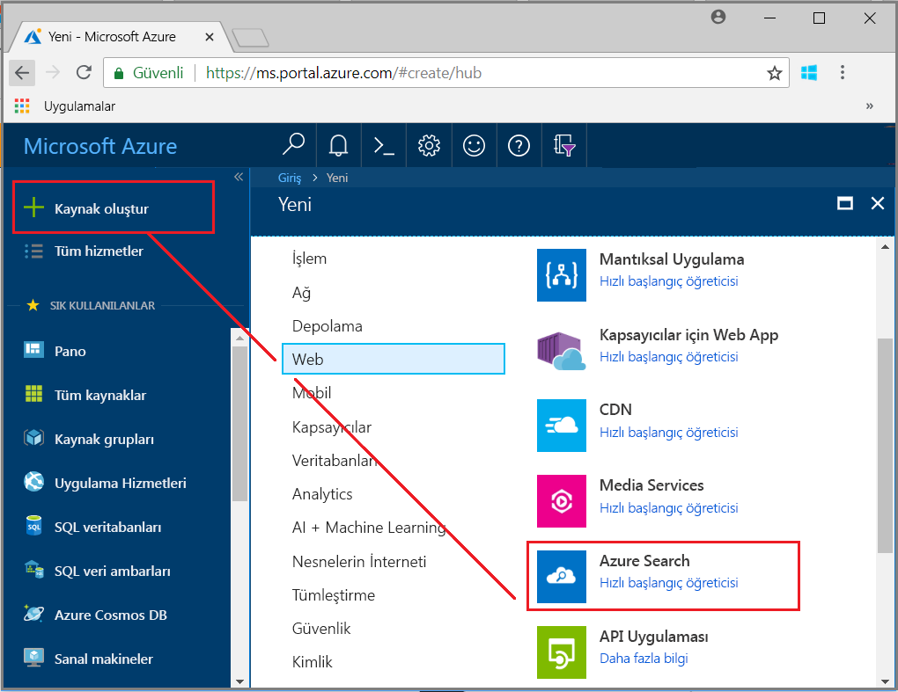
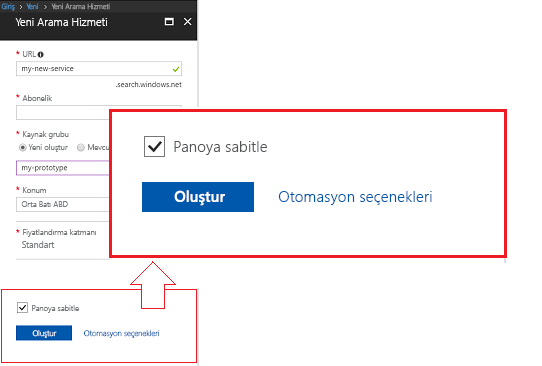
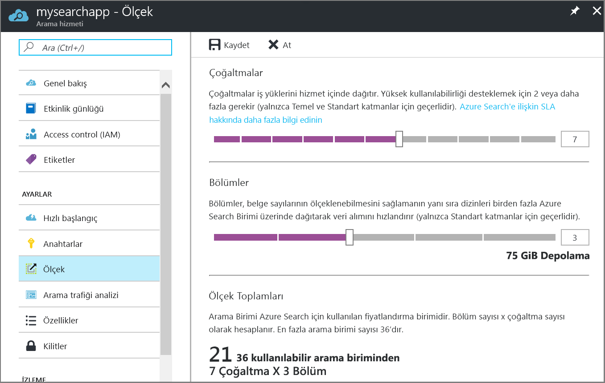

# Portalda Azure Search hizmeti oluşturma

Azure arama, bir arama deneyimi özel uygulamalarda takın için kullanılan tek başına bir kaynaktır. Diğer Azure Hizmetleri ile Azure Search bir kolayca tümleşir olsa da, kendisi tarafından Ayrıca ağ sunucularında uygulamaları veya diğer bulut platformlarında çalışan yazılımı ile kullanabilirsiniz.

Bu makalede, bir Azure Search kaynağı oluşturmayı öğrenin [Azure portalında](https://portal.azure.com/).

PowerShell’i mi tercih ediyorsunuz? Azure Resource Manager [hizmet şablonunu](https://azure.microsoft.com/resources/templates/101-azure-search-create/) kullanın. Başlama konusunda yardım için bkz: [PowerShell ile Azure Search yönetme](search-manage-powershell.md).

## Abone olma (ücretsiz veya ücretli)

[Ücretsiz bir Azure hesabı açın](https://azure.microsoft.com/pricing/free-trial/?WT.mc_id=A261C142F) ve ücretli Azure hizmetlerini denemek için ücretsiz krediler kullanın. Krediler bittikten sonra hesabı tutun ve Web Siteleri gibi ücretsiz Azure hizmetlerini kullanmaya devam edin. Açıkça ayarlarınızı değiştirip ücretlendirme istemediğiniz sürece kredi kartınız asla ücretlendirilmez.

Alternatif olarak, [MSDN abone avantajlarınızı etkinleştirin](https://azure.microsoft.com/pricing/member-offers/msdn-benefits-details/?WT.mc_id=A261C142F). MSDN aboneliği size her ay ücretli Azure hizmetleri için kullanabileceğiniz krediler verir. 

## Azure Search’ü bulma

1. [Azure Portal](https://portal.azure.com/) oturum açın.
2. Sol üst köşedeki artı işaretine ("+ Kaynak Oluştur") tıklayın.
3. Kaynağa gidin veya "Azure Search" bulmak için arama çubuğunu kullanın **Web** > **Azure Search**.

## Hizmet ve URL uç noktasını adlandırma

Hizmet adı, API çağrılarının düzenlendiği URL uç noktasının bir kısmıdır: `https://your-service-name.search.windows.net`. **URL** alanına hizmet adınızı girin.

Örneğin, uç istiyorsanız `https://my-app-name-01.search.windows.net`, şunu yazarsınız: `my-app-name-01`.

Hizmet adı gereksinimleri:

* search.windows.net ad alanı içinde benzersiz olmalıdır
* 2 ila 60 karakter uzunluğunda olmalıdır
* Küçük harfleri, rakamları veya kısa çizgileri ("-") kullanın
* İlk 2 karakter olarak veya sondaki tek karakter olarak tire ("-") kullanmaktan kaçının
* Hiçbir yerde art arda tire ("--") kullanmayın

## Abonelik seçme

Birden fazla aboneliğiniz varsa, veri veya dosya depolama hizmetleri de içeren bir abonelik seçin. Azure arama için otomatik algıla Azure Tablosu'nu ve Blob Depolama, SQL veritabanı ve Azure Cosmos DB aracılığıyla dizin oluşturmak için [ *dizin oluşturucular*](search-indexer-overview.md), ancak yalnızca aynı Abonelikteki hizmetler için.

## Kaynak grubu seçme

Kaynak grubu, birlikte kullanılan Azure hizmetleri ve kaynakları koleksiyonudur. Örneğin, bir SQL veritabanının dizinini oluşturmak için Azure Search kullanıyorsanız, her iki hizmet de aynı kaynak grubunun parçası olmalıdır.

Tek bir grup olarak birleştirip olmayan ya da mevcut kaynak gruplarını ilgisiz çözümlerinde kullanılan kaynaklarla doldurulursa, yalnızca Azure Search kaynağınız için yeni bir kaynak grubu oluşturun.

> [!TIP]
> Bir kaynak grubu silindiğinde, o kaynak grubunun içindeki hizmetler de silinir. Birden fazla hizmet kullanan prototip projeler için, tüm bunların aynı kaynak grubuna yerleştirilmesi, proje bittikten sonra temizleme işlemini kolaylaştırır.

## Bir konum seçin

Azure hizmeti olarak Azure Search, dünyanın dört bir yanındaki veri merkezlerinde barındırılabilir. Desteklenen bölgelerin listesini bulunabilir [fiyatlandırma sayfası](https://azure.microsoft.com/pricing/details/search/). 

Başka bir Azure tarafından sağlanan veri sıralıyorsanız hizmeti (Azure depolama, Azure Cosmos DB, Azure SQL veritabanı), bant genişliği ücretleri önlemek için aynı bölgede Azure Search hizmetinizi oluşturma öneririz. Hizmetler aynı bölgede çalışırken giden veriler için herhangi bir ücreti yoktur.

Bilişsel arama AI zenginleştirmelerinin kullanıyorsanız, Bilişsel hizmetler kaynağınızı aynı bölgede hizmetinizi oluşturun. Hizmetlerin birlikte bulundurma, yapay ZEKA zenginleştirme için bir gereksinimdir.

> [!Note]
> Orta Hindistan, yeni hizmetler için şu anda kullanılamıyor. Orta Hindistan zaten Hizmetleri, kısıtlama olmadan ölçeği artırabilirsiniz ve hizmetiniz bu bölgeye tam olarak desteklenir. Bu bölge kısıtlaması geçicidir ve uzun, geçerli olduğu durumlarda bu notta kaldıracağız.

## Fiyatlandırma katmanı (SKU) seçme

[Azure arama şu anda birden fazla fiyatlandırma katmanında sunulan](https://azure.microsoft.com/pricing/details/search/): Ücretsiz, temel veya standart. Her katmanın kendi [kapasitesi ve sınırları](search-limits-quotas-capacity.md) vardır. Yönergeler için [Fiyatlandırma katmanı veya SKU seçme](search-sku-tier.md) bölümüne bakın.

Üretim iş yükleri için genellikle Standart seçilir ancak çoğu müşteri başlangıçta Ücretsiz hizmeti kullanır.

Hizmet oluşturulduktan sonra fiyatlandırma katmanı değiştirilemez. Daha yüksek veya daha düşük bir katmana ihtiyacınız olursa, hizmeti yeniden oluşturmanız gerekir.

## Sitenizi oluşturma

Her oturum açtığınızda kolay erişim için hizmetinizi panoya sabitlemeyi unutmayın.

## Bir anahtarı ve URL uç noktasını alın

Birkaç özel durum ile birlikte kullanarak yeni hizmetinizin URL uç nokta ve yetkilendirme api anahtarı sağlamanızı gerektirir. Hızlı Başlangıçlar, öğreticiler gibi [Azure Search REST API'lerini keşfetme (Postman)](search-fiddler.md) ve [net'ten Azure Search kullanma](search-howto-dotnet-sdk.md), örnekler ve bir uç nokta gerekir ve anahtar belirli kaynağınız üzerinde çalıştırmak için özel kod.

1. Hizmet genel bakış sayfasında bulun ve sayfanın sağ tarafındaki URL uç noktasını kopyalayın.

   

2. Sol gezinti bölmesinde seçin **anahtarları** (bunlar eşdeğerdir) yönetici anahtarlarından birini kopyalayın. Yönetici API anahtarları oluşturma, güncelleştirme, hizmetinizde nesneleri silme için gereklidir.

   

Bir uç noktasını ve anahtarı portal tabanlı görevler için gerekli değildir. Portalda Azure Search kaynağınıza yönetici haklarıyla zaten bağlı. Portal öğreticisi için başlayın [Öğreticisi: İçeri aktarma ve dizini Azure Search'te sorgu](search-get-started-portal.md).

## Hizmetinizi ölçeklendirme

Bir hizmetin oluşturulması birkaç dakika (katmana bağlı olarak 15 dakika veya daha fazla) sürebilir. Hizmetiniz sağlandıktan sonra ihtiyaçlarınızı karşılayacak şekilde ölçeklendirilebilir. Azure Search hizmetiniz için Standart katmanı seçtiğinizden hizmetinizi iki boyutta ölçeklendirebilirsiniz: çoğaltmalar ve bölümler. Temel katmanı seçtiyseniz yalnızca çoğaltmalar ekleyebilirsiniz. Ücretsiz hizmeti sağladıysanız ölçek kullanılamaz.

***Bölümler***, hizmetinizin daha fazla belge depolamasına ve daha fazla belgede arama yapmasına olanak sağlar.

***Çoğaltmalar***, hizmetinizin daha yüksek arama sorgusu yükünü işlemesine olanak sağlar.

Kaynak eklemek aylık faturanız artırır. [Fiyatlandırma hesaplayıcısı](https://azure.microsoft.com/pricing/calculator/), fatura konusunda kaynak eklemenin getirdiği sonuçları anlamanıza yardımcı olabilir. Kaynakları yüke göre ayarlayabildiğinizi unutmayın. Örneğin, tam bir ilk dizin oluşturmak için kaynakları artırabilir ve ardından artımlı dizin oluşturmak için daha uygun bir düzeye indirebilirsiniz.

> [!Important]
> Bir hizmetin [salt okunur SLA için 2 çoğaltması ve okuma/yazma SLA’sı için 3 çoğaltması](https://azure.microsoft.com/support/legal/sla/search/v1_0/) olmalıdır.

1. Azure portalında arama hizmeti sayfanıza gidin.
2. Sol gezinti bölmesinde **Ayarlar** > **Ölçek** seçeneklerini belirleyin.
3. Her iki türdeki kaynakları eklemek için kaydırma çubuğunu kullanın.

> [!Note]
> Her katmanın, tek bir hizmette izin verilen toplam Arama Birimi sayısı üzerinde farklı [sınırları](search-limits-quotas-capacity.md) vardır (Çoğaltmalar * Bölümler = Toplam Arama Birimleri).

## Ne zaman ikinci bir hizmet eklenir?

Müşterilerin çoğu yalnızca bir hizmet katmanı sağlayarak sağlanan kullanın [doğru kaynak bakiyesini](search-sku-tier.md). Bir hizmet, her bir dizinin diğerinden yalıtıldığı, [seçtiğiniz maksimum katman sınırlarına](search-capacity-planning.md) tabi olan birden fazla dizin barındırabilir. Azure Search’te istekler yalnızca bir dizine yönlendirilerek aynı hizmetteki diğer dizinlerden yanlışlıkla veya kasıtlı olarak veri alınması ihtimalini en aza indirir.

Müşterilerin çoğu yalnızca bir hizmet kullansa da, işletim gereksinimleri arasında aşağıdakiler yer alıyorsa hizmet yedekliliği gerekebilir:

* Olağanüstü durum kurtarma (veri merkezi kesintisi). Azure Search, bir kesinti olması durumunda anında yük devretme işlevi sağlamaz. Öneriler ve kılavuz için bkz. [Hizmet yönetim](search-manage.md).
* Çok kiracılı modelleme araştırması, ek hizmetlerin optimum tasarım olduğunu belirlemiştir. Daha fazla bilgi için bkz. [Çoklu kiracı tasarımı](search-modeling-multitenant-saas-applications.md).
* Genel olarak dağıtılan uygulamalar için, uygulamanızın uluslararası trafiğinin gecikme süresini en aza indirmek amacıyla birden fazla bölgede bir Azure Search örneği gerekebilir.

> [!NOTE]
> Azure Search’te, dizin oluşturma ve sorgulama iş yüklerini ayıramazsınız; bu nedenle ayrılmış iş yükleri için hiçbir zaman birden fazla hizmet oluşturmazsınız. Bir dizin her zaman oluşturulduğu hizmette sorgulanır (bir hizmette bir dizini oluşturup başka bir hizmete kopyalayamazsınız).

Yüksek düzeyde kullanılabilirlik için ikinci bir hizmet gerekmez. Aynı hizmette 2 veya daha fazla çoğaltma kullandığınızda sorguların yüksek kullanılabilirliği elde edilir. Çoğaltma güncelleştirmeleri sıralıdır; başka bir deyişle bir hizmet güncelleştirmesi kullanıma sunulduğunda en az biri işlevsel olur. Çalışma süresi hakkında daha fazla bilgi için bkz. [Hizmet Düzeyi Sözleşmeleri](https://azure.microsoft.com/support/legal/sla/search/v1_0/).

## Sonraki adımlar

Azure Search Hizmeti sağlandıktan sonra portalda ilk dizininizi oluşturmaya devam edebilirsiniz.

> [!div class="nextstepaction"]
> [Öğretici: Verileri içeri aktarma, dizin ve Portalı'nda sorgu çalıştırma](search-get-started-portal.md)
