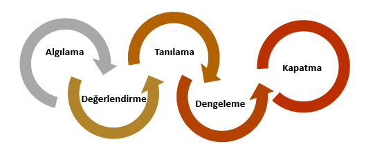
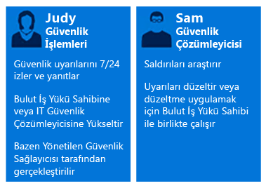
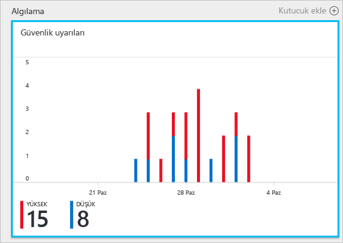
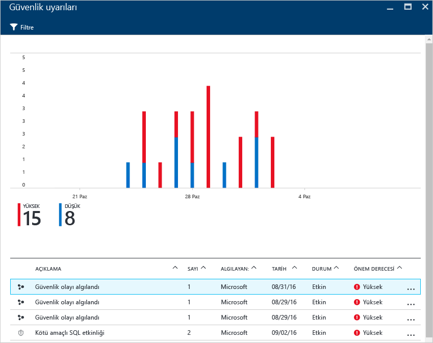
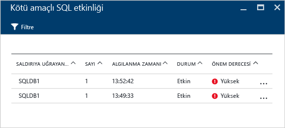
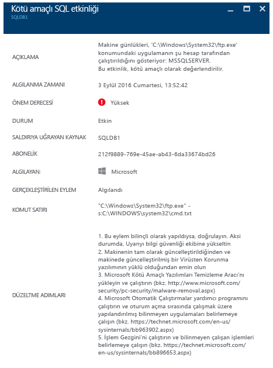

# Olay yanıtı için Azure Güvenlik Merkezi’ni kullanma
Birçok kuruluş güvenlik olaylarına nasıl yanıt vereceğini ancak bir saldırıya uğradıktan sonra öğrenir. Maliyetini ve zararını azaltmak için bir saldırı gerçekleşmeden önce olay yanıtı planınızın olması önemlidir. Bir olay yanıtının farklı aşamalarında Azure Güvenlik Merkezi’ni kullanabilirsiniz.

## Olay yanıtı planlaması
Etkili bir plan üç temel özelliğe bağlıdır: tehditlere karşı koruma, tehditleri algılama ve yanıtlama. Koruma; olayları önlemek, algılama; tehditleri erken belirlemek ve yanıt; saldırganı uzaklaştırıp sistemleri geri yükleyerek bir ihlalin etkilerini azaltmak içindir.

Bu makale aşağıdaki diyagramda gösterildiği gibi [Bulutta Microsoft Azure Güvenlik Yanıtı](https://gallery.technet.microsoft.com/Azure-Security-Response-in-dd18c678) makalesinden güvenlik olay yanıtı aşamalarını kullanmaktadır:

Algılama, Değerlendirme ve Tanılama aşamalarında Güvenlik Merkezi’ni kullanabilirsiniz. Olay yanıtının başlangıçtaki üç aşaması sırasında Güvenlik Merkezi’nin nasıl yararlı olabileceğine ilişkin örnekler aşağıda verilmiştir:

* **Algılama**: olay araştırmasının ilk göstergesini gözden geçirin.
  * Örnek: Güvenlik Merkezi panosunda yüksek öncelikli bir güvenlik uyarısının oluşturulduğuna ilişkin ilk doğrulamayı gözden geçirin.
* **Değerlendirme**: şüpheli etkinlik hakkında daha fazla bilgi edinmek için ilk değerlendirmeyi gerçekleştirin.
  * Örnek: Güvenlik uyarısı hakkında daha fazla bilgi edinin.
* **Tanılama**: teknik bir inceleme gerçekleştirme, kapsamı tanımlama, giderme ve geçici çözüm stratejileri.
  * Örnek: ilgili güvenlik uyarısında Güvenlik Merkezi tarafından tanımlanan düzeltme adımlarını izleyin.

Aşağıdaki senaryoda bir güvenlik olayının Algılama, Değerlendirme ve Tanılama/Yanıtlama aşamaları sırasında Güvenlik Merkezi’nden nasıl yararlanılacağı gösterilmektedir. Güvenlik Merkezi'nde bir [güvenlik olayı](security-center-incident.md), bir kaynağın [sonlandırma zinciri](https://blogs.technet.microsoft.com/office365security/addressing-your-cxos-top-five-cloud-security-concerns/) desenleri ile hizalanan tüm uyarılarının toplamıdır. Olaylar [Güvenlik uyarıları](security-center-managing-and-responding-alerts.md) kutucuğunda ve dikey penceresinde görüntülenir. Bir olay, her olay hakkında daha fazla bilgi almanızı sağlayan ilgili uyarıların listesini ortaya çıkarır. Güvenlik Merkezi şüpheli bir etkinliği izlemek için de kullanılabilen bağımsız güvenlik uyarıları da sunar.

## Senaryo
Contoso kısa süre önce bazı sanal makine tabanlı iş kolu iş yükleri ve SQL veritabanları dahil olmak üzere şirket içi kaynaklarından bazılarını Azure’a taşımıştır. Contoso'nun Çekirdek Bilgisayar Güvenliği Olay Yanıtı Ekibi (CSIRT) şu anda geçerli olay yanıtı araçlarıyla tümleşik güvenlik bilgileri olmadığı için güvenlik sorunlarını araştırmayla ilgili bir sorun yaşamaktadır. Bu tümleştirme eksikliği, Algılama aşamasında (çok sayıda hatalı pozitif sonuç) ve Değerlendirme ile Tanılama aşamalarında bir sorun oluşturmaktadır. Bu geçişin bir parçası olarak, bu sorunu gidermeye yardımcı olmak üzere Güvenlik Merkezi’ni kullanmaya karar verilmiştir.

Bu geçişin ilk aşaması tüm kaynaklar eklendikten sonra ve Güvenlik Merkezi'nin tüm güvenlik önerileri ele alındıktan sonra tamamlanmıştır. Contoso CSIRT, bilgisayar güvenliği olaylarıyla ilgilenmek için odak noktasıdır. Ekip her türlü güvenlik olayıyla ilgilenmekten sorumlu kişilerden oluşur. Hiçbir sorumluluk alanının kapsam dışında kalmaması için ekip üyeleri açıkça tanımlanmış görevlere sahiptir.

Bu senaryoda Contoso CSIRT ekibinin bir parçası olan aşağıdaki kişilerin rollerine odaklanılacaktır:

Zehra güvenlik operasyonlarında görev almaktadır. Sorumlulukları şunlardır:

* Gün boyunca güvenlik tehditlerini izleme ve yanıtlama.
* Gerektiğinde bulut iş yükü sahibine veya güvenlik analiz uzmanına başvurma.

Vedat bir güvenlik analiz uzmanıdır ve aşağıdaki sorumluluklara sahiptir:

* Saldırıları araştırma.
* Uyarıları düzeltme.
* İş yükü sahipleriyle birlikte çalışarak çözümleri belirleyip uygulama.

Gördüğünüz gibi Zehra ve Vedat farklı sorumluluklara sahiptir ve Güvenlik Merkezi bilgilerini paylaşarak birlikte çalışmaları gerekir.

## Önerilen çözüm
Zehra ve Vedat farklı rollere sahip olduğundan günlük etkinlikleriyle ilgili bilgileri almak için Güvenlik Merkezi’nin farklı alanlarını kullanacaklardır. Zehra günlük izleme görevinin bir parçası olarak **Güvenlik uyarılarını** kullanır.

Zehra, Algılama ve Değerlendirme aşamaları sırasında Güvenlik uyarılarını kullanır. Zehra ilk değerlendirmesini tamamladıktan sonra ek araştırma gerekiyorsa sorunu Vedat’a taşıyabilir. Bu noktada Vedat, Tanılama aşamasına geçmek için bazen diğer veri kaynaklarıyla birlikte Güvenlik Merkezi tarafından sağlanan bilgileri kullanmak zorundadır.

## Bu çözümü uygulama
Bir olay yanıtı senaryosunda Azure Güvenlik Merkezi’nin nasıl kullanılacağını görmek için Meltem’in Algılama ve Değerlendirme aşamasındaki adımlarını izleyecek ve Vedat’ın sorunu tanılamak için ne yaptığını göreceğiz.

### Olay yanıtının Algılama ve Değerlendirme aşamaları
Zehra Azure portalında oturum açmıştır ve Güvenlik Merkezi konsolunda çalışmaktadır. Günlük izleme etkinliklerinin bir parçası olarak aşağıdaki adımları uygulayarak yüksek öncelikli güvenlik ayarlarını gözden geçirmeye başlamıştır:

1. **Güvenlik uyarıları** kutucuğuna tıklamış ve **Güvenlik uyarıları** dikey penceresine erişmiştir.
    

   > [!NOTE]
   > Bu senaryoda Zehra, önceki şekilde görünen Kötü Amaçlı SQL etkinliği uyarısı üzerinde bir değerlendirme yapacaktır.
   >
   >
2. Tıklayın **kötü amaçlı SQL etkinliği** için saldırılan kaynakları gözden geçirin ve uyarı **kötü amaçlı SQL etkinliği** dikey penceresinde:  

    Bu dikey pencerede Zehra, saldırıya uğrayan kaynaklar, bu saldırının kaç kez gerçekleştiği ve ne zaman algılandığı ile ilgili notlar alabilir.
3. Bu saldırı hakkında daha fazla bilgi almak için **saldırıya uğrayan kaynak** öğesine tıklayın.

Meltem açıklamayı okuduktan sonra bunun yanlış pozitif olmadığına ve bu sorunu Vedat’a götürmesi gerektiğine ikna olur.

### Tanılama olay yanıtı aşaması
Vedat olayı Zehra’dan alır ve Güvenlik Merkezi tarafından önerilen düzeltme adımlarını gözden geçirmeye başlar.

### Ek kaynaklar
Araştırma işlemi sırasında Güvenlik bilgileri ve olay yönetimi (SIEM) çözümünü kullanan şirketler ayrıca [Güvenlik Merkezi’ni çözümleriyle tümleştirebilir](security-center-integrating-alerts-with-log-integration.md). Ayrıca, [Azure günlük tümleştirme aracını](https://azure.microsoft.com/blog/introducing-hdinsight-integration-with-azure-log-analytics/) kullanarak Azure denetim günlükleri ve sanal makine (VM) güvenlik olaylarını tümleştirebilirsiniz. Bir saldırıyı araştırmak için Güvenlik Merkezi tarafından sağlanan bilgilerle birlikte bu bilgileri kullanabilirsiniz. Ayrıca, bir olayın kök nedenini belirlemenize yardımcı olması için Güvenlik Merkezi’ndeki [araştırma](https://docs.microsoft.com/azure/security-center/security-center-investigation) özelliğini kullanabilirsiniz.

## Sonuç
Olay gerçekleşmeden önce bir ekibin toplanması kuruluşunuz için çok önemlidir ve olayların nasıl ele alındığını olumlu yönde etkiler. Kaynakları izlemek için doğru araçlara sahip olunması bu ekibin bir güvenlik olayını düzeltmek üzere doğru adımları uygulamasına yardımcı olabilir. Güvenlik Merkezi [algılama özellikleri](security-center-detection-capabilities.md), BT’nin güvenlik olaylarına hızlıca yanıt vermesine ve güvenlik sorunlarını düzeltmesine yardımcı olabilir.
