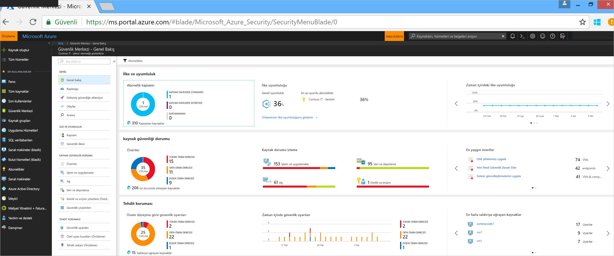
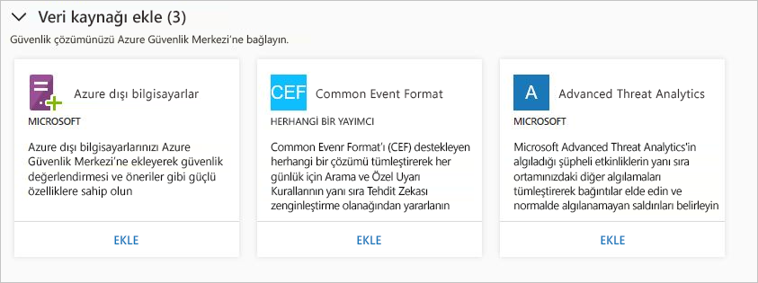
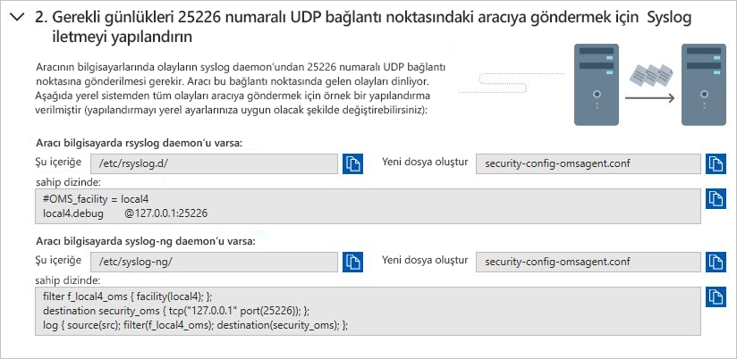
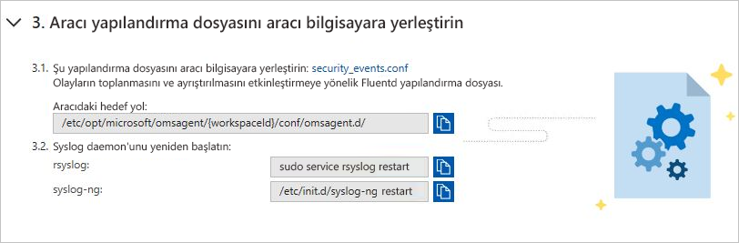
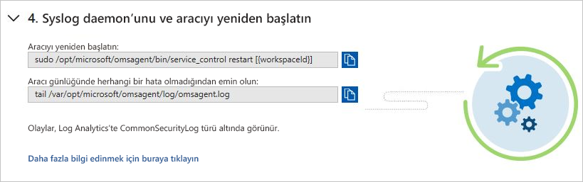
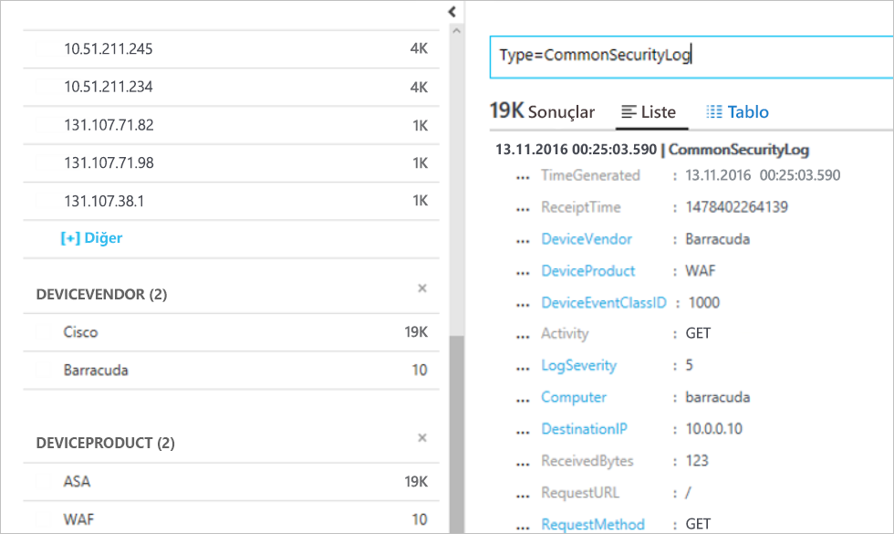

# Azure Güvenlik Merkezi'ndeki tümleşik güvenlik çözümleri
Bu belge Azure Güvenlik Merkezi'ne bağlanmış olan güvenlik çözümlerini yönetmenize ve yenilerini eklemenize yardımcı olur.

## Tümleşik Azure güvenlik çözümleri
Güvenlik Merkezi, Azure'daki tümleşik güvenlik çözümlerini etkinleştirmeyi kolaylaştırır. Faydaları şunlardır:

- **Basitleştirilmiş Dağıtım**: Güvenlik Merkezi, tümleşik iş ortağı çözümlerinin kolay sağlama sunar. Güvenlik Merkezi, kötü amaçlı yazılımdan koruma ve güvenlik açığı değerlendirmesi gibi çözümler için gerekli aracıyı sanal makinelerinize sağlayabilir. Güvenlik duvarı cihazları için ise Güvenlik Merkezi gerekli ağ yapılandırmasının çoğunluğunu gerçekleştirebilir.
- **Tümleşik algılamalar**: İş ortağı çözümlerinden gelen güvenlik olayları otomatik olarak toplanır, birleştirilir ve Güvenlik Merkezi uyarıları ve olaylarının bir parçası olarak görüntülenir. Gelişmiş tehdit algılama özellikleri sağlanması amacıyla, bu olaylar diğer kaynaklardan alınan algılamalarla da birleştirilir.
- **Birleşik sistem durumu izleme ve Yönetim**: Müşteriler, tümleşik sistem durumu olaylarını kullanarak bir bakışta tüm iş ortağı çözümlerini izleyebilir. İş ortağı çözümü kullanarak gelişmiş kuruluma kolayca erişim olanağıyla temel yapılandırma seçeneği sunulur.

Tümleşik güvenlik çözümleri şu anda aşağıdakileri içermektedir:

- Web uygulaması güvenlik duvarı ([Barracuda](https://www.barracuda.com/products/webapplicationfirewall), [F5](https://support.f5.com/kb/en-us/products/big-ip_asm/manuals/product/bigip-ve-web-application-firewall-microsoft-azure-12-0-0.html), [Imperva](https://www.imperva.com/Products/WebApplicationFirewall-WAF), [Fortinet](https://www.fortinet.com/products.html) ve [Azure Application Gateway](https://azure.microsoft.com/blog/azure-web-application-firewall-waf-generally-available/))
- Yeni nesil güvenlik duvarı ([Check Point](https://www.checkpoint.com/products/vsec-microsoft-azure/), [Barracuda](https://campus.barracuda.com/product/nextgenfirewallf/article/NGF/AzureDeployment/), [Fortinet](https://docs.fortinet.com/d/fortigate-fortios-handbook-the-complete-guide-to-fortios-5.2), [Cisco](https://www.cisco.com/c/en/us/td/docs/security/firepower/quick_start/azure/ftdv-azure-qsg.html) ve [Palo Alto Networks](https://www.paloaltonetworks.com/products))
- Güvenlik açığı değerlendirmesi ([Qualys](https://www.qualys.com/public-clouds/microsoft-azure/) ve [Rapid7](https://www.rapid7.com/products/insightvm/))

> [!NOTE]
> Güvenlik cihazı satıcılarının çoğu dış aracıların cihazlarında çalışmasını engellediğinden Güvenlik Merkezi, Microsoft Monitoring Agent uygulamasını iş ortağı sanal cihazlarına yüklemez.
>
>

## Güvenlik çözümlerinin tümleştirilme şekli
Güvenlik Merkezinden dağıtılan Azure güvenlik çözümleri otomatik olarak bağlanır. Aşağıdakiler dahil olmak üzere diğer güvenlik verisi kaynaklarına da bağlanabilirsiniz:

- Azure AD Kimlik Koruması
- Şirket içinde veya diğer bulutlarda çalışan bilgisayarlar
- Common Event Format (CEF) destekli güvenlik çözümü
- Microsoft Advanced Threat Analytics

## Tümleşik Azure güvenlik çözümlerini ve diğer veri kaynaklarını yönetme

1. [Azure Portal](https://azure.microsoft.com/features/azure-portal/) oturum açın.

2. **Microsoft Azure** menüsünde **Güvenlik Merkezi**’ni seçin. **Güvenlik Merkezi - Genel Bakış** açılır.

3. Güvenlik Merkezi menüsünde **Güvenlik çözümleri**’ni seçin.

   

**Güvenlik çözümleri** altında tümleşik Azure güvenlik çözümlerinin sistem durumu hakkındaki bilgileri görüntüleyebilir ve temel yönetim görevlerini gerçekleştirebilirsiniz. Ayrıca Common Event Format (CEF) biçimindeki Azure Active Directory Kimlik Koruması uyarılarını ve güvenlik duvarı günlükleri gibi diğer güvenlik veri kaynağı türlerini de bağlayabilirsiniz.

### Bağlantılı çözümler

**Bağlantılı çözümler** bölümünde Güvenlik Merkezi'ne bağlı olan güvenlik çözümleri ve her çözümün sistem durumu hakkında bilgiler yer alır.  

Bir iş ortağı çözümünün durumunu olabilir:

* Sağlıklı (yeşil) - hiçbir sistem durumu sorunu yok.
* Sağlıksız (kırmızı) - sistem durumunda hemen ilgilenilmesi gereken bir sorun var.
* Sistem durumu sorunları (turuncu) - çözüm, sistem durumunu raporlamayı durdurdu.
* Bildirilmedi (gri) - çözüm herhangi bir şey bildirilmedi henüz yakın zamanda bağlanmış ve hala veya sistem veri yok, çözümün durumu bildirilmeyen olabilir.

> [!NOTE]
> Güvenlik Merkezi, sistem durumu verilerini kullanılabilir durumda değilse, çözüm veya rapor bildirmek üzere alınan son olayın saat ve tarihi gösterir. Son 14 gün içinde alınan hiçbir uyarı ve sistem durumu veri yok, Güvenlik Merkezi, sağlıksız veya değil raporlama çözümüdür gösterir.
>
>

1. Seçin **görünümü** ek bilgileri veya seçenekleri için içerir:

   - **Çözüm Konsolu**. Bu çözüm için yönetim deneyimi açar.
   - **Bağlantı VM**. Bağlantı uygulamalar dikey penceresi açılır. Burada, kaynakları iş ortağı çözümüne bağlayabilirsiniz.
   - **Çözümü Sil**.
   - **Yapılandırma**.

   

### Bulunan çözümler

Güvenlik Merkezi, Azure’da çalışmasına karşın Güvenlik Merkezi’ne bağlı olmayan güvenlik çözümlerini otomatik olarak bulur ve çözümleri **Bulunan çözümler** bölümünde gösterir. Buna [Azure AD Kimlik Koruması](https://docs.microsoft.com/azure/active-directory/active-directory-identityprotection) gibi Azure çözümlerinin yanı sıra iş ortağı çözümleri dahildir.

> [!NOTE]
> Güvenlik Merkezi’nin Standart katmanı, bulunan çözümler özelliği için abonelik düzeyinde gereklidir. Güvenlik fiyatlandırma katmanları hakkında daha fazla bilgi almak için bkz. [Fiyatlandırma](security-center-pricing.md).
>
>

Güvenlik Merkezi ile tümleştirmek ve güvenlik uyarılarını bildirim olarak almak üzere bir çözümün altında **BAĞLAN** öğesini seçin.

Güvenlik Merkezi ayrıca Ortak Olay Biçimi (CEF) günlüklerini iletebilen, abonelikte dağıtılmış çözümleri bulur. CEF günlükleri kullanan [bir güvenlik çözümünü](quick-security-solutions.md) Güvenlik Merkezi'ne bağlama hakkında bilgi edinin.

### Veri kaynağı ekleme

**Veri kaynakları ekleyin** bölümünde bağlanabilecek diğer veri kaynakları bulunur. Bu kaynaklardan veri ekleme talimatları için **EKLE**'ye tıklayın.

### Dış çözümleri bağlama

Bilgisayarlarınızdan güvenlik verileri toplamaya ek olarak, Common Event Format’ı (CEF) destekleyen güvenlik çözümleri de dahil olmak üzere diğer çeşitli güvenlik çözümlerinden güvenlik verilerini tümleştirebilirsiniz. CEF, Syslog iletilerine ek olarak sektörde standart haline gelmiş, farklı platformlar arasında olay tümleştirmesi sağlamak için birçok güvenlik hizmeti satıcısı tarafından kullanılan bir biçimdir.

Bu hızlı başlangıçta şu işlemleri nasıl yapacağınız gösterilir:
- CEF Günlükleri kullanarak bir güvenlik çözümünü Güvenlik Merkezi'ne bağlama
- Bağlantıyı güvenlik çözümü ile doğrulama

#### Önkoşullar
Güvenlik Merkezi ile çalışmaya başlamak için Microsoft Azure aboneliğinizin olması gerekir. Bir aboneliğiniz yoksa [ücretsiz hesap](https://azure.microsoft.com/free/) için kaydolabilirsiniz.

Bu hızlı başlangıcı adım adım uygulamak için Güvenlik Merkezi’nin Standart fiyatlandırma katmanında olmanız gerekir. Ücretsiz olarak Güvenlik Merkezi standart deneyebilirsiniz. [Azure aboneliğinizi Güvenlik Merkezi Standart katmanına ekleme](security-center-get-started.md) başlıklı hızlı başlangıçta Standart katmanına nasıl yükseltebileceğiniz adım adım açıklanmıştır. Daha fazla bilgi için bkz. [fiyatlandırma sayfası](https://azure.microsoft.com/pricing/details/security-center/).

Ayrıca, Güvenlik Merkezi’ne zaten bağlı bir Syslog hizmeti ile birlikte bir [Linux makine](https://docs.microsoft.com/azure/log-analytics/log-analytics-agent-linux) gerekir.

#### CEF kullanarak çözüm bağlama

1. [Azure portal](https://azure.microsoft.com/features/azure-portal/) oturum açın.
2. **Microsoft Azure** menüsünde **Güvenlik Merkezi**’ni seçin. **Güvenlik Merkezi - Genel Bakış** açılır.

      

3. Güvenlik Merkezi ana menüsünde **Güvenlik Çözümleri**’ni seçin.
4. Güvenlik Çözümleri sayfasındaki **Veri kaynakları ekle (3)** altında, **Common Event Format** içindeki **Ekle**’ye tıklayın.

    

5. Common Event Format Günlükleri sayfasında ikinci adım olan **Gerekli günlükleri UDP bağlantı noktası 25226'daki aracıya göndermek için Syslog iletmeyi yapılandırın**’ı genişletin ve Linux bilgisayarınızda aşağıdaki yönergeleri izleyin:

    

6. Üçüncü adım olan **Aracı yapılandırma dosyasını aracı bilgisayarına yerleştirin**’i genişletin ve Linux bilgisayarınızda aşağıdaki yönergeleri izleyin:

    

7. Dördüncü adım olan **Syslog daemon’ı ve aracıyı yeniden başlatın**’ı genişletin ve Linux bilgisayarınızda aşağıdaki yönergeleri izleyin:

    

#### Bağlantıyı doğrulama

Aşağıdaki adımlara geçmeden önce syslog’un Güvenlik Merkezi’ne bildirmeye başlamasını beklemeniz gerekir. Bu işlem biraz zaman alabilir ve ortamın boyutuna göre değişir.

1.  Sol bölmedeki Güvenlik Merkezi panosunda **Ara**’ya tıklayın.
2.  Syslog’un (Linux Makinesi) bağlı olduğu çalışma alanını seçin.
3.  *CommonSecurityLog* yazıp **Ara** düğmesine tıklayın.

Aşağıdaki örnek, bu adımların sonucu gösterir: 

#### Kaynakları temizleme
Bu koleksiyondaki diğer hızlı başlangıçlar ve öğreticiler bu hızlı başlangıcı temel alır. Sonraki hızlı başlangıç ve öğreticilerle çalışmaya devam etmeyi planlıyorsanız Standart katmanını çalıştırmaya devam edin ve otomatik sağlamayı etkinleştirilmiş halde tutun. Devam etmeyi planlamıyorsanız veya Ücretsiz katmanına dönmek istiyorsanız:

1. Güvenlik Merkezi ana menüsüne dönüp **Güvenlik İlkesi**’ni seçin.
2. Ücretsiz katmanına döndürmek istediğiniz aboneliği veya ilkeyi seçin. **Güvenlik ilkesi** açılır.
3. **İLKE BİLEŞENLERİ** altında **Fiyatlandırma katmanı**’nı seçin.
4. Aboneliği Standart katmanından Ücretsiz katmanına geçirmek için **Ücretsiz**’i seçin.
5. **Kaydet**’i seçin.

Otomatik sağlamayı devre dışı bırakmak istiyorsanız:

1. Güvenlik Merkezi ana menüsüne dönüp **Güvenlik ilkesi**’ni seçin.
2. Otomatik sağlamayı hangi abonelik için devre dışı bırakmak istediğinizi belirtin.
3. Otomatik sağlamayı kapatmak için **Güvenlik ilkesi – Veri Toplama** altındaki **Ekleme** bölümünden **Kapalı**’yı seçin.
4. **Kaydet**’i seçin.

>[!NOTE]
> Otomatik sağlama devre dışı bırakıldığında Microsoft Monitoring Agent’ın sağlandığı Azure VM’lerinden aracı kaldırılmaz. Otomatik sağlamanın devre dışı bırakılması, kaynaklarınızın güvenliğinin izlenmesini kısıtlar.
>

## SIEM'ye aktarma verileri dışarı aktarma

Azure Güvenlik Merkezi tarafından üretilen işlenen olaylar, Azure'a yayımlanır [etkinlik günlüğü](../monitoring-and-diagnostics/monitoring-overview-activity-logs.md), bir günlük türlerini Azure İzleyici aracılığıyla kullanılabilir. Azure İzleyici, tüm izleme verilerinizi bir SIEM aracına yönlendirme için birleştirilmiş bir işlem hattı sunar. Bu, bir iş ortağı aracına bu verileri Burada, ardından çekilebilir olay Hub'ına akış tarafından gerçekleştirilir.

Bu kanal kullanan [Azure izleme tek bir işlem hattı](../azure-monitor/platform/stream-monitoring-data-event-hubs.md) erişim, Azure ortamınızdan izleme verilerini alma. Bu, kolayca veri tüketmek için Sıem'lerden ve izleme araçlarını ayarlama sağlar.

Sonraki bölümlerde, verileri olay hub'ına akışla nasıl yapılandırılacağını açıklar. Adımlar, Azure Güvenlik Merkezi, Azure aboneliğinizde yapılandırılmış zaten sahip olduğunuzu varsaymaktadır.

Yüksek düzey genel bakış

### SIEM için kullanıma sunulan Azure güvenlik veri nedir?

Bu sürümde kullanıma sunuyoruz [güvenlik uyarıları.](../security-center/security-center-managing-and-responding-alerts.md) Gelecek sürümlerde biz güvenlik önerilerini veri kümesiyle zenginleştirin.

### İşlem hattı ayarlama

#### Event Hub'ı oluşturma

Başlamadan önce yapmanız [bir Event Hubs ad alanı oluşturma](../event-hubs/event-hubs-create.md). Bu ad alanı ve olay hub'ı olduğu için tüm izleme verilerinizi hedef.

#### Azure etkinlik günlüğünün Event Hubs'a Stream

Lütfen aşağıdaki makaleye başvurun [etkinlik günlüğünün Event Hubs'a akış](../azure-monitor/platform/activity-logs-stream-event-hubs.md)

#### Bir iş ortağı SIEM bağlayıcısı yükleyin 

Bir olay hub'ına Azure İzleyici ile izleme verilerinizi yönlendirme, iş ortağı SIEM ve izleme araçları ile kolayca tümleştirmenize olanak sağlar.

Listesini görmek için aşağıdaki bağlantıya bakın [desteklenen Sıem'lerin](../azure-monitor/platform/stream-monitoring-data-event-hubs.md#what-can-i-do-with-the-monitoring-data-being-sent-to-my-event-hub)

### Örneğin, verileri Sorgulama 

Birkaç uyarı veri çekmek için kullanabileceğiniz Splunk sorgu aşağıda verilmiştir:

| **Sorgu açıklaması** | **Sorgu** |
|----|----|
| Tüm Uyarılar| Dizin ana Microsoft.Security/locations/alerts =|
| İşlem sayısı adlarına göre özetleyin.| index=main sourcetype="amal:security" \| table operationName \| stats count by operationName|
| Uyarıları bilgi alın: Saat, adı, abonelik, durumu ve kimliği | Dizin ana Microsoft.Security/locations/alerts = \| tablo \_zaman, properties.eventName, durumu, properties.operationId am_subscriptionId |

## Sonraki adımlar

Bu makalede, Güvenlik Merkezi'nde iş ortağı çözümlerinin nasıl tümleştirileceğini öğrendiniz. Güvenlik Merkezi hakkında daha fazla bilgi edinmek için aşağıdaki makalelere bakın:

* [Güvenlik Merkezi'nde güvenlik durumunu izleme](security-center-monitoring.md). Azure kaynaklarınızı durumunu izleme hakkında bilgi edinin.
* [Güvenlik Merkezi’yle iş ortağı çözümlerini izleme](security-center-partner-solutions.md). İş ortağı çözümlerinizin sistem durumunu izleme hakkında bilgi edinin.
* [Azure Güvenlik Merkezi SSS](security-center-faq.md). Güvenlik Merkezi kullanımı ile ilgili sık sorulan soruların yanıtlarını alın.
* [Azure Güvenlik blogu](https://blogs.msdn.com/b/azuresecurity/). Azure güvenliği ve uyumluluğu ile ilgili blog yazılarını bulun.
