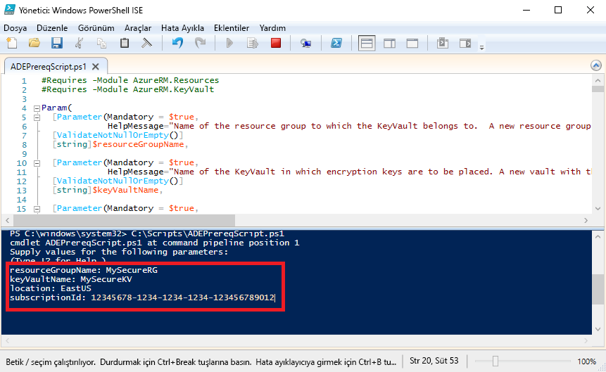

# <a name="quickstart-encrypt-a-windows-iaas-vm-with-azure-powershell"></a>Hızlı Başlangıç: Azure PowerShell ile bir Windows Iaas VM'LERİNİ şifreleme

Azure Disk Şifrelemesi, Windows ve Linux IaaS sanal makine disklerini şifrelemenize yardımcı olur. Çözüm ayrıca Azure Key Vault ile birlikte çalışarak disk şifreleme anahtarlarını ve gizli dizilerini denetlemenize ve yönetmenize yardımcı olur. Azure Disk Şifrelemesi'ni kullanarak, VM'lerinizin bekleme sırasında endüstri standardı şifreleme teknolojisi kullanılarak güvende tutulmasını sağlayabilirsiniz. Bu hızlı başlangıçta, Windows Server 2016 VM oluşturacak ve İşletim sistemi diskini şifreleyeceksiniz.

Azure aboneliğiniz yoksa başlamadan önce [ücretsiz bir hesap](https://azure.microsoft.com/free/?WT.mc_id=A261C142F) oluşturun.

## <a name="prerequisites"></a>Önkoşullar

[!INCLUDE [updated-for-az](../../includes/updated-for-az.md)]

- Windows PowerShell ISE
- Yüklemeniz veya güncelleştirmeniz [Azure PowerShell modülünün en son sürümü](/powershell/azure/install-az-ps)
    - Az modül sürüm 1.0.0 olması gerekir veya üzeri. Kullanım `Get-Module Az -ListAvailable | Select-Object -Property Name,Version,Path` sürümü denetlemek için.
- [Azure Disk Şifrelemesi önkoşulları betiğinin](https://raw.githubusercontent.com/Azure/azure-powershell/master/src/Compute/Compute/Extension/AzureDiskEncryption/Scripts/AzureDiskEncryptionPreRequisiteSetup.ps1) bir kopyası.
    - Bu betiğe zaten sahipseniz, kısa süre önce değiştirildiği için yeni bir kopyasını indirin. 
    - Metnin tamamını seçmek için **CTRL-A**, seçtiğiniz tüm metni Not Defteri'ne kopyalamak için ise **CTRL-C** tuşlarına basın.
    - Dosyayı **ADEPrereqScript.ps1** olarak kaydetme


## <a name="sign-in-to-azure"></a>Azure'da oturum açma

1. **Windows PowerShell ISE**'ye sağ tıklayın ve **Yönetici olarak çalıştır**'a tıklayın.
1. İçinde **yönetici: Windows PowerShell ISE** penceresinde tıklayın **görünümü** ve ardından **betik bölmesini göster**.
1. Betik bölmesine şu cmdlet komutunu yazın: 

     ```azurepowershell
      Connect-AzAccount
     ```

1. **Betiği Çalıştır** seçeneğine ilişkin yeşil oka tıklayın veya F5 tuşuna basın. 
2. Azure hesabınıza bağlanma işlemini tamamlamak için etkileşimli oturum açma özelliğini kullanın.
3. Bir sonraki PowerShell betiğini çalıştırırken kullanmak üzere, döndürülen **abonelik kimliğinizi** kopyalayın. 

## <a name="bkmk_PrereqScript"></a> Azure Disk Şifrelemesi önkoşulları betiğini çalıştırma
 **ADEPrereqScript.ps1**, bir kaynak grubu ve anahtar kasası oluşturup anahtar kasası erişim ilkesini belirler. Betik, yanlışlıkla silinmeye karşı korunmasına yardımcı olmak üzere anahtar kasasında bir kaynak kilidi de oluşturur.  

1. İçinde **yönetici: Windows PowerShell ISE** penceresinde tıklayın **dosya** ve ardından **açık**. **ADEPrereqScript.ps1** dosyasına gidin ve bu dosyaya çift tıklayın. Betik bölmesinde söz konusu betik açılır.
2. Betiği çalıştırmak için **Betiği Çalıştır** seçeneğine ilişkin yeşil oka tıklayın veya F5 tuşuna basın. 
3. Yeni bir **kaynak grubu** ve **anahtar kasası** için ad girin. Kaynak grubunu daha sonra sileceğimizden, bu hızlı başlangıç için mevcut bir kaynak grubunu veya anahtar kasasını kullanmayın. 
4. Kaynakları oluşturmak istediğiniz konumu (**EastUS** gibi) yazın. `Get-AzLocation` komutu ile bir konum listesi alın.
5. **Abonelik kimliğinizi** kopyalayın. Abonelik Kimliğinizi `Get-AzSubscription` komutu ile alabilirsiniz.  
6. **Betiği Çalıştır** seçeneğine ilişkin yeşil oka tıklayın. 
7. Daha sonra kullanmak üzere, döndürülen **DiskEncryptionKeyVaultUrl** ve **DiskEncryptionKeyVaultId** bilgilerini kopyalayın.




## <a name="create-a-virtual-machine"></a>Sanal makine oluşturma 
Şimdi de diskini şifreleyebilmek için bir sanal makine oluşturmanız gerekir. Kullanacağınız betik, 8 GB RAM ve 30 GB işletim sistemi diskine sahip bir Windows Server 2016 VM oluşturur. 

1. Betiğe kopyalama **yönetici: Windows PowerShell ISE** betik bölmesi ve ilk üç değişkenlerini değiştirin. Kaynak grubu ve konumun, [önkoşullar betiği](#bkmk_PrereqScript) için kullandıklarınızla aynı olması gerekir.  

   ```azurepowershell
    # Variables for common values
    $resourceGroup = "MySecureRG"
    $location = "EastUS"
    $vmName = "MySecureVM"
    
    # Create user object
    $cred = Get-Credential -Message "Enter a username and password for the virtual machine."
    
    # Create a resource group
    New-AzResourceGroup -Name $resourceGroup -Location $location
    
    # Create a subnet configuration
    $subnetConfig = New-AzVirtualNetworkSubnetConfig -Name mySubnet -AddressPrefix 192.168.1.0/24
    
    # Create a virtual network
    $vnet = New-AzVirtualNetwork -ResourceGroupName $resourceGroup -Location $location `
      -Name MYvNET -AddressPrefix 192.168.0.0/16 -Subnet $subnetConfig
    
    # Create a public IP address and specify a DNS name
    $pip = New-AzPublicIpAddress -ResourceGroupName $resourceGroup -Location $location `
      -Name "mypublicdns$(Get-Random)" -AllocationMethod Static -IdleTimeoutInMinutes 4
    
    # Create an inbound network security group rule for port 3389
    $nsgRuleRDP = New-AzNetworkSecurityRuleConfig -Name myNetworkSecurityGroupRuleRDP  -Protocol Tcp `
      -Direction Inbound -Priority 1000 -SourceAddressPrefix * -SourcePortRange * -DestinationAddressPrefix * `
      -DestinationPortRange 3389 -Access Allow
    
    # Create a network security group
    $nsg = New-AzNetworkSecurityGroup -ResourceGroupName $resourceGroup -Location $location `
      -Name myNetworkSecurityGroup -SecurityRules $nsgRuleRDP
    
    # Create a virtual network card and associate with public IP address and NSG
    $nic = New-AzNetworkInterface -Name myNic -ResourceGroupName $resourceGroup -Location $location `
      -SubnetId $vnet.Subnets[0].Id -PublicIpAddressId $pip.Id -NetworkSecurityGroupId $nsg.Id
    
    # Create a virtual machine configuration
    $vmConfig = New-AzVMConfig -VMName $vmName -VMSize Standard_D2_v3 | `
    Set-AzVMOperatingSystem -Windows -ComputerName $vmName -Credential $cred | `
    Set-AzVMSourceImage -PublisherName MicrosoftWindowsServer -Offer WindowsServer -Skus 2016-Datacenter-smalldisk -Version latest | `
    Add-AzVMNetworkInterface -Id $nic.Id
    
    # Create a virtual machine
    New-AzVM -ResourceGroupName $resourceGroup -Location $location -VM $vmConfig
   ```

2. VM'i oluşturmak için **Betiği Çalıştır** seçeneğine ilişkin yeşil oka tıklayın.  


## <a name="encrypt-the-disk-of-the-vm"></a>VM diskini şifreleme
Oluşturulan ve bir anahtar kasası ile bir VM yapılandırılmış göre diskle şifreleyebilirsiniz **kümesi AzVmDiskEncryptionExtension** cmdlet'i. 
 
1. VM diskini şifrelemek için şu cmdlet komutunu çalıştırın:

    ```azurepowershell
     Set-AzVmDiskEncryptionExtension -ResourceGroupName "MySecureRG" -VMName "MySecureVM" `
     -DiskEncryptionKeyVaultId "<Returned by the prerequisites script>" -DiskEncryptionKeyVaultUrl "<Returned by the prerequisites script>"
     ```


1. Şifreleme tamamlandığında şu cmdlet komutunu kullanarak, diskin şifrelendiğini doğrulayabilirsiniz: 

     ```azurepowershell
     Get-AzVmDiskEncryptionStatus -ResourceGroupName "MySecureRG" -VMName "MySecureVM"
     ```
    
    
## <a name="clean-up-resources"></a>Kaynakları temizleme
 **ADEPrereqScript.ps1**, anahtar kasasında bir kaynak kilidi oluşturur. Bu hızlı başlangıçtaki kaynakları temizlemek için önce kaynak kilidini kaldırmanız, ardından da kaynak grubunu silmeniz gerekir. 

1. Anahtar kasasından kaynak kilidi kaldırın

     ```azurepowershell
     $LockId =(Get-AzResourceLock -ResourceGroupName "MySecureRG" -ResourceName "MySecureVault" -ResourceType "Microsoft.KeyVault/vaults").LockID 
     Remove-AzResourceLock -LockID $LockId
      ```
    
2. Kaynak grubunu kaldırın. Bu işlemle birlikte gruptaki tüm kaynaklar da silinir. 
     ```azurepowershell
      Remove-AzResourceGroup -Name "MySecureRG"
      ```

## <a name="next-steps"></a>Sonraki adımlar
IaaS VM'leri için Azure Disk Şifrelemesi önkoşulları hakkında daha fazla bilgi edinmek üzere bir sonraki makaleye geçin.

> [!div class="nextstepaction"]
> [Azure Disk Şifrelemesi Önkoşulları](azure-security-disk-encryption-prerequisites.md)
