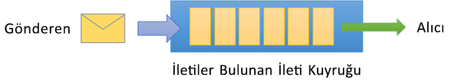
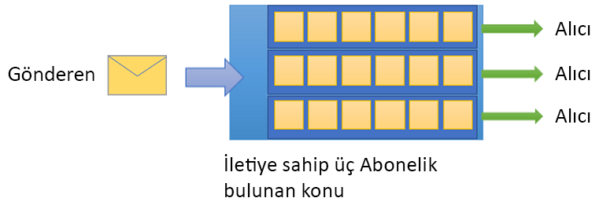

# Azure Service Bus nedir?

Microsoft Azure Service Bus, tam olarak yönetilen bir kuruluş olan [tümleştirme](https://azure.com/integration) ileti Aracısı. Service Bus, en sık olarak uygulamaları ve hizmetleri birbirinden ayırmak için kullanılır ve zaman uyumsuz veri ve durum aktarımı için güvenilir ve güvenli bir platformdur. Veriler, farklı uygulamalar ve hizmetler arasında *iletiler* kullanılarak aktarılır. JSON, XML veya yalnızca metin içerebilir, ikili biçimde bir iletidir. 

Yaygın olarak kullanılan bazı mesajlaşma senaryoları:

* Mesajlaşma: satış veya sipariş emirleri, günlük ya da envanter hareketleri gibi iş verileri aktarma.
* Uygulamaları ayırma: uygulama ve hizmetlerin güvenilirliğini ve ölçeklenebilirliğini artırma (istemci ve hizmetin aynı anda çevrimiçi olması gerekmez).
* Konu başlıkları ve abonelikler: yayımcılar ve aboneler arasında 1:*n* ilişkileri etkinleştirme.
* İleti oturumları: ileti sıralama veya ileti erteleme gerektiren iş akışlarını uygulama.

## Ad Alanları

Ad alanı, tüm mesajlaşma bileşenlerini kapsayan bir kapsayıcıdır. Tek bir ad alanında birden fazla kuyruk ve konu bulunabilir ve ad alanları genellikle uygulama kapsayıcıları olarak görev yapar.

## Kuyruklar

İletiler *kuyruklara* gönderilir ve bunlardan alınır. Kuyruklar, alacak uygulama almaya ve işlemeye uygun olana kadar iletileri depolamanızı sağlar.

Sıralarındaki iletileri sıralanır ve zaman damgalı işle. Kabul edildikten sonra ileti yedekli depolama alanında güvenli bir şekilde tutulur. İletileri teslim edilir *çekme* istek iletileri sunan modu.

## Konu başlıkları

İleti göndermek ve almak için *konu başlıklarını* da kullanabilirsiniz. Bir kuyruk genellikle noktadan noktaya iletişim için kullanılır, buna karşın konu başlıkları yayımlama/abone olma senaryolarında yararlıdır.

Konuların birden fazla ve bağımsız abonesi olabilir. Bir konu başlığının bir abonesi konu başlığına gönderilen her iletinin bir kopyasını alabilir. Abonelikler, kalıcı olarak oluşturulan ancak istenirse süresi dolabilecek veya silinebilecek adlandırılmış varlıklardır.

Bazı senaryolarda bireysel aboneliklerin bir konu başlığına gönderilen tüm iletileri almasını istemeyebilirsiniz. Böyle durumlarda, isteğe bağlı [eylemler](topic-filters.md#actions) tetikleyen, belirli iletileri filtreleyen ve ileti özelliklerini ayarlayan veya değiştiren koşullar tanımlamak için [kurallar ve filtreler](topic-filters.md) kullanabilirsiniz.

## Gelişmiş özellikler

Service Bus ayrıca daha karmaşık mesajlaşma sorunlarını çözmenizi sağlayan gelişmiş özelliklere de sahiptir. Aşağıdaki bölümlerde bu başlıca özellikler açıklanmaktadır:

### İleti oturumları

Service Bus'ta ilk giren ilk çıkar ilkesinin (FIFO) kullanılmasını garantilemek için oturumlar kullanın. [İleti oturumları](message-sessions.md), sınırsız sayıda birbiriyle ilgili iletinin birlikte ve düzenli olarak işlenmesini sağlar. 

### Otomatik iletme

[Otomatik iletme](service-bus-auto-forwarding.md) özelliği, bir kuyruk veya aboneliği aynı ad alanında olan başka bir kuyruk veya konu başlığına zincirleme eklemenize olanak tanır. Otomatik iletme etkinleştirildiğinde, Service Bus, ilk kuyruğa veya aboneliğe (kaynak) yerleştirilen iletileri otomatik olarak kaldırıp ikinci kuyruğa veya aboneliğe (hedef) yerleştirir.

### Ulaşmayan posta

Service Bus, herhangi bir alıcıya teslim edilemeyen veya işlenemeyen iletileri tutmak için bir [ulaşmayan posta kuyruğunu](service-bus-dead-letter-queues.md) (DLQ) destekler. İletileri daha sonra DLQ'dan kaldırabilir ve inceleyebilirsiniz.

### Zamanlanmış teslim

Bir kuyruğa veya konu başlığına [daha sonra işlenmek](message-sequencing.md#scheduled-messages); örneğin belirli bir işi belirli bir zamanda sistem tarafından işlenmeye uygun hale gelmesi için zamanlamak üzere ileti gönderebilirsiniz.

### İleti erteleme

Bir kuyruk veya abonelik istemcisi işlemeye hazır olduğu ancak uygulamadaki özel koşullar nedeniyle o anda işlenmesinin mümkün olmadığı bir ileti aldığında, [iletinin alınmasını (ilerideki bir zamana) erteleme](message-deferral.md) seçeneğine sahiptir. İleti sıra veya abonelikte kalır ancak bir kenara ayrılır.

### Toplu İşleme

[İstemci tarafında toplu iş](service-bus-performance-improvements.md#client-side-batching), bir kuyruk veya konu başlığı istemcisinin bir iletiyi göndermeyi belirli bir süre için ertelemesini sağlar. İstemci bu süre içinde başka iletiler gönderirse, iletileri tek bir toplu iş olarak gönderir. 

### İşlemler

Bir [hareket](service-bus-transactions.md), iki veya daha fazla işlemi tek bir yürütme kapsamında bir araya toplar. Service Bus, bir hareketin kapsamı içindeki işlemlerin (kuyruk, konu başlığı, abonelik gibi) tek bir mesajlaşma varlığına göre gruplanmasını destekler.

### Filtreleme ve eylemler

Aboneler, bir konu başlığından hangi iletileri almak istediklerini tanımlayabilir. Bu iletiler, bir veya daha fazla [adlandırılmış abonelik kuralı](topic-filters.md) biçiminde belirtilir. Eşleşen her kural koşulu için abonelik, iletinin, her eşleşme kuralı için farklı şekilde açıklama eklenebilecek bir kopyasını üretir.

### Boşta beklemede otomatik silme

[Boşta beklemede otomatik silme](/dotnet/api/microsoft.servicebus.messaging.queuedescription.autodeleteonidle), bittiğinde kuyruğun otomatik olarak silindiği bir boşta bekleme süresi belirtmenizi sağlar. En düşük süre 5 dakikadır.

### Yineleme algılama

Bir hata oluşursa, istemcinin bir gönderme işleminin sonucu hakkında herhangi bir şüpheli neden [yinelenen algılama](duplicate-detection.md) aynı iletinin ve kuyruk veya konuda yeniden göndermesini sağlayarak bu durumlar dışında şüpheli alır Yinelenen kopyalar atar.

### Azure kaynakları için SAS, RBAC ve Yönetilen kimlikler

Service Bus, [Paylaşılan Erişim İmzaları](service-bus-sas.md) (SAS), [Rol Tabanlı Erişim Denetimi](service-bus-role-based-access-control.md) (RBAC) ve [Azure kaynakları için Yönetilen kimlikler](service-bus-managed-service-identity.md) gibi güvenlik protokollerini destekler.

### Coğrafi olağanüstü durum kurtarma

Azure bölgeleri veya veri merkezleri bir kesinti yaşadığında, [Coğrafi olağanüstü durum kurtarma](service-bus-geo-dr.md) veri işlemenin başka bir bölge veya veri merkezinde devam etmesini olanaklı kılar.

### Güvenlik

Service Bus, standart [AMQP 1.0](service-bus-amqp-overview.md) ve [HTTP/REST](/rest/api/servicebus/) protokollerini destekler.

## İstemci kitaplıkları

Service Bus, [.NET](https://github.com/Azure/azure-service-bus-dotnet/tree/master), [Java](https://github.com/Azure/azure-service-bus-java/tree/master) ve [JMS](https://github.com/Azure/azure-service-bus/tree/master/samples/Java/qpid-jms-client) istemci kitaplıklarını destekler.

## Tümleştirme

Service Bus, aşağıdaki Azure hizmetleriyle tam olarak tümleşiktir:

- [Event Grid](https://azure.microsoft.com/services/event-grid/) 
- [Logic Apps](https://azure.microsoft.com/services/logic-apps/) 
- [İşlevler](https://azure.microsoft.com/services/functions/) 
- [Dynamics 365](https://dynamics.microsoft.com)
- [Akış Analizi](https://azure.microsoft.com/services/stream-analytics/)
 
## Sonraki adımlar

Service Bus mesajlaşmasını kullanmaya başlamak için aşağıdaki makalelere bakın:

* [Azure mesajlaşma hizmetlerini karşılaştırma](../event-grid/compare-messaging-services.md?toc=%2fazure%2fservice-bus-messaging%2ftoc.json&bc=%2fazure%2fservice-bus-messaging%2fbreadcrumb%2ftoc.json)
* Azure Service Bus [Standart ve Premium](https://azure.microsoft.com/pricing/details/service-bus/) katmanları ve bunların fiyatlandırması hakkında daha fazla bilgi edinin
* [Azure Service Bus Premium katmanının performansı ve gecikme süresi](https://blogs.msdn.microsoft.com/servicebus/2016/07/18/premium-messaging-how-fast-is-it/)
* [.NET](service-bus-dotnet-get-started-with-queues.md), [Java](service-bus-java-how-to-use-queues.md) ve [JMS](service-bus-java-how-to-use-jms-api-amqp.md) hızlı başlangıçlarını deneyin
