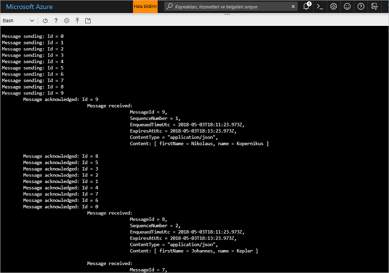

# <a name="quickstart-send-and-receive-messages-using-azure-cli-and-java"></a>Hızlı başlangıç: Azure CLI ve Java kullanarak iletileri gönderme ve alma

Microsoft Azure Service Bus, güvenli mesajlaşma ve yüksek güvenilirlik sağlayan bir kurumsal tümleştirme ileti aracısıdır. Tipik bir Service Bus senaryosu genellikle iki veya daha fazla uygulama, hizmet veya işlemi ayırmayı (uygulamaların aynı anda çevrimiçi olması gerekmez), durum veya veri değişikliklerini aktarmayı ve uygulamalar arasında ileti göndermeyi içerir. 

Örneğin, bir perakende şirketi satış noktası verilerini yenileme ve stok güncelleştirmeleri için bir arka ofise veya bölgesel dağıtım merkezine gönderebilir. Bu durumda, istemci uygulaması Service Bus kuyruğuna iletiler gönderir ve o kuyruktan ileti alır:


Bu hızlı başlangıçta, Azure CLI ve Service Bus Java kitaplığını kullanarak Service Bus ile ileti gönderme ve alma açıklanmaktadır. Son olarak, daha teknik ayrıntılarla ilgileniyorsanız örnek kodun temel öğeleriyle ilgili [bir açıklamayı okuyabilirsiniz](#understand-the-sample-code).

Azure aboneliğiniz yoksa başlamadan önce [ücretsiz bir hesap][] oluşturabilirsiniz.

[!INCLUDE [cloud-shell-try-it.md](../../includes/cloud-shell-try-it.md)]

## <a name="log-in-to-azure"></a>Azure'da oturum açma

Azure portalının sağ üst köşesindeki menüde Cloud Shell düğmesine tıklayın ve **Ortam seçin** açılır menüsünden **Bash**’i seçin. 

## <a name="use-cli-to-create-resources"></a>Kaynak oluşturmak için CLI kullanma

Cloud Shell’de, Service Bus kaynakları sağlamak için Bash komut isteminden aşağıdaki komutları verin. Tüm yer tutucuları uygun değerlerle değiştirdiğinizden emin olun:

```azurecli-interactive
# Create a resource group
az group create --name myResourceGroup --location eastus

# Create a Service Bus messaging namespace with a unique name
namespaceName=myNameSpace$RANDOM
az servicebus namespace create \
   --resource-group myResourceGroup \
   --name $namespaceName \
   --location eastus

# Create a Service Bus queue
az servicebus queue create --resource-group myResourceGroup \
   --namespace-name $namespaceName \
   --name myQueue

# Get the connection string for the namespace
connectionString=$(az servicebus namespace authorization-rule keys list \
   --resource-group myResourceGroup \
   --namespace-name  $namespaceName \
   --name RootManageSharedAccessKey \
   --query primaryConnectionString --output tsv)
```

Son komut çalıştıktan sonra, bağlantı dizesini ve seçtiğiniz kuyruk adını kopyalayıp Not Defteri gibi geçici bir yere yapıştırın. Bu sonraki adımda gerekecektir.

## <a name="send-and-receive-messages"></a>İleti alma ve gönderme

Ad alanı ve kuyruğun oluşturulmasının ve gerekli kimlik bilgilerine sahip olmanızın ardından ileti gönderip almaya hazırsınız demektir. [Bu GitHub örnek klasöründeki](https://github.com/Azure/azure-service-bus/tree/master/samples/Java/quickstarts-and-tutorials/quickstart-java/src/main/java/samples/quickstart/SendAndReceiveMessages.java) kodu inceleyebilirsiniz.

1. Cloud Shell'in açık olduğundan Bash isteminin görüntülendiğinden emin olun.

2. [Service Bus GitHub deposunu](https://github.com/Azure/azure-service-bus/) aşağıdaki komutu çalıştırarak kopyalayın:

   ```bash
   git clone https://github.com/Azure/azure-service-bus.git
   ```

2. Yol ayırıcı olarak eğik çizgi kullanarak geçerli dizininizi örnek klasöre değiştirin:

   ```bash
   cd azure-service-bus/samples/Java/quickstarts-and-tutorials/quickstart-java 
   ```

3. Uygulamayı derlemek için aşağıdaki komutu çalıştırın:
   
   ```bash
   mvn clean package -DskipTests
   ```

4. Programı çalıştırmak için aşağıdaki komutu çalıştırın. Bash kabuğunu yeniden başlatmadığınız sürece, bağlantı dizesi değerini içeren değişken otomatik olarak değiştirilir:

   ```bash
   java -jar ./target/samples.quickstart-1.0.0-jar-with-dependencies.jar -c $connectionString -q myQueue
   ```

6. Kuyruğa gönderilen 10 iletiyi inceleyin. İletilerin sıralamasının garanti edilmediğine dikkat edin. Gönderilen ve ardından kabul edilip alınan iletileri yük bilgileriyle birlikte görebilirsiniz:

   

## <a name="clean-up-resources"></a>Kaynakları temizleme

Kaynak grubunu, ad alanını ve tüm ilgili kaynakları kaldırmak için aşağıdaki komutu çalıştırın:

```azurecli-interactive
az group delete --resource-group myResourceGroup
```

## <a name="understand-the-sample-code"></a>Örnek kodu anlama

Bu bölümde, örnek kodun temel bölümleri hakkında daha fazla ayrıntı bulunmaktadır. [Burada](https://github.com/Azure/azure-service-bus/blob/master/samples/Java/quickstarts-and-tutorials/quickstart-java/src/main/java/samples/quickstart/SendAndReceiveMessages.java) GitHub deposunda bulunan koda gözatabilirsiniz.

### <a name="get-connection-string-and-queue"></a>Bağlantı dizesini ve kuyruğu alma

İlk olarak kod, komut satırında bağımsız değişken olarak geçirilen iki dize değişkeni bildirir:

```java
String ConnectionString = null;
String QueueName = null;
```

Bu değerler parametrelerle eklenir ve `runApp()` yönteminde ayrılır:

```java
public static void main(String[] args) {
    SendAndReceiveMessages app = new SendAndReceiveMessages();
    try {
        app.runApp(args);
        app.run();
    } catch (Exception e) {
        System.out.printf("%s", e.toString());
    }
    System.exit(0);
}

public void runApp(String[] args) {
    try {
        // parse connection string from command line             
        Options options = new Options();
        options.addOption(new Option("c", true, "Connection string"));
        options.addOption(new Option("q", true, "Queue Name"));
        CommandLineParser clp = new DefaultParser();
        CommandLine cl = clp.parse(options, args);
        if (cl.getOptionValue("c") != null && cl.getOptionValue("q") != null) {
            ConnectionString = cl.getOptionValue("c");
            QueueName =  cl.getOptionValue("q");
        }
        else
        {
            HelpFormatter formatter = new HelpFormatter();
            formatter.printHelp("run jar with", "", options, "", true);
        }

    } catch (Exception e) {
        System.out.printf("%s", e.toString());
    }
}
```

### <a name="create-queue-clients-to-send-and-receive"></a>Gönderme ve alma için kuyruk istemcileri oluşturma

İleti gönderip almak için, `run()` yöntemi bağlantı dizesi ve kuyruk adından oluşturulan kuyruk istemcisi örnekleri oluşturur. Bu kod, gönderme ve alma için birer kuyruk istemcisi oluşturur:

```java
public void run() throws Exception {
// Create a QueueClient instance for receiving using the connection string builder
// We set the receive mode to "PeekLock", meaning the message is delivered
// under a lock and must be acknowledged ("completed") to be removed from the queue
QueueClient receiveClient = new QueueClient(new ConnectionStringBuilder(ConnectionString, QueueName), ReceiveMode.PEEKLOCK);
this.registerReceiver(receiveClient);

// Create a QueueClient instance for sending and then asynchronously send messages.
QueueClient sendClient = new QueueClient(new ConnectionStringBuilder(ConnectionString, QueueName), ReceiveMode.PEEKLOCK);
```

`run()` yöntemi ayrıca zaman uyumsuz ileti gönderme işlemini başlatır ve gönderme işlemi tamamlandıktan sonra göndericiyi kapatır:

```java
this.sendMessagesAsync(sendClient).thenRunAsync(() -> sendClient.closeAsync());
``` 

### <a name="construct-and-send-messages"></a>İleti oluşturma ve gönderme

`sendMessagesAsync()` yöntemi 10 iletiden oluşan bir küme oluşturur ve bunları kuyruk istemcisini kullanarak zaman uyumsuz bir şekilde gönderir:

```java
CompletableFuture<Void> sendMessagesAsync(QueueClient sendClient) {
List<HashMap<String, String>> data =
        GSON.fromJson(
                "[" +
                        "{'name' = 'Einstein', 'firstName' = 'Albert'}," +
                        "{'name' = 'Heisenberg', 'firstName' = 'Werner'}," +
                        "{'name' = 'Curie', 'firstName' = 'Marie'}," +
                        "{'name' = 'Hawking', 'firstName' = 'Steven'}," +
                        "{'name' = 'Newton', 'firstName' = 'Isaac'}," +
                        "{'name' = 'Bohr', 'firstName' = 'Niels'}," +
                        "{'name' = 'Faraday', 'firstName' = 'Michael'}," +
                        "{'name' = 'Galilei', 'firstName' = 'Galileo'}," +
                        "{'name' = 'Kepler', 'firstName' = 'Johannes'}," +
                        "{'name' = 'Kopernikus', 'firstName' = 'Nikolaus'}" +
                        "]",
                new TypeToken<List<HashMap<String, String>>>() {}.getType());

List<CompletableFuture> tasks = new ArrayList<>();
for (int i = 0; i < data.size(); i++) {
    final String messageId = Integer.toString(i);
    Message message = new Message(GSON.toJson(data.get(i), Map.class).getBytes(UTF_8));
    message.setContentType("application/json");
    message.setLabel("Scientist");
    message.setMessageId(messageId);
    message.setTimeToLive(Duration.ofMinutes(2));
    System.out.printf("\nMessage sending: Id = %s", message.getMessageId());
    tasks.add(
            sendClient.sendAsync(message).thenRunAsync(() -> {
                System.out.printf("\n\tMessage acknowledged: Id = %s", message.getMessageId());
            }));
}
return CompletableFuture.allOf(tasks.toArray(new CompletableFuture<?>[tasks.size()]));
```

### <a name="receive-messages"></a>İleti alma

`registerReceiver()` yöntemi `RegisterMessageHandler` geri aramasını kaydeder ve bazı ileti işleyici seçeneklerini ayarlar:

```java
void registerReceiver(QueueClient queueClient) throws Exception {
    // register the RegisterMessageHandler callback
    queueClient.registerMessageHandler(new IMessageHandler() {
                           // callback invoked when the message handler loop has obtained a message
                           public CompletableFuture<Void> onMessageAsync(IMessage message) {
                               // receives message is passed to callback
                               if (message.getLabel() != null &&
                                       message.getContentType() != null &&
                                       message.getLabel().contentEquals("Scientist") &&
                                       message.getContentType().contentEquals("application/json")) {
                                    byte[] body = message.getBody();
                                   Map scientist = GSON.fromJson(new String(body, UTF_8), Map.class);

                                   System.out.printf(
                                           "\n\t\t\t\tMessage received: \n\t\t\t\t\t\tMessageId = %s, \n\t\t\t\t\t\tSequenceNumber = %s, \n\t\t\t\t\t\tEnqueuedTimeUtc = %s," +
                                                   "\n\t\t\t\t\t\tExpiresAtUtc = %s, \n\t\t\t\t\t\tContentType = \"%s\",  \n\t\t\t\t\t\tContent: [ firstName = %s, name = %s ]\n",
                                           message.getMessageId(),
                                           message.getSequenceNumber(),
                                           message.getEnqueuedTimeUtc(),
                                           message.getExpiresAtUtc(),
                                           message.getContentType(),
                                           scientist != null ? scientist.get("firstName") : "",
                                           scientist != null ? scientist.get("name") : "");
                               }
                               return CompletableFuture.completedFuture(null);
                           }

                           // callback invoked when the message handler has an exception to report
                           public void notifyException(Throwable throwable, ExceptionPhase exceptionPhase) {
                               System.out.printf(exceptionPhase + "-" + throwable.getMessage());
                           }
                       },
    // 1 concurrent call, messages are auto-completed, auto-renew duration
    new MessageHandlerOptions(1, true, Duration.ofMinutes(1)));

}
```

## <a name="next-steps"></a>Sonraki adımlar

Bu makalede, bir Service Bus alan adı ve bir kuyruktan ileti gönderip almak için gereken diğer kaynakları oluşturdunuz. İleti göndermek ve almak için kod yazma hakkında daha fazla bilgi edinmek için, aşağıdaki Service Bus öğreticisine geçin:

> [!div class="nextstepaction"]
> [CLI ve Java kullanarak envanteri güncelleştirme](./service-bus-tutorial-topics-subscriptions-cli.md)

[ücretsiz bir hesap]: https://azure.microsoft.com/free/?ref=microsoft.com&utm_source=microsoft.com&utm_medium=docs&utm_campaign=visualstudio
[fully qualified domain name]: https://wikipedia.org/wiki/Fully_qualified_domain_name
[Install the Azure CLI]: /cli/azure/install-azure-cli
[az group create]: /cli/azure/group#az_group_create