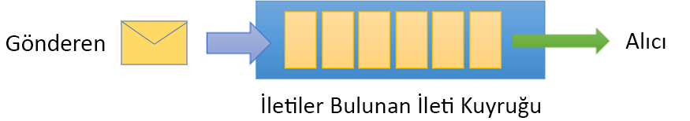
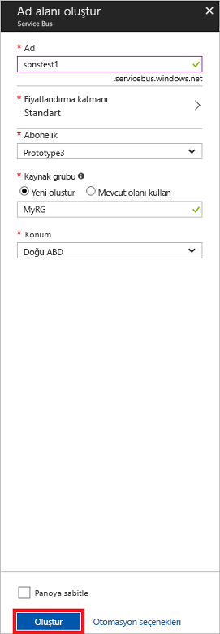

# <a name="quickstart-send-and-receive-messages-using-the-azure-portal-and-net"></a>Hızlı başlangıç: Azure portalı ve .NET kullanarak iletileri gönderme ve alma

Microsoft Azure Service Bus, güvenli mesajlaşma ve son derece yüksek güvenilirlik sağlayan bir kurumsal tümleştirme ileti aracısıdır. Tipik bir Service Bus senaryosunda çoğunlukla iki veya daha çok uygulama, hizmet veya işlem birbirinden ayrılır ve durum veya veri değişiklikleri aktarılır. Bu tür senaryolar başka bir uygulama veya hizmetlerde birden çok toplu işin zamanlanmasını veya sipariş karşılama işleminin tetiklenmesini içerebilir. Örneğin, bir perakende şirketi satış noktası verilerini yenileme ve stok güncelleştirmeleri için bir arka ofise veya bölgesel dağıtım merkezine gönderebilir. Bu senaryoda, istemci uygulaması Service Bus kuyruğuna iletiler gönderir ve o kuyruktan ileti alır.  



Bu hızlı başlangıçta, mesajlaşma ad alanı ve o ad alanı içinde bir kuyruk oluşturmak ve söz konusu ad alanında yetkilendirme kimlik bilgilerini almak için [Azure portalı][Azure portal] kullanarak bir Service Bus kuyruğuna nasıl ileti gönderileceği ve Service Bus kuyruğundan nasıl ileti alınacağı açıklanmaktadır. Daha sonra yordam, [.NET Standard kitaplığı](https://www.nuget.org/packages/Microsoft.Azure.ServiceBus) kullanılarak bu kuyruktan nasıl ileti gönderilip alınacağını gösterir.

Azure aboneliğiniz yoksa başlamadan önce [ücretsiz bir hesap][] oluşturabilirsiniz.

## <a name="prerequisites"></a>Ön koşullar

Bu öğreticiyi tamamlamak için şunları yüklediğinizden emin olun:

- [Visual Studio 2017 Güncelleştirme 3 (sürüm 15.3, 26730.01)](https://www.visualstudio.com/vs) veya sonraki sürümler.
- [NET Core SDK](https://www.microsoft.com/net/download/windows), sürüm 2.0 veya sonraki sürümler.

## <a name="log-on-to-the-azure-portal"></a>Azure portalda oturum açma

Önce [Azure portala][Azure portal] gidin ve Azure aboneliğinizi kullanarak oturum açın. İlk adım, **Mesajlaşma** türünde bir Service Bus ad alanı oluşturmaktır.

## <a name="create-a-service-bus-namespace"></a>Service Bus ad alanı oluşturma

Service Bus mesajlaşma ad alanı, [tam etki alanı adının][] başvurduğu, içinde bir veya daha fazla kuyruk, konu başlığı ve abonelik oluşturduğunuz benzersiz bir kapsam kapsayıcısı sağlar. Aşağıdaki örnekte, yeni veya var olan bir [kaynak grubunda](/azure/azure-resource-manager/resource-group-portal) bir Service Bus mesajlaşma ad alanı oluşturulur:

1. Portalın sol gezinti bölmesinde **+ Kaynak oluştur**'a tıklayın, ardından **Kurumsal Tümleştirme**'ye ve sonra **Service Bus**'a tıklayın.
2. **Ad alanı oluştur** iletişim kutusunda bir ad alanı adı girin. Adın kullanılabilirliği sistem tarafından hemen denetlenir.
3. Ad alanı adının kullanılabildiğinden emin olduktan sonra fiyatlandırma katmanını (Standart veya Premium) seçin.
4. **Abonelik** alanında, ad alanı oluşturmak için kullanmak istediğiniz bir Azure aboneliği seçin.
5. **Kaynak grubu** alanında, ad alanını barındırmak üzere var olan bir kaynak grubunu seçin veya yeni bir kaynak grubu oluşturun.      
6. **Konum** alanında, ad alanınızın barındırılması gereken ülkeyi veya bölgeyi seçin.
7. **Oluştur**’a tıklayın. Artık sistem ad alanınızı oluşturur ve kullanıma açar. Sistem, hesabınıza yönelik kaynakları sağlarken birkaç dakika beklemeniz gerekebilir.



### <a name="obtain-the-management-credentials"></a>Yönetim kimlik bilgilerini alma

Yeni bir ad alanı oluşturulduğunda, her biri ad alanının tüm yönleri üzerinde tam denetim veren ilişkili bir çift birincil ve ikincil anahtara sahip bir ilk Paylaşılan Erişim İmzası (SAS) kuralı otomatik olarak oluşturulur. İlk kuralı kopyalamak için aşağıdaki adımları takip edin: 

1.  **Tüm kaynaklar**’a ve sonra yeni oluşturulan ad alanı adına tıklayın.
2. Ad alanı penceresinde **Paylaşılan erişim ilkeleri**'ne tıklayın.
3. **Paylaşılan erişim ilkeleri** ekranında **RootManageSharedAccessKey** seçeneğine tıklayın.
4. **İlke: RootManageSharedAccessKey** penceresinde **Birincil Bağlantı Dizesi**'nin yanındaki **Kopyala** düğmesine tıklayın ve bağlantı dizesini daha sonra kullanmak üzere panonuza kopyalayın. Bu değeri Not Defteri veya başka bir geçici konuma yapıştırın. 

    ![bağlantı dizesi][connection-string]
5. **Birincil Anahtar** değerini daha sonra kullanmak üzere geçici bir konuma kopyalayarak önceki adımı tamamlayın.

## <a name="create-a-queue"></a>Bir kuyruk oluşturma

Bir Service Bus kuyruğu oluşturmak için kuyruğun altında oluşturulmasını istediğiniz ad alanını belirtin. Aşağıdaki örnekte portalda kuyruk oluşturma örneği gösterilmektedir:

1. Portalın sol tarafındaki gezinme bölmesinde **Service Bus**'a tıklayın (**Service Bus** yoksa **Diğer hizmetler**'e tıklayın).
2. Kuyruğu oluşturmak istediğiniz ad alanına tıklayın.
3. Ad alanı penceresinde **Kuyruklar**’a ve sonra **Kuyruklar** penceresinde **Kuyruk Ekle**’ye tıklayın.
4. **Kuyruk Adını** girin ve diğer değerleri varsayılan olarak bırakın.
5. Pencerenin altında yer alan **Oluştur** düğmesine tıklayın.
6. Kuyruk adını not edin.

## <a name="send-and-receive-messages"></a>İleti alma ve gönderme

Ad alanı ve kuyruğun sağlanmasının ve gerekli kimlik bilgilerine sahip olmanızın ardından ileti gönderip almaya hazırsınız demektir. [Bu GitHub örnek klasöründeki](https://github.com/Azure/azure-service-bus/tree/master/samples/Java/quickstarts-and-tutorials/quickstart-jms) kodu inceleyebilirsiniz.

Kodu çalıştırmak için aşağıdakileri yapın:

1. [Service Bus GitHub deposunu](https://github.com/Azure/azure-service-bus/) aşağıdaki komutu çalıştırarak kopyalayın:

   ```shell
   git clone https://github.com/Azure/azure-service-bus.git
   ```

3. Örnek `azure-service-bus\samples\DotNet\GettingStarted\BasicSendReceiveQuickStart\BasicSendReceiveQuickStart` klasörüne gidin.

4. [Yönetim kimlik bilgilerini alma](#obtain-the-management-credentials) bölümünde aldığınız bağlantı dizesi ve kuyruk adını kopyalayın.

5.  Komut isteminde aşağıdaki komutu yazın:

   ```shell
   dotnet build
   ```

6.  `bin\Debug\netcoreapp2.0` klasörüne gidin.

7.  Programı çalıştırmak için aşağıdaki komutu yazın. `myConnectionString` yerine daha önce aldığınız değeri ve `myQueueName` yerine oluşturduğunuz kuyruğun adını koymayı unutmayın:

   ```shell
   dotnet BasicSendReceiveQuickStart.dll -ConnectionString "myConnectionString" -QueueName "myQueueName"
   ``` 

8. Kuyruğa 10 ileti gönderildiğini ve ardından bunların kuyruktan alındığını gözlemleyin:

   

## <a name="clean-up-resources"></a>Kaynakları temizleme

Kaynak grubu, ad alanı ve kuyruğu kaldırmak için portalı kullanabilirsiniz.

## <a name="understand-the-sample-code"></a>Örnek kodu anlama

Bu bölümde örnek kodun işlevleri hakkında daha fazla ayrıntı bulunmaktadır. 

### <a name="get-connection-string-and-queue"></a>Bağlantı dizesini ve kuyruğu alma

Bağlantı dizesi ve kuyruk adı, `Main()` yöntemine komut satırı bağımsız değişkenleri olarak geçirilir. `Main()`, bu değerleri tutmak için iki dize değişkeni bildirir:

```csharp
static void Main(string[] args)
{
    string ServiceBusConnectionString = "";
    string QueueName = "";

    for (int i = 0; i < args.Length; i++)
    {
        var p = new Program();
        if (args[i] == "-ConnectionString")
        {
            Console.WriteLine($"ConnectionString: {args[i+1]}");
            ServiceBusConnectionString = args[i + 1]; 
        }
        else if(args[i] == "-QueueName")
        {
            Console.WriteLine($"QueueName: {args[i+1]}");
            QueueName = args[i + 1];
        }                
    }

    if (ServiceBusConnectionString != "" && QueueName != "")
        MainAsync(ServiceBusConnectionString, QueueName).GetAwaiter().GetResult();
    else
    {
        Console.WriteLine("Specify -Connectionstring and -QueueName to execute the example.");
        Console.ReadKey();
    }                            
}
```
 
`Main()` yöntemi daha sonra zaman uyumsuz ileti döngüsünü (`MainAsync()`) başlatır.

### <a name="message-loop"></a>İleti döngüsü

MainAsync() yöntemi, komut satırı bağımsız değişkenleri ile bir kuyruk istemcisi oluşturur, `RegisterOnMessageHandlerAndReceiveMessages()` adlı bir ileti alma işleyicisi çağırır ve ileti kümesini gönderir:

```csharp
static async Task MainAsync(string ServiceBusConnectionString, string QueueName)
{
    const int numberOfMessages = 10;
    queueClient = new QueueClient(ServiceBusConnectionString, QueueName);

    Console.WriteLine("======================================================");
    Console.WriteLine("Press any key to exit after receiving all the messages.");
    Console.WriteLine("======================================================");

    // Register QueueClient's MessageHandler and receive messages in a loop
    RegisterOnMessageHandlerAndReceiveMessages();

    // Send Messages
    await SendMessagesAsync(numberOfMessages);

    Console.ReadKey();

    await queueClient.CloseAsync();
}
```

`RegisterOnMessageHandlerAndReceiveMessages()` yöntemi, basit bir şekilde birkaç ileti işleyicisi seçeneği ayarlar, daha sonra kuyruk istemcisinin `RegisterMessageHandler()` yöntemini çağırarak alma işlemini başlatır:

```csharp
static void RegisterOnMessageHandlerAndReceiveMessages()
{
    // Configure the MessageHandler Options in terms of exception handling, number of concurrent messages to deliver etc.
    var messageHandlerOptions = new MessageHandlerOptions(ExceptionReceivedHandler)
    {
        // Maximum number of Concurrent calls to the callback `ProcessMessagesAsync`, set to 1 for simplicity.
        // Set it according to how many messages the application wants to process in parallel.
        MaxConcurrentCalls = 1,

        // Indicates whether MessagePump should automatically complete the messages after returning from User Callback.
        // False below indicates the Complete will be handled by the User Callback as in `ProcessMessagesAsync` below.
        AutoComplete = false
    };

    // Register the function that will process messages
    queueClient.RegisterMessageHandler(ProcessMessagesAsync, messageHandlerOptions);
} 
```

### <a name="send-messages"></a>İleti gönderme

İleti oluşturma ve gönderme işlemleri, `SendMessagesAsync()` yönteminde gerçekleşir:

```csharp
static async Task SendMessagesAsync(int numberOfMessagesToSend)
{
    try
    {
        for (var i = 0; i < numberOfMessagesToSend; i++)
        {
            // Create a new message to send to the queue
            string messageBody = $"Message {i}";
            var message = new Message(Encoding.UTF8.GetBytes(messageBody));

            // Write the body of the message to the console
            Console.WriteLine($"Sending message: {messageBody}");

            // Send the message to the queue
            await queueClient.SendAsync(message);
        }
    }
    catch (Exception exception)
    {
        Console.WriteLine($"{DateTime.Now} :: Exception: {exception.Message}");
    }
}
```

### <a name="process-messages"></a>İletileri işleme

`ProcessMessagesAsync()` yöntemi, iletilerin alınmasını onaylar, işler ve tamamlar:

```csharp
static async Task ProcessMessagesAsync(Message message, CancellationToken token)
{
    // Process the message
    Console.WriteLine($"Received message: SequenceNumber:{message.SystemProperties.SequenceNumber} Body:{Encoding.UTF8.GetString(message.Body)}");

    // Complete the message so that it is not received again.
    await queueClient.CompleteAsync(message.SystemProperties.LockToken);
}
```

## <a name="next-steps"></a>Sonraki adımlar

Bu makalede, bir Service Bus alan adı ve bir kuyruktan ileti gönderip almak için gereken diğer kaynakları oluşturdunuz. İleti göndermek ve almak için kod yazma hakkında daha fazla bilgi edinmek için, aşağıdaki Service Bus öğreticisine geçin:

> [!div class="nextstepaction"]
> [Azure portalını kullanarak envanteri güncelleştirme](./service-bus-tutorial-topics-subscriptions-portal.md)


[ücretsiz bir hesap]: https://azure.microsoft.com/free/?ref=microsoft.com&utm_source=microsoft.com&utm_medium=docs&utm_campaign=visualstudio
[tam etki alanı adının]: https://wikipedia.org/wiki/Fully_qualified_domain_name
[Azure portal]: https://portal.azure.com/

[connection-string]: ./media/service-bus-quickstart-portal/connection-string.png
[service-bus-flow]: ./media/service-bus-quickstart-portal/service-bus-flow.png
