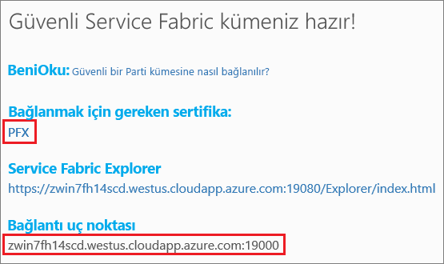

# <a name="quickstart-deploy-a-service-fabric-windows-container-application-on-azure"></a>Hızlı başlangıç: Azure’da bir Service Fabric Windows kapsayıcı uygulaması dağıtma
Azure Service Fabric; ölçeklenebilir ve güvenilir mikro hizmetleri ve kapsayıcıları dağıtmayı ve yönetmeyi sağlayan bir dağıtılmış sistemler platformudur. 

Bir Service Fabric kümesindeki Windows kapsayıcısında mevcut olan bir uygulamayı çalıştırmak için uygulamanızda herhangi bir değişiklik yapılması gerekmez. Bu hızlı başlangıç, Service Fabric uygulamasında önceden oluşturulmuş bir Docker kapsayıcısı görüntüsünü dağıtmayı gösterir. İşlemi tamamladığınızda, çalışan bir Windows Server 2016 Nano Server ve IIS kapsayıcısına sahip olacaksınız. Bu hızlı başlangıç, Windows kapsayıcısı dağıtmayı açıklar. Linux kapsayıcısı dağıtmak için [bu Hızlı Başlangıca](service-fabric-quickstart-containers-linux.md) bakın.

![IIS varsayılan web sayfası][iis-default]

Bu hızlı başlangıçta şunları yapmayı öğrenirsiniz:

* Docker görüntü kapsayıcısını paketleme
* İletişimi yapılandırma
* Service Fabric uygulamasını oluşturma ve paketleme
* Kapsayıcı uygulamasını Azure’a dağıtma

## <a name="prerequisites"></a>Ön koşullar
* Bir Azure aboneliği ([ücretsiz bir hesap](https://azure.microsoft.com/free/?WT.mc_id=A261C142F) oluşturabilirsiniz).
* Şunları çalıştıran bir geliştirme bilgisayarı:
  * Visual Studio 2015 veya Visual Studio 2017.
  * [Service Fabric SDK’sı ve araçları](service-fabric-get-started.md).

## <a name="package-a-docker-image-container-with-visual-studio"></a>Visual Studio ile Docker görüntü kapsayıcısını paketleme
Service Fabric SDK’sı ve araçları, bir kapsayıcıyı Service Fabric kümesine dağıtmanıza yardımcı olan bir hizmet şablonu sağlar.

Visual Studio'yu “Yönetici” olarak başlatın.  **Dosya** > **Yeni** > **Proje**’yi seçin.

**Service Fabric uygulaması**’nı seçin, "MyFirstContainer" olarak adlandırın ve **Tamam**’a tıklayın.

**Barındırılan Kapsayıcılar ve Uygulamalar** şablonlarından **Kapsayıcı**’yı seçin.

**Görüntü Adı** olarak "microsoft/iis:nanoserver" değerini [Windows Server Nano Server ve IIS temel görüntüsü](https://hub.docker.com/r/microsoft/iis/)'nü seçin. 

Hizmeti "MyContainerService" olarak adlandırın ve **Tamam**’a tıklayın.

## <a name="configure-communication-and-container-port-to-host-port-mapping"></a>İletişim ve kapsayıcı bağlantı noktalarıyla konak bağlantı noktalarını eşlemeyi yapılandırın
Hizmetin iletişim sağlayabilmesi için bir uç nokta gerekir.  Bu hızlı başlangıçta kapsayıcı hizmeti 80 numaralı bağlantı noktasını dinler.  Çözüm Gezgini’nde *MyFirstContainer/ApplicationPackageRoot/MyContainerServicePkg/ServiceManifest.xml* dosyasını açın.  ServiceManifest.xml dosyasındaki mevcut `Endpoint` uç noktasını güncelleştirip protokol, bağlantı noktası ve URI düzeni ekleyin: 

```xml
<Resources>
    <Endpoints>
        <Endpoint Name="MyContainerServiceTypeEndpoint" UriScheme="http" Port="80" Protocol="http"/>
   </Endpoints>
</Resources>
```
`UriScheme` değerinin sağlanması, kapsayıcı uç noktasını bulunabilirlik için Service Fabric Adlandırma hizmetine otomatik olarak kaydeder. Bu makalenin sonunda tam bir ServiceManifest.xml örnek dosyası verilmiştir. 

80 numaralı bağlantı noktasında hizmete gelen isteklerin, kapsayıcı üzerindeki 80 numaralı bağlantı noktasıyla eşlenmesi için kapsayıcının bağlantı noktasından konağa bağlantı noktası eşlenmesini yapılandırın.  Çözüm Gezgini’nde *MyFirstContainer/ApplicationPackageRoot/ApplicationManifest.xml* dosyasını açıp `ContainerHostPolicies` içinde bir `PortBinding` belirtin.  Bu Hızlı Başlangıç için `ContainerPort` 80'dir ve `EndpointRef`, "MyContainerServiceTypeEndpoint" değeridir (hizmet bildiriminde tanımlanan uç noktası).    

```xml
<ServiceManifestImport>
...
  <ConfigOverrides />
  <Policies>
    <ContainerHostPolicies CodePackageRef="Code">
      <PortBinding ContainerPort="80" EndpointRef="MyContainerServiceTypeEndpoint"/>
    </ContainerHostPolicies>
  </Policies>
</ServiceManifestImport>
```

Bu makalenin sonunda tam bir ApplicationManifest.xml örnek dosyası verilmiştir.

## <a name="create-a-cluster"></a>Küme oluşturma
Uygulamayı Azure’daki bir kümeye dağıtmak için bir grup kümesine katılabilirsiniz. Grup kümeleri, Azure üzerinde barındırılan ve Service Fabric ekibi tarafından sunulan ücretsiz, sınırlı süreli Service Fabric kümeleridir. Bu kümelerde herkes uygulama dağıtabilir ve platform hakkında bilgi edinebilir.  Küme, düğümden düğüme ve istemciden düğüme güvenlik için tek bir otomatik olarak imzalanan sertifika kullanır. Grup kümeleri, kapsayıcıları destekler. Kendi kümenizi ayarlamaya ve kullanmaya karar verirseniz küme, kapsayıcıları destekleyen bir SKU’da (örn. Kapsayıcılar’ı içeren Windows Server 2016 Datacenter) çalışıyor olmalıdır.

Oturum açın ve [bir Windows kümesine katılın](http://aka.ms/tryservicefabric). **PFX** bağlantısına tıklayarak PFX sertifikasını bilgisayarınıza indirin. **Güvenli Grup kümesine bağlanma** bağlantısına tıklayın ve sertifika parolasını kopyalayın. Aşağıdaki adımlarda sertifika, sertifika parolası ve **Bağlantı uç noktası** değeri kullanılır.



> [!Note]
> Saat başına sınırlı sayıda Grup kümesi vardır. Bir Grup kümesine kaydolmaya çalıştığınızda hata alırsanız bir süre bekleyebilir ve tekrar deneyebilirsiniz veya [.NET uygulaması dağıtma](https://docs.microsoft.com/azure/service-fabric/service-fabric-tutorial-deploy-app-to-party-cluster#deploy-the-sample-application) öğreticisindeki adımları izleyerek Azure aboneliğinizde bir Service Fabric kümesi oluşturabilir ve bu kümede uygulamayı dağıtabilirsiniz. Visual Studio aracılığıyla oluşturulan küme, kapsayıcıları destekler. Kümenizde uygulamayı dağıtıp doğruladıktan sonra, bu hızlı başlangıçtaki [Örnek Service Fabric uygulama ve hizmet bildirimlerini tamamlama](#complete-example-service-fabric-application-and-service-manifests) kısmına atlayabilirsiniz. 
>

Bir Windows bilgisayarda PFX’i *CurrentUser\My* sertifika deposuna yükleyin.

```powershell
PS C:\mycertificates> Import-PfxCertificate -FilePath .\party-cluster-873689604-client-cert.pfx -CertStoreLocation Cert:\CurrentUser\My -Password (ConvertTo-SecureString 873689604 -AsPlainText -Force)


  PSParentPath: Microsoft.PowerShell.Security\Certificate::CurrentUser\My

Thumbprint                                Subject
----------                                -------
3B138D84C077C292579BA35E4410634E164075CD  CN=zwin7fh14scd.westus.cloudapp.azure.com
```

Sonraki adım için parmak izini unutmayın.  

## <a name="deploy-the-application-to-azure-using-visual-studio"></a>Visual Studio kullanarak uygulamayı Azure’a dağıtma
Uygulama hazır olduğuna göre, doğrudan Visual Studio'dan bir kümeye dağıtabilirsiniz.

Çözüm Gezgini'nde **MyFirstContainer**’a sağ tıklayın ve **Yayımla**’yı seçin. Yayımla iletişim kutusu görüntülenir.

Grup kümesi sayfasındaki **Bağlantı Uç Noktası**'nı **Bağlantı Uç Noktası** alanına kopyalayın. Örneğin, `zwin7fh14scd.westus.cloudapp.azure.com:19000`. **Gelişmiş Bağlantı Parametrelerine** tıklayıp bağlantı parametresi bilgilerini doğrulayın.  *FindValue* ve *ServerCertThumbprint* değerleri önceki adımda yüklenen sertifikanın parmak iziyle eşleşmelidir. 


**Yayımla**’ta tıklayın.

Kümedeki her uygulamanın benzersiz bir adı olmalıdır.  Bununla birlikte grup kümeleri ortak, paylaşılan bir ortamdır ve mevcut uygulamalardan biriyle çakışma olabilir.  Ad çakışması varsa, Visual Studio projesini yeniden adlandırın ve bir kez daha dağıtın.

Bir tarayıcıyı açıp Grup kümesi sayfasında belirtilen **Bağlantı uç noktasına** gidin. İsteğe bağlı olarak, URL’nin başına düzen tanımlayıcısını (`http://`) ve sonuna bağlantı noktasını (`:80`) ekleyebilirsiniz. Örneğin, http://zwin7fh14scd.westus.cloudapp.azure.com:80. IIS varsayılan web sayfasını görmeniz gerekir: ![IIS varsayılan web sayfası][iis-default]

## <a name="complete-example-service-fabric-application-and-service-manifests"></a>Tam Service Fabric uygulaması ve hizmet bildirimleri örneği
Bu hızlı başlangıçta kullanılan tam hizmet ve uygulama bildirimleri aşağıda verilmiştir.

### <a name="servicemanifestxml"></a>ServiceManifest.xml
```xml
<?xml version="1.0" encoding="utf-8"?>
<ServiceManifest Name="MyContainerServicePkg"
                 Version="1.0.0"
                 xmlns="http://schemas.microsoft.com/2011/01/fabric"
                 xmlns:xsd="http://www.w3.org/2001/XMLSchema"
                 xmlns:xsi="http://www.w3.org/2001/XMLSchema-instance">
  <ServiceTypes>
    <!-- This is the name of your ServiceType.
         The UseImplicitHost attribute indicates this is a guest service. -->
    <StatelessServiceType ServiceTypeName="MyContainerServiceType" UseImplicitHost="true" />
  </ServiceTypes>

  <!-- Code package is your service executable. -->
  <CodePackage Name="Code" Version="1.0.0">
    <EntryPoint>
      <!-- Follow this link for more information about deploying Windows containers to Service Fabric: https://aka.ms/sfguestcontainers -->
      <ContainerHost>
        <ImageName>microsoft/iis:nanoserver</ImageName>
      </ContainerHost>
    </EntryPoint>
    <!-- Pass environment variables to your container: -->
    <!--
    <EnvironmentVariables>
      <EnvironmentVariable Name="VariableName" Value="VariableValue"/>
    </EnvironmentVariables>
    -->
  </CodePackage>

  <!-- Config package is the contents of the Config directoy under PackageRoot that contains an 
       independently-updateable and versioned set of custom configuration settings for your service. -->
  <ConfigPackage Name="Config" Version="1.0.0" />

  <Resources>
    <Endpoints>
      <!-- This endpoint is used by the communication listener to obtain the port on which to 
           listen. Please note that if your service is partitioned, this port is shared with 
           replicas of different partitions that are placed in your code. -->
      <Endpoint Name="MyContainerServiceTypeEndpoint" UriScheme="http" Port="80" Protocol="http"/>
    </Endpoints>
  </Resources>
</ServiceManifest>
```
### <a name="applicationmanifestxml"></a>ApplicationManifest.xml
```xml
<?xml version="1.0" encoding="utf-8"?>
<ApplicationManifest ApplicationTypeName="MyFirstContainerType"
                     ApplicationTypeVersion="1.0.0"
                     xmlns="http://schemas.microsoft.com/2011/01/fabric"
                     xmlns:xsd="http://www.w3.org/2001/XMLSchema"
                     xmlns:xsi="http://www.w3.org/2001/XMLSchema-instance">
  <Parameters>
    <Parameter Name="MyContainerService_InstanceCount" DefaultValue="-1" />
  </Parameters>
  <!-- Import the ServiceManifest from the ServicePackage. The ServiceManifestName and ServiceManifestVersion 
       should match the Name and Version attributes of the ServiceManifest element defined in the 
       ServiceManifest.xml file. -->
  <ServiceManifestImport>
    <ServiceManifestRef ServiceManifestName="MyContainerServicePkg" ServiceManifestVersion="1.0.0" />
    <ConfigOverrides />
    <Policies>
      <ContainerHostPolicies CodePackageRef="Code">
        <PortBinding ContainerPort="80" EndpointRef="MyContainerServiceTypeEndpoint"/>
      </ContainerHostPolicies>
    </Policies>
  </ServiceManifestImport>
  <DefaultServices>
    <!-- The section below creates instances of service types, when an instance of this 
         application type is created. You can also create one or more instances of service type using the 
         ServiceFabric PowerShell module.
         
         The attribute ServiceTypeName below must match the name defined in the imported ServiceManifest.xml file. -->
    <Service Name="MyContainerService" ServicePackageActivationMode="ExclusiveProcess">
      <StatelessService ServiceTypeName="MyContainerServiceType" InstanceCount="[MyContainerService_InstanceCount]">
        <SingletonPartition />
      </StatelessService>
    </Service>
  </DefaultServices>
</ApplicationManifest>
```

## <a name="next-steps"></a>Sonraki adımlar
Bu hızlı başlangıçta şunları öğrendiniz:

* Docker görüntü kapsayıcısını paketleme
* İletişimi yapılandırma
* Service Fabric uygulamasını oluşturma ve paketleme
* Kapsayıcı uygulamasını Azure’a dağıtma

Service Fabric’te Windows kapsayıcılarıyla çalışma hakkında daha fazla bilgi için Windows kapsayıcı uygulamaları öğreticisiyle devam edin.

> [!div class="nextstepaction"]
> [Windows kapsayıcı uygulaması oluşturma](./service-fabric-host-app-in-a-container.md)

[iis-default]: ./media/service-fabric-quickstart-containers/iis-default.png
[publish-dialog]: ./media/service-fabric-quickstart-containers/publish-dialog.png
