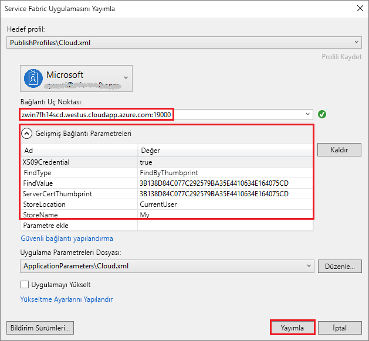

# <a name="quickstart-deploy-windows-containers-to-service-fabric"></a>Hızlı Başlangıç: Windows kapsayıcıları Service Fabric'e dağıtma

Azure Service Fabric; ölçeklenebilir ve güvenilir mikro hizmetleri ve kapsayıcıları dağıtmayı ve yönetmeyi sağlayan bir dağıtılmış sistemler platformudur.

Bir Service Fabric kümesindeki Windows kapsayıcısında mevcut olan bir uygulamayı çalıştırmak için uygulamanızda herhangi bir değişiklik yapılması gerekmez. Bu hızlı başlangıç, Service Fabric uygulamasında önceden oluşturulmuş bir Docker kapsayıcısı görüntüsünü dağıtmayı gösterir. İşlemi tamamladığınızda, çalışan bir Windows Server Core 2016 Server ve IIS kapsayıcısına sahip olacaksınız. Bu hızlı başlangıç, Windows kapsayıcısı dağıtmayı açıklar. Linux kapsayıcısı dağıtmak için [bu Hızlı Başlangıca](service-fabric-quickstart-containers-linux.md) bakın.

![IIS varsayılan web sayfası][iis-default]

Bu hızlı başlangıçta şunları yapmayı öğrenirsiniz:

* Docker görüntü kapsayıcısını paketleme
* İletişimi yapılandırma
* Service Fabric uygulamasını oluşturma ve paketleme
* Kapsayıcı uygulamasını Azure’a dağıtma


[!INCLUDE [updated-for-az](../../includes/updated-for-az.md)]

## <a name="prerequisites"></a>Önkoşullar

* Bir Azure aboneliği ([ücretsiz bir hesap](https://azure.microsoft.com/free/?WT.mc_id=A261C142F) oluşturabilirsiniz).
* Şunları çalıştıran bir geliştirme bilgisayarı:
  * Visual Studio 2015 veya Visual Studio 2017.
  * [Service Fabric SDK’sı ve araçları](service-fabric-get-started.md).

## <a name="package-a-docker-image-container-with-visual-studio"></a>Visual Studio ile Docker görüntü kapsayıcısını paketleme

Service Fabric SDK’sı ve araçları, bir kapsayıcıyı Service Fabric kümesine dağıtmanıza yardımcı olan bir hizmet şablonu sağlar.

Visual Studio'yu “Yönetici” olarak başlatın.  **Dosya** > **Yeni** > **Proje**’yi seçin.

**Service Fabric uygulaması**’nı seçin, "MyFirstContainer" olarak adlandırın ve **Tamam**’a tıklayın.

**Barındırılan Kapsayıcılar ve Uygulamalar** şablonlarından **Kapsayıcı**’yı seçin.

İçinde **görüntü adı**, "mcr.microsoft.com/windows/servercore/iis:windowservercore-ltsc2016" girin [Windows Sunucu Çekirdeği sunucusuna ve IIS temel görüntüsü](https://hub.docker.com/r/microsoft-windows-servercore-iis).

80 numaralı bağlantı noktasında hizmete gelen isteklerin, kapsayıcı üzerindeki 80 numaralı bağlantı noktasıyla eşlenmesi için kapsayıcının bağlantı noktasından konağa bağlantı noktası eşlenmesini yapılandırın.  **Kapsayıcı Bağlantı Noktası**’nı "80" olarak ve **Ana Bilgisayar Bağlantı Noktası**’nı "80" olarak ayarlayın.  

Hizmeti "MyContainerService" olarak adlandırın ve **Tamam**’a tıklayın.

![Yeni hizmet iletişim kutusu][new-service]

## <a name="specify-the-os-build-for-your-container-image"></a>Kapsayıcı görüntünüz için OS derlemesini belirtme

Windows Server'ın belirli bir sürümüyle derlenen kapsayıcılar, Windows Server'ın farklı sürümünü çalıştıran bir konakta çalışmayabilir. Örneğin, Windows Server sürüm 1709 kullanarak derlenen kapsayıcılar Windows Server 2016 çalıştıran konaklarda çalışmaz. Daha fazla bilgi için bkz. [Windows Server kapsayıcı işletim sistemi ve ana bilgisayar işletim sistemi uyumluluğu](service-fabric-get-started-containers.md#windows-server-container-os-and-host-os-compatibility). 

Service Fabric çalışma zamanının sürüm 6.1 veya daha yeni bir sürümüyle, kapsayıcı başına birden çok işletim sistemi görüntüsü belirtebilir ve her birini dağıtılacağı işletim sisteminin derleme sürümüyle etiketleyebilirsiniz. Bu, uygulamanızın Windows işletim sisteminin farklı sürümlerini çalıştıran konaklar arasında çalıştırılabilmesine yardımcı olur. Daha fazla bilgi edinmek için bkz. [İşletim sistemi derlemesine özgü kapsayıcı görüntüleri belirtme](service-fabric-get-started-containers.md#specify-os-build-specific-container-images). 

Microsoft, Windows Server'ın farklı sürümleri üzerinde oluşturulmuş IIS sürümleri için farklı görüntüler yayımlar. Service Fabric'in, uygulamanızın dağıtıldığı küme düğümlerinde çalıştırılan Windows Server sürümüyle uyumlu bir kapsayıcı dağıttığından emin olmak için, *ApplicationManifest.xml* dosyasına aşağıdaki satırları ekleyin. WIndows Server 2016 için derleme sürümü 14393, Windows Server 1709 sürümü için derleme sürümü 16299’dur.

```xml
    <ContainerHostPolicies CodePackageRef="Code"> 
      <ImageOverrides> 
        ...
          <Image Name="mcr.microsoft.com/windows/servercore/iis:windowservercore-1803" /> 
          <Image Name= "mcr.microsoft.com/windows/servercore/iis:windowservercore-ltsc2016" Os="14393" /> 
          <Image Name="mcr.microsoft.com/windows/servercore/iis:windowservercore-1709" Os="16299" /> 
      </ImageOverrides> 
    </ContainerHostPolicies> 
```

Hizmet bildirimi, `mcr.microsoft.com/windows/servercore/iis:windowservercore-ltsc2016` nano sunucusu için tek bir görüntü belirtmeye devam eder.

Ayrıca *ApplicationManifest.xml* dosya, değişiklik **PasswordEncrypted** için **false**. Hesabı ve parolası boş bir parola şifreleme, bir derleme hatasına neden olur çünkü biz şifreleme'yi etkinleştirmek için Docker Hub'ında ortak kapsayıcı görüntüsü için boştur.

```xml
<RepositoryCredentials AccountName="" Password="" PasswordEncrypted="false" />
```

## <a name="create-a-cluster"></a>Küme oluşturma

Aşağıdaki örnek betik bir X.509 sertifikasıyla sağlanan beş düğümlü bir Service Fabric kümesi oluşturur. Bu komut otomatik olarak imzalanan bir sertifika oluşturur ve bunu yeni bir anahtar kasasına yükler. Sertifika aynı zamanda bir yerel dizine de kopyalanır. Bu komut dosyasını kullanarak küme oluşturma hakkında daha fazla bilgi [bir Service Fabric kümesi oluşturma](scripts/service-fabric-powershell-create-secure-cluster-cert.md).

Gerekli olursa, bulunan yönergeleri kullanarak Azure PowerShell'i yükleme [Azure PowerShell kılavuzunda](/powershell/azure/overview).

Çalıştırma PowerShell'de aşağıdaki betiği çalıştırmadan önce `Connect-AzAccount` Azure ile bir bağlantı oluşturmak için.

Açık ve Pano için aşağıdaki betiği kopyalayın **Windows PowerShell ISE**.  İçeriği boş Untitled1.ps1 penceresine yapıştırın. Betikteki değişkenlerin değerleri sağlayın: `subscriptionId`, `certpwd`, `certfolder`, `adminuser`, `adminpwd`vb.  Belirttiğiniz için dizin `certfolder` betiği çalıştırmadan önce mevcut olması gerekir.

[!code-powershell[main](../../powershell_scripts/service-fabric/create-secure-cluster/create-secure-cluster.ps1 "Create a Service Fabric cluster")]

Değişkenleri değerlerinizi sağladıktan sonra basın **F5** betiği çalıştırmak için.

Komut dosyasını çalıştırır ve Küme oluşturulduktan sonra bulma `ClusterEndpoint` çıktı. Örneğin:

```powershell
...
ClusterEndpoint : https://southcentralus.servicefabric.azure.com/runtime/clusters/b76e757d-0b97-4037-a184-9046a7c818c0
```

### <a name="install-the-certificate-for-the-cluster"></a>Küme için sertifika yükleme

PFX'e yüklenir artık *CurrentUser\My* sertifika deposu. PFX dosyasını kullanarak belirttiğiniz dizindeki olacaktır `certfolder` PowerShell komut dosyası yukarıdaki ortam değişkeninde.

Bu dizine değiştirin ve ardından yer PFX dosyasının adını değiştirerek aşağıdaki PowerShell komutu çalıştırın, `certfolder` dizin ve belirttiğiniz parolayı `certpwd` değişkeni. Bu örnekte, geçerli dizin tarafından belirtilen dizin ayarlanır `certfolder` PowerShell betik değişken. Buradan `Import-PfxCertificate` komutu çalıştırın:

```powershell
PS C:\mycertificates> Import-PfxCertificate -FilePath .\mysfclustergroup20190130193456.pfx -CertStoreLocation Cert:\CurrentUser\My -Password (ConvertTo-SecureString Password#1234 -AsPlainText -Force)
```

Komut, parmak izini döndürür:

```powershell
  ...
  PSParentPath: Microsoft.PowerShell.Security\Certificate::CurrentUser\My

Thumbprint                                Subject
----------                                -------
0AC30A2FA770BEF566226CFCF75A6515D73FC686  CN=mysfcluster.SouthCentralUS.cloudapp.azure.com
```

Sonraki adım için parmak izi değerini unutmayın.

## <a name="deploy-the-application-to-azure-using-visual-studio"></a>Visual Studio kullanarak uygulamayı Azure’a dağıtma

Uygulama hazır olduğuna göre, doğrudan Visual Studio'dan bir kümeye dağıtabilirsiniz.

Çözüm Gezgini'nde **MyFirstContainer**’a sağ tıklayın ve **Yayımla**’yı seçin. Yayımla iletişim kutusu görüntülenir.

Aşağıdaki içeriği kopyalayın **CN =** çalıştırdığınızda PowerShell penceresinde `Import-PfxCertificate` yukarıda komutunu ve bağlantı noktası Ekle `19000` ona. Örneğin, `mysfcluster.SouthCentralUS.cloudapp.azure.com:19000`. İçine kopyalayın **bağlantı uç noktası** alan. Gelecekteki bir adımda ihtiyacınız olacağı için bu değer unutmayın.

**Gelişmiş Bağlantı Parametrelerine** tıklayıp bağlantı parametresi bilgilerini doğrulayın.  *FindValue* ve *ServerCertThumbprint* değerleri çalıştırdığınızda yüklenen sertifikanın parmak izini eşleşmelidir `Import-PfxCertificate` önceki adımda.



Tıklayın **yayımlama**.

Kümedeki her uygulamanın benzersiz bir adı olmalıdır. Ad çakışması varsa, Visual Studio projesini yeniden adlandırın ve bir kez daha dağıtın.

Bir tarayıcı açın ve içine yerleştirdiğiniz adresine gidin **bağlantı uç noktası** önceki adımda alan. İsteğe bağlı olarak, URL’nin başına düzen tanımlayıcısını (`http://`) ve sonuna bağlantı noktasını (`:80`) ekleyebilirsiniz. Örneğin, http:\//mysfcluster.SouthCentralUS.cloudapp.azure.com:80.

 IIS varsayılan web sayfasını görmeniz gerekir: ![IIS varsayılan web sayfası][iis-default]

## <a name="clean-up"></a>Temizleme

Küme çalışırken ücreti alınmaya devam edilir. Göz önünde bulundurun [kümenizi silmeyi](service-fabric-cluster-delete.md).

## <a name="next-steps"></a>Sonraki adımlar

Bu hızlı başlangıçta şunları öğrendiniz:

* Docker görüntü kapsayıcısını paketleme
* İletişimi yapılandırma
* Service Fabric uygulamasını oluşturma ve paketleme
* Kapsayıcı uygulamasını Azure’a dağıtma

Service Fabric’te Windows kapsayıcılarıyla çalışma hakkında daha fazla bilgi için Windows kapsayıcı uygulamaları öğreticisiyle devam edin.

> [!div class="nextstepaction"]
> [Windows kapsayıcı uygulaması oluşturma](./service-fabric-host-app-in-a-container.md)

[iis-default]: ./media/service-fabric-quickstart-containers/iis-default.png
[publish-dialog]: ./media/service-fabric-quickstart-containers/publish-dialog.png
[new-service]: ./media/service-fabric-quickstart-containers/NewService.png
