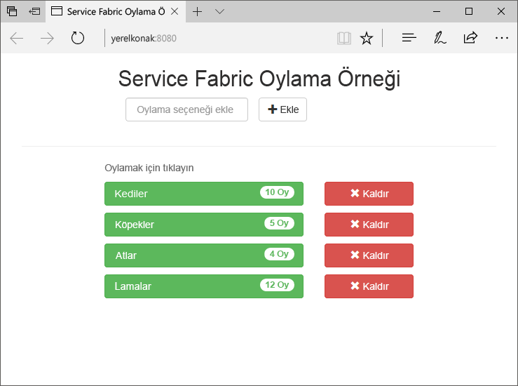
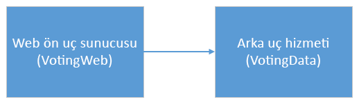
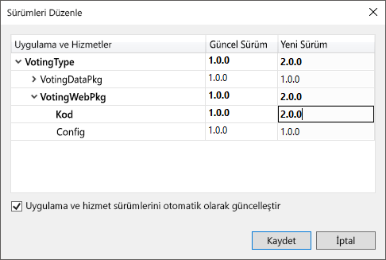
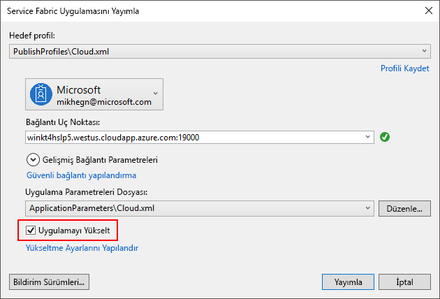
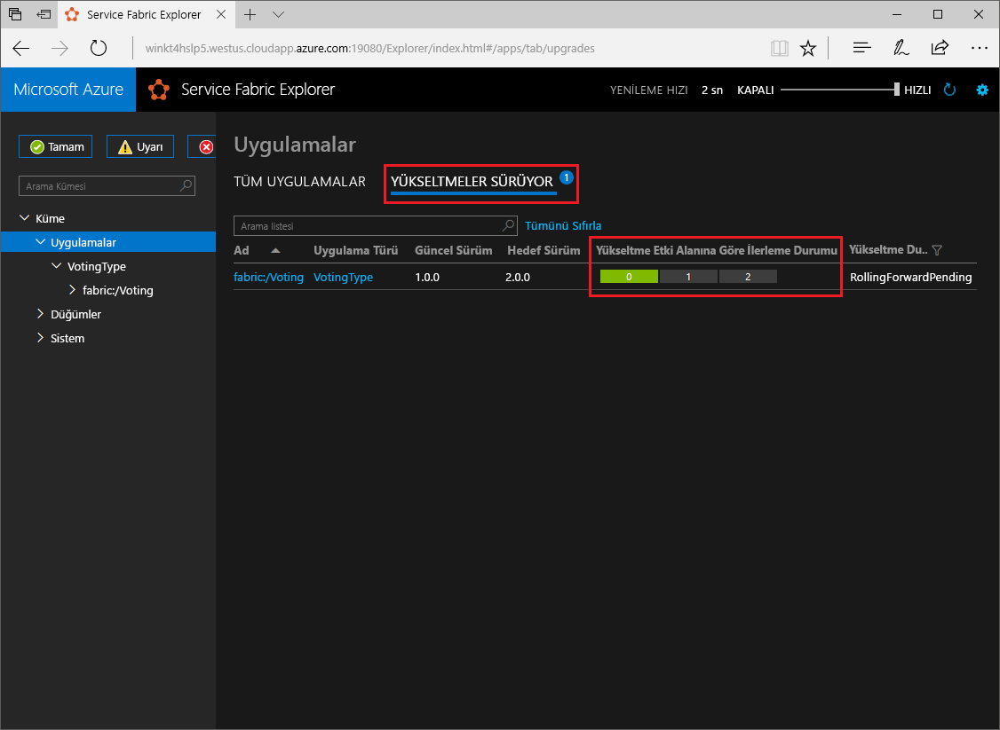

# <a name="quickstart-deploy-a-net-reliable-services-application-to-service-fabric"></a>Hızlı Başlangıç: Service Fabric için .NET reliable services uygulaması dağıtma

Azure Service Fabric; ölçeklenebilir ve güvenilir mikro hizmetleri ve kapsayıcıları dağıtmayı ve yönetmeyi sağlayan bir dağıtılmış sistemler platformudur.

Bu hızlı başlangıçta ilk .NET uygulamanızın Service Fabric'e nasıl dağıtılacağı gösterilir. Bitirdiğinizde, oylama sonuçlarını kümedeki durum bilgisi içeren arka uç hizmetine kaydeden bir ASP.NET Core web ön ucuna sahip oylama uygulaması sağlanır.



Bu uygulamayı kullanarak şunları yapmayı öğrenirsiniz:

* .NET ve Service Fabric kullanarak uygulama oluşturma
* ASP.NET Core'u web ön ucu olarak kullanma
* Uygulama verilerini durum bilgisi içeren bir hizmette depolama
* Uygulamanızda yerel olarak hata ayıklama
* Birden çok düğüm arasında uygulamanın ölçeğini genişletme
* Toplu uygulama yükseltmesi yapma

## <a name="prerequisites"></a>Önkoşullar

Bu hızlı başlangıcı tamamlamak için:

1. [Azure geliştirme](https://www.visualstudio.com/) ve **ASP.NET ve Web geliştirme** iş yükleriyle **Visual Studio 2017’yi yükleyin**.
2. [Git'i yükleyin](https://git-scm.com/)
3. [Microsoft Azure Service Fabric SDK'sını yükleyin](https://www.microsoft.com/web/handlers/webpi.ashx?command=getinstallerredirect&appid=MicrosoftAzure-ServiceFabric-CoreSDK)
4. Visual Studio'nun yerel Service Fabric kümesine dağıtım yapmasını sağlamak için aşağıdaki komutu çalıştırın:

   ```powershell
   Set-ExecutionPolicy -ExecutionPolicy Unrestricted -Force -Scope CurrentUser
   ```
    
## <a name="build-a-cluster"></a>Küme oluşturma

Artık çalışma zamanı, SDK, Visual Studio Araçları, Docker'ı yükleme ve Docker çalışmasını sonra beş düğümlü yerel geliştirme kümesi oluşturun.

> [!Note]
> Böylece kapsayıcı özellikleri etkin küme oluşturulduktan kümeyi oluşturduğunuzda, Docker çalışan nedenidir. Docker çalışmıyorsa, kapsayıcı özellikleri etkinleştirmek için bir küme oluşturmanız gerekir.
> Gereksiz olsa da bu belirli hızlı başlangıç için kümeyi oluşturduğunuzda, Docker çalışan yönergesi en iyi uygulama dahil edilir.
> Terminal penceresi açarak ve hata oluşup oluşmadığını görmek için `docker ps` komutunu çalıştırarak Docker'ı çalışmasını test edin. Yanıt bir hata göstermiyorsa, Docker çalışıyor ve siz de küme oluşturmaya hazırsınız demektir.

1. Yönetici olarak yeni, yükseltilmiş bir PowerShell penceresi açın.
2. Aşağıdaki PowerShell komutunu çalıştırarak geliştirme kümesini oluşturun:

   ```powershell
   . "C:\Program Files\Microsoft SDKs\Service Fabric\ClusterSetup\DevClusterSetup.ps1"
   ```
3. Yerel Küme Yöneticisi aracını başlatmak için aşağıdaki komutu çalıştırın:

   ```powershell
   . "C:\Program Files\Microsoft SDKs\Service Fabric\Tools\ServiceFabricLocalClusterManager\ServiceFabricLocalClusterManager.exe"
   ```

>[!NOTE]
> Bu hızlı başlangıçtaki örnek uygulama, Windows 7'de mevcut olmayan özellikleri kullanır.
>

## <a name="download-the-sample"></a>Örneği indirme

Komut penceresinde, örnek uygulama deposunu yerel makinenize kopyalamak için aşağıdaki komutu çalıştırın.

```git
git clone https://github.com/Azure-Samples/service-fabric-dotnet-quickstart
```

## <a name="run-the-application-locally"></a>Uygulamayı yerel olarak çalıştırma

Başlat Menüsünde Visual Studio'ya sağ tıklayın ve **Yönetici olarak çalıştır**'ı seçin. Hizmetlerinize hata ayıklayıcıyı eklemek için Visual Studio'yu yönetici olarak çalıştırmalısınız.

Kopyaladığınız depodan **Voting.sln** Visual Studio çözümünü açın.

Varsayılan olarak, oylama uygulaması 8080 bağlantı noktasında dinler.  Uygulama bağlantı noktası */VotingWeb/PackageRoot/ServiceManifest.xml* dosyasında ayarlanır.  **Endpoint** öğesinin **Port** özniteliğini güncelleştirerek uygulama bağlantı noktasını değiştirebilirsiniz.  Uygulamayı yerel olarak dağıtmak ve çalıştırmak için, uygulama bağlantı noktasının bilgisayarınızda açık ve kullanılabilir olması gerekir.  Uygulama bağlantı noktasını değiştirirseniz, bu makalenin tamamında "8080" değerinin yerine yeni uygulama bağlantı noktası değerini koyun.

Uygulamayı dağıtmak için **F5** tuşuna basın.

> [!NOTE]
> Visual Studio çıktı penceresinde, "Uygulama URL'si ayarlanmadı veya tarayıcı uygulamaya açılmayacak için bir HTTP/HTTPS URL'si değil." iletisini görür  Bu ileti bir hataya işaret etmez ama tarayıcının otomatik olarak başlatılmayacağını belirtir.

Dağıtım tamamlandığında, tarayıcıyı başlatın ve açık `http://localhost:8080` uygulamasının web ön ucu görüntülemek için.


Şimdi bir dizi oylama seçeneği ekleyebilir ve oyları almaya başlayabilirsiniz. Uygulama çalıştırılır ve ayrı bir veritabanına gerek kalmadan tüm verileri Service Fabric kümenizde depolar.

## <a name="walk-through-the-voting-sample-application"></a>Oylama örnek uygulamasında izlenecek yol

Oylama uygulaması iki hizmetten oluşur:

* Web ön uç hizmeti (VotingWeb)- Web sayfasına hizmet veren ve arka uç hizmetiyle iletişim için web API'lerini kullanıma sunan bir ASP.NET Core web ön uç hizmeti.
* Arka uç hizmeti (VotingData)- Oy sonuçlarını diskte kalıcı olan güvenilir bir sözlükte depolamak için API'yi kullanıma sunan bir ASP.NET Core web hizmeti.



Uygulamada oy kullandığınızda aşağıdaki olaylar gerçekleşir:

1. Oy isteğini bir JavaScript HTTP PUT isteği olarak web ön uç hizmetindeki web API'sine gönderir.

2. Web ön uç hizmeti bir ara sunucu kullanarak HTTP PUT isteğini bulur ve arka uç hizmetine iletir.

3. Arka uç hizmeti gelen isteği alır ve güncelleştirilmiş sonucu güvenilir bir sözlükte depolar. Bu sözlük küme içinde birden çok düğüme çoğaltılır ve diskte kalıcı olur. Uygulamanın tüm verileri kümede depolandığından, veritabanına gerek yoktur.

## <a name="debug-in-visual-studio"></a>Visual Studio'da hata ayıklama

Uygulama düzgün şekilde çalışmalıdır, ancak uygulamanın temel parçalarının nasıl çalıştığını görmek için hata ayıklayıcıyı kullanabilirsiniz. Visual Studio'da uygulamada hata ayıklaması yaparken yerel bir Service Fabric geliştirme kümesi kullanırsınız. Hata ayıklama deneyiminizi senaryonuza göre ayarlama seçeneğiniz vardır. Bu uygulamada, verileri güvenilir bir sözlük kullanılarak arka uç hizmetinde depolanır. Hata ayıklayıcıyı durdurduğunuzda Visual Studio varsayılan olarak uygulamayı kaldırır. Uygulamanın kaldırılması arka uç hizmetindeki verilerin de kaldırılmasına neden olur. Hata ayıklama oturumları arasında verilerin kalıcı olmasını sağlamak için, Visual Studio'da **Oylama** projesindeki bir özellik olarak **Uygulama Hata Ayıklama Modu**'nu değiştirebilirsiniz.

Kodda neler olduğuna bakmak için aşağıdaki adımları tamamlayın:

1. **/VotingWeb/Controllers/VotesController.cs** dosyasını açın ve web API'sinin **Put** yönteminde (69. satır) bir kesme noktası ayarlayın. Dosyayı Visual Studio'daki Çözüm Gezgini'nde arayıp bulabilirsiniz.

2. **/VotingData/Controllers/VoteDataController.cs** dosyasını açın ve bu web API'sinin **Put** yönteminde (54. satır) bir kesme noktası ayarlayın.

3. Tarayıcıya dönün ve bir oylama seçeneğine tıklayın veya yeni oylama seçeneği ekleyin. Web ön ucunun api denetleyicisinde ilk kesme noktasına ulaşırsınız.
   * Burası, tarayıcıda JavaScript'in ön uç hizmetindeki API denetleyicisine istek gönderdiği yerdir.

     

   * İlk olarak, arka uç hizmetimiz için ReverseProxy'nin URL'sini oluşturun **(1)**.
   * Ardından, HTTP PUT İsteğini ReverseProxy'ye gönderin **(2)**.
   * Son olarak, yanıtı arka uç hizmetinden istemciye döndürün **(3)**.

4. Devam etmek için **F5** tuşuna basın
   - Tarayıcı tarafından sorulursa, ServiceFabricAllowedUsers grubuna Hata Ayıklama Modu için okuma ve yürütme izinleri verin.
   - Şimdi arka uç hizmetindeki kesme noktasındasınız.

     

   - Yöntemin ilk satırında **(1)**, `StateManager` `counts` adlı güvenilir bir sözlük alır veya ekler.
   - Güvenilir bir sözcükteki değerlerle tüm etkileşimler bir işlem gerektirir; bu using deyimi **(2)** o işlemi oluşturur.
   - İşlemde, oylama seçeneği için uygun anahtarın değerini güncelleştirin ve işlemi yürütün **(3)**. Commit yöntemi döndüğünde, sözlükteki veriler güncelleştirilir ve kümedeki diğer düğümlere çoğaltılır. Artık veriler güvenli bir şekilde kümede depolanır ve arka uç hizmeti verilerin kullanılabilir olduğu diğer düğümlere yük devretebilir.
5. Devam etmek için **F5** tuşuna basın

Hata ayıklama oturumunu durdurmak için **Shift+F5** tuşlarına basın.

## <a name="perform-a-rolling-application-upgrade"></a>Toplu uygulama yükseltmesi yapma

Uygulamanıza yeni güncelleştirmeleri dağıtırken, Service Fabric güncelleştirmeyi güvenli bir yolla dağıtır. Sıralı yükseltmeler, yükseltme yaparken sistemi kapatma gereğini ortadan kaldırır ve hata olması durumunda otomatik geri almaya olanak tanır.

Uygulamayı yükseltmek için aşağıdakileri yapın:

1. Visual Studio'da **/VotingWeb/Views/Home/Index.cshtml** dosyasını açın.
2. Metin ekleyerek veya var olan metni güncelleştirerek sayfadaki başlığı değiştirin. Örneğin, başlığı "Service Fabric Oylama Örneği v2" olarak değiştirin.
3. Dosyayı kaydedin.
4. Çözüm Gezgini'nde **Oylama**’ya sağ tıklayın ve **Yayımla**’yı seçin. Yayımla iletişim kutusu görüntülenir.
5. Hizmetin ve uygulamanın sürümünü değiştirmek için **Bildirim Sürümü** düğmesine tıklayın.
6. **VotingWebPkg**'nin altındaki **Code** öğesinin sürümünü örneğin "2.0.0" olarak değiştirin ve **Kaydet**'e tıklayın.

    
7. İçinde **Service Fabric uygulamasını Yayımla** iletişim kutusunda, onay **uygulama onay yükseltme**.
8.  Değişiklik **hedef profil** için **PublishProfiles\Local.5Node.xml** olduğundan emin olun **bağlantı uç noktası** ayarlanır **yerel küme**. 
9. Seçin **uygulamayı Yükselt**.

    

10. **Yayımla**’ta tıklayın.

    Yükseltme çalışırken, uygulamayı kullanmaya devam edebilirsiniz. Kümede hizmetin iki örneği çalıştığından, isteklerinizden bazıları uygulamanın yükseltilmiş sürümünü alırken, diğerleri eski sürümü almaya devam edebilir.

11. Tarayıcınızı açın ve bağlantı noktası 19080'de küme adresine göz atabilirsiniz. Örneğin, `http://localhost:19080/`.
12. Ağaç görünümünde **Uygulamalar** düğümüne tıklayın ve ardından sağ bölmede **Devam Eden Yükseltmeler**'e tıklayın. Güncelleştirmenin kümenizdeki yükseltme etki alanlarında nasıl ilerlediğini görür, bir sonrakine geçmeden önce her etki alanının iyi durumda olduğundan emin olursunuz. Durumu doğrulanan yükseltme etki alanı, ilerleme çubuğunda yeşil gösterilir.
    

    Service Fabric, kümedeki bir düğümde hizmeti yükselttikten sonra iki dakika bekleyerek yükseltmelerin güvenle yapılmasını sağlar. Tüm güncelleştirmenin yaklaşık sekiz dakika sürmesini bekleyebilirsiniz.

## <a name="next-steps"></a>Sonraki adımlar

Bu hızlı başlangıçta şunları öğrendiniz:

* .NET ve Service Fabric kullanarak uygulama oluşturma
* ASP.NET Core'u web ön ucu olarak kullanma
* Uygulama verilerini durum bilgisi içeren bir hizmette depolama
* Uygulamanızda yerel olarak hata ayıklama
* Birden çok düğüm arasında uygulamanın ölçeğini genişletme
* Toplu uygulama yükseltmesi yapma

Service Fabric ve .NET hakkında daha fazla bilgi edinmek için şu öğreticiyi gözden geçirin:
> [!div class="nextstepaction"]
> [Service Fabric üzerinde .NET uygulaması](service-fabric-tutorial-create-dotnet-app.md)
