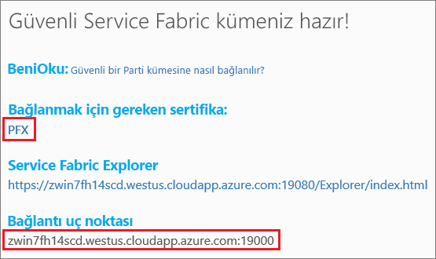
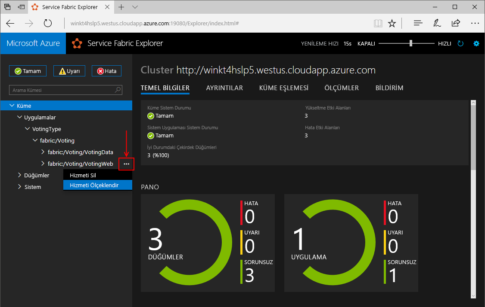
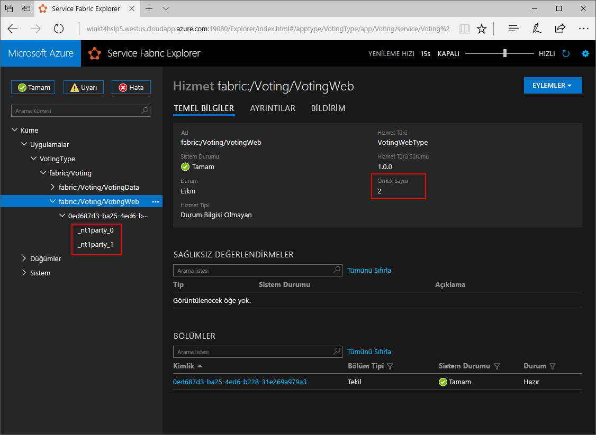

# <a name="quickstart-deploy-a-net-reliable-services-application-to-service-fabric"></a>Hızlı başlangıç: Service Fabric'e bir .NET güvenilir hizmetler uygulaması dağıtma

Azure Service Fabric; ölçeklenebilir ve güvenilir mikro hizmetleri ve kapsayıcıları dağıtmayı ve yönetmeyi sağlayan bir dağıtılmış sistemler platformudur.

Bu hızlı başlangıçta ilk .NET uygulamanızın Service Fabric'e nasıl dağıtılacağı gösterilir. Bitirdiğinizde, oylama sonuçlarını kümedeki durum bilgisi içeren arka uç hizmetine kaydeden bir ASP.NET Core web ön ucuna sahip oylama uygulaması sağlanır.


Bu uygulamayı kullanarak şunları yapmayı öğrenirsiniz:

* .NET ve Service Fabric kullanarak uygulama oluşturma
* ASP.NET Core'u web ön ucu olarak kullanma
* Uygulama verilerini durum bilgisi içeren bir hizmette depolama
* Uygulamanızda yerel olarak hata ayıklama
* Uygulamayı Azure'da bir kümeye dağıtma
* Birden çok düğüm arasında uygulamanın ölçeğini genişletme
* Toplu uygulama yükseltmesi yapma

## <a name="prerequisites"></a>Ön koşullar

Bu hızlı başlangıcı tamamlamak için:

1. [Azure geliştirme](https://www.visualstudio.com/) ve **ASP.NET ve Web geliştirme** iş yükleriyle **Visual Studio 2017’yi yükleyin**.
2. [Git'i yükleyin](https://git-scm.com/)
3. [Microsoft Azure Service Fabric SDK'sını yükleyin](http://www.microsoft.com/web/handlers/webpi.ashx?command=getinstallerredirect&appid=MicrosoftAzure-ServiceFabric-CoreSDK)
4. Visual Studio'nun yerel Service Fabric kümesine dağıtım yapmasını sağlamak için aşağıdaki komutu çalıştırın:
    ```powershell
    Set-ExecutionPolicy -ExecutionPolicy Unrestricted -Force -Scope CurrentUser
    ```

>[!NOTE]
> Bu hızlı başlangıçtaki örnek uygulama, Windows 7'de mevcut olmayan özellikleri kullanır.
>

## <a name="download-the-sample"></a>Örneği indirme

Komut penceresinde, örnek uygulama deposunu yerel makinenize kopyalamak için aşağıdaki komutu çalıştırın.

```git
git clone https://github.com/Azure-Samples/service-fabric-dotnet-quickstart
```

## <a name="run-the-application-locally"></a>Uygulamayı yerel olarak çalıştırma

Başlat Menüsünde Visual Studio'ya sağ tıklayın ve **Yönetici olarak çalıştır**'ı seçin. Hizmetlerinize hata ayıklayıcıyı eklemek için Visual Studio'yu yönetici olarak çalıştırmalısınız.

Kopyaladığınız depodan **Voting.sln** Visual Studio çözümünü açın.

Varsayılan olarak, Oylama uygulaması bağlantı noktası 8080'den dinleyecek şekilde ayarlanır.  Uygulama bağlantı noktası */VotingWeb/PackageRoot/ServiceManifest.xml* dosyasında ayarlanır.  **Endpoint** öğesinin **Port** özniteliğini güncelleştirerek uygulama bağlantı noktasını değiştirebilirsiniz.  Uygulamayı yerel olarak dağıtmak ve çalıştırmak için, uygulama bağlantı noktasının bilgisayarınızda açık ve kullanılabilir olması gerekir.  Uygulama bağlantı noktasını değiştirirseniz, bu makalenin tamamında "8080" değerinin yerine yeni uygulama bağlantı noktası değerini koyun.

Uygulamayı dağıtmak için **F5** tuşuna basın.

> [!NOTE]
> Uygulamayı ilk kez çalıştırdığınızda ve dağıttığınızda, Visual Studio hata ayıklama için yerel bir küme oluşturur. Bu işlem biraz zaman alabilir. Küme oluşturma durumu, Visual Studio çıkış penceresinde görüntülenir.  Çıkışta, "Uygulama URL'si ayarlanmadığı veya bir HTTP/HTTPS URL'si olmadığı için tarayıcı, uygulamaya açılmayacak" iletisini görürsünüz.  Bu ileti bir hataya işaret etmez ama tarayıcının otomatik olarak başlatılmayacağını belirtir.

Dağıtım tamamlandığında, tarayıcıyı başlatın ve şu sayfayı açın: `http://localhost:8080` - uygulamanın web ön ucu.


Şimdi bir dizi oylama seçeneği ekleyebilir ve oyları almaya başlayabilirsiniz. Uygulama çalıştırılır ve ayrı bir veritabanına gerek kalmadan tüm verileri Service Fabric kümenizde depolar.

## <a name="walk-through-the-voting-sample-application"></a>Oylama örnek uygulamasında izlenecek yol

Oylama uygulaması iki hizmetten oluşur:

* Web ön uç hizmeti (VotingWeb)- Web sayfasına hizmet veren ve arka uç hizmetiyle iletişim için web API'lerini kullanıma sunan bir ASP.NET Core web ön uç hizmeti.
* Arka uç hizmeti (VotingData)- Oy sonuçlarını diskte kalıcı olan güvenilir bir sözlükte depolamak için API'yi kullanıma sunan bir ASP.NET Core web hizmeti.


Uygulamada oy kullandığınızda aşağıdaki olaylar gerçekleşir:

1. Oy isteğini bir JavaScript HTTP PUT isteği olarak web ön uç hizmetindeki web API'sine gönderir.

2. Web ön uç hizmeti bir ara sunucu kullanarak HTTP PUT isteğini bulur ve arka uç hizmetine iletir.

3. Arka uç hizmeti gelen isteği alır ve güncelleştirilmiş sonucu güvenilir bir sözlükte depolar. Bu sözlük küme içinde birden çok düğüme çoğaltılır ve diskte kalıcı olur. Uygulamanın tüm verileri kümede depolandığından, veritabanına gerek yoktur.

## <a name="debug-in-visual-studio"></a>Visual Studio'da hata ayıklama

Uygulama düzgün şekilde çalışmalıdır, ancak uygulamanın temel parçalarının nasıl çalıştığını görmek için hata ayıklayıcıyı kullanabilirsiniz. Visual Studio'da uygulamada hata ayıklaması yaparken yerel bir Service Fabric geliştirme kümesi kullanırsınız. Hata ayıklama deneyiminizi senaryonuza göre ayarlama seçeneğiniz vardır. Bu uygulamada, verileri güvenilir bir sözlük kullanılarak arka uç hizmetinde depolanır. Hata ayıklayıcıyı durdurduğunuzda Visual Studio varsayılan olarak uygulamayı kaldırır. Uygulamanın kaldırılması arka uç hizmetindeki verilerin de kaldırılmasına neden olur. Hata ayıklama oturumları arasında verilerin kalıcı olmasını sağlamak için, Visual Studio'da **Oylama** projesindeki bir özellik olarak **Uygulama Hata Ayıklama Modu**'nu değiştirebilirsiniz.

Kodda neler olduğuna bakmak için aşağıdaki adımları tamamlayın:

1. **/VotingWeb/Controllers/VotesController.cs** dosyasını açın ve web API'sinin **Put** yönteminde (69. satır) bir kesme noktası ayarlayın. Dosyayı Visual Studio'daki Çözüm Gezgini'nde arayıp bulabilirsiniz.

2. **/VotingData/Controllers/VoteDataController.cs** dosyasını açın ve bu web API'sinin **Put** yönteminde (54. satır) bir kesme noktası ayarlayın.

3. Tarayıcıya dönün ve bir oylama seçeneğine tıklayın veya yeni oylama seçeneği ekleyin. Web ön ucunun api denetleyicisinde ilk kesme noktasına ulaşırsınız.
    * Burası, tarayıcıda JavaScript'in ön uç hizmetindeki API denetleyicisine istek gönderdiği yerdir.

    

    * İlk olarak, arka uç hizmetimiz için ReverseProxy'nin URL'sini oluşturun **(1)**.
    * Ardından, HTTP PUT İsteğini ReverseProxy'ye gönderin **(2)**.
    * Son olarak, yanıtı arka uç hizmetinden istemciye döndürün **(3)**.

4. Devam etmek için **F5** tuşuna basın
    - Tarayıcı tarafından sorulursa, ServiceFabricAllowedUsers grubuna Hata Ayıklama Modu için okuma ve yürütme izinleri verin.
    - Şimdi arka uç hizmetindeki kesme noktasındasınız.

    

    * Yöntemin ilk satırında **(1)**, `StateManager` `counts` adlı güvenilir bir sözlük alır veya ekler.
    * Güvenilir bir sözcükteki değerlerle tüm etkileşimler bir işlem gerektirir; bu using deyimi **(2)** o işlemi oluşturur.
    * İşlemde, oylama seçeneği için uygun anahtarın değerini güncelleştirin ve işlemi yürütün **(3)**. Commit yöntemi döndüğünde, sözlükteki veriler güncelleştirilir ve kümedeki diğer düğümlere çoğaltılır. Artık veriler güvenli bir şekilde kümede depolanır ve arka uç hizmeti verilerin kullanılabilir olduğu diğer düğümlere yük devretebilir.
5. Devam etmek için **F5** tuşuna basın

Hata ayıklama oturumunu durdurmak için **Shift+F5** tuşlarına basın.

## <a name="deploy-the-application-to-azure"></a>Uygulamayı Azure’a dağıtma

Uygulamayı Azure'a dağıtmak için, uygulamayı çalıştıran bir Service Fabric kümesine ihtiyacınız vardır.

### <a name="join-a-party-cluster"></a>Grup kümesine katılma

Grup kümeleri, Azure üzerinde barındırılan ve Service Fabric ekibi tarafından sunulan ücretsiz, sınırlı süreli Service Fabric kümeleridir. Bu kümelerde herkes uygulama dağıtabilir ve platform hakkında bilgi edinebilir. Küme, düğümden düğüme ve istemciden düğüme güvenlik için tek bir otomatik olarak imzalanan sertifika kullanır.

Oturum açın ve [bir Windows kümesine katılın](http://aka.ms/tryservicefabric). **PFX** bağlantısına tıklayarak PFX sertifikasını bilgisayarınıza indirin. **Güvenli Grup kümesine bağlanma** bağlantısına tıklayın ve sertifika parolasını kopyalayın. Aşağıdaki adımlarda sertifika, sertifika parolası ve **Bağlantı uç noktası** değeri kullanılır.



> [!Note]
> Saat başına sınırlı sayıda Grup kümesi vardır. Bir Grup kümesine kaydolmaya çalıştığınızda hata alırsanız bir süre bekleyebilir ve tekrar deneyebilirsiniz veya [.NET uygulaması dağıtma](https://docs.microsoft.com/azure/service-fabric/service-fabric-tutorial-deploy-app-to-party-cluster#deploy-the-sample-application) öğreticisindeki adımları izleyerek Azure aboneliğinizde bir Service Fabric kümesi oluşturabilir ve bu kümede uygulamayı dağıtabilirsiniz. Mevcut bir Azure aboneliğiniz yoksa [ücretsiz hesap](https://azure.microsoft.com/free/?WT.mc_id=A261C142F) oluşturabilirsiniz. Kümenizde uygulamayı dağıtıp doğruladıktan sonra, bu hızlı başlangıçtaki [Bir kümedeki uygulamaları ve hizmetleri ölçeklendirme](#scale-applications-and-services-in-a-cluster) kısmına atlayabilirsiniz.
>

Windows makinenizde PFX’i *CurrentUser\My* sertifika deposuna yükleyin.

```powershell
PS C:\mycertificates> Import-PfxCertificate -FilePath .\party-cluster-873689604-client-cert.pfx -CertStoreLocation Cert:\CurrentUser\My -Password (ConvertTo-SecureString 873689604 -AsPlainText -Force)


   PSParentPath: Microsoft.PowerShell.Security\Certificate::CurrentUser\My

Thumbprint                                Subject
----------                                -------
3B138D84C077C292579BA35E4410634E164075CD  CN=zwin7fh14scd.westus.cloudapp.azure.com
```

Sonraki adım için parmak izini unutmayın.

> [!Note]
> Varsayılan olarak, web ön uç hizmeti 8080 numaralı bağlantı noktasında gelen trafiği dinleyecek şekilde yapılandırılmıştır. Grup Kümesinde bağlantı noktası 8080 açıktır.  Uygulama bağlantı noktasını değiştirmeniz gerekiyorsa, bunu Grup Kümesinde açık olan bağlantı noktalarından biriyle değiştirin.
>

### <a name="deploy-the-application-using-visual-studio"></a>Visual Studio kullanarak uygulamayı dağıtma

Uygulama hazır olduğuna göre, doğrudan Visual Studio'dan bir kümeye dağıtabilirsiniz.

1. Çözüm Gezgini'nde **Oylama**’ya sağ tıklayın ve **Yayımla**’yı seçin. Yayımla iletişim kutusu görüntülenir.

2. Grup kümesi sayfasındaki **Bağlantı Uç Noktası**'nı **Bağlantı Uç Noktası** alanına kopyalayın. Örneğin, `zwin7fh14scd.westus.cloudapp.azure.com:19000`. **Gelişmiş Bağlantı Parametreleri**’ne tıklayın ve *FindValue* ve *ServerCertThumbprint* değerlerinin bir önceki adımda yüklenen sertifikanın parmak iziyle eşleştiğinden emin olun.

    

    Kümedeki her uygulamanın benzersiz bir adı olmalıdır.  Bununla birlikte grup kümeleri ortak, paylaşılan bir ortamdır ve mevcut uygulamalardan biriyle çakışma olabilir.  Ad çakışması varsa, Visual Studio projesini yeniden adlandırın ve bir kez daha dağıtın.

3. **Yayımla**’ta tıklayın.

4. Tarayıcıyı açın, küme adresini yazın ve kümedeki uygulamaya gelmek için arkasına ':8080' ekleyin; örneğin, `http://zwin7fh14scd.westus.cloudapp.azure.com:8080`. Artık Azure'da kümede çalıştırılan uygulamayı görüyor olmalısınız.

    

## <a name="scale-applications-and-services-in-a-cluster"></a>Bir kümedeki uygulamaları ve hizmetleri ölçeklendirme

Hizmet yükündeki bir değişikliği karşılamak için kümedeki Service Fabric hizmetleri kolayca ölçeklendirilebilir. Kümede çalıştırılan örnek sayısını değiştirerek bir hizmeti ölçeklendirebilirsiniz. Hizmetlerinizi ölçeklendirmenin birçok yolu vardır; PowerShell veya Service Fabric CLI'den (sfctl) betikler veya komutlar kullanabilirsiniz. Bu örnekte, Service Fabric Explorer'ı kullanın.

Service Fabric Explorer tüm Service Fabric kümelerinde çalıştırılır ve tarayıcıdan kümelerin HTTP yönetim bağlantı noktasına (19080) göz atarak (örneğin, `http://zwin7fh14scd.westus.cloudapp.azure.com:19080`) erişilebilir.

Konumun güvenilir olmadığına dair bir tarayıcı uyarısı alabilirsiniz. Bunun sebebi, sertifikanın otomatik olarak imzalanmasıdır. Uyarıyı yoksayıp devam etmeyi seçebilirsiniz.
1. Tarayıcı tarafından istendiğinde, bağlanmak için yüklü sertifikayı seçin. Listeden seçtiğiniz taraf küme sertifikası, erişmeye çalıştığınız taraf kümesi ile eşleşmelidir. Örneğin, win243uja6w62r.westus.cloudapp.azure.com.
2. Tarayıcı tarafından sorulursa, bu oturum için CryptoAPI Özel Anahtarınıza erişim verin.

Web ön uç hizmetini ölçeklendirmek için aşağıdaki adımları gerçekleştirin:

1. Kümenizde Service Fabric Explorer'ı açın. Örneğin: `http://zwin7fh14scd.westus.cloudapp.azure.com:19080`.

2. Ağaç görünümünde **Uygulamalar**->**VotingType**->**fabric:/Voting** seçeneğini genişletin. Ağaç görünümünde **fabric:/Voting/VotingWeb** düğümünün yanındaki üç noktaya tıklayın ve **Hizmeti Ölçeklendir**'i seçin.

    

    Şimdi web ön uç hizmetindeki örnek sayısını ölçeklendirebilirsiniz.

3. Rakamı **2** olarak değiştirin ve **Hizmeti Ölçeklendir**'e tıklayın.
4. Ağaç görünümünde **fabric:/Voting/VotingWeb** düğümüne tıklayın ve bölüm düğümünü (GUID ile gösterilir) genişletin.

    

    Bir gecikmenin ardından, hizmetin iki örneği olduğunu görebilirsiniz.  Ağaç görünümünde örneklerin üzerinde çalıştığı düğümleri görürsünüz.

Bu basit yönetim görevi sayesinde ön uç hizmetinizde kullanıcı yükünü işleyecek kaynak sayısı iki katına çıkar. Bir hizmetin güvenilir bir şekilde çalışması için birden fazla örneğe ihtiyaç duymadığını anlamanız önemlidir. Bir hizmet başarısız olursa Service Fabric kümede yeni bir hizmet örneği çalışmasını sağlar.

## <a name="perform-a-rolling-application-upgrade"></a>Toplu uygulama yükseltmesi yapma

Uygulamanıza yeni güncelleştirmeleri dağıtırken, Service Fabric güncelleştirmeyi güvenli bir yolla dağıtır. Sıralı yükseltmeler, yükseltme yaparken sistemi kapatma gereğini ortadan kaldırır ve hata olması durumunda otomatik geri almaya olanak tanır.

Uygulamayı yükseltmek için aşağıdakileri yapın:

1. Visual Studio'da **/VotingWeb/Views/Home/Index.cshtml** dosyasını açın.
2. Metin ekleyerek veya var olan metni güncelleştirerek sayfadaki başlığı değiştirin. Örneğin, başlığı "Service Fabric Oylama Örneği v2" olarak değiştirin.
3. Dosyayı kaydedin.
4. Çözüm Gezgini'nde **Oylama**’ya sağ tıklayın ve **Yayımla**’yı seçin. Yayımla iletişim kutusu görüntülenir.
5. Hizmetin ve uygulamanın sürümünü değiştirmek için **Bildirim Sürümü** düğmesine tıklayın.
6. **VotingWebPkg**'nin altındaki **Code** öğesinin sürümünü örneğin "2.0.0" olarak değiştirin ve **Kaydet**'e tıklayın.

    
7. **Service Fabric Uygulamasını Yayımla** iletişim kutusunda Uygulamayı Yükselt onay kutusunu işaretleyin ve **Yayımla**'ya tıklayın.

    

    Yükseltme çalışırken, uygulamayı kullanmaya devam edebilirsiniz. Kümede hizmetin iki örneği çalıştığından, isteklerinizden bazıları uygulamanın yükseltilmiş sürümünü alırken, diğerleri eski sürümü almaya devam edebilir.

8. Tarayıcınızı açın ve bağlantı noktası 19080'de küme adresine göz atın; örneğin, `http://zwin7fh14scd.westus.cloudapp.azure.com:19080`.
9. Ağaç görünümünde **Uygulamalar** düğümüne tıklayın ve ardından sağ bölmede **Devam Eden Yükseltmeler**'e tıklayın. Güncelleştirmenin kümenizdeki yükseltme etki alanlarında nasıl ilerlediğini görür, bir sonrakine geçmeden önce her etki alanının iyi durumda olduğundan emin olursunuz. Durumu doğrulanan yükseltme etki alanı, ilerleme çubuğunda yeşil gösterilir.
    

    Service Fabric, kümedeki bir düğümde hizmeti yükselttikten sonra iki dakika bekleyerek yükseltmelerin güvenle yapılmasını sağlar. Tüm güncelleştirmenin yaklaşık sekiz dakika sürmesini bekleyebilirsiniz.

## <a name="next-steps"></a>Sonraki adımlar

Bu hızlı başlangıçta şunları öğrendiniz:

* .NET ve Service Fabric kullanarak uygulama oluşturma
* ASP.NET Core'u web ön ucu olarak kullanma
* Uygulama verilerini durum bilgisi içeren bir hizmette depolama
* Uygulamanızda yerel olarak hata ayıklama
* Uygulamayı Azure'da bir kümeye dağıtma
* Birden çok düğüm arasında uygulamanın ölçeğini genişletme
* Toplu uygulama yükseltmesi yapma

Service Fabric ve .NET hakkında daha fazla bilgi edinmek için şu öğreticiyi gözden geçirin:
> [!div class="nextstepaction"]
> [Service Fabric üzerinde .NET uygulaması](service-fabric-tutorial-create-dotnet-app.md)
