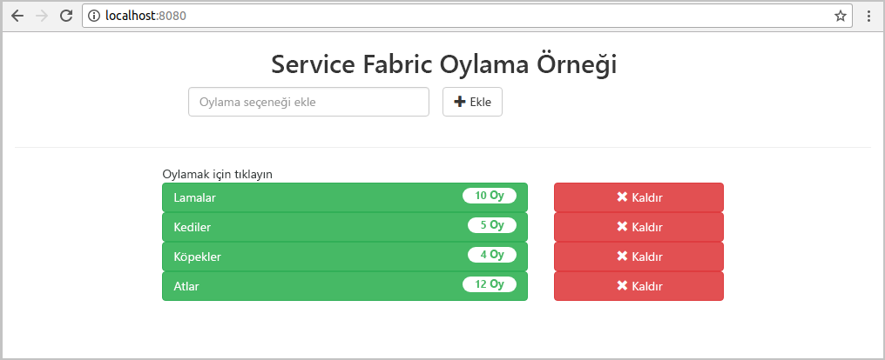
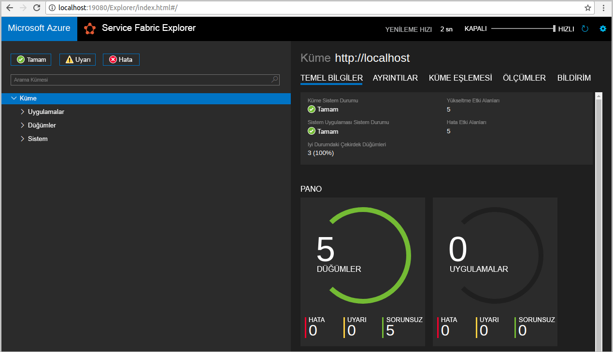
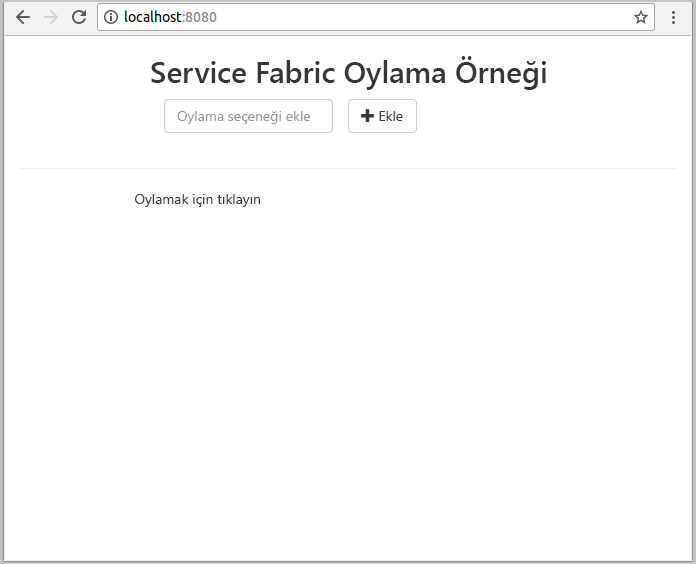
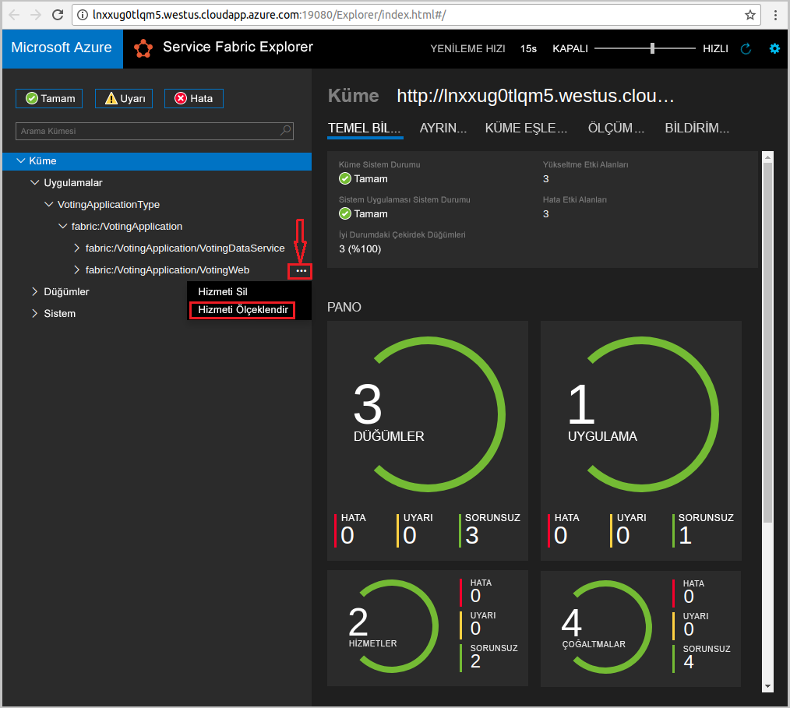
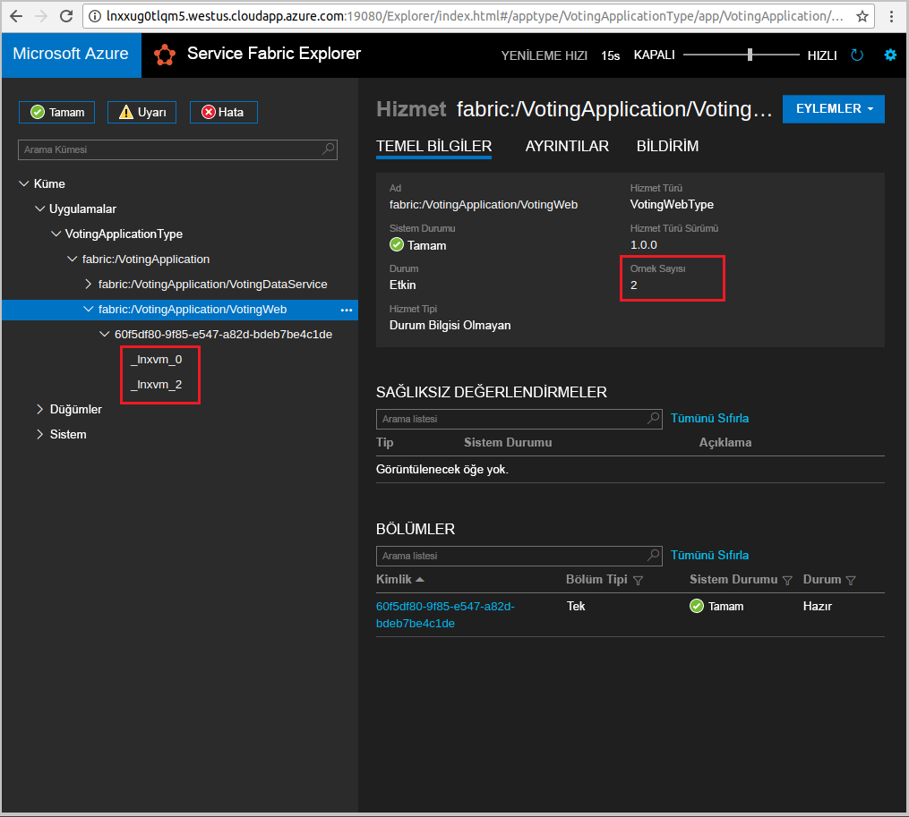

# <a name="quickstart-deploy-a-java-reliable-services-application-to-service-fabric"></a>Hızlı Başlangıç: Service Fabric için Java reliable services uygulaması dağıtma

Azure Service Fabric; mikro hizmetleri ve kapsayıcıları dağıtmayı ve yönetmeyi sağlayan bir dağıtılmış sistemler platformudur.

Bu hızlı başlangıçta, Linux geliştirici makinesinde Eclipse IDE’yi kullanarak Service Fabric’e ilk Java uygulamanızı dağıtmayla ilgili bilgi verilmektedir. Bitirdiğinizde, oylama sonuçlarını kümedeki durum bilgisi içeren arka uç hizmetine kaydeden bir Java web ön ucuna sahip oylama uygulaması sağlanır.



Bu hızlı başlangıçta şunları yapmayı öğrenirsiniz:

* Service Fabric Java uygulamalarınız için Eclipse’ı kullanma
* Uygulamayı yerel kümenize dağıtma
* Birden çok düğüm arasında uygulamanın ölçeğini genişletme

## <a name="prerequisites"></a>Önkoşullar

Bu hızlı başlangıcı tamamlamak için:

1. [Service Fabric SDK ve Service Fabric Komut Satırı Arabirimi’ni (CLI) yükleme](https://docs.microsoft.com/azure/service-fabric/service-fabric-get-started-linux#installation-methods)
2. [Git'i yükleyin](https://git-scm.com/)
3. [Eclipse’i yükleyin](https://www.eclipse.org/downloads/)
4. [Java Environment’ı ayarlayın](https://docs.microsoft.com/azure/service-fabric/service-fabric-get-started-linux#set-up-java-development), Eclipse eklentisini yüklemek için isteğe bağlı adımları izlediğinizden emin olun

## <a name="download-the-sample"></a>Örneği indirme

Komut penceresinde, örnek uygulama deposunu yerel makinenize kopyalamak için aşağıdaki komutu çalıştırın.

```git
git clone https://github.com/Azure-Samples/service-fabric-java-quickstart.git
```

## <a name="run-the-application-locally"></a>Uygulamayı yerel olarak çalıştırma

1. Aşağıdaki komutu çalıştırarak yerel kümenizi başlatın:

    ```bash
    sudo /opt/microsoft/sdk/servicefabric/common/clustersetup/devclustersetup.sh
    ```
    Yerel kümenin başlatılması biraz zaman alabilir. Kümenin sorunsuz çalıştığından emin olmak için, **http://localhost:19080** adresinden Service Fabric Explorer’a erişin. Sorunsuz beş düğüm, yerel kümenin çalıştığını belirtir.

    

2. Eclipse’i açın.
3. Dosya -> İçeri Aktar -> Gradle -> Var Olan Gradle Projesi'ne tıklayın ve sihirbazı izleyin.
4. Dizin'e tıklayın ve seçin `Voting` yer `service-fabric-java-quickstart` Github'dan kopyaladığınız klasörü. Son'a tıklayın.

    

5. Artık, Package Explorer for Eclipse’de `Voting` projesine sahipsiniz.
6. Projeye sağ tıklayın ve **Service Fabric** açılan listesinde **Uygulamayı Yayımla...** seçeneğini belirleyin. **PublishProfiles/Local.json** öğesini Hedef Profil olarak seçin ve Yayımla’ya tıklayın.

    

7. Sık kullandığınız web tarayıcınızı açın ve uygulama erişerek `http://localhost:8080`.

    

Şimdi bir dizi oylama seçeneği ekleyebilir ve oyları almaya başlayabilirsiniz. Uygulama çalıştırılır ve ayrı bir veritabanına gerek kalmadan tüm verileri Service Fabric kümenizde depolar.

## <a name="scale-applications-and-services-in-a-cluster"></a>Bir kümedeki uygulamaları ve hizmetleri ölçeklendirme

Hizmet yükündeki bir değişikliği karşılamak için kümedeki hizmetler kolayca ölçeklendirilebilir. Kümede çalıştırılan örnek sayısını değiştirerek bir hizmeti ölçeklendirebilirsiniz. Hizmetlerinizi ölçeklendirmenin birçok yolu vardır; örneğin, Service Fabric CLI’den (sfctl) betikler veya komutlar kullanabilirsiniz. Aşağıdaki adımlarda Service Fabric Explorer kullanılmaktadır.

Service Fabric Explorer tüm Service Fabric kümelerinde çalıştırılır ve tarayıcıdan kümelerin HTTP yönetim bağlantı noktasına (19080) göz atılarak (örneğin, `http://localhost:19080`) erişilebilir.

Web ön uç hizmetini ölçeklendirmek için aşağıdakileri yapın:

1. Kümenizde Service Fabric Explorer'ı açın. Örneğin: `https://localhost:19080`.
2. Ağaç görünümünde **fabric:/Voting/VotingWeb** düğümünün yanındaki üç noktaya tıklayın ve **Hizmeti Ölçeklendir**'i seçin.

    

    Şimdi web ön uç hizmetindeki örnek sayısını ölçeklendirebilirsiniz.

3. Rakamı **2** olarak değiştirin ve **Hizmeti Ölçeklendir**'e tıklayın.
4. Ağaç görünümünde **fabric:/Voting/VotingWeb** düğümüne tıklayın ve bölüm düğümünü (GUID ile gösterilir) genişletin.

    

    Hizmette üç örnek olduğunu ve ağaç görünümünde örneklerin çalıştığı düğümleri görebilirsiniz.

Bu basit yönetim görevi sayesinde ön uç hizmetinin kullanıcı yükünü işlemek için kullanabileceği kaynakları iki katına çıkarmış oldunuz. Bir hizmetin güvenilir bir şekilde çalışması için birden fazla örneğe ihtiyaç duymadığınızı anlamanız önemlidir. Bir hizmet başarısız olursa Service Fabric, kümede yeni bir hizmet örneği çalışmasını sağlar.

## <a name="next-steps"></a>Sonraki adımlar

Bu hızlı başlangıçta şunları öğrendiniz:

* Service Fabric Java uygulamalarınız için Eclipse’ı kullanma
* Java uygulamalarını yerel kümenize dağıtma
* Birden çok düğüm arasında uygulamanın ölçeğini genişletme

Service Fabric’te Java uygulamalarıyla çalışma hakkında daha fazla bilgi için Java uygulamaları öğreticisiyle devam edin.

> [!div class="nextstepaction"]
> [Java uygulaması dağıtma](./service-fabric-tutorial-create-java-app.md)
