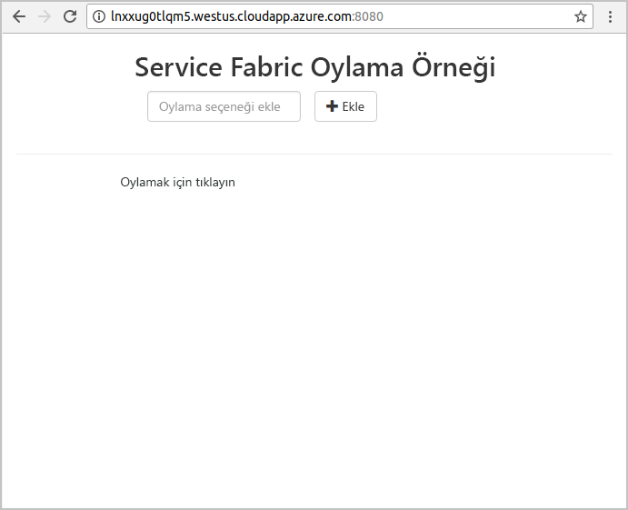

# <a name="create-a-java-application"></a>Java Uygulaması oluşturma
Azure Service Fabric; mikro hizmetleri ve kapsayıcıları dağıtmayı ve yönetmeyi sağlayan bir dağıtılmış sistemler platformudur. 

Bu hızlı başlangıçta, Linux geliştirici makinesinde Eclipse IDE’yi kullanarak Service Fabric’e ilk Java uygulamanızı dağıtmayla ilgili bilgi verilmektedir. Bitirdiğinizde, oylama sonuçlarını kümedeki durum bilgisi içeren arka uç hizmetine kaydeden bir Java web ön ucuna sahip oylama uygulaması sağlanır.


Bu hızlı başlangıçta şunları yapmayı öğrenirsiniz:

> [!div class="checklist"]
> * Service Fabric Java uygulamalarınız için Eclipse’ı kullanma
> * Uygulamayı yerel kümenize dağıtma 
> * Uygulamayı Azure'da bir kümeye dağıtma
> * Birden çok düğüm arasında uygulamanın ölçeğini genişletme

## <a name="prerequisites"></a>Ön koşullar
Bu hızlı başlangıcı tamamlamak için:
1. [Service Fabric SDK ve Service Fabric Komut Satırı Arabirimi’ni (CLI) yükleme](https://docs.microsoft.com/azure/service-fabric/service-fabric-get-started-linux#installation-methods)
2. [Git'i yükleyin](https://git-scm.com/)
3. [Eclipse’i yükleyin](https://www.eclipse.org/downloads/)
4. [Java Environment’ı ayarlayın](https://docs.microsoft.com/azure/service-fabric/service-fabric-get-started-linux#set-up-java-development), Eclipse eklentisini yüklemek için isteğe bağlı adımları izlediğinizden emin olun 

## <a name="download-the-sample"></a>Örneği indirme
Komut penceresinde, örnek uygulama deposunu yerel makinenize kopyalamak için aşağıdaki komutu çalıştırın.
```
git clone https://github.com/Azure-Samples/service-fabric-java-quickstart.git
```

## <a name="run-the-application-locally"></a>Uygulamayı yerel olarak çalıştırma
1. Aşağıdaki komutu çalıştırarak yerel kümenizi başlatın:

    ```bash
    sudo /opt/microsoft/sdk/servicefabric/common/clustersetup/devclustersetup.sh
    ```
    Yerel kümenin başlatılması biraz zaman alabilir. Yerel kümenin sorunsuz çalıştığından emin olmak için, **http://localhost:19080** adresinden Service Fabric Explorer’a erişin. Sorunsuz beş düğüm, yerel kümenin çalıştığını belirtir. 
    
    

2. Eclipse’i açın.
3. Dosya Sistemi’nde Dosya -> Proje Aç seçeneğine tıklayın... 
4. Dizin’e tıklayın ve GitHub’dan kopyaladığınız `service-fabric-java-quickstart` klasöründe yer alan `Voting` dizinini seçin. Son'a tıklayın. 

    
    
5. Artık, Package Explorer for Eclipse’de `Voting` projesine sahipsiniz. 
6. Projeye sağ tıklayın ve **Service Fabric** açılan listesinde **Uygulamayı Yayımla...** seçeneğini belirleyin. **PublishProfiles/Local.json** öğesini Hedef Profil olarak seçin ve Yayımla’ya tıklayın. 

    
    
7. Sık kullandığınız web tarayıcısını açın ve **http://localhost:8080** adresine giderek uygulamaya erişin. 

    
    
Şimdi bir dizi oylama seçeneği ekleyebilir ve oyları almaya başlayabilirsiniz. Uygulama çalıştırılır ve ayrı bir veritabanına gerek kalmadan tüm verileri Service Fabric kümenizde depolar.

## <a name="deploy-the-application-to-azure"></a>Uygulamayı Azure’a dağıtma

### <a name="set-up-your-azure-service-fabric-cluster"></a>Azure Service Fabric Kümesi’ni ayarlama
Uygulamayı Azure'daki bir kümeye dağıtmak için kendi kümenizi oluşturun.

Grup kümeleri Azure üzerinde barındırılan ücretsiz ve sınırlı süreli Service Fabric kümeleridir. Service Fabric ekibi tarafından çalıştırılan bu kümelere herkes uygulama dağıtarak platform hakkında bilgi alabilir. Bir Grup Kümesine erişmek için [yönergeleri takip edin](http://aka.ms/tryservicefabric). 

Güvenli grup kümelerinde yönetim işlemleri gerçekleştirmek için, Service Fabric Explorer, CLI veya PowerShell’i kullanabilirsiniz. Service Fabric Explorer’ı kullanmak için, Grup Kümeleri web sitesinden PFX dosyasını indirmeniz ve sertifikayı, sertifika depolama alanınıza (Windows veya Mac) veya tarayıcının kendisine (Ubuntu) aktarmanız gerekir. Grup kümesindeki otomatik olarak imzalanan sertifikaların parolaları yoktur. 

PowerShell veya CLI ile yönetim işlemleri gerçekleştirmek için, PFX (PowerShell) veya PEM (CLI) gerekir. PFX’i, PEM dosyasına dönüştürmek için lütfen şu komutu çalıştırın:  

```bash
openssl pkcs12 -in party-cluster-1277863181-client-cert.pfx -out party-cluster-1277863181-client-cert.pem -nodes -passin pass:
```

Kendi kümenizi oluşturma hakkında daha fazla bilgi için bkz. [Azure'da Service Fabric kümesi oluşturma](service-fabric-tutorial-create-vnet-and-linux-cluster.md).

> [!Note]
> Spring Boot hizmeti 8080 numaralı bağlantı noktasında gelen trafiği dinleyecek şekilde yapılandırılmıştır. Kümenizde bu bağlantı noktasının açık olduğundan emin olun. Grup Kümesi kullanıyorsanız bu bağlantı noktası açık durumdadır.
>

### <a name="add-certificate-information-to-your-application"></a>Sertifika bilgilerini uygulamanıza ekleme

Service Fabric programlama modellerini kullandığından, sertifika parmak izinin uygulamanıza eklenmesi gerekiyor. 

1. Sertifikanızın parmak izinin, güvenli bir kümede çalışırken ```Voting/VotingApplication/ApplicationManiest.xml``` dosyasında olması gerekir. Sertifikanın parmak izini ayıklamak için aşağıdaki komutu çalıştırın.

    ```bash
    openssl x509 -in [CERTIFICATE_FILE] -fingerprint -noout
    ```

2. ```Voting/VotingApplication/ApplicationManiest.xml``` konumunda, aşağıdaki kod parçacığını **ApplicationManifest** etiketi altına ekleyin. **X509FindValue** önceki adımdaki parmak izi olmalıdır (noktalı virgül olmamalı). 

    ```xml
    <Certificates>
        <SecretsCertificate X509FindType="FindByThumbprint" X509FindValue="0A00AA0AAAA0AAA00A000000A0AA00A0AAAA00" />
    </Certificates>   
    ```
    
### <a name="deploy-the-application-using-eclipse"></a>Eclipse kullanarak uygulamayı dağıtma
Uygulama ve kümeniz hazır olduğuna göre, doğrudan Eclipse’teki bir kümeye dağıtabilirsiniz.

1. **PublishProfiles** dizinindeki **Cloud.json** dosyasını açın ve `ConnectionIPOrURL` ile `ConnectionPort` alanlarını uygun şekilde doldurun. Örnek: 

    ```bash
    {
         "ClusterConnectionParameters": 
         {
            "ConnectionIPOrURL": "lnxxug0tlqm5.westus.cloudapp.azure.com",
            "ConnectionPort": "19080",
            "ClientKey": "[path_to_your_pem_file_on_local_machine]",
            "ClientCert": "[path_to_your_pem_file_on_local_machine]"
         }
    }
    ```

2. Projeye sağ tıklayın ve **Service Fabric** açılan listesinde **Uygulamayı Yayımla...** seçeneğini belirleyin. **PublishProfiles/Cloud.json** öğesini Hedef Profil olarak seçin ve Yayımla’ya tıklayın. 

    

3. Sık kullandığınız web tarayıcısını açın ve **http://\<ConnectionIPOrURL>:8080** adresine giderek uygulamaya erişin. 

    
    
## <a name="scale-applications-and-services-in-a-cluster"></a>Bir kümedeki uygulamaları ve hizmetleri ölçeklendirme
Hizmet yükündeki bir değişikliği karşılamak için kümedeki hizmetler kolayca ölçeklendirilebilir. Kümede çalıştırılan örnek sayısını değiştirerek bir hizmeti ölçeklendirebilirsiniz. Hizmetlerinizi ölçeklendirmenin birçok yolu vardır; Service Fabric CLI'den (sfctl) betikler veya komutlar kullanabilirsiniz. Bu örnekte, Service Fabric Explorer'ı kullanıyoruz.

Service Fabric Explorer tüm Service Fabric kümelerinde çalıştırılır ve tarayıcıdan kümelerin HTTP yönetim bağlantı noktasına (19080) göz atarak (örneğin, `http://lnxxug0tlqm5.westus.cloudapp.azure.com:19080`) erişilebilir.

Web ön uç hizmetini ölçeklendirmek için aşağıdaki adımları gerçekleştirin:

1. Kümenizde Service Fabric Explorer'ı açın. Örneğin: `https://lnxxug0tlqm5.westus.cloudapp.azure.com:19080`.
2. Ağaç görünümünde **fabric:/Voting/VotingWeb** düğümünün yanındaki üç noktaya tıklayın ve **Hizmeti Ölçeklendir**'i seçin.

    

    Şimdi web ön uç hizmetindeki örnek sayısını ölçeklendirebilirsiniz.

3. Rakamı **2** olarak değiştirin ve **Hizmeti Ölçeklendir**'e tıklayın.
4. Ağaç görünümünde **fabric:/Voting/VotingWeb** düğümüne tıklayın ve bölüm düğümünü (GUID ile gösterilir) genişletin.

    

    Hizmette üç örnek olduğunu ve ağaç görünümünde örneklerin çalıştığı düğümleri görebilirsiniz.

Bu basit yönetim görevi sayesinde ön uç hizmetinizde kullanıcı yükünü işleyecek kaynak sayısını iki katına çıkarmış olduk. Bir hizmetin güvenilir bir şekilde çalışması için birden fazla örneğe ihtiyaç duymadığını anlamanız önemlidir. Bir hizmet başarısız olursa Service Fabric kümede yeni bir hizmet örneği çalışmasını sağlar.

## <a name="next-steps"></a>Sonraki adımlar
Bu hızlı başlangıçta şunları öğrendiniz:

> [!div class="checklist"]
> * Service Fabric Java uygulamalarınız için Eclipse’ı kullanma
> * Java uygulamalarını yerel kümenize dağıtma 
> * Java uygulamalarını Azure’da yerel kümenize dağıtma
> * Birden çok düğüm arasında uygulamanın ölçeğini genişletme

* [Eclipse kullanarak Java’da hizmetler için hata ayıklama](service-fabric-debugging-your-application-java.md) hakkında daha fazla bilgi edinin
* [Jenkins kullanarak sürekli tümleştirme ve dağıtma işlemlerinizi ayarlama](service-fabric-cicd-your-linux-applications-with-jenkins.md) hakkında daha fazla bilgi edinin
* Diğer [Java Örnekleri](https://github.com/Azure-Samples/service-fabric-java-getting-started)’ne göz atın