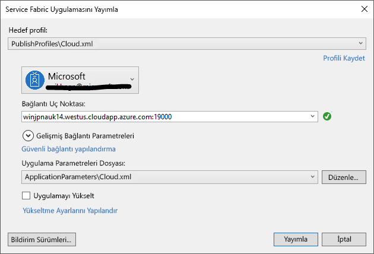

# <a name="tutorial-deploy-a-service-fabric-application-to-a-cluster-in-azure"></a>Öğretici: Bir Service Fabric uygulamasının azure'da bir kümeye dağıtma

Bu öğretici, bir dizinin ikinci bölümüdür. Azure Service Fabric uygulamasının Azure’da yeni kümeye nasıl dağıtılacağı gösterilir.

Bu öğreticide şunların nasıl yapıldığını öğreneceksiniz:
> [!div class="checklist"]
> * Bir küme oluşturun.
> * Visual Studio kullanarak uygulamayı uzak bir kümeye dağıtma.

Bu öğretici serisinde şunların nasıl yapıldığını öğrenirsiniz:
> [!div class="checklist"]
> * [.NET Service Fabric uygulaması oluşturma](service-fabric-tutorial-create-dotnet-app.md).
> * Uygulamayı uzak kümeye dağıtma.
> * [Bir ASP.NET Core ön uç hizmetine HTTPS uç noktası ekleme](service-fabric-tutorial-dotnet-app-enable-https-endpoint.md).
> * [Azure Pipelines kullanarak CI/CD yapılandırın](service-fabric-tutorial-deploy-app-with-cicd-vsts.md).
> * [Uygulama için izleme ve tanılamayı ayarlama](service-fabric-tutorial-monitoring-aspnet.md).

## <a name="prerequisites"></a>Önkoşullar

Bu öğreticiye başlamadan önce:

* Azure aboneliğiniz yoksa [ücretsiz bir hesap](https://azure.microsoft.com/free/?WT.mc_id=A261C142F) oluşturun.
* [Visual Studio 2019 yükleme](https://www.visualstudio.com/), yükleyip **Azure geliştirme** ve **ASP.NET ve web geliştirme** iş yükleri.
* [Service Fabric SDK'yı yükleyin](service-fabric-get-started.md).

## <a name="download-the-voting-sample-application"></a>Voting örnek uygulamasını indirme

[Bu öğretici serisinin birinci kısmında](service-fabric-tutorial-create-dotnet-app.md) Voting örnek uygulamasını oluşturmadıysanız, indirebilirsiniz. Bir komut penceresinde örnek uygulama deposunu yerel makinenize kopyalamak için aşağıdaki kodu çalıştırın.

```git
git clone https://github.com/Azure-Samples/service-fabric-dotnet-quickstart 
```

Visual Studio, yönetici olarak çalışan uygulamayı açın ve uygulamayı derleyin.

## <a name="create-a-cluster"></a>Küme oluşturma

Uygulama hazır olduğuna göre bir Service Fabric kümesi oluşturma ve ardından uygulamayı kümeye dağıtın. [Service Fabric kümesi](https://docs.microsoft.com/azure/service-fabric/service-fabric-deploy-anywhere), mikro hizmetlerin dağıtılıp yönetildiği, ağa bağlı bir sanal veya fiziksel makine kümesidir.

Bu öğreticide, Visual Studio IDE'de yeni üç düğümlü test kümesi oluşturun ve sonra da uygulamayı bu kümeye yayımlayabilirsiniz. Bkz: [oluşturma ve yönetme küme Öğreticisi](service-fabric-tutorial-create-vnet-and-windows-cluster.md) bir üretim kümesi oluşturma hakkında bilgi için. Ayrıca uygulamayı daha önce oluşturduğunuz aracılığıyla mevcut bir kümeye dağıtabilirsiniz [Azure portalında](https://portal.azure.com), kullanarak [PowerShell](./scripts/service-fabric-powershell-create-secure-cluster-cert.md) veya [Azure CLI](./scripts/cli-create-cluster.md) betiklerin veya bir [Azure Resource Manager şablonu](service-fabric-tutorial-create-vnet-and-windows-cluster.md).

> [!NOTE]
> Oylama uygulaması ve diğer birçok uygulama, hizmetler arasında iletişim kurulabilmesi için Service Fabric ters proxy kullanın. Visual Studio'dan oluşturulan kümeleri varsayılan olarak etkin ters Ara sunucuya sahiptir. Mevcut bir kümeye dağıtıyorsanız gerekir [kümedeki ters Proxy'yi Etkinleştir](service-fabric-reverseproxy-setup.md) oylama uygulamanın çalışması.


### <a name="find-the-votingweb-service-endpoint"></a>VotingWeb hizmet uç noktasını bulun

Oylama uygulamasının web ön uç hizmeti, belirli bir bağlantı noktasında dinleme (buna adımları izlediyseniz 8080 [Bu öğretici serisinin birinci kısmında](service-fabric-tutorial-create-dotnet-app.md). Uygulama Azure'daki bir kümeye dağıtıldığında hem küme hem de uygulama bir Azure yük dengeleyicinin arkasında çalışır. Bir kural kullanarak, uygulama bağlantı noktası Azure yük dengeleyicide açılması gerekir. Kural, web hizmetine load balancer üzerinden gelen trafiği gönderir. Bağlantı noktası **VotingWeb/PackageRoot/ServiceManifest.xml** dosyasının **Endpoint** öğesinde bulunur. 

```xml
<Endpoint Protocol="http" Name="ServiceEndpoint" Type="Input" Port="8080" />
```

Bir sonraki adımda gerekli hizmet uç noktası not alın.  Mevcut bir kümeye dağıtıyorsanız, bir Yük Dengeleme kuralı ve araştırma kullanarak Azure yük dengeleyici oluşturarak bu bağlantı noktasını açın bir [PowerShell Betiği](./scripts/service-fabric-powershell-open-port-in-load-balancer.md) veya bu küme için yük dengeleyici aracılığıyla [Azure portalı ](https://portal.azure.com).

### <a name="create-a-test-cluster-in-azure"></a>Azure'da bir test kümesi oluşturma
Çözüm Gezgini’nde **Oylama**’ya sağ tıklayın ve **Yayımla**’yı seçin.

İçinde **bağlantı uç noktası**seçin **yeni küme oluşturma**.  Mevcut bir kümeye dağıtıyorsanız, küme uç noktasına listeden seçin.  Service Fabric kümesi oluşturma iletişim kutusunu açar.

İçinde **küme** sekmesinde **küme adı** (örneğin, "mytestcluster"), aboneliğinizi seçin, küme (örneğin, Güney Orta ABD) için bir bölge seçin, küme düğümleri (biz sayısını girin test kümesi için üç düğüm önerilir), bir kaynak grubu (örneğin, "mytestclustergroup") girin. **İleri**’ye tıklayın.


İçinde **sertifika** sekmesinde, küme sertifikası için parola ve çıkış yolunu girin. Kendinden imzalı bir sertifika bir PFX dosyası olarak oluşturulur ve belirtilen çıkış yoluna kaydedilir.  Sertifika, düğümden düğüme hem istemci düğüme güvenlik için kullanılır.  Üretim kümeleri için otomatik olarak imzalanan bir sertifika kullanmayın.  Bu sertifika, kümeyle kimlik doğrulaması ve uygulamaları dağıtmak için Visual Studio tarafından kullanılır. Seçin **sertifikayı içeri aktarma** PFX bilgisayarınızı CurrentUser\My sertifika deposuna yüklemek için.  **İleri**’ye tıklayın.


İçinde **VM ayrıntısı** sekmesinde **kullanıcı adı** ve **parola** küme yönetim hesabının.  Seçin **sanal makine görüntüsü** küme düğümleri için ve **sanal makine boyutu** her küme düğümünde için.  Tıklayın **Gelişmiş** sekmesi.


İçinde **bağlantı noktaları**, VotingWeb Hizmeti uç noktası önceki adımda girin (örneğin, 8080).  Küme oluşturulduğunda, bu uygulama bağlantı noktaları küme trafiği iletmek için Azure yük dengeleyicide açılır.  Tıklayın **Oluştur** birkaç dakika sürer kullanarak kümeyi oluşturun.


## <a name="publish-the-application-to-the-cluster"></a>Kümeye uygulama yayımlama

Yeni küme hazır olduğunda, doğrudan Visual Studio'dan Voting uygulamasını dağıtabilirsiniz.

Çözüm Gezgini’nde **Oylama**’ya sağ tıklayın ve **Yayımla**’yı seçin. **Yayımla** iletişim kutusu görüntülenir.

İçinde **bağlantı uç noktası**, önceki adımda oluşturduğunuz kümenin uç noktayı seçin.  Örneğin, "mytestcluster.southcentral.cloudapp.azure.com:19000". Seçerseniz **Gelişmiş bağlantı parametreleri**, sertifika bilgileri otomatik olarak doldurulmuş olması gerekir.  


**Yayımla**’yı seçin.

Uygulama dağıtıldığında bir tarayıcı açın ve ardından küme adresini girin **: 8080**. Veya başka bir bağlantı noktası yapılandırdıysanız onu girin. `http://mytestcluster.southcentral.cloudapp.azure.com:8080` bunun bir örneğidir. Artık Azure'da kümede çalıştırılan uygulamayı görüyor olmalısınız. Voting web sayfasında, oylama seçeneklerini ve bu seçeneklerden en az biri için oylama ekleyip silmeyi deneyin.


## <a name="next-steps"></a>Sonraki adımlar
Öğreticinin bu bölümünde, şunların nasıl yapıldığını öğrendiniz:

> [!div class="checklist"]
> * Bir küme oluşturun.
> * Visual Studio kullanarak uygulamayı uzak bir kümeye dağıtma.

Sonraki öğreticiye ilerleyin:
> [!div class="nextstepaction"]
> [HTTPS'yi etkinleştirme](service-fabric-tutorial-dotnet-app-enable-https-endpoint.md)
