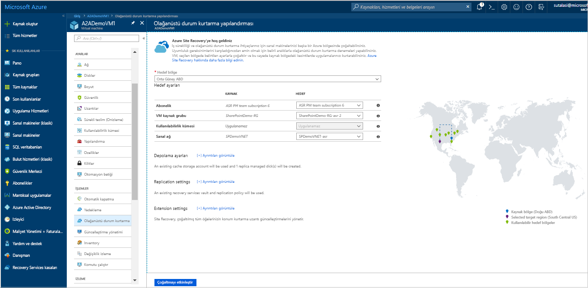
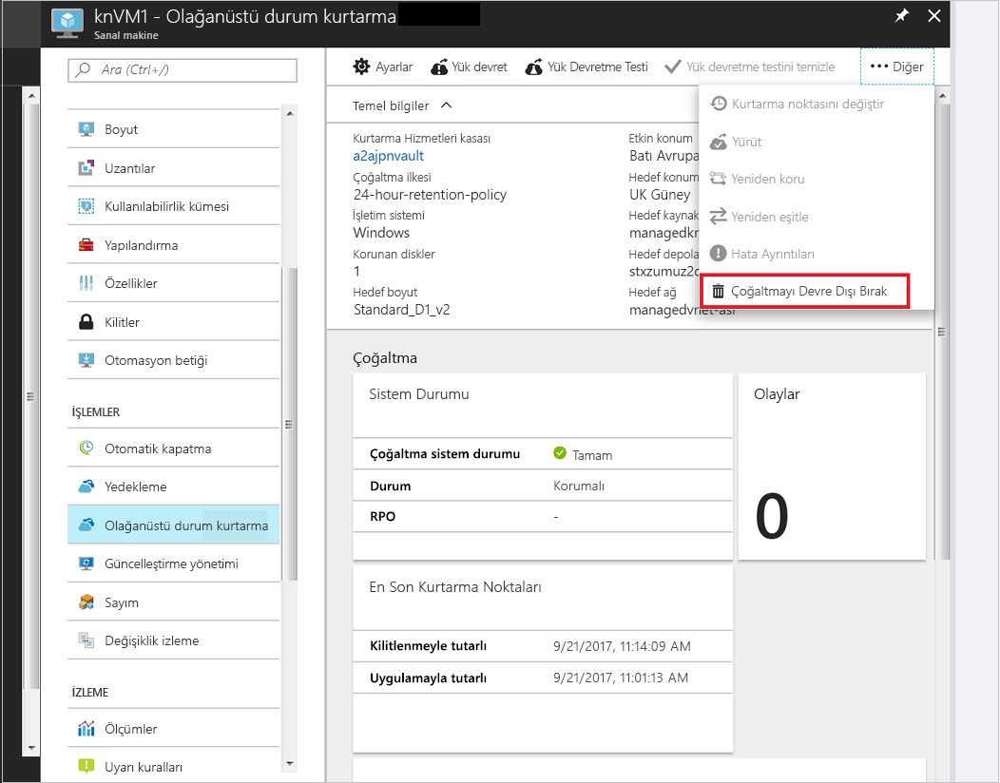

# Bir Azure VM’yi başka bir Azure bölgesine çoğaltma

[Azure Site Recovery](site-recovery-overview.md) hizmeti, planlı ve plansız kesintiler sırasında iş uygulamalarınızı çalışır durumda tutarak, iş sürekliliğinize ve olağanüstü durum kurtarma (BCDR) stratejinize katkıda bulunur. Site Recovery, şirket içi makinelerin ve Azure sanal makinelerinin çoğaltma, yük devretme ve kurtarma gibi olağanüstü durum kurtarma işlemlerini yönetir ve düzenler.

Bu hızlı başlangıç, bir Azure VM’nin farklı bir Azure bölgesine nasıl çoğaltılacağını açıklar.

Azure aboneliğiniz yoksa başlamadan önce [ücretsiz bir hesap](https://azure.microsoft.com/free/?WT.mc_id=A261C142F) oluşturun.

## Azure'da oturum açma

http://portal.azure.com adresinden Azure portalında oturum açın.

## Azure VM için çoğaltmayı etkinleştirme

1. Azure portalında, **Sanal makineler** seçeneğine tıklayın ve çoğaltmak istediğiniz VM’yi seçin.

2. **İşlemler** menüsünde **Olağanüstü durum kurtarma** seçeneğine tıklayın.
3. **Olağanüstü durumdan kurtarma yapılandırma** > **Hedef bölge** bölümünde, çoğaltma yapacağınız hedef bölgeyi seçin.
4. Bu Hızlı Başlangıç için, diğer varsayılan ayarları kabul edin.
5. **Çoğaltmayı etkinleştir**’e tıklayın. Bu, sanal makineye yönelik çoğaltmayı etkinleştirmek için bir iş başlatır.

    

## Ayarları doğrulama

Çoğaltma işlemi bittikten sonra, çoğaltma durumunu denetleyebilir, çoğaltma ayarlarını değiştirebilir ve dağıtımı test edebilirsiniz.

1. VM menüsünde, **Olağanüstü durum kurtarma** seçeneğine tıklayın.
2. Çoğaltma durumunu, oluşturulan kurtarma noktalarını ve haritadaki kaynak ve hedef bölgelerini doğrulayabilirsiniz.

   

## Kaynakları temizleme

Çoğaltma işlemini devre dışı bıraktığınızda, birincil bölgedeki VM çoğaltmayı durdurur:

- Kaynak çoğaltma ayarları otomatik olarak temizlenir.
- VM’nin Site Recovery faturalaması da ayrıca durur.

Şu adımlara göre çoğaltmayı durdurun:

1. VM’yi seçin.
2. **Olağanüstü durum kurtarma** bölümünde **Çoğaltmayı devre dışı bırak**'a tıklayın.

   

## Sonraki adımlar

Bu hızlı başlangıçta, tek bir VM’yi ikincil bir bölgeye çoğalttınız.

> [!div class="nextstepaction"]
> [Azure VM’leri için olağanüstü durum kurtarmayı yapılandır](azure-to-azure-tutorial-enable-replication.md)
