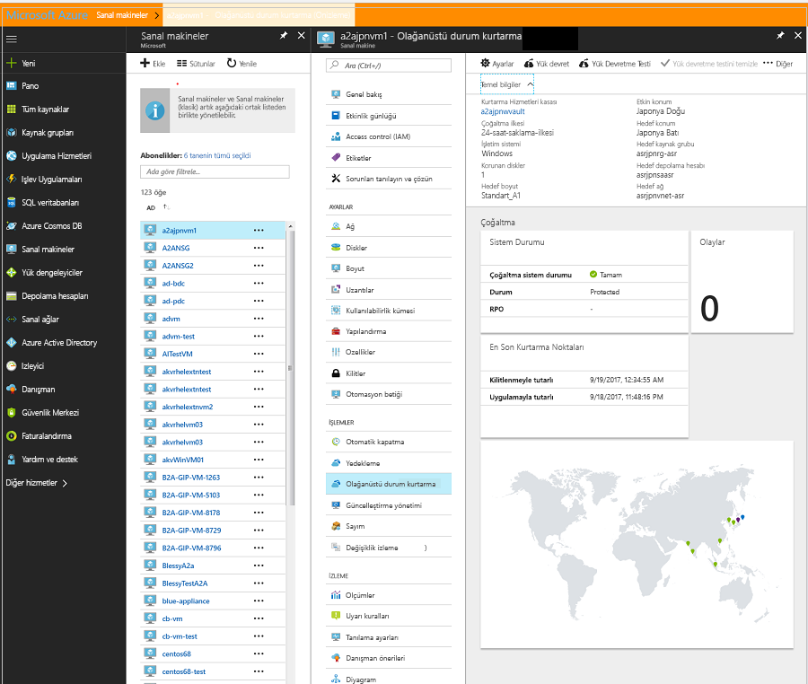

# Kullanılabilirlik alanına Azure sanal makineleri taşıma
Azure kullanılabilirlik alanları, uygulamalarınız ve verileriniz, veri merkezi arızasına karşı korumak yardımcı olur. Her Kullanılabilirlik Alanı, bağımsız güç, soğutma ve ağ bağlantısı ile donatılmış bir veya daha fazla veri merkezinden oluşur. Dayanıklılık sağlamak için üç ayrı bölge etkinleştirilmiş tüm bölgelerde en az yoktur. Bir bölge içinde kullanılabilirlik alanlarının fiziksel olarak ayrılması, uygulamaları ve verileri, veri merkezi arızasına karşı korumak yardımcı olur. Kullanılabilirlik alanları ile Azure, bir hizmet düzeyi sözleşmesi (SLA), % 99,99 oranında çalışma süresi sanal makinelerin (VM'ler) sunar. Kullanılabilirlik alanları, seçilmiş bölgelerde desteklenir, belirtildiği gibi [Azure kullanılabilirlik alanları nedir?](https://docs.microsoft.com/azure/availability-zones/az-overview#regions-that-support-availability-zones).

Olarak Vm'lerinizin dağıtıldığı bir senaryoda *tek örnek* belirli bir bölge ve bu sanal makineler bir kullanılabilirlik bölgesine taşıyarak, kullanılabilirliği artırmak istiyorsanız, Azure Site RECOVERY'yi kullanarak bunu yapabilirsiniz. Bu eylem daha halinde kategorilere ayrılabilir:

- Tek Örnekli VM'ler hedef bölgede kullanılabilirlik alanları içine taşı
- Vm'leri bir kullanılabilirlik kümesindeki kullanılabilirlik hedef bölgede içine taşı

> [!IMPORTANT]
> Şu anda, Azure Site Recovery Vm'leri bir bölgeden diğerine taşınmasını destekler ancak bir bölge içinde taşıma desteklemiyor.

## Önkoşul denetimi

- Hedef bölge olup olmadığını denetleyin [desteklemek için kullanılabilirlik alanları](https://docs.microsoft.com/azure/availability-zones/az-overview#regions-that-support-availability-zones). Kontrol ettiğiniz [kaynak bölge/hedef bölge birleşimi desteklenir](https://docs.microsoft.com/azure/site-recovery/azure-to-azure-support-matrix#region-support). Hedef bölge konusunda bilinçli bir karar.
- [Senaryo mimarisini ve bileşenlerini ](azure-to-azure-architecture.md) anladığınızdan emin olun.
- [Destek sınırlamaları ve gereksinimleri](azure-to-azure-support-matrix.md) konusunu inceleyin.
- Hesap izinlerini denetleyin. Hemen ücretsiz Azure hesabınızı oluşturduysanız aboneliğinizin Yöneticisi olursunuz. Abonelik Yöneticisi değilseniz, ihtiyaç duyduğunuz izinleri atamak için yöneticiyle birlikte çalışın. Bir sanal Makineye yönelik çoğaltmayı etkinleştirmek ve sonunda Azure Site Recovery kullanarak verileri hedefe kopyalamak için şunlara sahip olmalısınız:

    1. Azure kaynakları bir sanal makine oluşturma izni. *Sanal makine Katılımcısı* yerleşik rolü dahil bu izinlere sahiptir:
        - Seçilen kaynak grubunda sanal makine oluşturma izni
        - Seçilen sanal ağda sanal makine oluşturma izni
        - Seçilen depolama hesabına yazma izni

    2. Azure Site Recovery görevleri yönetme izni. *Site Recovery katkıda bulunanı* rolü, Kurtarma Hizmetleri kasasındaki Site Recovery eylemleri yönetmek için gereken tüm izinlere sahiptir.

## Kaynak Vm'leri hazırlama

1. Site Recovery kullanarak bir kullanılabilirlik alanı'na taşımak istiyorsanız Vm'leriniz yönetilen diskleri kullanmanız gerekir. Yönetilmeyen diskleri yönetilen disklere kullanmayı varolan Windows Vm'leri dönüştürebilirsiniz. Bölümündeki adımları [bir Windows sanal makine yönetilmeyen disklerden yönetilen disklere dönüştürme](https://docs.microsoft.com/azure/virtual-machines/windows/convert-unmanaged-to-managed-disks). Kullanılabilirlik kümesi olarak yapılandırılmış olduğundan emin olun *yönetilen*.
2. En son kök sertifikalar Azure Vm'lerinde taşımak istediğiniz mevcut olduğundan emin olun. En son kök sertifikalar mevcut değilse güvenlik kısıtlamaları nedeniyle veri kopyalama hedef bölge için etkinleştirilemez.

3. Windows VM’ler için, güvenilir kök sertifikaların tamamı makinede mevcut olacak şekilde sanal makineye en son Windows güncelleştirmelerinin tümünü yükleyin. Bağlantısı kesilmiş bir ortamda, standart Windows update ve sertifika güncelleştirme işlemlerini kuruluşunuz için izleyin.

4. Linux VM'ler için sanal makinede en son güvenilir kök sertifikaları ve sertifika iptal listesini almak için Linux dağıtıcınız tarafından sağlanan yönergeleri izleyin.
5. Taşımak istediğiniz sanal makineler için ağ bağlantısını denetlemek için kimlik doğrulama proxy'si kullanmayın emin olun.

6. Taşıma çalıştığınız VM internet erişimi yok ve giden erişimi denetlemek için bir güvenlik duvarı proxy kullanır, hayvanlarla denetleyin [giden ağ bağlantısını yapılandırma](azure-to-azure-tutorial-enable-replication.md#set-up-outbound-network-connectivity-for-vms).

7. Kaynak ağ düzeni ve şu anda yük Dengeleyiciler, Nsg ve ortak IP dahil, doğrulama için kullandığınız kaynakları belirleyin.

## Hedef bölge hazırlama

1. Azure aboneliğinizin, olağanüstü durum kurtarma için kullanılan hedef bölgede VM'ler oluşturmanıza olanak tanır denetleyin. Gerekli kotayı sağlamak için gerekli kişi destekliyorsa.

2. Aboneliğinizin, kaynak VM’lerinize uygun boyutlardaki VM’leri desteklemek için yeterli kaynakları içerdiğinden emin olun. Hedef veri kopyalamak için Site Recovery kullanırsanız, aynı boyutta veya hedef sanal makine için olası en yakın boyutu seçer.

3. Kaynak ağ düzeninde tanımlanan her bileşeni için bir hedef kaynak oluşturun. Bu eylem için hedef bölgede üzerinden Kes sonra Vm'lerinizi tüm işlevleri ve kaynak olan özellikleri sahip olmasını sağlar.

    > [!NOTE]
    > Azure Site Recovery otomatik olarak bulur ve kaynak VM için çoğaltmayı etkinleştirdiğinizde, bir sanal ağ ve depolama hesabı oluşturur. Ayrıca, önceden bu kaynakları oluşturmak ve VM etkinleştir çoğaltma adımının bir parçası atayın. Ancak diğer kaynaklar için daha sonra belirtildiği gibi bunları hedef bölgede el ile oluşturmanız gerekir.

     Aşağıdaki belgeler, kaynak VM yapılandırmasına bağlı olarak ilgili en yaygın olarak kullanılan ağ kaynakları oluşturma söyleyin.

    - [Ağ güvenlik grupları](https://docs.microsoft.com/azure/virtual-network/manage-network-security-group)
    - [Yük dengeleyiciler](https://docs.microsoft.com/azure/load-balancer/#step-by-step-tutorials)
    - [Genel IP](https://docs.microsoft.com/azure/load-balancer/#step-by-step-tutorials)
    
   Tüm diğer ağ bileşenleri için ağ ile başvurmak [belgeleri](https://docs.microsoft.com/azure/#pivot=products&panel=network).

    > [!IMPORTANT]
    > Bölgesel olarak yedekli yük dengeleyici hedef kullandığınızdan emin olun. Daha fazla bilgi edinebilirsiniz [standart Load Balancer ve kullanılabilirlik bölgeleri](https://docs.microsoft.com/azure/load-balancer/load-balancer-standard-availability-zones).

4. El ile [üretim dışı ağ oluşturma](https://docs.microsoft.com/azure/virtual-network/quick-create-portal) hedef bölgedeki hedef bölgeye üzerinden Kes önce yapılandırmayı sınamak istiyorsanız. Üretim ortamıyla çok az kesintiye neden olduğu için bu yaklaşım önerilir.

## Çoğaltmayı etkinleştirme
Aşağıdaki adımlarda hedef bölgeye veri çoğaltma işleminin sonunda kullanılabilirlik alanına taşımadan önce etkinleştirmek için Azure Site Recovery kullanırken yönlendirecektir.

> [!NOTE]
> Bu adımlar, tek bir VM için içindir. Birden çok VM için aynı genişletebilirsiniz. Kurtarma Hizmetleri kasası, select Git **+ Çoğalt**, ilgili sanal makineleri birlikte seçin.

1. Azure portalında **sanal makineler**ve kullanılabilirlik alanına taşımak istediğiniz VM'yi seçin.
2. İçinde **işlemleri**seçin **olağanüstü durum kurtarma**.
3. İçinde **olağanüstü durumdan kurtarma yapılandırma** > **hedef bölge**, kendisine, çoğaltma yapacağınız hedef bölgeyi seçin. Bu bölge sağlamak [destekler](https://docs.microsoft.com/azure/availability-zones/az-overview#regions-that-support-availability-zones) kullanılabilirlik alanları.

    

4. Seçin **sonraki: Gelişmiş ayarlar**.
5. Hedef abonelik, hedef VM kaynak grubu ve sanal ağ için uygun değerleri seçin.
6. İçinde **kullanılabilirlik** bölümünde, istediğiniz sanal Makineyi taşımak kullanılabilirlik bölgesi seçin. 
   > [!NOTE]
   > Kullanılabilirlik kümesi veya kullanılabilirlik bölgesi seçeneğini görmüyorsanız, emin [önkoşulları](#prepare-the-source-vms) karşılandığından ve [hazırlama](#prepare-the-source-vms) Vm'leri tam kaynağıdır.
  
    

7. **Çoğaltmayı Etkinleştir** seçeneğini belirleyin. Bu eylem, sanal Makineye yönelik çoğaltmayı etkinleştirmek için bir iş başlatır.

## Ayarlarını kontrol edin

Çoğaltma işlemi bittikten sonra, çoğaltma durumunu denetleyebilir, çoğaltma ayarlarını değiştirebilir ve dağıtımı test edebilirsiniz.

1. VM menüde **olağanüstü durum kurtarma**.
2. Çoğaltma durumu, oluşturulan kurtarma noktaları ve kaynak ve hedef bölgeler harita üzerinde kontrol edebilirsiniz.

   

## Test yapılandırması

1. Sanal makine menüde **olağanüstü durum kurtarma**.
2. Seçin **yük devretme testi** simgesi.
3. İçinde **yük devretme testi**, yük devretme için kullanılacak bir kurtarma noktası seçin:

   - **En son işlenen**: VM'nin Site Recovery hizmeti tarafından işlenen en son kurtarma noktasına devreder. Zaman damgası gösterilir. Bu seçenekle veri işlemeye zaman harcanmadığından düşük kurtarma süresi hedefi (RTO) elde edilir.
   - **Uygulamayla tutarlı olan sonuncu**: Bu seçenek tüm sanal makineler en son uygulamayla tutarlı kurtarma noktasına devreder. Zaman damgası gösterilir.
   - **Özel**: Herhangi bir kurtarma noktasını seçin.

3. Test yapılandırması için Azure Vm'lerini taşımak istediğiniz Azure sanal ağı seçin test hedefleyin. 

    > [!IMPORTANT]
    > Test hataları ve üretim ağdaki Vm'lerinizi taşımak istediğiniz hedef bölgede için ayrı bir Azure VM ağını kullanmanızı öneririz.

4. Taşıma Sınamayı başlatmak için seçin **Tamam**. İlerleme durumunu izlemek için VM özelliklerini açmak için seçin. Ya da seçebilirsiniz **yük devretme testi** iş kasa adı > **ayarları** > **işleri** > **SiteRecoveryişleri**.
5. Yük devretme bittikten sonra, çoğaltma Azure VM, Azure portalı > **Sanal Makineler** bölümünde görünür. VM’nin çalıştığından, uygun şekilde boyutlandırıldığından ve uygun ağa bağlı olduğundan emin olun.
6. Silmek istiyorsanız taşıma testin bir parçası olarak oluşturulan VM, seçin **yük devretme testini Temizle** çoğaltılan öğe üzerinde. İçinde **notları**testiyle ilişkili gözlemlerinizi kaydetmek ve kaydedin.

## Hedef bölgeye taşımak ve onaylayın

1.  Sanal makine menüde **olağanüstü durum kurtarma**.
2. Seçin **yük devretme** simgesi.
3. **Yük devretme** bölümünde **En geç** seçeneğini belirleyin. 
4. **Yük devretmeyi başlatmadan önce makineyi kapatın** seçeneğini belirleyin. Site Recovery, yük devretmeyi tetiklemeden önce kaynak sanal makineyi kapatmaya çalışır. Kapatma işlemi başarısız olsa bile yük devretme devam eder. Yük devretme işleminin ilerleme durumunu **İşler** sayfasında takip edebilirsiniz. 
5. İş tamamlandıktan sonra sanal Makinenin hedef Azure bölgeniz beklendiği gibi görüntülenip görüntülenmediğini denetleyin.
6. **Çoğaltılan öğeler** bölümünde VM’ye sağ tıklayıp **Yürüt**’e tıklayın. Bu, hedef bölge için taşıma işlemi tamamlanır. İşleme iş tamamlanana kadar bekleyin.

## Kaynak bölgedeki kaynak atma

Sanal Makineye gidin. Seçin **çoğaltma devre dışı bırakma**. Bu eylem, sanal makine için veri kopyalama işlemini durdurur.  

> [!IMPORTANT]
> Taşıdıktan sonra Site Recovery çoğaltması için ücret önlemek için önceki adımı uygulayın. Kaynak çoğaltma ayarları otomatik olarak temizlenir. Çoğaltma bir parçası yüklenen Site Recovery uzantısı kaldırılmaz ve el ile kaldırılması gerekiyor unutmayın.

## Sonraki adımlar

Bu öğreticide, bir kullanılabilirlik kümesi veya kullanılabilirlik alanı taşıyarak Azure VM kullanılabilirliği artar. Şimdi, taşınan sanal makine için olağanüstü durum kurtarma ayarlayabilirsiniz.

> [!div class="nextstepaction"]
> [Geçişten sonra olağanüstü durum kurtarmayı ayarlama](azure-to-azure-quickstart.md)

