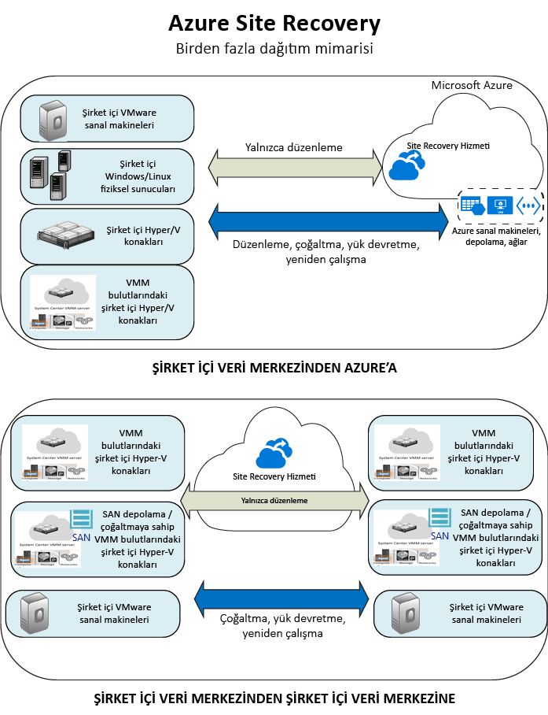

<properties
    pageTitle="Site Recovery nedir? | Microsoft Azure"
    description="Bu sayfada, Azure Site Recovery hizmetine genel bir bakış sağlanmış ve dağıtım senaryoları özetlenmiştir."
    services="site-recovery"
    documentationCenter=""
    authors="rayne-wiselman"
    manager="cfreeman"
    editor=""/>

<tags
    ms.service="site-recovery"
    ms.devlang="na"
    ms.topic="get-started-article"
    ms.tgt_pltfrm="na"
    ms.workload="storage-backup-recovery"
    ms.date="10/13/2016"
    ms.author="raynew"/>

#  Site Recovery nedir?

Azure Site Recovery'ye hoş geldiniz! Bu makalede, Site Recovery hizmeti ve işlerinize nasıl katkı sağlayacağına ilişkin genel bir bakış sunulmuştur.

Kuruluşunuz; uygulamaları, iş yüklerini ve verileri planlanmış ve planlanmamış kesinti süreleri içinde güvenli ve kullanılabilir durumda tutan ve mümkün olan en kısa zamanda normal çalışma koşullarına dönmenizi sağlayan bir iş sürekliliği ve olağanüstü durum kurtarma (BCDR) stratejisine ihtiyaç duyar. Site Recovery, bu stratejiye katkıda bulunan bir Azure hizmetidir.

Site Recovery, şirket içi fiziksel sunucularda ve sanal makinelerde çalışan iş yüklerinin çoğaltılmasını düzenler. Sunucuları ve VM’leri, birincil veri kaynağından buluta (Azure) veya ikincil veri merkezine çoğaltabilirsiniz. Kesinti birincil sitede meydana gelirse uygulamaları ve iş yüklerini erişilebilir ve kullanılabilir durumda tutmak için ikincil siteye yük devredersiniz. Normal çalışma koşullarına dönüldüğünde de yükü birincil konuma geri alabilirsiniz.

## Azure portalında Site Recovery

Azure’da kaynak oluşturmak ve bunlarla çalışmak için iki farklı [dağıtım modeli](../resource-manager-deployment-model.md) vardır. Azure Resource Manager modeli ve klasik hizmet yönetim modeli. Ayrıca Azure iki portala sahiptir: Klasik dağıtım modelini destekleyen [klasik Azure portalı](https://manage.windowsazure.com/) ve hem klasik modele hem de Resource Manager modeline destek sağlayan [Azure portal](https://portal.azure.com).

- Site Recovery hem klasik portalda hem de Azure portalında kullanılabilir.
- Klasik Azure portalında, klasik hizmet yönetim modeliyle Site Recovery’yi destekleyebilirsiniz.
- Azure portal’da, klasik modeli veya Resource Manager dağıtımlarını destekleyebilirsiniz. 

Bu makaledeki bilgiler hem klasik hem de Azure portalı dağıtımları için geçerlidir. Geçerli olduğu yerlerde farklılıklar belirtilmiştir.

## Neden Site Recovery’yi dağıtayım?

Site Recovery'nin sağladığı avantajlar şunlardır:

- **BCDR sisteminizi basitleştirme** - Azure portal’da tek bir konumdan birden çok iş yükünün çoğaltılmasını, yük devretmesini ve kurtarılmasını yönetebilirsiniz. Site Recovery, çoğaltma ve yük devretme işlemlerini düzenler ancak uygulama verilerinize müdahale etmez veya uygulamanız hakkında bilgiler toplamaz.
- **Esnek çoğaltma sağlama** - Site Recovery’yi kullanarak Hyper-V VM’lerinde, VMware VM’lerinde ve Windows/Linux fiziksel sunucularında çalışan iş yüklerini çoğaltabilirsiniz.
- **Kolay çoğaltma testi yapma** - Site Recovery, üretim ortamlarını etkilemeden olağanüstü durum kurtarma ayrıntılarını desteklemek için yük devretme testleri sunar.
- **Yük devretme ve kurtarma** - Beklenen kesintilere yönelik olarak sıfır veri kaybı sunan planlanan yük devretmeler veya beklenmeyen olağanüstü durumlar için minimum düzeyde veri kaybıyla sonuçlanan (çoğaltma sıklığına bağlı olarak) planlanmamış yük devretmeler çalıştırabilirsiniz. Yük devretmenin ardından birincil sitelerinizde yeniden çalışma işlemini gerçekleştirebilirsiniz. Yük devretme işlemini özelleştirebilmeniz ve çok katmanlı uygulamaları kurtarabilmeniz için Site Recovery, betikleri ve Azure otomasyonu çalışma kitaplarını içeren kurtarma planları sunar.
- **İkincil veri merkezini kaldırma** - İş yüklerini, ikincil bir site yerine Azure’a çoğaltabilirsiniz. Bu, ikincil bir veri merkezi kullanmanın maliyetini ve karmaşıklığını ortadan kaldırır. Çoğaltılan veriler, sunduğu tüm esneklikle birlikte Azure Depolama’da depolanır. Yük devretme gerçekleştiğinde çoğaltılan verilerle VM’ler oluşturulur.
- **Mevcut BCDR teknolojileri ile tümleştirme** - Site Recovery, diğer BCDR özellikleriyle tümleşir. Örneğin, kullanılabilir grupların yük devretme işlemlerini yönetmek amacıyla SQL Server AlwaysOn yerel desteği dahil olmak üzere kurumsal iş yüklerinin SWL Server arka ucunu korumak için Site Recovery'yi kullanabilirsiniz.

## Neleri çoğaltabilirim?

Site Recovery kullanarak çoğaltabileceğiniz öğelerin özeti aşağıda verilmiştir.

**ÇOĞALTILAN** | **ÇOĞALTMA HEDEFİ** 
---|---
Şirket içi VMware VM'lerinde çalışan iş yükleri | [Azure](site-recovery-vmware-to-azure-classic.md)   [İkincil site](site-recovery-vmware-to-vmware.md)
VMM bulutlarında yönetilen şirket içi Hyper-V VM’lerinde çalışan iş yükleri  | [Azure](site-recovery-vmm-to-azure.md)   [İkincil site](site-recovery-vmm-to-vmm.md) 
SAN depolama alanı ile birlikte VMM bulutlarında yönetilen şirket içi Hyper-V VM’lerinde çalışan iş yükleri|  [İkincil site](site-recovery-vmm-san.md)
VMM olmadan şirket içi Hyper-V VM’lerinde çalışan iş yükleri | [Azure](site-recovery-hyper-v-site-to-azure.md)
Şirket içi fiziksel Windows/Linux sunucuları üzerinde çalışan iş yükleri | [Azure](site-recovery-vmware-to-azure-classic.md)   [İkincil site](site-recovery-vmware-to-vmware.md)

## Hangi iş yüklerini koruyabilirim?

Site Recovery uygulamayla tutarlı BCDR sağladığından iş yükleri ve uygulamalar kesinti olduğunda tutarlı bir şekilde çalışmaya devam eder. Site Recovery şunları sağlar:

- **Uygulamayla tutarlı anlık görüntüler** - Makineler, tek veya çok katmanlı uygulamalara yönelik uygulamayla tutarlı anlık görüntüler kullanılarak çoğaltılır. Uygulamayla tutarlı anlık görüntüler, disk verilerinin yanı sıra bellekteki tüm verileri ve devam eden tüm işlemleri yakalar.
- **Yakın zaman uyumlu çoğaltma** - Site Recovery, Hyper-V için düşük çoğaltma sıklığı (30 saniye) ve VMware için sürekli çoğaltma sağlar.
- **Esnek kurtarma planları** - Dış betikler ve el ile yapılan eylemlerle kurtarma planlarını oluşturabilir ve özelleştirebilirsiniz. Azure Otomasyonu runbook’ları ile tümleştirme, bir uygulama yığının tamamını tek bir tıklamayla kurtarmanızı sağlar.
- **SQL Server AlwaysOn ile tümleştirme** - Site Recovery kurtarma planlarında kullanılabilir grupların yük devretme işlemlerini yönetebilirsiniz.
- **Automation kitaplığı** - Zengin Azure Automation kitaplığı, indirilebilen ve Site Recovery ile tümleştirilebilen üretime hazır ve uygulamaya özgü betikler sağlar.
- **Basit ağ yönetimi** - Site Recovery'deki gelişmiş ağ yönetimi ve Azure; IP adresini koruma, yük dengeleyicileri yapılandırma ve etkili ağ değişimleri için Azure Traffic Manager ile tümleştirme dahil olmak üzere uygulama ağ gereksinimlerini basitleştirir.

## Sonraki adımlar

- [Site Recovery hangi iş yüklerini koruyabilir?](site-recovery-workload.md) başlığından daha fazla bilgi edinin.
- [Site Recovery nasıl çalışır?](site-recovery-components.md) başlığından Site Recovery mimarisi hakkında daha fazla bilgi edinin.
 

<!--HONumber=Oct16_HO3-->

