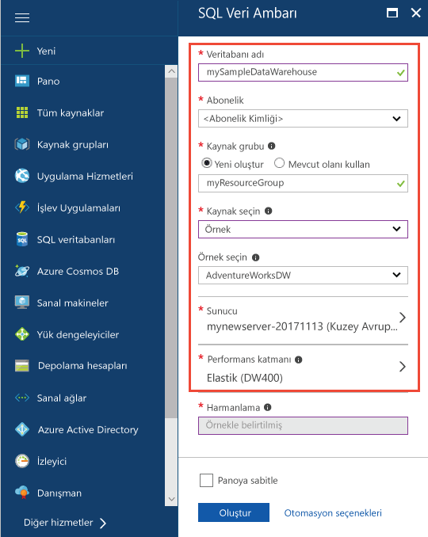
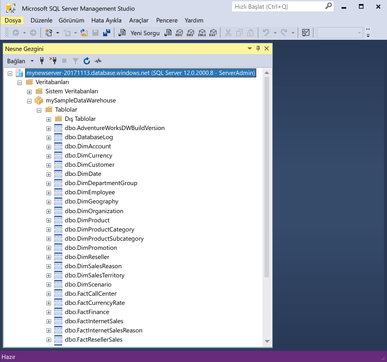
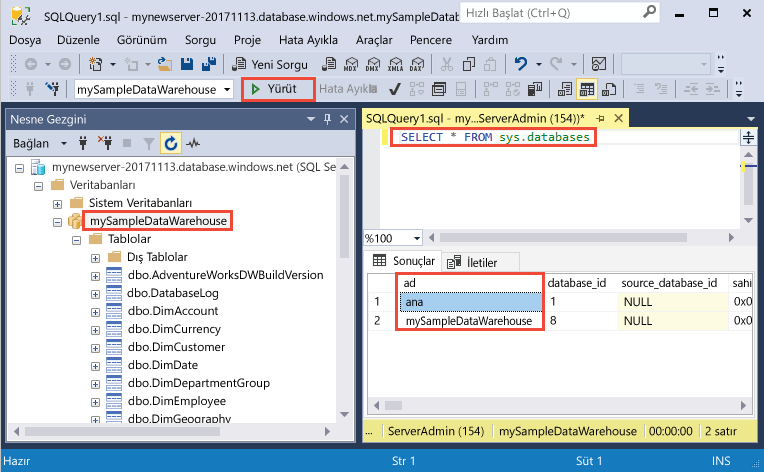
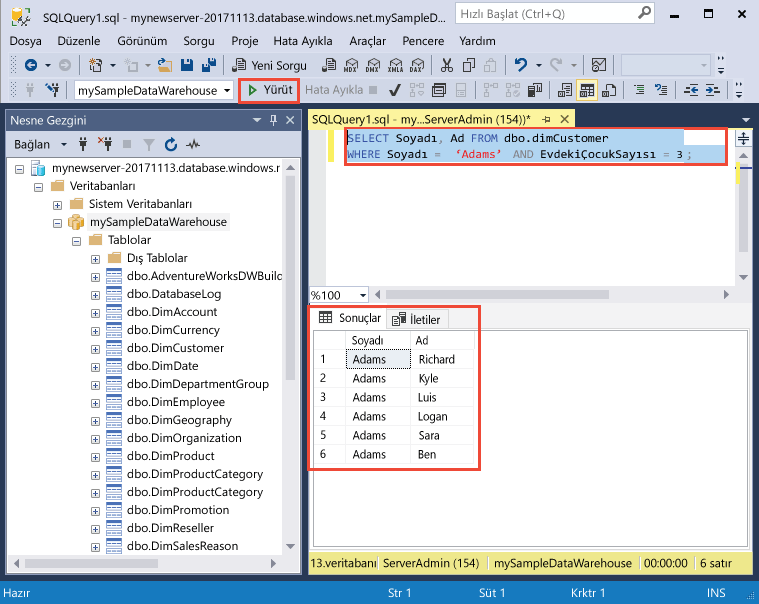

# <a name="quickstart-create-and-query-an-azure-sql-data-warehouse-in-the-azure-portal"></a>Hızlı Başlangıç: Azure portalında Azure SQL veri ambarı oluşturma ve sorgulama

Hızla oluşturun ve Azure portalını kullanarak Azure SQL veri ambarı sorgusu.

Azure aboneliğiniz yoksa başlamadan önce [ücretsiz](https://azure.microsoft.com/free/) bir hesap oluşturun.

> [!NOTE]
> Bir SQL Veri Ambarı'nın oluşturulması ek hizmet ücretlerinin alınmasına neden olabilir. Ayrıntılı bilgi için bkz. [SQL Veri Ambarı fiyatlandırması](https://azure.microsoft.com/pricing/details/sql-data-warehouse/).

## <a name="before-you-begin"></a>Başlamadan önce

[SQL Server Management Studio](/sql/ssms/download-sql-server-management-studio-ssms)’nun (SSMS) en yeni sürümünü indirin ve yükleyin.

## <a name="sign-in-to-the-azure-portal"></a>Azure portalında oturum açın

[Azure Portal](https://portal.azure.com/) oturum açın.

## <a name="create-a-data-warehouse"></a>Veri ambarı oluşturma

Azure SQL veri ambarı bir dizi [işlem kaynağı](memory-and-concurrency-limits.md) ile oluşturulur. Veritabanı bir [Azure kaynak grubu](../azure-resource-manager/resource-group-overview.md) ve bir [Azure SQL mantıksal sunucusu](../sql-database/sql-database-logical-servers.md) içinde oluşturulur. 

AdventureWorksDW örnek verileri içeren bir SQL veri ambarı oluşturmak için bu adımları izleyin. 

1. Azure portalının sol üst köşesinde bulunan **Kaynak oluştur** öğesine tıklayın.

2. **Yeni** sayfasından **Veritabanları**’nı seçin ve **Yeni** sayfasında **Öne Çıkan** altından **SQL Veri Ambarı**’nı seçin.

    

3. SQL Veri Ambarı formunu aşağıdaki bilgilerle doldurun:

    | Ayar | Önerilen değer | Açıklama |
    | :------ | :-------------- | :---------- |
    | **Veritabanı adı** | mySampleDataWarehouse | Geçerli veritabanı adları için bkz. [Veritabanı Tanımlayıcıları](/sql/relational-databases/databases/database-identifiers). Veri ambarının bir veritabanı türü olduğuna dikkat edin.|
    | **Abonelik** | Aboneliğiniz | Abonelikleriniz hakkında daha ayrıntılı bilgi için bkz. [Abonelikler](https://account.windowsazure.com/Subscriptions). |
    | **Kaynak grubu** | myResourceGroup | Geçerli kaynak grubu adları için bkz. [Adlandırma kuralları ve kısıtlamalar](https://docs.microsoft.com/azure/architecture/best-practices/naming-conventions). |
    | **Kaynak seçme** | Örnek | Örnek bir veritabanı yüklemek için belirtir. Veri ambarının bir veritabanı türü olduğuna dikkat edin. |
    | **Örnek seçme** | AdventureWorksDW | AdventureWorksDW örnek veritabanını yüklemeyi belirtir. |
    ||||

    

4. Yeni veritabanınız için yeni bir sunucu oluşturup yapılandırmak üzere **Sunucu**’ya tıklayın. **Yeni sunucu formu**’nu aşağıdaki bilgilerle doldurun: 

    | Ayar | Önerilen değer | Açıklama |
    | :------ | :-------------- | :---------- |
    | **Sunucu adı** | Genel olarak benzersiz bir ad | Geçerli sunucu adları için bkz. [Adlandırma kuralları ve kısıtlamalar](https://docs.microsoft.com/azure/architecture/best-practices/naming-conventions). |
    | **Sunucu yöneticisi oturum açma bilgileri** | Geçerli bir ad | Geçerli oturum açma adları için bkz. [Veritabanı Tanımlayıcıları](https://docs.microsoft.com/sql/relational-databases/databases/database-identifiers).|
    | **Parola** | Geçerli bir parola | Parolanızda en az 8 karakter bulunmalı ve parolanız şu üç kategoriden karakterler içermelidir: büyük harf karakterler, küçük harf karakterler, sayılar ve alfasayısal olmayan karakterler. |
    | **Konum** | Geçerli bir konum | Bölgeler hakkında bilgi için bkz. [Azure Bölgeleri](https://azure.microsoft.com/regions/). |
    ||||

    

5. **Seç**'e tıklayın.

6. Tıklayın **performans düzeyi** veri ambarı için performans yapılandırmasını belirtmek için.

7. Bu öğreticide, seçin **Gen2**. Kaydırıcı varsayılan olarak ayarlanmış **DW1000c**. Nasıl çalıştığını görmek için yukarı ve aşağı taşımayı deneyin. 

    

8. **Uygula**'ya tıklayın.

9. SQL veri ambarı formunu tamamladığınıza göre tıklayın **Oluştur** veritabanını sağlamak için. Sağlama birkaç dakika sürer. 

    

10. Araç çubuğunda **Bildirimler**’e tıklayarak dağıtım işlemini izleyin.
    
     

## <a name="create-a-server-level-firewall-rule"></a>Sunucu düzeyinde bir güvenlik duvarı kuralı oluşturma

SQL Veri Ambarı hizmeti, dış uygulama ve araçların sunucuya ya da sunucu üzerindeki herhangi bir veritabanına bağlanmasını engelleyen sunucu düzeyinde bir güvenlik duvarı kuralı oluşturur. Bağlantıyı etkinleştirmek için, belirli IP adresleri için bağlantıyı etkinleştiren güvenlik duvarı kuralları ekleyebilirsiniz. İstemcinizin IP adresine yönelik bir [sunucu düzeyi güvenlik duvarı kuralı](../sql-database/sql-database-firewall-configure.md) oluşturmak için bu adımları izleyin. 

> [!NOTE]
> SQL Veri Ambarı 1433 numaralı bağlantı noktası üzerinden iletişim kurar. Kurumsal ağ içinden bağlanmaya çalışıyorsanız, ağınızın güvenlik duvarı tarafından 1433 numaralı bağlantı noktası üzerinden giden trafiğe izin verilmiyor olabilir. Bu durumda BT departmanınız 1433 numaralı bağlantı noktasını açmadığı sürece Azure SQL Veritabanı sunucunuza bağlanamazsınız.

1. Dağıtım tamamlandıktan sonra tıklayın **SQL veri ambarları** 'a tıklayın ve sol taraftaki menüden **mySampleDatabase** üzerinde **SQL veri ambarları** sayfası. Veritabanınıza ilişkin genel bakış sayfası açılır ve tam sunucu adını gösteren (gibi **mynewserver-20180430.database.windows.net**) ve daha fazla yapılandırma seçenekleri sağlar. 

2. Sonraki hızlı başlangıçlarda sunucunuza ve veritabanlarına bağlanmak için bu tam sunucu adını kopyalayın. Sunucu ayarlarını açmak için sunucu adına tıklayın.

    

3. Sunucu ayarlarını açmak için, 
4. sunucu adına tıklayın.

    

5. **Güvenlik duvarı ayarlarını göster**’e tıklayın. SQL Veritabanı sunucusu için **Güvenlik duvarı ayarları** sayfası açılır. 

    

4. Geçerli IP adresinizi yeni bir güvenlik duvarı kuralına eklemek için araç çubuğunda **İstemci IP’si Ekle** öğesine tıklayın. Güvenlik duvarı kuralı, 1433 numaralı bağlantı noktasını tek bir IP adresi veya bir IP adresi aralığı için açabilir.

5. **Kaydet**’e tıklayın. Geçerli IP adresiniz için mantıksal sunucuda 1433 numaralı bağlantı noktası açılarak sunucu düzeyinde güvenlik duvarı kuralı oluşturulur.

6. **Tamam**’a tıklayın ve sonra **Güvenlik duvarı ayarları** sayfasını kapatın.

Şimdi bu IP adresini kullanarak SQL sunucusuna ve veri ambarlarına bağlanabilirsiniz. Bağlantı SQL Server Management Studio’dan veya seçtiğiniz diğer bir araçtan çalışır. Bağlandığınızda, daha önce oluşturduğunuz ServerAdmin hesabını kullanın.

> [!IMPORTANT]
> Varsayılan olarak, SQL Veritabanı güvenlik duvarı üzerinden erişim tüm Azure hizmetleri için etkindir. Tüm Azure hizmetleri için güvenlik duvarını kapatmak üzere bu sayfada **KAPALI**’ya ve ardından **Kaydet**’e tıklayın.

## <a name="get-the-fully-qualified-server-name"></a>Tam sunucu adını alma

SQL sunucunuzun tam sunucu adını Azure portalından alabilirsiniz. Daha sonra sunucuya bağlanırken tam adı kullanırsınız.

1. [Azure Portal](https://portal.azure.com/) oturum açın.
2. Seçin **SQL veri ambarları** sol taraftaki menüden, ve veri ambarınız üzerinde **SQL datawarehouses** sayfası. 
3. Veritabanınızın Azure portal sayfasındaki **Temel Bilgiler** bölmesinde, **Sunucu adını** bulup kopyalayın. Bu örnekte, tam ad mynewserver-20180430.database.windows.net ' dir. 

    

## <a name="connect-to-the-server-as-server-admin"></a>Sunucu yöneticisi olarak sunucuya bağlanma

Bu bölümde Azure SQL sunucunuzla bağlantı kurmak için [SQL Server Management Studio](/sql/ssms/download-sql-server-management-studio-ssms) (SSMS) kullanılmaktadır.

1. SQL Server Management Studio’yu açın.

2. **Sunucuya Bağlan** iletişim kutusuna şu bilgileri girin:

   | Ayar | Önerilen değer | Açıklama |
   | :------ | :-------------- | :---------- |
   | Sunucu türü | Veritabanı altyapısı | Bu değer gereklidir |
   | Sunucu adı | Tam sunucu adı | Bir örnek aşağıda verilmiştir: **mynewserver-20180430.database.windows.net**. |
   | Kimlik Doğrulaması | SQL Server Kimlik Doğrulaması | Bu öğreticide yapılandırılan tek kimlik doğrulaması türü SQL Kimlik Doğrulamasıdır. |
   | Oturum Aç | Sunucu yöneticisi hesabı | Bu, sunucuyu oluştururken belirttiğiniz hesaptır. |
   | Parola | Sunucu yöneticisi hesabınızın parolası | Bu, sunucuyu oluştururken belirttiğiniz paroladır. |
   ||||

    

3. **Bağlan**'a tıklayın. SSMS’te Nesne Gezgini penceresi açılır. 

4. Nesne Gezgini’nde, **Veritabanları**’nı genişletin. Daha sonra yeni veritabanınızdaki nesneleri görüntülemek için **mySampleDatabase**’i genişletin.

     

## <a name="run-some-queries"></a>Sorgular çalıştırma

SQL Veri Ambarı sorgu dili olarak T-SQL kullanır. Bir sorgu penceresi açıp T-SQL sorguları çalıştırmak için, aşağıdaki adımları kullanın:

1. **mySampleDataWarehouse**’a sağ tıklayıp **Yeni Sorgu**’yu seçin. Yeni bir sorgu penceresi açılır.
2. Sorgu penceresinde, veritabanlarının listesini görmek için aşağıdaki komutu girin.

    ```sql
    SELECT * FROM sys.databases
    ```

3. **Yürüt**'e tıklayın. Sorgu sonuçları iki veritabanı gösterir: **master** ve **mySampleDataWarehouse**.

    

4. Verilere bakmak için, Adams soyadına sahip ve üç çocuğu olan müşteri sayısını görmek için aşağıdaki komutu kullanın. Sonuçlarda altı müşteri listelenir. 

    ```sql
    SELECT LastName, FirstName FROM dbo.dimCustomer
    WHERE LastName = 'Adams' AND NumberChildrenAtHome = 3;
    ```

    

## <a name="clean-up-resources"></a>Kaynakları temizleme

Veri ambarı birimleri ve veri ambarınızda depolanan veriler için ücretlendirilirsiniz. Bu işlem ve depolama alanı kaynakları ayrı ayrı faturalandırılır. 

- Verileri depoda tutmak istiyorsanız, veri ambarını kullanmadığınız zamanlarda işlemi duraklatabilirsiniz. İşlemi duraklatarak, yalnızca veri depolama için ücretlendirilirsiniz. Verilerle çalışmak için hazır olduğunuzda işlemi sürdürebilirsiniz.
- Gelecekteki ücretlendirmeleri kaldırmak istiyorsanız, veri ambarını silebilirsiniz. 

Kaynakları istediğiniz gibi temizlemek için bu adımları izleyin.

1. [Azure portalında](https://portal.azure.com) oturum açıp veri ambarınıza tıklayın.

    

2. İşlemi duraklatmak için, **Duraklat** düğmesine tıklayın. Veri ambarı duraklatıldığında, bir **Başlat** düğmesi görürsünüz. İşlemi sürdürmek için **Başlat**’a tıklayın.

3. İşlem veya depolama için ücretlendirilmemek üzere veri ambarını kaldırmak için **Sil**’e tıklayın.

4. Oluşturduğunuz SQL sunucusunu kaldırmak için tıklayın **mynewserver-20180430.database.windows.net** önceki görüntüde ve ardından **Sil**. Sunucuyu silmek sunucuyla ilişkili tüm veritabanlarını da sileceğinden bu silme işlemini gerçekleştirirken dikkatli olun.

5. Kaynak grubunu kaldırmak için, **myResourceGroup**’a tıklayıp daha sonra **Kaynak grubunu sil**’e tıklayın.

## <a name="next-steps"></a>Sonraki adımlar

Şimdi bir veri ambarı oluşturdunuz, bir güvenlik duvarı kuralı oluşturdunuz, veri ambarınıza bağlandınız ve birkaç sorgu çalıştırdınız. Azure SQL Veri Ambarı hakkında daha fazla bilgi edinmek için, veri yükleme öğreticisiyle devam edin.

> [!div class="nextstepaction"]
> [SQL veri ambarına veri yükleme](load-data-from-azure-blob-storage-using-polybase.md)
