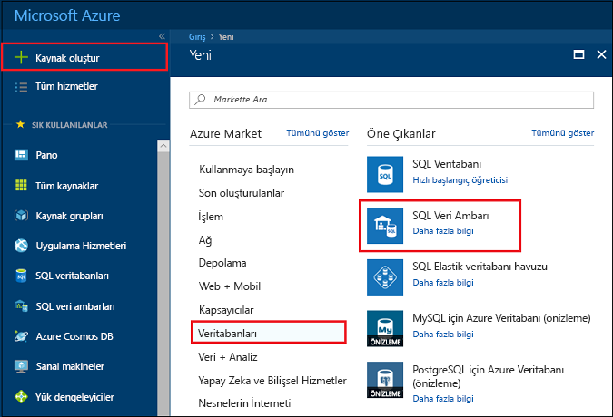
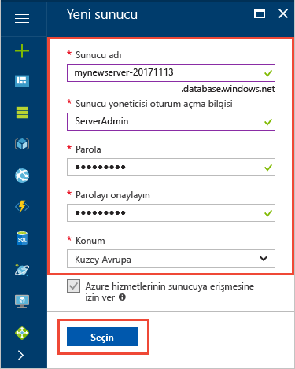
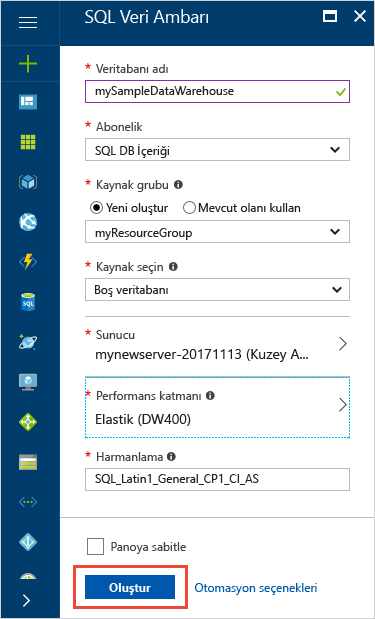
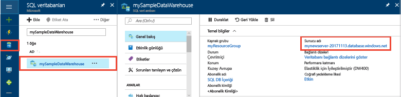
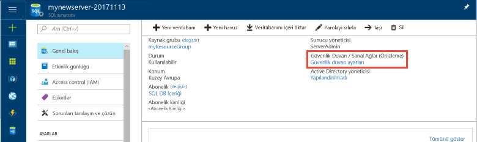
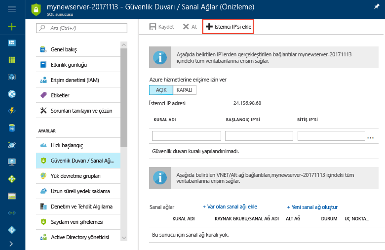
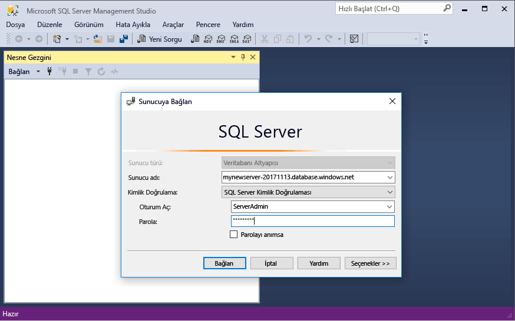

# <a name="tutorial-load-new-york-taxicab-data-to-azure-sql-data-warehouse"></a>Öğretici: New York taksi verilerini Azure SQL veri ambarı'nı yükleme

Bu öğretici kullanan New York taksi verilerini genel kullanıma yüklemek için PolyBase Azure SQL veri ambarı için Azure blob. Öğreticide aşağıdaki işlemler için [Azure Portal](https://portal.azure.com) ve [SQL Server Management Studio](/sql/ssms/download-sql-server-management-studio-ssms) (SSMS) kullanılır: 

> [!div class="checklist"]
> * Azure Portal'da veri ambarı oluşturma
> * Azure Portal'da sunucu düzeyinde bir güvenlik duvarı kuralı ayarlama
> * SSMS ile veri ambarına bağlanma
> * Verileri yüklemek için belirlenen bir kullanıcı oluşturma
> * Azure blob depolama alanında veriler için dış tablolar oluşturma
> * Verileri veri ambarınıza yüklemek için CTAS T-SQL deyimini kullanma
> * Yüklendikleri sırada verilerin ilerleme durumunu görüntüleme
> * Yeni yüklenen verilere ilişkin istatistikler oluşturma

Azure aboneliğiniz yoksa başlamadan önce [ücretsiz bir hesap oluşturun](https://azure.microsoft.com/free/).

## <a name="before-you-begin"></a>Başlamadan önce

Bu öğreticiye başlamadan önce, [SQL Server Management Studio](/sql/ssms/download-sql-server-management-studio-ssms)’nun (SSMS) en yeni sürümünü indirin ve yükleyin.


## <a name="log-in-to-the-azure-portal"></a>Azure portalında oturum açma

[Azure Portal](https://portal.azure.com/)’da oturum açın.

## <a name="create-a-blank-sql-data-warehouse"></a>Boş bir SQL veri ambarı oluşturma

Azure SQL veri ambarı bir dizi [işlem kaynağı](memory-and-concurrency-limits.md) ile oluşturulur. Veritabanı bir [Azure kaynak grubu](../azure-resource-manager/resource-group-overview.md) ve bir [Azure SQL mantıksal sunucusu](../sql-database/sql-database-features.md) içinde oluşturulur. 

Boş bir SQL veri ambarı oluşturmak için aşağıdaki adımları izleyin. 

1. Azure portalının sol üst köşesinde bulunan **Kaynak oluştur** öğesine tıklayın.

2. **Yeni** sayfasından **Veritabanları**’nı seçin ve **Yeni** sayfasında **Öne Çıkan** altından **SQL Veri Ambarı**’nı seçin.

    

3. SQL Veri Ambarı formunu aşağıdaki bilgilerle doldurun:   

   | Ayar | Önerilen değer | Açıklama | 
   | ------- | --------------- | ----------- | 
   | **Veritabanı adı** | mySampleDataWarehouse | Geçerli veritabanı adları için bkz. [Veritabanı Tanımlayıcıları](/sql/relational-databases/databases/database-identifiers). | 
   | **Abonelik** | Aboneliğiniz  | Abonelikleriniz hakkında daha ayrıntılı bilgi için bkz. [Abonelikler](https://account.windowsazure.com/Subscriptions). |
   | **Kaynak grubu** | myResourceGroup | Geçerli kaynak grubu adları için bkz. [Adlandırma kuralları ve kısıtlamalar](https://docs.microsoft.com/azure/architecture/best-practices/naming-conventions). |
   | **Kaynak seçme** | Boş veritabanı | Boş bir veritabanı oluşturulacağını belirtir. Veri ambarının bir veritabanı türü olduğuna dikkat edin.|

    

4. Yeni veritabanınız için yeni bir sunucu oluşturup yapılandırmak üzere **Sunucu**’ya tıklayın. **Yeni sunucu formu**’nu aşağıdaki bilgilerle doldurun: 

    | Ayar | Önerilen değer | Açıklama | 
    | ------- | --------------- | ----------- |
    | **Sunucu adı** | Genel olarak benzersiz bir ad | Geçerli sunucu adları için bkz. [Adlandırma kuralları ve kısıtlamalar](https://docs.microsoft.com/azure/architecture/best-practices/naming-conventions). | 
    | **Sunucu yöneticisi oturum açma bilgileri** | Geçerli bir ad | Geçerli oturum açma adları için bkz. [Veritabanı Tanımlayıcıları](https://docs.microsoft.com/sql/relational-databases/databases/database-identifiers).|
    | **Parola** | Geçerli bir parola | Parolanızda en az 8 karakter bulunmalı ve parolanız şu üç kategoriden karakterler içermelidir: büyük harf karakterler, küçük harf karakterler, sayılar ve alfasayısal olmayan karakterler. |
    | **Konum** | Geçerli bir konum | Bölgeler hakkında bilgi için bkz. [Azure Bölgeleri](https://azure.microsoft.com/regions/). |

    

5. **Seç**'e tıklayın.

6. Tıklayın **performans düzeyi** veri ambarı Gen1 veya 2. nesil ve sayı veri ambarı birimleri olup olmadığını belirtmek için. 

7. Bu öğreticide, seçin **Gen2** SQL veri ambarı. Kaydırıcı kümesine **DW1000c** varsayılan olarak.  Nasıl çalıştığını görmek için yukarı ve aşağı taşımayı deneyin. 

    

8. **Uygula**'ya tıklayın.
9. SQL Veri Ambarı sayfasında, boş veritabanı için bir **harmanlama** seçin. Bu öğreticide varsayılan değeri kullanın. Harmanlamalar hakkında daha fazla bilgi için bkz. [Harmanlamalar](/sql/t-sql/statements/collations)

11. SQL Veritabanı formunu tamamladıktan sonra veritabanını sağlamak için **Oluştur**’a tıklayın. Sağlama birkaç dakika sürer. 

    

12. Araç çubuğunda **Bildirimler**’e tıklayarak dağıtım işlemini izleyin.
    
     

## <a name="create-a-server-level-firewall-rule"></a>Sunucu düzeyinde bir güvenlik duvarı kuralı oluşturma

SQL Veri Ambarı hizmeti, dış uygulama ve araçların sunucuya ya da sunucu üzerindeki herhangi bir veritabanına bağlanmasını engelleyen sunucu düzeyinde bir güvenlik duvarı kuralı oluşturur. Bağlantıyı etkinleştirmek için, belirli IP adresleri için bağlantıyı etkinleştiren güvenlik duvarı kuralları ekleyebilirsiniz.  İstemcinizin IP adresine yönelik bir [sunucu düzeyi güvenlik duvarı kuralı](../sql-database/sql-database-firewall-configure.md) oluşturmak için bu adımları izleyin. 

> [!NOTE]
> SQL Veri Ambarı 1433 numaralı bağlantı noktası üzerinden iletişim kurar. Kurumsal ağ içinden bağlanmaya çalışıyorsanız, ağınızın güvenlik duvarı tarafından 1433 numaralı bağlantı noktası üzerinden giden trafiğe izin verilmiyor olabilir. Bu durumda BT departmanınız 1433 numaralı bağlantı noktasını açmadığı sürece Azure SQL Veritabanı sunucunuza bağlanamazsınız.
>

1. Dağıtım tamamlandıktan sonra, soldaki menüden **SQL veritabanları**'na ve ardından **SQL veritabanları** sayfasında **mySampleDatabase** öğesine tıklayın. Veritabanınıza ilişkin genel bakış sayfası açılır ve tam sunucu adını gösteren (gibi **mynewserver-20180430.database.windows.net**) ve daha fazla yapılandırma seçenekleri sağlar. 

2. Sonraki hızlı başlangıçlarda sunucunuza ve veritabanlarına bağlanmak için bu tam sunucu adını kopyalayın. Ardından sunucu adına tıklayarak sunucu ayarlarını açın.

     

3. Sunucu ayarlarını açmak için sunucu adına tıklayın.

     

5. **Güvenlik duvarı ayarlarını göster**’e tıklayın. SQL Veritabanı sunucusu için **Güvenlik duvarı ayarları** sayfası açılır. 

     

4. Geçerli IP adresinizi yeni bir güvenlik duvarı kuralına eklemek için araç çubuğunda **İstemci IP’si Ekle** öğesine tıklayın. Güvenlik duvarı kuralı, 1433 numaralı bağlantı noktasını tek bir IP adresi veya bir IP adresi aralığı için açabilir.

5. **Kaydet**’e tıklayın. Geçerli IP adresiniz için mantıksal sunucuda 1433 numaralı bağlantı noktası açılarak sunucu düzeyinde güvenlik duvarı kuralı oluşturulur.

6. **Tamam**’a tıklayın ve sonra **Güvenlik duvarı ayarları** sayfasını kapatın.

Şimdi bu IP adresini kullanarak SQL sunucusuna ve veri ambarlarına bağlanabilirsiniz. Bağlantı SQL Server Management Studio’dan veya seçtiğiniz diğer bir araçtan çalışır. Bağlandığınızda, daha önce oluşturduğunuz ServerAdmin hesabını kullanın.  

> [!IMPORTANT]
> Varsayılan olarak, SQL Veritabanı güvenlik duvarı üzerinden erişim tüm Azure hizmetleri için etkindir. Tüm Azure hizmetleri için güvenlik duvarını kapatmak üzere bu sayfada **KAPALI**’ya ve ardından **Kaydet**’e tıklayın.

## <a name="get-the-fully-qualified-server-name"></a>Tam sunucu adını alma

SQL sunucunuzun tam sunucu adını Azure portalından alabilirsiniz. Daha sonra sunucuya bağlanırken tam adı kullanacaksınız.

1. [Azure Portal](https://portal.azure.com/)’da oturum açın.
2. Seçin **SQL veri ambarları** sol menüdeki ve veritabanınıza tıklayın **SQL veri ambarları** sayfası. 
3. Veritabanınızın Azure portal sayfasındaki **Temel Bilgiler** bölmesinde, **Sunucu adını** bulup kopyalayın. Bu örnekte, tam ad mynewserver-20180430.database.windows.net ' dir. 

      

## <a name="connect-to-the-server-as-server-admin"></a>Sunucu yöneticisi olarak sunucuya bağlanma

Bu bölümde Azure SQL sunucunuzla bağlantı kurmak için [SQL Server Management Studio](/sql/ssms/download-sql-server-management-studio-ssms) (SSMS) kullanılmaktadır.

1. SQL Server Management Studio’yu açın.

2. **Sunucuya Bağlan** iletişim kutusuna şu bilgileri girin:

    | Ayar      | Önerilen değer | Açıklama | 
    | ------------ | --------------- | ----------- | 
    | Sunucu türü | Veritabanı altyapısı | Bu değer gereklidir |
    | Sunucu adı | Tam sunucu adı | Ad şunun gibi olmalıdır: **mynewserver-20180430.database.windows.net**. |
    | Kimlik Doğrulaması | SQL Server Kimlik Doğrulaması | Bu öğreticide yapılandırdığımız tek kimlik doğrulaması türü SQL Kimlik Doğrulamasıdır. |
    | Oturum Aç | Sunucu yöneticisi hesabı | Bu, sunucuyu oluştururken belirttiğiniz hesaptır. |
    | Parola | Sunucu yöneticisi hesabınızın parolası | Bu, sunucuyu oluştururken belirttiğiniz paroladır. |

    

4. **Bağlan**'a tıklayın. SSMS’te Nesne Gezgini penceresi açılır. 

5. Nesne Gezgini’nde, **Veritabanları**’nı genişletin. Ardından **Sistem veritabanları**'nı ve **asıl** öğesini genişleterek asıl veritabanındaki nesneleri görüntüleyin.  Yeni veritabanınızdaki nesneleri görüntülemek için **mySampleDatabase**’i genişletin.

     

## <a name="create-a-user-for-loading-data"></a>Verileri yüklemek için kullanıcı oluşturma

Sunucu yöneticisi hesabı yönetim işlemlerini gerçekleştirmeye yöneliktir ve kullanıcı verileri üzerinde sorgu çalıştırmaya uygun değildir. Verileri yükleme, yoğun bellek kullanan bir işlemdir. Bellek üst sınırları tanımlanmış hangi oluşturma, SQL veri ambarı göre sağladığınız, [veri ambarı birimleri](what-is-a-data-warehouse-unit-dwu-cdwu.md), ve [kaynak sınıfı](resource-classes-for-workload-management.md). 

En iyisi verileri yüklemeye ayrılmış bir oturum açma ve kullanıcı bilgisi oluşturmaktır. Ardından yükleme kullanıcısını uygun bir bellek ayırma üst sınırına olanak tanıyan bir [kaynak sınıfına](resource-classes-for-workload-management.md) ekleyin.

Şu anda sunucu yöneticisi olarak bağlandığınız için oturum açma bilgileri ve kullanıcılar oluşturabilirsiniz. Şu adımları kullanarak **LoaderRC20** adlı bir oturum açma bilgisi ve kullanıcı oluşturun. Sonra kullanıcıyı **staticrc20** kaynak sınıfına atayın. 

1.  SSMS'de, açılan menüyü görüntülemek için **asıl** öğesine sağ tıklayın ve **Yeni Sorgu**'yu seçin. Yeni bir sorgu penceresi açılır.

    

2. Sorgu penceresinde, şu T-SQL komutlarını girerek LoaderRC20 adlı bir oturum açma bilgisi ve kullanıcı oluşturun, 'a123STRONGpassword!' yerine kendi parolanızı girin. 

    ```sql
    CREATE LOGIN LoaderRC20 WITH PASSWORD = 'a123STRONGpassword!';
    CREATE USER LoaderRC20 FOR LOGIN LoaderRC20;
    ```

3. **Yürüt**'e tıklayın.

4. **mySampleDataWarehouse**’a sağ tıklayıp **Yeni Sorgu**’yu seçin. Yeni bir sorgu penceresi açılır.  

    
 
5. Aşağıdaki T-SQL komutlarını girerek LoaderRC20 oturum açma bilgisi için LoaderRC20 adlı bir veritabanı kullanıcısı oluşturun. İkinci satır, yeni kullanıcıya yeni veri ambarı üzerinde DENETİM izinleri verir.  Bu izinler, kullanıcıyı veritabanı sahibi yapmaya benzer. Üçüncü satır, yeni kullanıcı staticrc20 [kaynak sınıfına](resource-classes-for-workload-management.md) üye olarak ekler.

    ```sql
    CREATE USER LoaderRC20 FOR LOGIN LoaderRC20;
    GRANT CONTROL ON DATABASE::[mySampleDataWarehouse] to LoaderRC20;
    EXEC sp_addrolemember 'staticrc20', 'LoaderRC20';
    ```

6. **Yürüt**'e tıklayın.

## <a name="connect-to-the-server-as-the-loading-user"></a>Yükleme kullanıcısı olarak sunucuya bağlanma

Verileri yüklemenin ilk adımı LoaderRC20 olarak oturum açmaktır.  

1. Nesne Gezgini'nde **Bağlan** açılan menüsüne tıklayın ve **Veritabanı Altyapısı**'nı seçin. **Sunucuya Bağlan** iletişim kutusu görüntülenir.

    

2. Tam sunucu adını girin ve Oturum Açma bilgisi olarak **LoaderRC20** girin.  LoaderRC20 için parolanızı girin.

3. **Bağlan**'a tıklayın.

4. Bağlantınız hazır olduğunda, Nesne Gezgini'nde iki sunucu bağlantısı görürsünüz. Bağlantılardan biri ServerAdmin ve diğeri de MedRCLogin olarak gösterilir.

    

## <a name="create-external-tables-for-the-sample-data"></a>Örnek veriler için dış tablo oluşturma

Verileri yeni veri ambarınıza yükleme işlemine başlamaya hazırsınız. Bu öğreticide bir Azure depolama blobu'ndan New York taksi verilerini yüklemek için dış tablolar kullanmayı gösterir. [Yüklemeye genel bakış](sql-data-warehouse-overview-load.md) bölümünde, verilerinizi Azure blob depolama alanına alma veya doğrudan kaynağınızdan SQL Veri Ambarı’na yükleme konusunda ileride işinize yarayacak bilgiler edinebilirsiniz.

Aşağıdaki SQL betiklerini çalıştırın, yüklemek istediğiniz veriler hakkındaki bilgileri belirtin. Bu bilgiler verilerin konumu, verilerdeki içeriğin biçimi ve verilerin tablo tanımıdır. 

1. Önceki bölümde veri ambarınızda LoaderRC20 olarak oturum açmıştınız. SSMS'de, LoaderRC20 bağlantınıza sağ tıklayın ve **Yeni Sorgu**'yu seçin.  Yeni bir sorgu penceresi görüntülenir. 

    

2. Sorgu pencerenizi önceki resimle karşılaştırın.  Yeni sorgu pencerenizin LoaderRC20 olarak çalıştırıldığını ve MySampleDataWarehouse veritabanınız üzerinde sorgular gerçekleştirdiğini doğrulayın. Tüm yükleme adımlarını gerçekleştirmek için bu sorgu penceresini kullanın.

3. MySampleDataWarehouse veritabanı için bir ana anahtar oluşturun. Veritabanı başına yalnızca bir kez ana anahtar oluşturmanız gerekir. 

    ```sql
    CREATE MASTER KEY;
    ```

4. Aşağıdaki [CREATE EXTERNAL DATA SOURCE](/sql/t-sql/statements/create-external-data-source-transact-sql) deyimini çalıştırarak Azure blobunun konumunu tanımlayın. Bu, dış taksi verilerinin konumudur.  Sorgu penceresine eklediğiniz komutları çalıştırmak için, çalıştırmak istediğiniz komutları vurgulayın ve **Yürüt**'e tıklayın.

    ```sql
    CREATE EXTERNAL DATA SOURCE NYTPublic
    WITH
    (
        TYPE = Hadoop,
        LOCATION = 'wasbs://2013@nytaxiblob.blob.core.windows.net/'
    );
    ```

5. Aşağıdaki [CREATE EXTERNAL FILE FORMAT](/sql/t-sql/statements/create-external-file-format-transact-sql) T-SQL deyimini çalıştırarak dış veri dosyasının biçimlendirme özelliklerini ve seçeneklerini belirtin. Bu deyim dış verilerin metin olarak depolandığını ve değerlerin birbirinden dikey çizgi ('|') karakteriyle ayrıldığını belirtir. Dış dosya Gzip ile sıkıştırılır. 

    ```sql
    CREATE EXTERNAL FILE FORMAT uncompressedcsv
    WITH (
        FORMAT_TYPE = DELIMITEDTEXT,
        FORMAT_OPTIONS ( 
            FIELD_TERMINATOR = ',',
            STRING_DELIMITER = '',
            DATE_FORMAT = '',
            USE_TYPE_DEFAULT = False
        )
    );
    CREATE EXTERNAL FILE FORMAT compressedcsv
    WITH ( 
        FORMAT_TYPE = DELIMITEDTEXT,
        FORMAT_OPTIONS ( FIELD_TERMINATOR = '|',
            STRING_DELIMITER = '',
        DATE_FORMAT = '',
            USE_TYPE_DEFAULT = False
        ),
        DATA_COMPRESSION = 'org.apache.hadoop.io.compress.GzipCodec'
    );
    ```

6.  Aşağıdaki [CREATE SCHEMA](/sql/t-sql/statements/create-schema-transact-sql) deyimini çalıştırarak dış dosya biçiminiz için bir şema oluşturun. Şema, oluşturmak üzere olduğunuz dış tabloları düzenlemek için bir yol sağlar.

    ```sql
    CREATE SCHEMA ext;
    ```

7. Harici tabloları oluşturun. Tablo tanımları SQL Veri Ambarı'nda depolanır, ama tablolar Azure blob depolama alanında depolanan verilere başvurur. Aşağıdaki T-SQL komutlarını çalıştırarak, tamamı dış veri kaynağımızda daha önce tanımladığımız Azure blobunu işaret eden dış tablolar oluşturun.

    ```sql
    CREATE EXTERNAL TABLE [ext].[Date] 
    (
        [DateID] int NOT NULL,
        [Date] datetime NULL,
        [DateBKey] char(10) COLLATE SQL_Latin1_General_CP1_CI_AS NULL,
        [DayOfMonth] varchar(2) COLLATE SQL_Latin1_General_CP1_CI_AS NULL,
        [DaySuffix] varchar(4) COLLATE SQL_Latin1_General_CP1_CI_AS NULL,
        [DayName] varchar(9) COLLATE SQL_Latin1_General_CP1_CI_AS NULL,
        [DayOfWeek] char(1) COLLATE SQL_Latin1_General_CP1_CI_AS NULL,
        [DayOfWeekInMonth] varchar(2) COLLATE SQL_Latin1_General_CP1_CI_AS NULL,
        [DayOfWeekInYear] varchar(2) COLLATE SQL_Latin1_General_CP1_CI_AS NULL,
        [DayOfQuarter] varchar(3) COLLATE SQL_Latin1_General_CP1_CI_AS NULL,
        [DayOfYear] varchar(3) COLLATE SQL_Latin1_General_CP1_CI_AS NULL,
        [WeekOfMonth] varchar(1) COLLATE SQL_Latin1_General_CP1_CI_AS NULL,
        [WeekOfQuarter] varchar(2) COLLATE SQL_Latin1_General_CP1_CI_AS NULL,
        [WeekOfYear] varchar(2) COLLATE SQL_Latin1_General_CP1_CI_AS NULL,
        [Month] varchar(2) COLLATE SQL_Latin1_General_CP1_CI_AS NULL,
        [MonthName] varchar(9) COLLATE SQL_Latin1_General_CP1_CI_AS NULL,
        [MonthOfQuarter] varchar(2) COLLATE SQL_Latin1_General_CP1_CI_AS NULL,
        [Quarter] char(1) COLLATE SQL_Latin1_General_CP1_CI_AS NULL,
        [QuarterName] varchar(9) COLLATE SQL_Latin1_General_CP1_CI_AS NULL,
        [Year] char(4) COLLATE SQL_Latin1_General_CP1_CI_AS NULL,
        [YearName] char(7) COLLATE SQL_Latin1_General_CP1_CI_AS NULL,
        [MonthYear] char(10) COLLATE SQL_Latin1_General_CP1_CI_AS NULL,
        [MMYYYY] char(6) COLLATE SQL_Latin1_General_CP1_CI_AS NULL,
        [FirstDayOfMonth] date NULL,
        [LastDayOfMonth] date NULL,
        [FirstDayOfQuarter] date NULL,
        [LastDayOfQuarter] date NULL,
        [FirstDayOfYear] date NULL,
        [LastDayOfYear] date NULL,
        [IsHolidayUSA] bit NULL,
        [IsWeekday] bit NULL,
        [HolidayUSA] varchar(50) COLLATE SQL_Latin1_General_CP1_CI_AS NULL
    )
    WITH
    (
        LOCATION = 'Date',
        DATA_SOURCE = NYTPublic,
        FILE_FORMAT = uncompressedcsv,
        REJECT_TYPE = value,
        REJECT_VALUE = 0
    ); 
    CREATE EXTERNAL TABLE [ext].[Geography]
    (
        [GeographyID] int NOT NULL,
        [ZipCodeBKey] varchar(10) COLLATE SQL_Latin1_General_CP1_CI_AS NOT NULL,
        [County] varchar(50) COLLATE SQL_Latin1_General_CP1_CI_AS NULL,
        [City] varchar(50) COLLATE SQL_Latin1_General_CP1_CI_AS NULL,
        [State] varchar(50) COLLATE SQL_Latin1_General_CP1_CI_AS NULL,
        [Country] varchar(50) COLLATE SQL_Latin1_General_CP1_CI_AS NULL,
        [ZipCode] varchar(50) COLLATE SQL_Latin1_General_CP1_CI_AS NULL
    )
    WITH
    (
        LOCATION = 'Geography',
        DATA_SOURCE = NYTPublic,
        FILE_FORMAT = uncompressedcsv,
        REJECT_TYPE = value,
        REJECT_VALUE = 0 
    );      
    CREATE EXTERNAL TABLE [ext].[HackneyLicense]
    (
        [HackneyLicenseID] int NOT NULL,
        [HackneyLicenseBKey] varchar(50) COLLATE SQL_Latin1_General_CP1_CI_AS NOT NULL,
        [HackneyLicenseCode] varchar(50) COLLATE SQL_Latin1_General_CP1_CI_AS NULL
    )
    WITH
    (
        LOCATION = 'HackneyLicense',
        DATA_SOURCE = NYTPublic,
        FILE_FORMAT = uncompressedcsv,
        REJECT_TYPE = value,
        REJECT_VALUE = 0
    );
    CREATE EXTERNAL TABLE [ext].[Medallion]
    (
        [MedallionID] int NOT NULL,
        [MedallionBKey] varchar(50) COLLATE SQL_Latin1_General_CP1_CI_AS NOT NULL,
        [MedallionCode] varchar(50) COLLATE SQL_Latin1_General_CP1_CI_AS NULL
    )
    WITH
    (
        LOCATION = 'Medallion',
        DATA_SOURCE = NYTPublic,
        FILE_FORMAT = uncompressedcsv,
        REJECT_TYPE = value,
        REJECT_VALUE = 0
    )
    ;  
    CREATE EXTERNAL TABLE [ext].[Time]
    (
        [TimeID] int NOT NULL,
        [TimeBKey] varchar(8) COLLATE SQL_Latin1_General_CP1_CI_AS NOT NULL,
        [HourNumber] tinyint NOT NULL,
        [MinuteNumber] tinyint NOT NULL,
        [SecondNumber] tinyint NOT NULL,
        [TimeInSecond] int NOT NULL,
        [HourlyBucket] varchar(15) COLLATE SQL_Latin1_General_CP1_CI_AS NOT NULL,
        [DayTimeBucketGroupKey] int NOT NULL,
        [DayTimeBucket] varchar(100) COLLATE SQL_Latin1_General_CP1_CI_AS NOT NULL
    )
    WITH
    (
        LOCATION = 'Time',
        DATA_SOURCE = NYTPublic,
        FILE_FORMAT = uncompressedcsv,
        REJECT_TYPE = value,
        REJECT_VALUE = 0
    );
    CREATE EXTERNAL TABLE [ext].[Trip]
    (
        [DateID] int NOT NULL,
        [MedallionID] int NOT NULL,
        [HackneyLicenseID] int NOT NULL,
        [PickupTimeID] int NOT NULL,
        [DropoffTimeID] int NOT NULL,
        [PickupGeographyID] int NULL,
        [DropoffGeographyID] int NULL,
        [PickupLatitude] float NULL,
        [PickupLongitude] float NULL,
        [PickupLatLong] varchar(50) COLLATE SQL_Latin1_General_CP1_CI_AS NULL,
        [DropoffLatitude] float NULL,
        [DropoffLongitude] float NULL,
        [DropoffLatLong] varchar(50) COLLATE SQL_Latin1_General_CP1_CI_AS NULL,
        [PassengerCount] int NULL,
        [TripDurationSeconds] int NULL,
        [TripDistanceMiles] float NULL,
        [PaymentType] varchar(50) COLLATE SQL_Latin1_General_CP1_CI_AS NULL,
        [FareAmount] money NULL,
        [SurchargeAmount] money NULL,
        [TaxAmount] money NULL,
        [TipAmount] money NULL,
        [TollsAmount] money NULL,
        [TotalAmount] money NULL
    )
    WITH
    (
        LOCATION = 'Trip2013',
        DATA_SOURCE = NYTPublic,
        FILE_FORMAT = compressedcsv,
        REJECT_TYPE = value,
        REJECT_VALUE = 0
    );
    CREATE EXTERNAL TABLE [ext].[Weather]
    (
        [DateID] int NOT NULL,
        [GeographyID] int NOT NULL,
        [PrecipitationInches] float NOT NULL,
        [AvgTemperatureFahrenheit] float NOT NULL
    )
    WITH
    (
        LOCATION = 'Weather',
        DATA_SOURCE = NYTPublic,
        FILE_FORMAT = uncompressedcsv,
        REJECT_TYPE = value,
        REJECT_VALUE = 0
    )
    ;
    ```

8. Nesne Gezgini'nde, yeni oluşturduğunuz dış tabloların listesini görmek için mySampleDataWarehouse'u genişletin.

    

## <a name="load-the-data-into-your-data-warehouse"></a>Verileri veri ambarınıza yükleme

Bu bölümde, örnek verileri Azure Depolama Blobu'ndan SQL Veri Ambarı'na yüklemek için az önce tanımladığınız dış tablolar kullanılır.  

> [!NOTE]
> Bu öğretici verileri doğrudan son tabloya yükler. Üretim ortamında, genellikle CREATE TABLE AS SELECT kullanarak bir hazırlama tablosuna yüklersiniz. Veriler hazırlama tablosundayken tüm gerekli dönüştürmeleri yapabilirsiniz. Hazırlama tablosundaki verileri üretim tablosuna eklemek için, INSERT...SELECT deyimini kullanabilirsiniz. Daha fazla bilgi için kz. [Üretim tablosuna veri ekleme](guidance-for-loading-data.md#inserting-data-into-a-production-table).
> 

Verileri Azure Depolama Blobu'ndan veri ambarınızdaki yeni tablolara yüklemek için, betikte [CREATE TABLE AS SELECT (CTAS)](/sql/t-sql/statements/create-table-as-select-azure-sql-data-warehouse) T-SQL deyimi kullanılır. CTAS bir SELECT deyiminin sonuçlarına göre yeni tablo oluşturur. Yeni tablo, select deyiminin sonuçları ile aynı sütunlara ve veri türlerine sahiptir. SELECT deyimi bir dış tablodan seçim yaptığında, SQL Veri Ambarı verileri veri ambarındaki bir ilişkisel tabloya aktarır. 

1. Aşağıdaki betiği çalıştırarak verileri veri ambarınızdaki yeni tablolara yükleyin.

    ```sql
    CREATE TABLE [dbo].[Date]
    WITH
    ( 
        DISTRIBUTION = ROUND_ROBIN,
        CLUSTERED COLUMNSTORE INDEX
    )
    AS SELECT * FROM [ext].[Date]
    OPTION (LABEL = 'CTAS : Load [dbo].[Date]')
    ;
    CREATE TABLE [dbo].[Geography]
    WITH
    ( 
        DISTRIBUTION = ROUND_ROBIN,
        CLUSTERED COLUMNSTORE INDEX
    )
    AS
    SELECT * FROM [ext].[Geography]
    OPTION (LABEL = 'CTAS : Load [dbo].[Geography]')
    ;
    CREATE TABLE [dbo].[HackneyLicense]
    WITH
    ( 
        DISTRIBUTION = ROUND_ROBIN,
        CLUSTERED COLUMNSTORE INDEX
    )
    AS SELECT * FROM [ext].[HackneyLicense]
    OPTION (LABEL = 'CTAS : Load [dbo].[HackneyLicense]')
    ;
    CREATE TABLE [dbo].[Medallion]
    WITH
    (
        DISTRIBUTION = ROUND_ROBIN,
        CLUSTERED COLUMNSTORE INDEX
    )
    AS SELECT * FROM [ext].[Medallion]
    OPTION (LABEL = 'CTAS : Load [dbo].[Medallion]')
    ;
    CREATE TABLE [dbo].[Time]
    WITH
    (
        DISTRIBUTION = ROUND_ROBIN,
        CLUSTERED COLUMNSTORE INDEX
    )
    AS SELECT * FROM [ext].[Time]
    OPTION (LABEL = 'CTAS : Load [dbo].[Time]')
    ;
    CREATE TABLE [dbo].[Weather]
    WITH
    ( 
        DISTRIBUTION = ROUND_ROBIN,
        CLUSTERED COLUMNSTORE INDEX
    )
    AS SELECT * FROM [ext].[Weather]
    OPTION (LABEL = 'CTAS : Load [dbo].[Weather]')
    ;
    CREATE TABLE [dbo].[Trip]
    WITH
    (
        DISTRIBUTION = ROUND_ROBIN,
        CLUSTERED COLUMNSTORE INDEX
    )
    AS SELECT * FROM [ext].[Trip]
    OPTION (LABEL = 'CTAS : Load [dbo].[Trip]')
    ;
    ```

2. Verilerinizi yüklenirken görüntüleyin. Birkaç GB veri yüklüyorsunuz ve yüksek performanslı kümelenmiş columnstore dizinlerine sıkıştırıyorsunuz. Yüklemenin durumunu göstermek için, dinamik yönetim görünümleri (DMV’ler) kullanan aşağıdaki sorguyu çalıştırın. Sorguyu başlattıktan sonra, SQL Veri Ambarı ağır yükü kaldırırken siz bir kahve alıp arkanıza yaslanın.

    ```sql
    SELECT
        r.command,
        s.request_id,
        r.status,
        count(distinct input_name) as nbr_files,
        sum(s.bytes_processed)/1024/1024/1024.0 as gb_processed
    FROM 
        sys.dm_pdw_exec_requests r
        INNER JOIN sys.dm_pdw_dms_external_work s
        ON r.request_id = s.request_id
    WHERE
        r.[label] = 'CTAS : Load [dbo].[Date]' OR
        r.[label] = 'CTAS : Load [dbo].[Geography]' OR
        r.[label] = 'CTAS : Load [dbo].[HackneyLicense]' OR
        r.[label] = 'CTAS : Load [dbo].[Medallion]' OR
        r.[label] = 'CTAS : Load [dbo].[Time]' OR
        r.[label] = 'CTAS : Load [dbo].[Weather]' OR
        r.[label] = 'CTAS : Load [dbo].[Trip]'
    GROUP BY
        r.command,
        s.request_id,
        r.status
    ORDER BY
        nbr_files desc, 
        gb_processed desc;
    ```

3. Tüm sistem sorgularını görüntüleyin.

    ```sql
    SELECT * FROM sys.dm_pdw_exec_requests;
    ```

4. Veri ambarınıza verilerinizin sorunsuz şekilde yüklenmesinin keyfini çıkarın.

    


## <a name="clean-up-resources"></a>Kaynakları temizleme

İşlem kaynakları ve veri ambarınıza yüklediğiniz veriler için ücretlendirilirsiniz. Bunlar ayrı faturalandırılır. 

- Verileri depoda tutmak istiyorsanız, veri ambarını kullanmadığınız zamanlarda işlemi duraklatabilirsiniz. İşlemi duraklattığınızda yalnızca veri depolaması için ücretlendirilirsiniz ve verilerle çalışmaya hazır olduğunuzda işlemi sürdürebilirsiniz.
- Gelecekteki ücretlendirmeleri kaldırmak istiyorsanız, veri ambarını silebilirsiniz. 

Kaynakları istediğiniz gibi temizlemek için bu adımları izleyin.

1. [Azure Portal](https://portal.azure.com)'da oturum açın ve veri ambarınıza tıklayın.

    

2. İşlemi duraklatmak için, **Duraklat** düğmesine tıklayın. Veri ambarı duraklatıldığında, bir **Başlat** düğmesi görürsünüz.  İşlemi sürdürmek için **Başlat**’a tıklayın.

3. İşlem ve depolama için ücretlendirilmemek üzere veri ambarını kaldırmak için **Sil**’e tıklayın.

4. Oluşturduğunuz SQL sunucusunu kaldırmak için tıklayın **mynewserver-20180430.database.windows.net** önceki görüntüde ve ardından **Sil**.  Sunucuyu silmek sunucuyla ilişkili tüm veritabanlarını da sileceğinden bu işlemi gerçekleştirirken dikkatli olun.

5. Kaynak grubunu kaldırmak için, **myResourceGroup**’a tıklayıp daha sonra **Kaynak grubunu sil**’e tıklayın.

## <a name="next-steps"></a>Sonraki adımlar 
Bu öğreticide, veri ambarı oluşturmayı ve verileri yüklemek için kullanıcı oluşturmayı öğrendiniz. Azure Depolama Blobu'nda depolanan verilerin yapısını tanımlamak için dış tablolar oluşturdunuz ve sonra da PolyBase CREATE TABLE AS SELECT deyimini kullanarak verileri veri ambarınıza yüklediniz. 

Şu işlemleri yaptınız:
> [!div class="checklist"]
> * Azure Portal'da veri ambarı oluşturuldu
> * Azure Portal'da sunucu düzeyinde bir güvenlik duvarı kuralı ayarlandı
> * SSMS ile veri ambarına bağlandı
> * Verileri yüklemek için belirlenen bir kullanıcı oluşturuldu
> * Azure Depolama Blobu'ndaki veriler için dış tablolar oluşturuldu
> * Verileri veri ambarınıza yüklemek için CTAS T-SQL deyimi kullanıldı
> * Yüklendikleri sırada verilerin ilerleme durumu görüntülendi
> * Yeni yüklenen verilere ilişkin istatistikler oluşturuldu

Mevcut veritabanını SQL Veri Ambarı'na geçirmeyi öğrenmek için geçişe genel bakış konusuna ilerleyin.

> [!div class="nextstepaction"]
>[Mevcut veritabanını SQL Veri Ambarı'na geçirmeyi öğrenin](sql-data-warehouse-overview-migrate.md)
