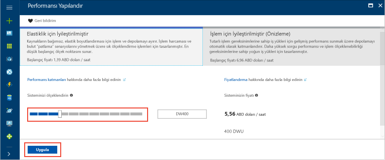

# <a name="tutorial-load-data-to-azure-sql-data-warehouse"></a>Öğretici: Azure SQL Data warehouse'a veri yükleme

Bu öğreticide, Azure Blob depolamadan Azure SQL Veri Ambarı’na WideWorldImportersDW veri ambarını yüklemek için PolyBase kullanılmaktadır. Öğreticide aşağıdaki işlemler için [Azure Portal](https://portal.azure.com) ve [SQL Server Management Studio](/sql/ssms/download-sql-server-management-studio-ssms) (SSMS) kullanılır: 

> [!div class="checklist"]
> * Azure Portal'da veri ambarı oluşturma
> * Azure Portal'da sunucu düzeyinde bir güvenlik duvarı kuralı ayarlama
> * SSMS ile veri ambarına bağlanma
> * Verileri yüklemek için belirlenen bir kullanıcı oluşturma
> * Veri kaynağı olarak Azure blob kullanan dış tablolar oluşturma
> * Verileri veri ambarınıza yüklemek için CTAS T-SQL deyimini kullanma
> * Yüklendikleri sırada verilerin ilerleme durumunu görüntüleme
> * Tarih boyutu ve satış bilgi tablolarında bir yıllık veri oluşturma
> * Yeni yüklenen verilere ilişkin istatistikler oluşturma

Azure aboneliğiniz yoksa başlamadan önce [ücretsiz bir hesap oluşturun](https://azure.microsoft.com/free/).

## <a name="before-you-begin"></a>Başlamadan önce

Bu öğreticiye başlamadan önce, [SQL Server Management Studio](/sql/ssms/download-sql-server-management-studio-ssms)’nun (SSMS) en yeni sürümünü indirin ve yükleyin.


## <a name="log-in-to-the-azure-portal"></a>Azure portalında oturum açma

[Azure Portal](https://portal.azure.com/)’da oturum açın.

## <a name="create-a-blank-sql-data-warehouse"></a>Boş bir SQL veri ambarı oluşturma

Azure SQL veri ambarı bir dizi [işlem kaynağı](memory-and-concurrency-limits.md) ile oluşturulur. Veritabanı bir [Azure kaynak grubu](../azure-resource-manager/resource-group-overview.md) ve bir [Azure SQL mantıksal sunucusu](../sql-database/sql-database-features.md) içinde oluşturulur. 

Boş bir SQL veri ambarı oluşturmak için aşağıdaki adımları izleyin. 

1. Azure portalının sol üst köşesinde bulunan **Kaynak oluştur** öğesine tıklayın.

2. **Yeni** sayfasından **Veritabanları**’nı seçin ve **Yeni** sayfasında **Öne Çıkan** altından **SQL Veri Ambarı**’nı seçin.

    

3. SQL Veri Ambarı formunu aşağıdaki bilgilerle doldurun:   

   | Ayar | Önerilen değer | Açıklama | 
   | ------- | --------------- | ----------- | 
   | **Veritabanı adı** | SampleDW | Geçerli veritabanı adları için bkz. [Veritabanı Tanımlayıcıları](/sql/relational-databases/databases/database-identifiers). | 
   | **Abonelik** | Aboneliğiniz  | Abonelikleriniz hakkında daha ayrıntılı bilgi için bkz. [Abonelikler](https://account.windowsazure.com/Subscriptions). |
   | **Kaynak grubu** | SampleRG | Geçerli kaynak grubu adları için bkz. [Adlandırma kuralları ve kısıtlamalar](https://docs.microsoft.com/azure/architecture/best-practices/naming-conventions). |
   | **Kaynak seçme** | Boş veritabanı | Boş bir veritabanı oluşturulacağını belirtir. Veri ambarının bir veritabanı türü olduğuna dikkat edin.|

    

4. Yeni veritabanınız için yeni bir sunucu oluşturup yapılandırmak üzere **Sunucu**’ya tıklayın. **Yeni sunucu formu**’nu aşağıdaki bilgilerle doldurun: 

    | Ayar | Önerilen değer | Açıklama | 
    | ------- | --------------- | ----------- |
    | **Sunucu adı** | Genel olarak benzersiz bir ad | Geçerli sunucu adları için bkz. [Adlandırma kuralları ve kısıtlamalar](https://docs.microsoft.com/azure/architecture/best-practices/naming-conventions). | 
    | **Sunucu yöneticisi oturum açma bilgileri** | Geçerli bir ad | Geçerli oturum açma adları için bkz. [Veritabanı Tanımlayıcıları](https://docs.microsoft.com/sql/relational-databases/databases/database-identifiers).|
    | **Parola** | Geçerli bir parola | Parolanızda en az 8 karakter bulunmalı ve parolanız şu üç kategoriden karakterler içermelidir: büyük harf karakterler, küçük harf karakterler, sayılar ve alfasayısal olmayan karakterler. |
    | **Konum** | Geçerli bir konum | Bölgeler hakkında bilgi için bkz. [Azure Bölgeleri](https://azure.microsoft.com/regions/). |

    

5. **Seç**'e tıklayın.

6. **Performans katmanı**'na tıklayarak veri ambarının esneklik veya işlem için iyileştirilip iyileştirilmeyeceğini ve veri ambarı birimlerinin sayısını belirtin. 

7. Bu öğreticide, **Esneklik için İyileştirilmiş** hizmet katmanını seçin. Kaydırıcı varsayılan olarak **DW400**’e ayarlanmıştır.  Nasıl çalıştığını görmek için yukarı ve aşağı taşımayı deneyin. 

    

8. **Uygula**'ya tıklayın.
9. SQL Veri Ambarı sayfasında, boş veritabanı için bir **harmanlama** seçin. Bu öğreticide varsayılan değeri kullanın. Harmanlamalar hakkında daha fazla bilgi için bkz. [Harmanlamalar](/sql/t-sql/statements/collations)

11. SQL Veritabanı formunu tamamladıktan sonra veritabanını sağlamak için **Oluştur**’a tıklayın. Sağlama birkaç dakika sürer. 

    

12. Araç çubuğunda **Bildirimler**’e tıklayarak dağıtım işlemini izleyin.
    
     

## <a name="create-a-server-level-firewall-rule"></a>Sunucu düzeyinde bir güvenlik duvarı kuralı oluşturma

SQL Veri Ambarı hizmeti, dış uygulama ve araçların sunucuya ya da sunucu üzerindeki herhangi bir veritabanına bağlanmasını engelleyen sunucu düzeyinde bir güvenlik duvarı kuralı oluşturur. Bağlantıyı etkinleştirmek için, belirli IP adresleri için bağlantıyı etkinleştiren güvenlik duvarı kuralları ekleyebilirsiniz.  İstemcinizin IP adresine yönelik bir [sunucu düzeyi güvenlik duvarı kuralı](../sql-database/sql-database-firewall-configure.md) oluşturmak için bu adımları izleyin. 

> [!NOTE]
> SQL Veri Ambarı 1433 numaralı bağlantı noktası üzerinden iletişim kurar. Kurumsal ağ içinden bağlanmaya çalışıyorsanız, ağınızın güvenlik duvarı tarafından 1433 numaralı bağlantı noktası üzerinden giden trafiğe izin verilmiyor olabilir. Bu durumda BT departmanınız 1433 numaralı bağlantı noktasını açmadığı sürece Azure SQL Veritabanı sunucunuza bağlanamazsınız.
>

1. Dağıtım tamamlandıktan sonra, soldaki menüden **SQL veritabanları**'na ve ardından **SQL veritabanları** sayfasında **SampleDW** öğesine tıklayın. Veritabanınıza ilişkin genel bakış sayfası açılır ve tam sunucu adı (örneğin, **sample-svr.database.windows.net**) görüntülenerek daha fazla yapılandırma seçeneği sunulur. 

2. Sonraki hızlı başlangıçlarda sunucunuza ve veritabanlarına bağlanmak için bu tam sunucu adını kopyalayın. Sunucu ayarlarını açmak için sunucu adına tıklayın.

     

3. Sunucu ayarlarını açmak için sunucu adına tıklayın.

     

5. **Güvenlik duvarı ayarlarını göster**’e tıklayın. SQL Veritabanı sunucusu için **Güvenlik duvarı ayarları** sayfası açılır. 

     

4.  Geçerli IP adresinizi yeni bir güvenlik duvarı kuralına eklemek için araç çubuğunda **İstemci IP’si Ekle** öğesine tıklayın. Güvenlik duvarı kuralı, 1433 numaralı bağlantı noktasını tek bir IP adresi veya bir IP adresi aralığı için açabilir.

5. **Kaydet**’e tıklayın. Geçerli IP adresiniz için mantıksal sunucuda 1433 numaralı bağlantı noktası açılarak sunucu düzeyinde güvenlik duvarı kuralı oluşturulur.

6. **Tamam**’a tıklayın ve sonra **Güvenlik duvarı ayarları** sayfasını kapatın.

Şimdi bu IP adresini kullanarak SQL sunucusuna ve veri ambarlarına bağlanabilirsiniz. Bağlantı SQL Server Management Studio’dan veya seçtiğiniz diğer bir araçtan çalışır. Bağlandığınızda, daha önce oluşturduğunuz serveradmin hesabını kullanın.  

> [!IMPORTANT]
> Varsayılan olarak, SQL Veritabanı güvenlik duvarı üzerinden erişim tüm Azure hizmetleri için etkindir. Tüm Azure hizmetleri için güvenlik duvarını kapatmak üzere bu sayfada **KAPALI**’ya ve ardından **Kaydet**’e tıklayın.

## <a name="get-the-fully-qualified-server-name"></a>Tam sunucu adını alma

SQL sunucunuzun tam sunucu adını Azure portalından alabilirsiniz. Daha sonra sunucuya bağlanırken tam adı kullanacaksınız.

1. [Azure Portal](https://portal.azure.com/)’da oturum açın.
2. Soldaki menüden **SQL Veritabanları**’nı seçin ve **SQL veritabanları** sayfasında veritabanınıza tıklayın. 
3. Veritabanınızın Azure portal sayfasındaki **Temel Bilgiler** bölmesinde, **Sunucu adını** bulup kopyalayın. Bu örnekte, tam ad mynewserver-20171113.database.windows.net. 

      

## <a name="connect-to-the-server-as-server-admin"></a>Sunucu yöneticisi olarak sunucuya bağlanma

Bu bölümde Azure SQL sunucunuzla bağlantı kurmak için [SQL Server Management Studio](/sql/ssms/download-sql-server-management-studio-ssms) (SSMS) kullanılmaktadır.

1. SQL Server Management Studio’yu açın.

2. **Sunucuya Bağlan** iletişim kutusuna şu bilgileri girin:

    | Ayar      | Önerilen değer | Açıklama | 
    | ------------ | --------------- | ----------- | 
    | Sunucu türü | Veritabanı altyapısı | Bu değer gereklidir |
    | Sunucu adı | Tam sunucu adı | Örneğin, **sample-svr.database.windows.net** tam sunucu adıdır. |
    | Kimlik Doğrulaması | SQL Server Kimlik Doğrulaması | Bu öğreticide yapılandırılan tek kimlik doğrulaması türü SQL Kimlik Doğrulamasıdır. |
    | Oturum Aç | Sunucu yöneticisi hesabı | Bu, sunucuyu oluştururken belirttiğiniz hesaptır. |
    | Parola | Sunucu yöneticisi hesabınızın parolası | Bu, sunucuyu oluştururken belirttiğiniz paroladır. |

    

4. **Bağlan**'a tıklayın. SSMS’te Nesne Gezgini penceresi açılır. 

5. Nesne Gezgini’nde, **Veritabanları**’nı genişletin. Ardından **Sistem veritabanları**'nı ve **asıl** öğesini genişleterek asıl veritabanındaki nesneleri görüntüleyin.  Yeni veritabanınızdaki nesneleri görüntülemek için **mySampleDatabase**’i genişletin.

     

## <a name="create-a-user-for-loading-data"></a>Verileri yüklemek için kullanıcı oluşturma

Sunucu yöneticisi hesabı yönetim işlemlerini gerçekleştirmeye yöneliktir ve kullanıcı verileri üzerinde sorgu çalıştırmaya uygun değildir. Verileri yükleme, yoğun bellek kullanan bir işlemdir. Bellek üst sınırları, kullandığınız SQL Veri Ambarı’nın Oluşturulmasına, [veri ambarı birimlerine](what-is-a-data-warehouse-unit-dwu-cdwu.md) ve [kaynak sınıfına](resource-classes-for-workload-management.md) göre tanımlanır. 

En iyisi verileri yüklemeye ayrılmış bir oturum açma ve kullanıcı bilgisi oluşturmaktır. Ardından yükleme kullanıcısını uygun bir bellek ayırma üst sınırına olanak tanıyan bir [kaynak sınıfına](resource-classes-for-workload-management.md) ekleyin.

Şu anda sunucu yöneticisi olarak bağlandığınız için oturum açma bilgileri ve kullanıcılar oluşturabilirsiniz. Şu adımları kullanarak **LoaderRC60** adlı bir oturum açma bilgisi ve kullanıcı oluşturun. Sonra kullanıcıyı **staticrc60** kaynak sınıfına atayın. 

1.  SSMS'de, açılan menüyü görüntülemek için **asıl** öğesine sağ tıklayın ve **Yeni Sorgu**'yu seçin. Yeni bir sorgu penceresi açılır.

    

2. Sorgu penceresinde, şu T-SQL komutlarını girerek LoaderRC60 adlı bir oturum açma bilgisi ve kullanıcı oluşturun, 'a123STRONGpassword!' yerine kendi parolanızı girin. 

    ```sql
    CREATE LOGIN LoaderRC60 WITH PASSWORD = 'a123STRONGpassword!';
    CREATE USER LoaderRC60 FOR LOGIN LoaderRC60;
    ```

3. **Yürüt**'e tıklayın.

4. **SampleDW** seçeneğine sağ tıklayın ve **Yeni Sorgu**’yu seçin. Yeni bir sorgu penceresi açılır.  

    
 
5. Aşağıdaki T-SQL komutlarını girerek LoaderRC60 oturum açma bilgisi için LoaderRC60 adlı bir veritabanı kullanıcısı oluşturun. İkinci satır, yeni kullanıcıya yeni veri ambarı üzerinde DENETİM izinleri verir.  Bu izinler, kullanıcıyı veritabanı sahibi yapmaya benzer. Üçüncü satır, yeni kullanıcıyı staticrc60 [kaynak sınıfının](resource-classes-for-workload-management.md) üyesi olarak ekler.

    ```sql
    CREATE USER LoaderRC60 FOR LOGIN LoaderRC60;
    GRANT CONTROL ON DATABASE::[SampleDW] to LoaderRC60;
    EXEC sp_addrolemember 'staticrc60', 'LoaderRC60';
    ```

6. **Yürüt**'e tıklayın.

## <a name="connect-to-the-server-as-the-loading-user"></a>Yükleme kullanıcısı olarak sunucuya bağlanma

Verileri yüklemenin ilk adımı LoaderRC60 olarak oturum açmaktır.  

1. Nesne Gezgini'nde **Bağlan** açılan menüsüne tıklayın ve **Veritabanı Altyapısı**'nı seçin. **Sunucuya Bağlan** iletişim kutusu görüntülenir.

    

2. Tam sunucu adını girin ve Oturum Açma bilgisi olarak **LoaderRC60** girin.  LoaderRC60 için parolanızı girin.

3. **Bağlan**'a tıklayın.

4. Bağlantınız hazır olduğunda, Nesne Gezgini'nde iki sunucu bağlantısı görürsünüz. Bağlantılardan biri ServerAdmin ve diğeri de LoaderRC60 olarak gösterilir.

    

## <a name="create-external-tables-and-objects"></a>Dış tablolar ve nesneler oluşturma

Verileri yeni veri ambarınıza yükleme işlemine başlamaya hazırsınız. [Yüklemeye genel bakış](sql-data-warehouse-overview-load.md) bölümünde, verilerinizi Azure Blob depolama alanına alma veya doğrudan kaynağınızdan SQL Veri Ambarı’na yükleme konusunda ileride işinize yarayacak bilgiler edinebilirsiniz.

Aşağıdaki SQL betiklerini çalıştırarak yüklemek istediğiniz veriler hakkındaki bilgileri belirtin. Bu bilgiler verilerin konumu, verilerdeki içeriğin biçimi ve verilerin tablo tanımıdır. Veriler, ortak Azure Blobu’nda bulunur.

1. Önceki bölümde veri ambarınızda LoaderRC60 olarak oturum açmıştınız. SSMS'de, LoaderRC60 bağlantınızın altında **SampleDW** seçeneğine sağ tıklayın ve **Yeni Sorgu**'yu seçin.  Yeni bir sorgu penceresi görüntülenir. 

    

2. Sorgu pencerenizi önceki resimle karşılaştırın.  Yeni sorgu pencerenizin LoaderRC60 olarak çalıştırıldığını ve SampleDW veritabanınız üzerinde sorgular gerçekleştirdiğini doğrulayın. Tüm yükleme adımlarını gerçekleştirmek için bu sorgu penceresini kullanın.

3. SampleDW veritabanı için ana anahtar oluşturun. Veritabanı başına yalnızca bir kez ana anahtar oluşturmanız gerekir. 

    ```sql
    CREATE MASTER KEY;
    ```

4. Aşağıdaki [CREATE EXTERNAL DATA SOURCE](/sql/t-sql/statements/create-external-data-source-transact-sql) deyimini çalıştırarak Azure blobunun konumunu tanımlayın. Bu, dış taksi verilerinin konumudur.  Sorgu penceresine eklediğiniz komutları çalıştırmak için, çalıştırmak istediğiniz komutları vurgulayın ve **Yürüt**'e tıklayın.

    ```sql
    CREATE EXTERNAL DATA SOURCE WWIStorage
    WITH
    (
        TYPE = Hadoop,
        LOCATION = 'wasbs://wideworldimporters@sqldwholdata.blob.core.windows.net'
    );
    ```

5. Aşağıdaki [CREATE EXTERNAL FILE FORMAT](/sql/t-sql/statements/create-external-file-format-transact-sql) T-SQL deyimini çalıştırarak dış veri dosyasının biçimlendirme özelliklerini ve seçeneklerini belirtin. Bu deyim dış verilerin metin olarak depolandığını ve değerlerin birbirinden dikey çizgi ('|') karakteriyle ayrıldığını belirtir.  

    ```sql
    CREATE EXTERNAL FILE FORMAT TextFileFormat 
    WITH 
    (   
        FORMAT_TYPE = DELIMITEDTEXT,
        FORMAT_OPTIONS
        (   
            FIELD_TERMINATOR = '|',
            USE_TYPE_DEFAULT = FALSE 
        )
    );
    ```

6.  Aşağıdaki [CREATE SCHEMA](/sql/t-sql/statements/create-schema-transact-sql) deyimlerini çalıştırarak dış dosya biçiminiz için bir şema oluşturun. Dış şema, oluşturmak üzere olduğunuz dış tabloları düzenlemek için bir yol sağlar. Wwi şeması, verileri içerecek standart tabloları düzenler. 

    ```sql
    CREATE SCHEMA ext;
    GO
    CREATE SCHEMA wwi;
    ```

7. Harici tabloları oluşturun. Tablo tanımları SQL Veri Ambarı'nda depolanır, ama tablolar Azure blob depolama alanında depolanan verilere başvurur. Aşağıdaki T-SQL komutlarını çalıştırarak, tamamı dış veri kaynağında daha önce tanımladığımız Azure blobunu işaret eden birçok dış tablo oluşturun.

    ```sql
    CREATE EXTERNAL TABLE [ext].[dimension_City](
        [City Key] [int] NOT NULL,
        [WWI City ID] [int] NOT NULL,
        [City] [nvarchar](50) NOT NULL,
        [State Province] [nvarchar](50) NOT NULL,
        [Country] [nvarchar](60) NOT NULL,
        [Continent] [nvarchar](30) NOT NULL,
        [Sales Territory] [nvarchar](50) NOT NULL,
        [Region] [nvarchar](30) NOT NULL,
        [Subregion] [nvarchar](30) NOT NULL,
        [Location] [nvarchar](76) NULL,
        [Latest Recorded Population] [bigint] NOT NULL,
        [Valid From] [datetime2](7) NOT NULL,
        [Valid To] [datetime2](7) NOT NULL,
        [Lineage Key] [int] NOT NULL
    )
    WITH (LOCATION='/v1/dimension_City/',   
        DATA_SOURCE = WWIStorage,  
        FILE_FORMAT = TextFileFormat,
        REJECT_TYPE = VALUE,
        REJECT_VALUE = 0
    );  
    CREATE EXTERNAL TABLE [ext].[dimension_Customer] (
        [Customer Key] [int] NOT NULL,
        [WWI Customer ID] [int] NOT NULL,
        [Customer] [nvarchar](100) NOT NULL,
        [Bill To Customer] [nvarchar](100) NOT NULL,
        [Category] [nvarchar](50) NOT NULL,
        [Buying Group] [nvarchar](50) NOT NULL,
        [Primary Contact] [nvarchar](50) NOT NULL,
        [Postal Code] [nvarchar](10) NOT NULL,
        [Valid From] [datetime2](7) NOT NULL,
        [Valid To] [datetime2](7) NOT NULL,
        [Lineage Key] [int] NOT NULL
    )
    WITH (LOCATION='/v1/dimension_Customer/',   
        DATA_SOURCE = WWIStorage,  
        FILE_FORMAT = TextFileFormat,
        REJECT_TYPE = VALUE,
        REJECT_VALUE = 0
    );  
    CREATE EXTERNAL TABLE [ext].[dimension_Employee] (
        [Employee Key] [int] NOT NULL,
        [WWI Employee ID] [int] NOT NULL,
        [Employee] [nvarchar](50) NOT NULL,
        [Preferred Name] [nvarchar](50) NOT NULL,
        [Is Salesperson] [bit] NOT NULL,
        [Photo] [varbinary](300) NULL,
        [Valid From] [datetime2](7) NOT NULL,
        [Valid To] [datetime2](7) NOT NULL,
        [Lineage Key] [int] NOT NULL
    )
    WITH ( LOCATION='/v1/dimension_Employee/',   
        DATA_SOURCE = WWIStorage,  
        FILE_FORMAT = TextFileFormat,
        REJECT_TYPE = VALUE,
        REJECT_VALUE = 0
    );
    CREATE EXTERNAL TABLE [ext].[dimension_PaymentMethod] (
        [Payment Method Key] [int] NOT NULL,
        [WWI Payment Method ID] [int] NOT NULL,
        [Payment Method] [nvarchar](50) NOT NULL,
        [Valid From] [datetime2](7) NOT NULL,
        [Valid To] [datetime2](7) NOT NULL,
        [Lineage Key] [int] NOT NULL
    )
    WITH ( LOCATION ='/v1/dimension_PaymentMethod/',   
        DATA_SOURCE = WWIStorage,  
        FILE_FORMAT = TextFileFormat,
        REJECT_TYPE = VALUE,
        REJECT_VALUE = 0
    );
    CREATE EXTERNAL TABLE [ext].[dimension_StockItem](
        [Stock Item Key] [int] NOT NULL,
        [WWI Stock Item ID] [int] NOT NULL,
        [Stock Item] [nvarchar](100) NOT NULL,
        [Color] [nvarchar](20) NOT NULL,
        [Selling Package] [nvarchar](50) NOT NULL,
        [Buying Package] [nvarchar](50) NOT NULL,
        [Brand] [nvarchar](50) NOT NULL,
        [Size] [nvarchar](20) NOT NULL,
        [Lead Time Days] [int] NOT NULL,
        [Quantity Per Outer] [int] NOT NULL,
        [Is Chiller Stock] [bit] NOT NULL,
        [Barcode] [nvarchar](50) NULL,
        [Tax Rate] [decimal](18, 3) NOT NULL,
        [Unit Price] [decimal](18, 2) NOT NULL,
        [Recommended Retail Price] [decimal](18, 2) NULL,
        [Typical Weight Per Unit] [decimal](18, 3) NOT NULL,
        [Photo] [varbinary](300) NULL,
        [Valid From] [datetime2](7) NOT NULL,
        [Valid To] [datetime2](7) NOT NULL,
        [Lineage Key] [int] NOT NULL
    )
    WITH ( LOCATION ='/v1/dimension_StockItem/',   
        DATA_SOURCE = WWIStorage,  
        FILE_FORMAT = TextFileFormat,
        REJECT_TYPE = VALUE,
        REJECT_VALUE = 0
    );
    CREATE EXTERNAL TABLE [ext].[dimension_Supplier](
        [Supplier Key] [int] NOT NULL,
        [WWI Supplier ID] [int] NOT NULL,
        [Supplier] [nvarchar](100) NOT NULL,
        [Category] [nvarchar](50) NOT NULL,
        [Primary Contact] [nvarchar](50) NOT NULL,
        [Supplier Reference] [nvarchar](20) NULL,
        [Payment Days] [int] NOT NULL,
        [Postal Code] [nvarchar](10) NOT NULL,
        [Valid From] [datetime2](7) NOT NULL,
        [Valid To] [datetime2](7) NOT NULL,
        [Lineage Key] [int] NOT NULL
    )
    WITH ( LOCATION ='/v1/dimension_Supplier/',   
        DATA_SOURCE = WWIStorage,  
        FILE_FORMAT = TextFileFormat,
        REJECT_TYPE = VALUE,
        REJECT_VALUE = 0
    );
    CREATE EXTERNAL TABLE [ext].[dimension_TransactionType](
        [Transaction Type Key] [int] NOT NULL,
        [WWI Transaction Type ID] [int] NOT NULL,
        [Transaction Type] [nvarchar](50) NOT NULL,
        [Valid From] [datetime2](7) NOT NULL,
        [Valid To] [datetime2](7) NOT NULL,
        [Lineage Key] [int] NOT NULL
    )    
    WITH ( LOCATION ='/v1/dimension_TransactionType/',   
        DATA_SOURCE = WWIStorage,  
        FILE_FORMAT = TextFileFormat,
        REJECT_TYPE = VALUE,
        REJECT_VALUE = 0
    );
    CREATE EXTERNAL TABLE [ext].[fact_Movement] (
        [Movement Key] [bigint] NOT NULL,
        [Date Key] [date] NOT NULL,
        [Stock Item Key] [int] NOT NULL,
        [Customer Key] [int] NULL,
        [Supplier Key] [int] NULL,
        [Transaction Type Key] [int] NOT NULL,
        [WWI Stock Item Transaction ID] [int] NOT NULL,
        [WWI Invoice ID] [int] NULL,
        [WWI Purchase Order ID] [int] NULL,
        [Quantity] [int] NOT NULL,
        [Lineage Key] [int] NOT NULL
    )
    WITH ( LOCATION ='/v1/fact_Movement/',   
        DATA_SOURCE = WWIStorage,  
        FILE_FORMAT = TextFileFormat,
        REJECT_TYPE = VALUE,
        REJECT_VALUE = 0
    );
    CREATE EXTERNAL TABLE [ext].[fact_Order] (
        [Order Key] [bigint] NOT NULL,
        [City Key] [int] NOT NULL,
        [Customer Key] [int] NOT NULL,
        [Stock Item Key] [int] NOT NULL,
        [Order Date Key] [date] NOT NULL,
        [Picked Date Key] [date] NULL,
        [Salesperson Key] [int] NOT NULL,
        [Picker Key] [int] NULL,
        [WWI Order ID] [int] NOT NULL,
        [WWI Backorder ID] [int] NULL,
        [Description] [nvarchar](100) NOT NULL,
        [Package] [nvarchar](50) NOT NULL,
        [Quantity] [int] NOT NULL,
        [Unit Price] [decimal](18, 2) NOT NULL,
        [Tax Rate] [decimal](18, 3) NOT NULL,
        [Total Excluding Tax] [decimal](18, 2) NOT NULL,
        [Tax Amount] [decimal](18, 2) NOT NULL,
        [Total Including Tax] [decimal](18, 2) NOT NULL,
        [Lineage Key] [int] NOT NULL
    )
    WITH ( LOCATION ='/v1/fact_Order/',   
        DATA_SOURCE = WWIStorage,  
        FILE_FORMAT = TextFileFormat,
        REJECT_TYPE = VALUE,
        REJECT_VALUE = 0
    );
    CREATE EXTERNAL TABLE [ext].[fact_Purchase] (
        [Purchase Key] [bigint] NOT NULL,
        [Date Key] [date] NOT NULL,
        [Supplier Key] [int] NOT NULL,
        [Stock Item Key] [int] NOT NULL,
        [WWI Purchase Order ID] [int] NULL,
        [Ordered Outers] [int] NOT NULL,
        [Ordered Quantity] [int] NOT NULL,
        [Received Outers] [int] NOT NULL,
        [Package] [nvarchar](50) NOT NULL,
        [Is Order Finalized] [bit] NOT NULL,
        [Lineage Key] [int] NOT NULL
    )
    WITH ( LOCATION ='/v1/fact_Purchase/',   
        DATA_SOURCE = WWIStorage,  
        FILE_FORMAT = TextFileFormat,
        REJECT_TYPE = VALUE,
        REJECT_VALUE = 0
    );
    CREATE EXTERNAL TABLE [ext].[fact_Sale] (
        [Sale Key] [bigint] NOT NULL,
        [City Key] [int] NOT NULL,
        [Customer Key] [int] NOT NULL,
        [Bill To Customer Key] [int] NOT NULL,
        [Stock Item Key] [int] NOT NULL,
        [Invoice Date Key] [date] NOT NULL,
        [Delivery Date Key] [date] NULL,
        [Salesperson Key] [int] NOT NULL,
        [WWI Invoice ID] [int] NOT NULL,
        [Description] [nvarchar](100) NOT NULL,
        [Package] [nvarchar](50) NOT NULL,
        [Quantity] [int] NOT NULL,
        [Unit Price] [decimal](18, 2) NOT NULL,
        [Tax Rate] [decimal](18, 3) NOT NULL,
        [Total Excluding Tax] [decimal](18, 2) NOT NULL,
        [Tax Amount] [decimal](18, 2) NOT NULL,
        [Profit] [decimal](18, 2) NOT NULL,
        [Total Including Tax] [decimal](18, 2) NOT NULL,
        [Total Dry Items] [int] NOT NULL,
        [Total Chiller Items] [int] NOT NULL,
        [Lineage Key] [int] NOT NULL
    )
    WITH ( LOCATION ='/v1/fact_Sale/',   
        DATA_SOURCE = WWIStorage,  
        FILE_FORMAT = TextFileFormat,
        REJECT_TYPE = VALUE,
        REJECT_VALUE = 0
    );
    CREATE EXTERNAL TABLE [ext].[fact_StockHolding] (
        [Stock Holding Key] [bigint] NOT NULL,
        [Stock Item Key] [int] NOT NULL,
        [Quantity On Hand] [int] NOT NULL,
        [Bin Location] [nvarchar](20) NOT NULL,
        [Last Stocktake Quantity] [int] NOT NULL,
        [Last Cost Price] [decimal](18, 2) NOT NULL,
        [Reorder Level] [int] NOT NULL,
        [Target Stock Level] [int] NOT NULL,
        [Lineage Key] [int] NOT NULL
    )
    WITH ( LOCATION ='/v1/fact_StockHolding/',   
        DATA_SOURCE = WWIStorage,  
        FILE_FORMAT = TextFileFormat,
        REJECT_TYPE = VALUE,
        REJECT_VALUE = 0
    );
    CREATE EXTERNAL TABLE [ext].[fact_Transaction] (
        [Transaction Key] [bigint] NOT NULL,
        [Date Key] [date] NOT NULL,
        [Customer Key] [int] NULL,
        [Bill To Customer Key] [int] NULL,
        [Supplier Key] [int] NULL,
        [Transaction Type Key] [int] NOT NULL,
        [Payment Method Key] [int] NULL,
        [WWI Customer Transaction ID] [int] NULL,
        [WWI Supplier Transaction ID] [int] NULL,
        [WWI Invoice ID] [int] NULL,
        [WWI Purchase Order ID] [int] NULL,
        [Supplier Invoice Number] [nvarchar](20) NULL,
        [Total Excluding Tax] [decimal](18, 2) NOT NULL,
        [Tax Amount] [decimal](18, 2) NOT NULL,
        [Total Including Tax] [decimal](18, 2) NOT NULL,
        [Outstanding Balance] [decimal](18, 2) NOT NULL,
        [Is Finalized] [bit] NOT NULL,
        [Lineage Key] [int] NOT NULL
    )
    WITH ( LOCATION ='/v1/fact_Transaction/',   
        DATA_SOURCE = WWIStorage,  
        FILE_FORMAT = TextFileFormat,
        REJECT_TYPE = VALUE,
        REJECT_VALUE = 0
    );
    ```

8. Nesne Gezgini’nde, yeni oluşturduğunuz dış tabloların listesini görmek için SampleDW öğesini genişletin.

    

## <a name="load-the-data-into-your-data-warehouse"></a>Verileri veri ambarınıza yükleme

Bu bölümde, örnek verileri Azure Blobu’ndan SQL Veri Ambarı'na yüklemek için az önce tanımladığınız dış tablolar kullanılır.  

> [!NOTE]
> Bu öğretici verileri doğrudan son tabloya yükler. Üretim ortamında, genellikle CREATE TABLE AS SELECT kullanarak bir hazırlama tablosuna yüklersiniz. Veriler hazırlama tablosundayken tüm gerekli dönüştürmeleri yapabilirsiniz. Hazırlama tablosundaki verileri üretim tablosuna eklemek için, INSERT...SELECT deyimini kullanabilirsiniz. Daha fazla bilgi için kz. [Üretim tablosuna veri ekleme](guidance-for-loading-data.md#inserting-data-into-a-production-table).
> 

Verileri Azure Depolama Blobu'ndan veri ambarınızdaki yeni tablolara yüklemek için, betikte [CREATE TABLE AS SELECT (CTAS)](/sql/t-sql/statements/create-table-as-select-azure-sql-data-warehouse) T-SQL deyimi kullanılır. CTAS bir SELECT deyiminin sonuçlarına göre yeni tablo oluşturur. Yeni tablo, select deyiminin sonuçları ile aynı sütunlara ve veri türlerine sahiptir. SELECT deyimi bir dış tablodan seçim yaptığında, SQL Veri Ambarı verileri veri ambarındaki bir ilişkisel tabloya aktarır. 

Bu betik, wwi.dimension_Date ve wwi.fact_Sales tablolarına veri yüklemez. Bu tablolar, boyutlandırılabilir satır sayısı içermesi için daha sonraki bir adımda oluşturulur.

1. Aşağıdaki betiği çalıştırarak verileri veri ambarınızdaki yeni tablolara yükleyin.

    ```sql
    CREATE TABLE [wwi].[dimension_City]
    WITH
    ( 
        DISTRIBUTION = REPLICATE,
        CLUSTERED COLUMNSTORE INDEX
    )
    AS
    SELECT * FROM [ext].[dimension_City]
    OPTION (LABEL = 'CTAS : Load [wwi].[dimension_City]')
    ;

    CREATE TABLE [wwi].[dimension_Customer]
    WITH
    ( 
        DISTRIBUTION = REPLICATE,
        CLUSTERED COLUMNSTORE INDEX
    )
    AS
    SELECT * FROM [ext].[dimension_Customer]
    OPTION (LABEL = 'CTAS : Load [wwi].[dimension_Customer]')
    ;

    CREATE TABLE [wwi].[dimension_Employee]
    WITH
    ( 
        DISTRIBUTION = REPLICATE,
        CLUSTERED COLUMNSTORE INDEX
    )
    AS
    SELECT * FROM [ext].[dimension_Employee]
    OPTION (LABEL = 'CTAS : Load [wwi].[dimension_Employee]')
    ;

    CREATE TABLE [wwi].[dimension_PaymentMethod]
    WITH
    ( 
        DISTRIBUTION = REPLICATE,
        CLUSTERED COLUMNSTORE INDEX
    )
    AS
    SELECT * FROM [ext].[dimension_PaymentMethod]
    OPTION (LABEL = 'CTAS : Load [wwi].[dimension_PaymentMethod]')
    ;

    CREATE TABLE [wwi].[dimension_StockItem]
    WITH
    ( 
        DISTRIBUTION = REPLICATE,
        CLUSTERED COLUMNSTORE INDEX
    )
    AS
    SELECT * FROM [ext].[dimension_StockItem]
    OPTION (LABEL = 'CTAS : Load [wwi].[dimension_StockItem]')
    ;

    CREATE TABLE [wwi].[dimension_Supplier]
    WITH
    ( 
        DISTRIBUTION = REPLICATE,
        CLUSTERED COLUMNSTORE INDEX
    )
    AS
    SELECT * FROM [ext].[dimension_Supplier]
    OPTION (LABEL = 'CTAS : Load [wwi].[dimension_Supplier]')
    ;

    CREATE TABLE [wwi].[dimension_TransactionType]
    WITH
    ( 
        DISTRIBUTION = REPLICATE,
        CLUSTERED COLUMNSTORE INDEX
    )
    AS
    SELECT * FROM [ext].[dimension_TransactionType]
    OPTION (LABEL = 'CTAS : Load [wwi].[dimension_TransactionType]')
    ;

    CREATE TABLE [wwi].[fact_Movement]
    WITH
    ( 
        DISTRIBUTION = HASH([Movement Key]),
        CLUSTERED COLUMNSTORE INDEX
    )
    AS
    SELECT * FROM [ext].[fact_Movement]
    OPTION (LABEL = 'CTAS : Load [wwi].[fact_Movement]')
    ;

    CREATE TABLE [wwi].[fact_Order]
    WITH
    ( 
        DISTRIBUTION = HASH([Order Key]),
        CLUSTERED COLUMNSTORE INDEX
    )
    AS
    SELECT * FROM [ext].[fact_Order]
    OPTION (LABEL = 'CTAS : Load [wwi].[fact_Order]')
    ;

    CREATE TABLE [wwi].[fact_Purchase]
    WITH
    ( 
        DISTRIBUTION = HASH([Purchase Key]),
        CLUSTERED COLUMNSTORE INDEX
    )
    AS
    SELECT * FROM [ext].[fact_Purchase]
    OPTION (LABEL = 'CTAS : Load [wwi].[fact_Purchase]')
    ;

    CREATE TABLE [wwi].[seed_Sale]
    WITH
    ( 
        DISTRIBUTION = HASH([WWI Invoice ID]),
        CLUSTERED COLUMNSTORE INDEX
    )
    AS
    SELECT * FROM [ext].[fact_Sale]
    OPTION (LABEL = 'CTAS : Load [wwi].[seed_Sale]')
    ;

    CREATE TABLE [wwi].[fact_StockHolding]
    WITH
    ( 
        DISTRIBUTION = HASH([Stock Holding Key]),
        CLUSTERED COLUMNSTORE INDEX
    )
    AS
    SELECT * FROM [ext].[fact_StockHolding]
    OPTION (LABEL = 'CTAS : Load [wwi].[fact_StockHolding]')
    ;

    CREATE TABLE [wwi].[fact_Transaction]
    WITH
    ( 
        DISTRIBUTION = HASH([Transaction Key]),
        CLUSTERED COLUMNSTORE INDEX
    )
    AS
    SELECT * FROM [ext].[fact_Transaction]
    OPTION (LABEL = 'CTAS : Load [wwi].[fact_Transaction]')
    ;
    ```

2. Verilerinizi yüklenirken görüntüleyin. Birkaç GB veri yüklüyorsunuz ve yüksek performanslı kümelenmiş columnstore dizinlerine sıkıştırıyorsunuz. SampleDW üzerinde yeni bir sorgu penceresi açın ve aşağıdaki sorguyu çalıştırarak yüklemenin durumunu gösterin. Sorguyu başlattıktan sonra, SQL Veri Ambarı ağır yükü kaldırırken siz bir kahve alıp arkanıza yaslanın.

    ```sql
    SELECT
        r.command,
        s.request_id,
        r.status,
        count(distinct input_name) as nbr_files,
        sum(s.bytes_processed)/1024/1024/1024 as gb_processed
    FROM 
        sys.dm_pdw_exec_requests r
        INNER JOIN sys.dm_pdw_dms_external_work s
        ON r.request_id = s.request_id
    WHERE
        r.[label] = 'CTAS : Load [wwi].[dimension_City]' OR
        r.[label] = 'CTAS : Load [wwi].[dimension_Customer]' OR
        r.[label] = 'CTAS : Load [wwi].[dimension_Employee]' OR
        r.[label] = 'CTAS : Load [wwi].[dimension_PaymentMethod]' OR
        r.[label] = 'CTAS : Load [wwi].[dimension_StockItem]' OR
        r.[label] = 'CTAS : Load [wwi].[dimension_Supplier]' OR
        r.[label] = 'CTAS : Load [wwi].[dimension_TransactionType]' OR
        r.[label] = 'CTAS : Load [wwi].[fact_Movement]' OR
        r.[label] = 'CTAS : Load [wwi].[fact_Order]' OR
        r.[label] = 'CTAS : Load [wwi].[fact_Purchase]' OR
        r.[label] = 'CTAS : Load [wwi].[fact_StockHolding]' OR
        r.[label] = 'CTAS : Load [wwi].[fact_Transaction]'
    GROUP BY
        r.command,
        s.request_id,
        r.status
    ORDER BY
        nbr_files desc, 
        gb_processed desc;
    ```

3. Tüm sistem sorgularını görüntüleyin.

    ```sql
    SELECT * FROM sys.dm_pdw_exec_requests;
    ```

4. Veri ambarınıza verilerinizin sorunsuz şekilde yüklenmesinin keyfini çıkarın.

    

## <a name="create-tables-and-procedures-to-generate-the-date-and-sales-tables"></a>Tarih ve Satış tablolarını oluşturmak için tablolar ve yordamlar oluşturma

Bu bölümde, wwi.dimension_Date ve wwi.fact_Sales tabloları oluşturulur. Ayrıca wwi.dimension_Date ve wwi.fact_Sales tablolarında milyonlarca satır oluşturabilen saklı yordamlar da oluşturulur.

1. dimension_Date ve fact_Sale tabloları oluşturun.  

    ```sql
    CREATE TABLE [wwi].[dimension_Date]
    (
        [Date] [datetime] NOT NULL,
        [Day Number] [int] NOT NULL,
        [Day] [nvarchar](10) NOT NULL,
        [Month] [nvarchar](10) NOT NULL,
        [Short Month] [nvarchar](3) NOT NULL,
        [Calendar Month Number] [int] NOT NULL,
        [Calendar Month Label] [nvarchar](20) NOT NULL,
        [Calendar Year] [int] NOT NULL,
        [Calendar Year Label] [nvarchar](10) NOT NULL,
        [Fiscal Month Number] [int] NOT NULL,
        [Fiscal Month Label] [nvarchar](20) NOT NULL,
        [Fiscal Year] [int] NOT NULL,
        [Fiscal Year Label] [nvarchar](10) NOT NULL,
        [ISO Week Number] [int] NOT NULL
    )
    WITH 
    (
        DISTRIBUTION = REPLICATE,
        CLUSTERED INDEX ([Date])
    );
    CREATE TABLE [wwi].[fact_Sale]
    (
        [Sale Key] [bigint] IDENTITY(1,1) NOT NULL,
        [City Key] [int] NOT NULL,
        [Customer Key] [int] NOT NULL,
        [Bill To Customer Key] [int] NOT NULL,
        [Stock Item Key] [int] NOT NULL,
        [Invoice Date Key] [date] NOT NULL,
        [Delivery Date Key] [date] NULL,
        [Salesperson Key] [int] NOT NULL,
        [WWI Invoice ID] [int] NOT NULL,
        [Description] [nvarchar](100) NOT NULL,
        [Package] [nvarchar](50) NOT NULL,
        [Quantity] [int] NOT NULL,
        [Unit Price] [decimal](18, 2) NOT NULL,
        [Tax Rate] [decimal](18, 3) NOT NULL,
        [Total Excluding Tax] [decimal](18, 2) NOT NULL,
        [Tax Amount] [decimal](18, 2) NOT NULL,
        [Profit] [decimal](18, 2) NOT NULL,
        [Total Including Tax] [decimal](18, 2) NOT NULL,
        [Total Dry Items] [int] NOT NULL,
        [Total Chiller Items] [int] NOT NULL,
        [Lineage Key] [int] NOT NULL
    )
    WITH
    (
        DISTRIBUTION = HASH ( [WWI Invoice ID] ),
        CLUSTERED COLUMNSTORE INDEX
    )
    ```

2. [wwi].[InitialSalesDataPopulation] oluşturarak [wwi].[seed_Sale] içinde satır sayısını sekiz katsayısı ile artırın. 

    ```sql
    CREATE PROCEDURE [wwi].[InitialSalesDataPopulation] AS
    BEGIN
        INSERT INTO [wwi].[seed_Sale] (
            [Sale Key], [City Key], [Customer Key], [Bill To Customer Key], [Stock Item Key], [Invoice Date Key], [Delivery Date Key], [Salesperson Key], [WWI Invoice ID], [Description], [Package], [Quantity], [Unit Price], [Tax Rate], [Total Excluding Tax], [Tax Amount], [Profit], [Total Including Tax], [Total Dry Items], [Total Chiller Items], [Lineage Key]
        )
        SELECT
            [Sale Key], [City Key], [Customer Key], [Bill To Customer Key], [Stock Item Key], [Invoice Date Key], [Delivery Date Key], [Salesperson Key], [WWI Invoice ID], [Description], [Package], [Quantity], [Unit Price], [Tax Rate], [Total Excluding Tax], [Tax Amount], [Profit], [Total Including Tax], [Total Dry Items], [Total Chiller Items], [Lineage Key]
        FROM [wwi].[seed_Sale]

        INSERT INTO [wwi].[seed_Sale] (
            [Sale Key], [City Key], [Customer Key], [Bill To Customer Key], [Stock Item Key], [Invoice Date Key], [Delivery Date Key], [Salesperson Key], [WWI Invoice ID], [Description], [Package], [Quantity], [Unit Price], [Tax Rate], [Total Excluding Tax], [Tax Amount], [Profit], [Total Including Tax], [Total Dry Items], [Total Chiller Items], [Lineage Key]
        )
        SELECT
            [Sale Key], [City Key], [Customer Key], [Bill To Customer Key], [Stock Item Key], [Invoice Date Key], [Delivery Date Key], [Salesperson Key], [WWI Invoice ID], [Description], [Package], [Quantity], [Unit Price], [Tax Rate], [Total Excluding Tax], [Tax Amount], [Profit], [Total Including Tax], [Total Dry Items], [Total Chiller Items], [Lineage Key]
        FROM [wwi].[seed_Sale]

        INSERT INTO [wwi].[seed_Sale] (
            [Sale Key], [City Key], [Customer Key], [Bill To Customer Key], [Stock Item Key], [Invoice Date Key], [Delivery Date Key], [Salesperson Key], [WWI Invoice ID], [Description], [Package], [Quantity], [Unit Price], [Tax Rate], [Total Excluding Tax], [Tax Amount], [Profit], [Total Including Tax], [Total Dry Items], [Total Chiller Items], [Lineage Key]
        )
        SELECT
            [Sale Key], [City Key], [Customer Key], [Bill To Customer Key], [Stock Item Key], [Invoice Date Key], [Delivery Date Key], [Salesperson Key], [WWI Invoice ID], [Description], [Package], [Quantity], [Unit Price], [Tax Rate], [Total Excluding Tax], [Tax Amount], [Profit], [Total Including Tax], [Total Dry Items], [Total Chiller Items], [Lineage Key]
        FROM [wwi].[seed_Sale]
    END
    ```

3. wwi.dimension_Date tablosundaki satırları dolduran bu saklı yordamı oluşturun.

    ```sql
    CREATE PROCEDURE [wwi].[PopulateDateDimensionForYear] @Year [int] AS
    BEGIN
        IF OBJECT_ID('tempdb..#month', 'U') IS NOT NULL 
            DROP TABLE #month
        CREATE TABLE #month (
            monthnum int,
            numofdays int
        )
        WITH ( DISTRIBUTION = ROUND_ROBIN, heap )
        INSERT INTO #month
            SELECT 1, 31 UNION SELECT 2, CASE WHEN (@YEAR % 4 = 0 AND @YEAR % 100 <> 0) OR @YEAR % 400 = 0 THEN 29 ELSE 28 END UNION SELECT 3,31 UNION SELECT 4,30 UNION SELECT 5,31 UNION SELECT 6,30 UNION SELECT 7,31 UNION SELECT 8,31 UNION SELECT 9,30 UNION SELECT 10,31 UNION SELECT 11,30 UNION SELECT 12,31

        IF OBJECT_ID('tempdb..#days', 'U') IS NOT NULL 
            DROP TABLE #days
        CREATE TABLE #days (days int)
        WITH (DISTRIBUTION = ROUND_ROBIN, HEAP)

        INSERT INTO #days
            SELECT 1 UNION SELECT 2 UNION SELECT 3 UNION SELECT 4 UNION SELECT 5 UNION SELECT 6 UNION SELECT 7 UNION SELECT 8 UNION SELECT 9 UNION SELECT 10 UNION SELECT 11 UNION SELECT 12 UNION SELECT 13 UNION SELECT 14 UNION SELECT 15 UNION SELECT 16 UNION SELECT 17 UNION SELECT 18 UNION SELECT 19 UNION SELECT 20    UNION SELECT 21 UNION SELECT 22 UNION SELECT 23 UNION SELECT 24 UNION SELECT 25 UNION SELECT 26 UNION SELECT 27 UNION SELECT 28 UNION SELECT 29 UNION SELECT 30 UNION SELECT 31

        INSERT [wwi].[dimension_Date] (
            [Date], [Day Number], [Day], [Month], [Short Month], [Calendar Month Number], [Calendar Month Label], [Calendar Year], [Calendar Year Label], [Fiscal Month Number], [Fiscal Month Label], [Fiscal Year], [Fiscal Year Label], [ISO Week Number] 
        )
        SELECT
            CAST(CAST(monthnum AS VARCHAR(2)) + '/' + CAST([days] AS VARCHAR(3)) + '/' + CAST(@year AS CHAR(4)) AS DATE) AS [Date]
            ,DAY(CAST(CAST(monthnum AS VARCHAR(2)) + '/' + CAST([days] AS VARCHAR(3)) + '/' + CAST(@year AS CHAR(4)) AS DATE)) AS [Day Number]
            ,CAST(DATENAME(day, CAST(CAST(monthnum AS VARCHAR(2)) + '/' + CAST([days] AS VARCHAR(3)) + '/' + CAST(@year AS CHAR(4)) AS DATE)) AS NVARCHAR(10)) AS [Day]
            ,CAST(DATENAME(month, CAST(CAST(monthnum AS VARCHAR(2)) + '/' + CAST([days] AS VARCHAR(3)) + '/' + CAST(@year as char(4)) AS DATE)) AS nvarchar(10)) AS [Month]
            ,CAST(SUBSTRING(DATENAME(month, CAST(CAST(monthnum as varchar(2)) + '/' + CAST([days] as varchar(3)) + '/' + CAST(@year as char(4)) AS DATE)), 1, 3) AS nvarchar(3)) AS [Short Month]
            ,MONTH(CAST(CAST(monthnum as varchar(2)) + '/' + CAST([days] as varchar(3)) + '/' + CAST(@year as char(4)) AS DATE)) AS [Calendar Month Number]
            ,CAST(N'CY' + CAST(YEAR(CAST(CAST(monthnum as varchar(2)) + '/' + CAST([days] as varchar(3)) + '/' + CAST(@year as char(4)) AS DATE)) AS nvarchar(4)) + N'-' + SUBSTRING(DATENAME(month, CAST(CAST(monthnum as varchar(2)) + '/' + CAST([days] as varchar(3)) + '/' + CAST(@year as char(4)) AS DATE)), 1, 3) AS nvarchar(10)) AS [Calendar Month Label]
            ,YEAR(CAST(CAST(monthnum as varchar(2)) + '/' + CAST([days] as varchar(3)) + '/' + CAST(@year as char(4)) AS DATE)) AS [Calendar Year]
            ,CAST(N'CY' + CAST(YEAR(CAST(CAST(monthnum as varchar(2)) + '/' + CAST([days] as varchar(3)) + '/' + CAST(@year as char(4)) AS DATE)) AS nvarchar(4)) AS nvarchar(10)) AS [Calendar Year Label]
            ,CASE WHEN MONTH(CAST(CAST(monthnum as varchar(2)) + '/' + CAST([days] as varchar(3)) + '/' + CAST(@year as char(4)) AS DATE)) IN (11, 12)
            THEN MONTH(CAST(CAST(monthnum as varchar(2)) + '/' + CAST([days] as varchar(3)) + '/' + CAST(@year as char(4)) AS DATE)) - 10
            ELSE MONTH(CAST(CAST(monthnum as varchar(2)) + '/' + CAST([days] as varchar(3)) + '/' + CAST(@year as char(4)) AS DATE)) + 2 END AS [Fiscal Month Number]
            ,CAST(N'FY' + CAST(CASE WHEN MONTH(CAST(CAST(monthnum as varchar(2)) + '/' + CAST([days] as varchar(3)) + '/' + CAST(@year as char(4)) AS DATE)) IN (11, 12)
            THEN YEAR(CAST(CAST(monthnum as varchar(2)) + '/' + CAST([days] as varchar(3)) + '/' + CAST(@year as char(4)) AS DATE)) + 1
            ELSE YEAR(CAST(CAST(monthnum as varchar(2)) + '/' + CAST([days] as varchar(3)) + '/' + CAST(@year as char(4)) AS DATE)) END AS nvarchar(4)) + N'-' + SUBSTRING(DATENAME(month, CAST(CAST(monthnum as varchar(2)) + '/' + CAST([days] as varchar(3)) + '/' + CAST(@year as char(4)) AS DATE)), 1, 3) AS nvarchar(20)) AS [Fiscal Month Label]
            ,CASE WHEN MONTH(CAST(CAST(monthnum as varchar(2)) + '/' + CAST([days] as varchar(3)) + '/' + CAST(@year as char(4)) AS DATE)) IN (11, 12)
            THEN YEAR(CAST(CAST(monthnum as varchar(2)) + '/' + CAST([days] as varchar(3)) + '/' + CAST(@year as char(4)) AS DATE)) + 1
            ELSE YEAR(CAST(CAST(monthnum as varchar(2)) + '/' + CAST([days] as varchar(3)) + '/' + CAST(@year as char(4)) AS DATE)) END AS [Fiscal Year]
            ,CAST(N'FY' + CAST(CASE WHEN MONTH(CAST(CAST(monthnum as varchar(2)) + '/' + CAST([days] as varchar(3)) + '/' + CAST(@year as char(4)) AS DATE)) IN (11, 12)
            THEN YEAR(CAST(CAST(monthnum as varchar(2)) + '/' + CAST([days] as varchar(3)) + '/' + CAST(@year as char(4)) AS DATE)) + 1
            ELSE YEAR(CAST(CAST(monthnum as varchar(2)) + '/' + CAST([days] as varchar(3)) + '/' + CAST(@year as char(4)) AS DATE))END AS nvarchar(4)) AS nvarchar(10)) AS [Fiscal Year Label]
            , DATEPART(ISO_WEEK, CAST(CAST(monthnum as varchar(2)) + '/' + CAST([days] as varchar(3)) + '/' + CAST(@year as char(4)) AS DATE)) AS [ISO Week Number]
    FROM #month m
        CROSS JOIN #days d
    WHERE d.days <= m.numofdays

    DROP table #month;
    DROP table #days;
    END;
    ```
4. wwi.dimension_Date ve wwi.fact_Sales tablolarını dolduran bu yordamı oluşturun. wwi.dimension_Date tablosunu doldurmak için [wwi].[PopulateDateDimensionForYear] çağrısı yapar.

    ```sql
    CREATE PROCEDURE [wwi].[Configuration_PopulateLargeSaleTable] @EstimatedRowsPerDay [bigint],@Year [int] AS
    BEGIN
        SET NOCOUNT ON;
        SET XACT_ABORT ON;

        EXEC [wwi].[PopulateDateDimensionForYear] @Year;

        DECLARE @OrderCounter bigint = 0;
        DECLARE @NumberOfSalesPerDay bigint = @EstimatedRowsPerDay;
        DECLARE @DateCounter date; 
        DECLARE @StartingSaleKey bigint;
        DECLARE @MaximumSaleKey bigint = (SELECT MAX([Sale Key]) FROM wwi.seed_Sale);
        DECLARE @MaxDate date;
        SET @MaxDate = (SELECT MAX([Invoice Date Key]) FROM wwi.fact_Sale)
        IF ( @MaxDate < CAST(@YEAR AS CHAR(4)) + '1231') AND (@MaxDate > CAST(@YEAR AS CHAR(4)) + '0101')
            SET @DateCounter = @MaxDate
        ELSE
            SET @DateCounter= CAST(@Year as char(4)) + '0101';

        PRINT 'Targeting ' + CAST(@NumberOfSalesPerDay AS varchar(20)) + ' sales per day.';

        DECLARE @OutputCounter varchar(20);
        DECLARE @variance DECIMAL(18,10);
        DECLARE @VariantNumberOfSalesPerDay BIGINT;

        WHILE @DateCounter < CAST(@YEAR AS CHAR(4)) + '1231'
        BEGIN
            SET @OutputCounter = CONVERT(varchar(20), @DateCounter, 112);
            RAISERROR(@OutputCounter, 0, 1);
            SET @variance = (SELECT RAND() * 10)*.01 + .95
            SET @VariantNumberOfSalesPerDay = FLOOR(@NumberOfSalesPerDay * @variance)

            SET @StartingSaleKey = @MaximumSaleKey - @VariantNumberOfSalesPerDay - FLOOR(RAND() * 20000);
            SET @OrderCounter = 0;

            INSERT [wwi].[fact_Sale] (
                [City Key], [Customer Key], [Bill To Customer Key], [Stock Item Key], [Invoice Date Key], [Delivery Date Key], [Salesperson Key], [WWI Invoice ID], [Description], Package, Quantity, [Unit Price], [Tax Rate], [Total Excluding Tax], [Tax Amount], Profit, [Total Including Tax], [Total Dry Items], [Total Chiller Items], [Lineage Key]
            )
            SELECT TOP(@VariantNumberOfSalesPerDay)
                [City Key], [Customer Key], [Bill To Customer Key], [Stock Item Key], @DateCounter, DATEADD(day, 1, @DateCounter), [Salesperson Key], [WWI Invoice ID], [Description], Package, Quantity, [Unit Price], [Tax Rate], [Total Excluding Tax], [Tax Amount], Profit, [Total Including Tax], [Total Dry Items], [Total Chiller Items], [Lineage Key]
            FROM [wwi].[seed_Sale]
            WHERE 
                 --[Sale Key] > @StartingSaleKey and /* IDENTITY DOES NOT WORK THE SAME IN SQLDW AND CAN'T USE THIS METHOD FOR VARIANT */
                [Invoice Date Key] >=cast(@YEAR AS CHAR(4)) + '-01-01'
            ORDER BY [Sale Key];

            SET @DateCounter = DATEADD(day, 1, @DateCounter);
        END;

    END;
    ```

## <a name="generate-millions-of-rows"></a>Milyonlarca satır oluşturma
wwi.fact_Sales tablosunda milyonlarca satır ve wwi.dimension_Date tablosunda karşılık gelen verileri üretmek için oluşturduğunuz depolanan yordamları kullanın. 


1. [wwi].[seed_Sale] çekirdeğini daha fazla satırla oluşturmak için bu yordamı çalıştırın.

    ```sql    
    EXEC [wwi].[InitialSalesDataPopulation]
    ```

2. wwi.fact_Sales tablosunu, 2000 yılındaki her gün için günde 100.000 satırla doldurmak için bu yordamı çalıştırın.

    ```sql
    EXEC [wwi].[Configuration_PopulateLargeSaleTable] 100000, 2000
    ```
3. Önceki adımdaki veri oluşturma işlemi yol boyunca ilerledikçe biraz zaman alabilir.  Geçerli işlemin hangi günde olduğunu görmek için yeni bir sorgu açın ve şu SQL komutunu çalıştırın:

    ```sql
    SELECT MAX([Invoice Date Key]) FROM wwi.fact_Sale;
    ```

4. Kullanılan alanı görmek için aşağıdaki komutu çalıştırın.

    ```sql
    EXEC sp_spaceused N'wwi.fact_Sale';
    ```

## <a name="populate-the-replicated-table-cache"></a>Çoğaltılmış tablo önbelleğini doldurma
SQL Veri Ambarı, her bir İşlem düğümünde verileri önbelleğe alarak bir tabloyu çoğaltır. Tabloya karşı bir sorgu çalıştırıldığında önbellek doldurulur. Bu nedenle, çoğaltılmış bir tablodaki ilk sorgunun önbelleği doldurması ek süre gerektirebilir. Önbellek doldurulduktan sonra çoğaltılmış tablolardaki sorgular daha hızlı çalıştırılır.

İşlem düğümlerindeki çoğaltılmış tablo önbelleğini doldurmak için şu SQL sorgularını çalıştırın. 

    ```sql
    SELECT TOP 1 * FROM [wwi].[dimension_City];
    SELECT TOP 1 * FROM [wwi].[dimension_Customer];
    SELECT TOP 1 * FROM [wwi].[dimension_Date];
    SELECT TOP 1 * FROM [wwi].[dimension_Employee];
    SELECT TOP 1 * FROM [wwi].[dimension_PaymentMethod];
    SELECT TOP 1 * FROM [wwi].[dimension_StockItem];
    SELECT TOP 1 * FROM [wwi].[dimension_Supplier];
    SELECT TOP 1 * FROM [wwi].[dimension_TransactionType];
    ```

## <a name="create-statistics-on-newly-loaded-data"></a>Yeni yüklenen verilere ilişkin istatistikler oluşturma

Yüksek sorgu performansı elde etmek için ilk yükleme işleminden sonra her tablonun her sütunu için istatistik oluşturulması önemlidir. Ayrıca veriler üzerinde önemli değişiklikler yapıldıktan sonra istatistiklerin güncelleştirilmesi de önemlidir. 

1. Tüm tabloların tüm sütunlarındaki istatistikleri güncelleştiren bu saklı yordamı oluşturun.

    ```sql
    CREATE PROCEDURE    [dbo].[prc_sqldw_create_stats]
    (   @create_type    tinyint -- 1 default 2 Fullscan 3 Sample
    ,   @sample_pct     tinyint
    )
    AS

    IF @create_type IS NULL
    BEGIN
        SET @create_type = 1;
    END;

    IF @create_type NOT IN (1,2,3)
    BEGIN
        THROW 151000,'Invalid value for @stats_type parameter. Valid range 1 (default), 2 (fullscan) or 3 (sample).',1;
    END;

    IF @sample_pct IS NULL
    BEGIN;
        SET @sample_pct = 20;
    END;

    IF OBJECT_ID('tempdb..#stats_ddl') IS NOT NULL
    BEGIN;
        DROP TABLE #stats_ddl;
    END;
    
    CREATE TABLE #stats_ddl
    WITH    (   DISTRIBUTION    = HASH([seq_nmbr])
            ,   LOCATION        = USER_DB
            )
    AS
    WITH T
    AS
    (
    SELECT      t.[name]                        AS [table_name]
    ,           s.[name]                        AS [table_schema_name]
    ,           c.[name]                        AS [column_name]
    ,           c.[column_id]                   AS [column_id]
    ,           t.[object_id]                   AS [object_id]
    ,           ROW_NUMBER()
                OVER(ORDER BY (SELECT NULL))    AS [seq_nmbr]
    FROM        sys.[tables] t
    JOIN        sys.[schemas] s         ON  t.[schema_id]       = s.[schema_id]
    JOIN        sys.[columns] c         ON  t.[object_id]       = c.[object_id]
    LEFT JOIN   sys.[stats_columns] l   ON  l.[object_id]       = c.[object_id]
                                        AND l.[column_id]       = c.[column_id]
                                        AND l.[stats_column_id] = 1
    LEFT JOIN    sys.[external_tables] e    ON    e.[object_id]        = t.[object_id]
    WHERE       l.[object_id] IS NULL
    AND            e.[object_id] IS NULL -- not an external table
    )
    SELECT  [table_schema_name]
    ,       [table_name]
    ,       [column_name]
    ,       [column_id]
    ,       [object_id]
    ,       [seq_nmbr]
    ,       CASE @create_type
            WHEN 1
            THEN    CAST('CREATE STATISTICS '+QUOTENAME('stat_'+table_schema_name+ '_' + table_name + '_'+column_name)+' ON '+QUOTENAME(table_schema_name)+'.'+QUOTENAME(table_name)+'('+QUOTENAME(column_name)+')' AS VARCHAR(8000))
            WHEN 2
            THEN    CAST('CREATE STATISTICS '+QUOTENAME('stat_'+table_schema_name+ '_' + table_name + '_'+column_name)+' ON '+QUOTENAME(table_schema_name)+'.'+QUOTENAME(table_name)+'('+QUOTENAME(column_name)+') WITH FULLSCAN' AS VARCHAR(8000))
            WHEN 3
            THEN    CAST('CREATE STATISTICS '+QUOTENAME('stat_'+table_schema_name+ '_' + table_name + '_'+column_name)+' ON '+QUOTENAME(table_schema_name)+'.'+QUOTENAME(table_name)+'('+QUOTENAME(column_name)+') WITH SAMPLE '+CONVERT(varchar(4),@sample_pct)+' PERCENT' AS VARCHAR(8000))
            END AS create_stat_ddl
    FROM T
    ;

    DECLARE @i INT              = 1
    ,       @t INT              = (SELECT COUNT(*) FROM #stats_ddl)
    ,       @s NVARCHAR(4000)   = N''
    ;

    WHILE @i <= @t
    BEGIN
        SET @s=(SELECT create_stat_ddl FROM #stats_ddl WHERE seq_nmbr = @i);
        PRINT @s
        EXEC sp_executesql @s
        SET @i+=1;
    END

    DROP TABLE #stats_ddl;
    ```

2. Veri ambarındaki tüm tabloların tüm sütunlarında istatistik oluşturmak için bu komutu çalıştırın.

    ```sql
    EXEC [dbo].[prc_sqldw_create_stats] 1, NULL;
    ```

## <a name="clean-up-resources"></a>Kaynakları temizleme

İşlem kaynakları ve veri ambarınıza yüklediğiniz veriler için ücretlendirilirsiniz. Bunlar ayrı faturalandırılır.  

Kaynakları istediğiniz gibi temizlemek için bu adımları izleyin.

1. [Azure Portal](https://portal.azure.com)'da oturum açın ve veri ambarınıza tıklayın.

    

2. Verileri depoda tutmak istiyorsanız, veri ambarını kullanmadığınız zamanlarda işlemi duraklatabilirsiniz. İşlemi duraklattığınızda yalnızca veri depolaması için ücretlendirilirsiniz ve verilerle çalışmaya hazır olduğunuzda işlemi sürdürebilirsiniz. İşlemi duraklatmak için, **Duraklat** düğmesine tıklayın. Veri ambarı duraklatıldığında, bir **Başlat** düğmesi görürsünüz.  İşlemi sürdürmek için **Başlat**’a tıklayın.

3. Gelecekteki ücretlendirmeleri kaldırmak istiyorsanız, veri ambarını silebilirsiniz. İşlem ve depolama için ücretlendirilmemek üzere veri ambarını kaldırmak için **Sil**’e tıklayın.

4. Oluşturduğunuz SQL sunucusunu kaldırmak için, önceki görüntüdeki **sample-svr.database.windows.net** öğesine tıklayıp **Sil**’e tıklayın.  Sunucuyu silmek sunucuyla ilişkili tüm veritabanlarını da sileceğinden bu işlemi gerçekleştirirken dikkatli olun.

5. Kaynak grubunu kaldırmak için, **SampleRG** öğesine tıklayıp daha sonra **Kaynak grubunu sil**’e tıklayın.

## <a name="next-steps"></a>Sonraki adımlar 
Bu öğreticide, veri ambarı oluşturmayı ve verileri yüklemek için kullanıcı oluşturmayı öğrendiniz. Azure Depolama Blobu'nda depolanan verilerin yapısını tanımlamak için dış tablolar oluşturdunuz ve sonra da PolyBase CREATE TABLE AS SELECT deyimini kullanarak verileri veri ambarınıza yüklediniz. 

Şu işlemleri yaptınız:
> [!div class="checklist"]
> * Azure Portal'da veri ambarı oluşturuldu
> * Azure Portal'da sunucu düzeyinde bir güvenlik duvarı kuralı ayarlandı
> * SSMS ile veri ambarına bağlandı
> * Verileri yüklemek için belirlenen bir kullanıcı oluşturuldu
> * Azure Depolama Blobu'ndaki veriler için dış tablolar oluşturuldu
> * Verileri veri ambarınıza yüklemek için CTAS T-SQL deyimi kullanıldı
> * Yüklendikleri sırada verilerin ilerleme durumu görüntülendi
> * Yeni yüklenen verilere ilişkin istatistikler oluşturuldu

Mevcut veritabanını SQL Veri Ambarı'na geçirmeyi öğrenmek için geçişe genel bakış konusuna ilerleyin.

> [!div class="nextstepaction"]
>[Mevcut veritabanını SQL Veri Ambarı'na geçirmeyi öğrenin](sql-data-warehouse-overview-migrate.md)
