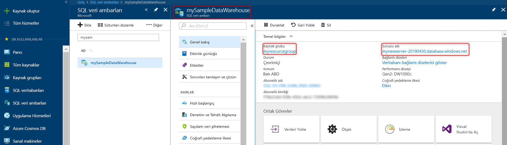
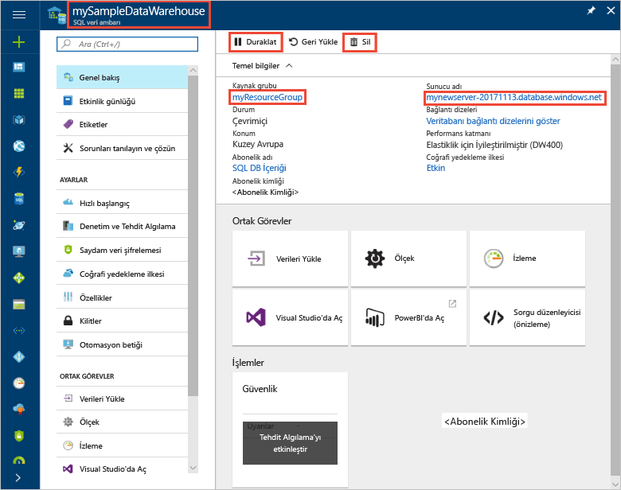

# <a name="quickstart-pause-and-resume-compute-in-azure-sql-data-warehouse-with-powershell"></a>Hızlı Başlangıç: PowerShell ile Azure SQL veri ambarı'nda işlem duraklatma ve sürdürme

Maliyetlerden tasarruf etmek için Azure SQL veri ambarı'nda duraklatma işlem PowerShell kullanın. [İşlem devam](sql-data-warehouse-manage-compute-overview.md) veri ambarı kullanılmaya hazır olduğunuzda.

Azure aboneliğiniz yoksa başlamadan önce [ücretsiz](https://azure.microsoft.com/free/) bir hesap oluşturun.

## <a name="before-you-begin"></a>Başlamadan önce

[!INCLUDE [updated-for-az](../../includes/updated-for-az.md)]

Bu hızlı başlangıçta, duraklatma ve sürdürme SQL data warehouse henüz varsayar. Bir oluşturmanız gerekiyorsa, kullanabileceğiniz [oluşturma ve bağlanma - portal](create-data-warehouse-portal.md) adlı bir veri ambarı oluşturmak için **mySampleDataWarehouse**.

## <a name="log-in-to-azure"></a>Azure'da oturum açma

Kullanarak Azure aboneliği için oturum açın [Connect AzAccount](/powershell/module/az.accounts/connect-azaccount) izleyin ve komut ekrandaki yönergeleri izleyin.

```powershell
Connect-AzAccount
```

Kullanmakta olduğunuz aboneliği görmek için çalıştırma [Get-AzSubscription](/powershell/module/az.accounts/get-azsubscription).

```powershell
Get-AzSubscription
```

Varsayılandan farklı bir abonelik kullanmanız gerekiyorsa, çalıştırma [kümesi AzContext](/powershell/module/az.accounts/set-azcontext).

```powershell
Set-AzContext -SubscriptionName "MySubscription"
```

## <a name="look-up-data-warehouse-information"></a>Veri ambarı bilgilerini arama

Duraklatmayı ve sürdürmeyi planladığınız veri ambarı için veritabanı adını, sunucu adını ve kaynak grubunu bulun.

Veri ambarınız için konum bilgilerini bulmak amacıyla aşağıdaki adımları uygulayın.

1. [Azure Portal](https://portal.azure.com/) oturum açın.
2. Azure portalının sol taraftaki sayfasında **SQL veritabanları**’na tıklayın.
3. **SQL veritabanları** sayfasından **mySampleDataWarehouse** seçeneğini belirleyin. Veri ambarı açılır.

    

4. Veritabanı adı olan veri ambarı adını yazın. Ayrıca sunucu adını ve kaynak grubunu da not alın.
6. Sunucunuz foo.database.windows.net ise, PowerShell cmdlet'lerinde sunucu adı olarak yalnızca ilk bölümü kullanın. Önceki görüntüde tam sunucu adı newserver-20171113.database.windows.net şeklindedir. Sonek bırakın ve kullanmak **newserver-20171113** PowerShell cmdlet'inde sunucu adı olarak.

## <a name="pause-compute"></a>Duraklatma işlem

Maliyetlerden tasarruf etmek için duraklatma ve sürdürme işlem kaynaklarını isteğe bağlı. Örneğin, gece ve hafta sonları veritabanı kullanmıyorsanız, bu saatlerde duraklatabilir ve gün boyunca devam. Veritabanı duraklatılmış durumdayken işlem kaynakları için ücret alınmaz. Ancak, depolama için ücret ödemeye devam.

Bir veritabanı duraklatmak için kullanmak [Suspend-AzSqlDatabase](/powershell/module/az.sql/suspend-azsqldatabase) cmdlet'i. Aşağıdaki örnekte adlı bir veri ambarı duraklatır **mySampleDataWarehouse** adlı bir sunucuda barındırılan **newserver-20171113**. Adlı bir Azure kaynak grubunda sunucusudur **myResourceGroup**.


```Powershell
Suspend-AzSqlDatabase –ResourceGroupName "myResourceGroup" `
–ServerName "newserver-20171113" –DatabaseName "mySampleDataWarehouse"
```

Bir değişim bu sonraki örnekte veritabanı $database nesnesine alır. Ardından nesneye kanallar [Suspend-AzSqlDatabase](/powershell/module/az.sql/suspend-azsqldatabase). Sonuçlar nesne resultDatabase içinde depolanır. Son komut sonuçları gösterilmektedir.

```Powershell
$database = Get-AzSqlDatabase –ResourceGroupName "myResourceGroup" `
–ServerName "newserver-20171113" –DatabaseName "mySampleDataWarehouse"
$resultDatabase = $database | Suspend-AzSqlDatabase
$resultDatabase
```


## <a name="resume-compute"></a>İşlem devam et

Bir veritabanına başlamak için kullanmak [sürdürme AzSqlDatabase](/powershell/module/az.sql/resume-azsqldatabase) cmdlet'i. Aşağıdaki örnek newserver-20171113 adlı bir sunucuda barındırılan mySampleDataWarehouse adlı bir veritabanı başlatır. MyResourceGroup adlı bir Azure kaynak grubunda sunucusudur.

```Powershell
Resume-AzSqlDatabase –ResourceGroupName "myResourceGroup" `
–ServerName "newserver-20171113" -DatabaseName "mySampleDataWarehouse"
```

Bir değişim bu sonraki örnekte veritabanı $database nesnesine alır. Ardından nesneye kanallar [sürdürme AzSqlDatabase](/powershell/module/az.sql/resume-azsqldatabase) ve sonuçları $resultDatabase içinde depolar. Son komut sonuçları gösterilmektedir.

```Powershell
$database = Get-AzSqlDatabase –ResourceGroupName "ResourceGroup1" `
–ServerName "Server01" –DatabaseName "Database02"
$resultDatabase = $database | Resume-AzSqlDatabase
$resultDatabase
```

## <a name="check-status-of-your-data-warehouse-operation"></a>Veri ambarı işlemi durumunu denetleyin

Veri ambarınızın durumunu denetlemek için kullanmak [Get-AzSqlDatabaseActivity](https://docs.microsoft.com/powershell/module/az.sql/Get-AzSqlDatabaseActivity#description) cmdlet'i.

```
Get-AzSqlDatabaseActivity -ResourceGroupName "ResourceGroup01" -ServerName "Server01" -DatabaseName "Database02"
```

## <a name="clean-up-resources"></a>Kaynakları temizleme

Veri ambarı birimleri ve veri ambarınızda depolanan veriler için ücretlendirilirsiniz. Bu işlem ve depolama alanı kaynakları ayrı ayrı faturalandırılır.

- Verileri depoda tutmak istiyorsanız, duraklatabilirsiniz.
- Gelecekteki ücretlendirmeleri kaldırmak istiyorsanız, veri ambarını silebilirsiniz.

Kaynakları istediğiniz gibi temizlemek için bu adımları izleyin.

1. Oturum [Azure portalında](https://portal.azure.com)ve veri ambarınıza tıklayın.

    

2. İşlemi duraklatmak için, **Duraklat** düğmesine tıklayın. Veri ambarı duraklatıldığında, bir **Başlat** düğmesi görürsünüz.  İşlemi sürdürmek için **Başlat**’a tıklayın.

3. İşlem veya depolama için ücretlendirilmemek üzere veri ambarını kaldırmak için **Sil**’e tıklayın.

4. Oluşturduğunuz SQL sunucusunu kaldırmak için tıklayın **mynewserver-20171113.database.windows.net**ve ardından **Sil**.  Sunucuyu silmek sunucuyla ilişkili tüm veritabanlarını da sileceğinden bu silme işlemini gerçekleştirirken dikkatli olun.

5. Kaynak grubunu kaldırmak için, **myResourceGroup**’a tıklayıp daha sonra **Kaynak grubunu sil**’e tıklayın.


## <a name="next-steps"></a>Sonraki adımlar

Artık duraklatıldı ve veri ambarınıza yönelik işlem sürdürülüyor. Azure SQL Veri Ambarı hakkında daha fazla bilgi edinmek için, veri yükleme öğreticisiyle devam edin.

> [!div class="nextstepaction"]
> [SQL veri ambarına veri yükleme](load-data-from-azure-blob-storage-using-polybase.md)
