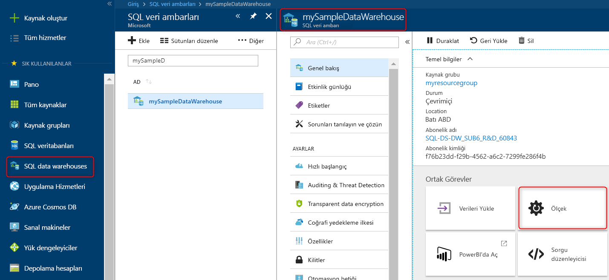

## Hızlı Başlangıç: Azure portalında Azure SQL veri ambarı'nda ölçek işlem

Azure portalından Azure SQL Veri Ambarı’nda işlemi ölçeklendirin. Daha iyi performans için [işlem ölçeğini genişletin](sql-data-warehouse-manage-compute-overview.md) veya maliyet tasarrufu için işlem ölçeğini daraltın. 

Azure aboneliğiniz yoksa başlamadan önce [ücretsiz](https://azure.microsoft.com/free/) bir hesap oluşturun.

## Azure portalında oturum açın

[Azure Portal](https://portal.azure.com/) oturum açın.

## Başlamadan önce

Zaten sahip veya kullanan bir veri ambarını ölçeklendirebilir [hızlı başlangıç: oluşturma ve bağlanma - portal](create-data-warehouse-portal.md) adlı bir veri ambarı oluşturmak için **mySampleDataWarehouse**.  Bu hızlı başlangıç, **mySampleDataWarehouse** öğesini ölçeklendirir.

>[!Note]
>Veri ambarınızın ölçeğini için çevrimiçi olmalıdır. 

## Hesaplamayı ölçeklendirme

SQL veri ambarı işlem kaynakları, artan veya azalan veri ambarı birimleri ölçeklendirilebilir. [Oluşturma ve bağlanma - portal] oluşturulan quickstart(create-data-warehouse-portal.md) **mySampleDataWarehouse** ve 400 Dwu ile başlatıldı. Aşağıdaki adımlar, **mySampleDataWarehouse** için DWU’ları ayarlar.

Veri ambarı birimlerini değiştirmek için:

1. Azure portalının sol taraftaki sayfasında **SQL veri ambarları**’na tıklayın.
2. **SQL veri ambarları** sayfasından **mySampleDataWarehouse** seçeneğini belirleyin. Veri ambarı açılır.
3. **Ölçek** seçeneğine tıklayın.

    

2. Ölçek panelinde kaydırıcıyı sola veya sağa hareket ettirerek DWU ayarını değiştirin.

    

3. **Kaydet**’e tıklayın. Bir onay iletisi görüntülenir. Onaylamak için **evet**’e, iptal etmek için **hayır**’a tıklayın.

    

## Sonraki adımlar
Artık veri ambarınız ölçeklendirileceğini öğrendiniz. Azure SQL Veri Ambarı hakkında daha fazla bilgi edinmek için, veri yükleme öğreticisiyle devam edin.

> [!div class="nextstepaction"]
>[SQL veri ambarına veri yükleme](load-data-from-azure-blob-storage-using-polybase.md)
