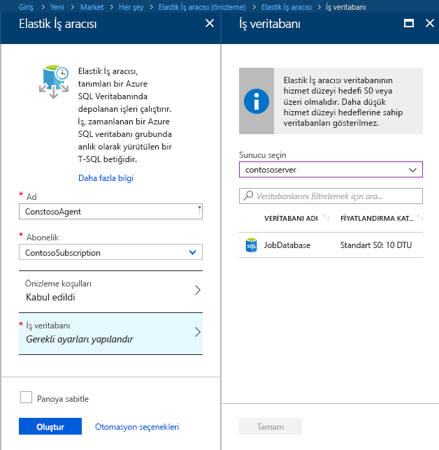
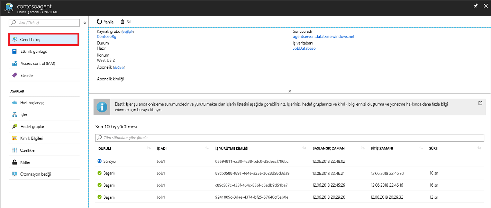
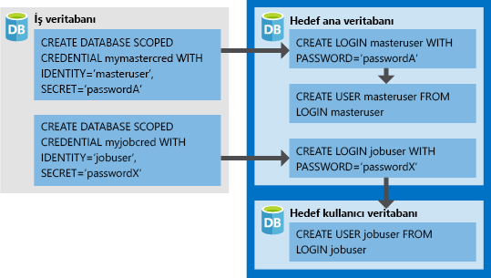

# <a name="create-configure-and-manage-elastic-jobs"></a>Oluşturma, yapılandırma ve elastik işleri Yönet

Bu makalede, oluşturma, yapılandırma ve elastik işleri yönetme öğreneceksiniz. Esnek işler, kullanmadıysanız [Azure SQL veritabanı'nda proje Otomasyon kavramları hakkında daha fazla bilgi](sql-database-job-automation-overview.md).

## <a name="create-and-configure-the-agent"></a>Aracıyı oluşturma ve yapılandırma

1. Boş bir S0 veya üzeri SQL veritabanı oluşturun ya da tanımlayın. Bu veritabanı olarak kullanılacak *iş veritabanı* elastik İş Aracısı oluşturma sırasında.
2. [Portalda](https://portal.azure.com/#create/Microsoft.SQLElasticJobAgent) veya [PowerShell](elastic-jobs-powershell.md#create-the-elastic-job-agent) kullanarak bir Elastik İş aracısı oluşturun.

   

## <a name="create-run-and-manage-jobs"></a>İşleri oluşturma, çalıştırma ve yönetme

1. [PowerShell](elastic-jobs-powershell.md#create-job-credentials-so-that-jobs-can-execute-scripts-on-its-targets) veya [T-SQL](elastic-jobs-tsql.md#create-a-credential-for-job-execution) kullanarak *İş veritabanında* iş yürütme kimlik bilgisi oluşturun.
2. [PowerShell](elastic-jobs-powershell.md#define-the-target-databases-you-want-to-run-the-job-against) veya [T-SQL](elastic-jobs-tsql.md#create-a-target-group-servers) kullanarak hedef grubu (işi çalıştırmak istediğiniz veritabanları) tanımlayın.
3. İşin çalışacağı her veritabanında bir iş aracısı kimlik bilgisi oluşturun [(kullanıcıyı (veya rolü) gruptaki her bir veritabanına ekleyin)](sql-database-control-access.md). Örnek için bkz. [PowerShell öğreticisi](elastic-jobs-powershell.md#create-job-credentials-so-that-jobs-can-execute-scripts-on-its-targets).
4. [PowerShell](elastic-jobs-powershell.md#create-a-job) veya [T-SQL](elastic-jobs-tsql.md#deploy-new-schema-to-many-databases) kullanarak bir iş oluşturun.
5. [PowerShell](elastic-jobs-powershell.md#create-a-job-step) veya [T-SQL](elastic-jobs-tsql.md#deploy-new-schema-to-many-databases) kullanarak iş adımlarını ekleyin.
6. [PowerShell](elastic-jobs-powershell.md#run-the-job) veya [T-SQL](elastic-jobs-tsql.md#begin-ad-hoc-execution-of-a-job) kullanarak bir işi çalıştırın.
7. Portal, [PowerShell](elastic-jobs-powershell.md#monitor-status-of-job-executions) veya [T-SQL](elastic-jobs-tsql.md#monitor-job-execution-status) kullanarak iş yürütme durumunu izleyin.

   

## <a name="credentials-for-running-jobs"></a>İşleri çalıştırmak için kullanılan kimlik bilgileri

İşler, yürütme sırasında hedef grup tarafından belirtilen veritabanlarına bağlanmak için [veritabanı kapsamlı kimlik bilgilerini](/sql/t-sql/statements/create-database-scoped-credential-transact-sql) kullanır. Hedef grupta sunucular veya havuzlar varsa bu veritabanı kapsamlı kimlik bilgileri, kullanılabilir durumdaki veritabanlarını numaralandırmak amacıyla asıl veritabanına bağlanmak için kullanılır.

Bir işi çalıştırmak için uygun kimlik bilgilerinin ayarlanması kafa karışıklığına neden olabileceğinden aşağıdaki noktaları göz önünde bulundurun:

- Veritabanı kapsamlı kimlik bilgileri *İş veritabanında* oluşturulmalıdır.
- **Tüm hedef veritabanları oturum açma kimliğiyle olmalıdır [yeterli izinlere](https://docs.microsoft.com/sql/relational-databases/security/permissions-database-engine) iş, başarıyla tamamlanması için** (`jobuser` aşağıdaki çizimde).
- İşleri arasında yeniden kullanılabilir kimlik bilgileri ve kimlik bilgisi parolaları şifrelenir ve iş nesnelere salt okunur erişime sahip kullanıcıların güvenli.

Aşağıdaki resim, uygun iş kimlik bilgilerinin anlaşılması ve ayarlanması konusunda yardımcı olmak üzere tasarlanmıştır. **Kullanıcının, işin çalıştırılacağı her veritabanında (tüm *hedef kullanıcı veritabanlarında*) oluşturulması gerektiğini unutmayın**.



## <a name="security-best-practices"></a>En iyi güvenlik uygulamaları

Elastik İşlerle çalışırken dikkat etmeniz gereken en iyi deneyimlerin bazıları:

- API’lerin kullanımını güvenilir kişilerle sınırlayın.
- Kimlik bilgileri iş adımını gerçekleştirmek için gerekli olan en düşük ayrıcalıklara sahip olmalıdır. Daha fazla bilgi için [yetkilendirme ve izinler SQL Server](https://docs.microsoft.com/dotnet/framework/data/adonet/sql/authorization-and-permissions-in-sql-server).
- Bir sunucu ve/veya havuzu hedef grup üyesi kullanırken, yüksek oranda listesini görüntüle/sunucuları ve/veya iş yürütülmeden önce havuzlarını veritabanı listesini genişletmek için kullanılan veritabanları için ana veritabanı üzerinde haklara sahip ayrı bir kimlik bilgisi oluşturmak için önerilir.

## <a name="agent-performance-capacity-and-limitations"></a>Aracı performansı, kapasitesi ve sınırlamaları

Elastik İşler, uzun süren işlerin tamamlanması sırasında en az düzeyde işlem kaynağı kullanır.

Hedef veritabanı grubunun boyutuna ve bir işin istenen yürütme süresine (eşzamanlı çalışan sayısı) bağlı olarak aracı için gerekli olan işlem süresi ve *İş veritabanı* performansı değişiklik gösterir (hedef ve iş sayısı ne kadar yüksek olursa gereken işlem zamanı o kadar fazla olur).

Önizleme şu an için 100 eşzamanlı işle sınırlıdır.

### <a name="prevent-jobs-from-reducing-target-database-performance"></a>İşlerin hedef veritabanının performansını düşürmesini engelleme

Bir SQL elastik havuzundaki veritabanları üzerinde iş çalıştırılması sırasında kaynakların aşırı yüklenmesini önlemek için işler aynı anda üzerinde çalışılabilecek veritabanı sayısını sınırlayacak şekilde yapılandırılabilir.

Üzerinde çalıştığı ayarlayarak bir iş eş zamanlı veritabanlarının sayısını ayarlayın `sp_add_jobstep` saklı yordamı'nın `@max_parallelism` T-SQL, parametre veya `Add-AzSqlElasticJobStep -MaxParallelism` PowerShell'de.

## <a name="best-practices-for-creating-jobs"></a>İş oluşturmak için en iyi deneyimler

### <a name="idempotent-scripts"></a>Bir kez etkili betikler
Bir işin T-SQL betiklerinin [bir kez etkili](https://en.wikipedia.org/wiki/Idempotence) olması gerekir. **Bir kez etkili**, betiğin başarılı olması ve tekrar çalıştırılması durumunda aynı sonucun ortaya çıkması anlamına gelir. Bir betik, geçici ağ sorunları nedeniyle başarısız olabilir. Bu durumda iş, betiği atlamadan önce otomatik olarak önceden belirtilen sayıda yeniden deneme gerçekleştirir. Bir kez etkili betik, iki kez (veya daha fazla) çalıştırılsa dahi aynı sonucu verir.

Basit bir yöntem, bir nesneyi oluşturmadan önce mevcut olup olmadığını test etmektir.


```sql
IF NOT EXIST (some_object)
    -- Create the object
    -- If it exists, drop the object before recreating it.
```

Benzer şekilde bir betiğin mantıksal olarak test ederek ve bulduğu sonuçlara göre kendini ayarlayarak başarılı şekilde yürütülebilmesi gerekir.


## <a name="next-steps"></a>Sonraki adımlar

- [PowerShell’i kullanarak Elastik İşler oluşturma ve yönetme](elastic-jobs-powershell.md)
- [Transact-SQL (T-SQL) kullanarak Elastik İşler oluşturma ve yönetme](elastic-jobs-tsql.md)
