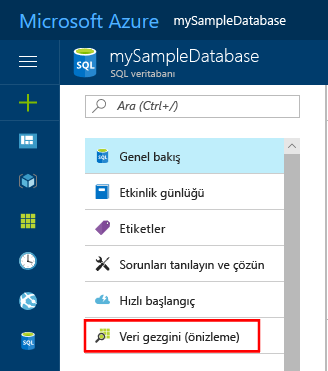
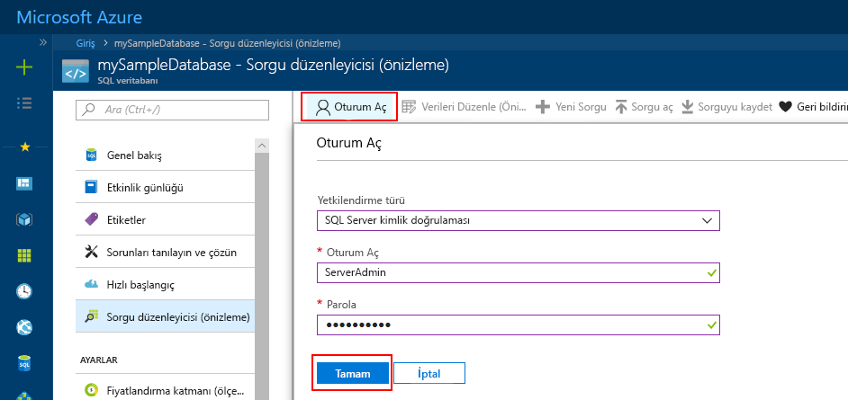
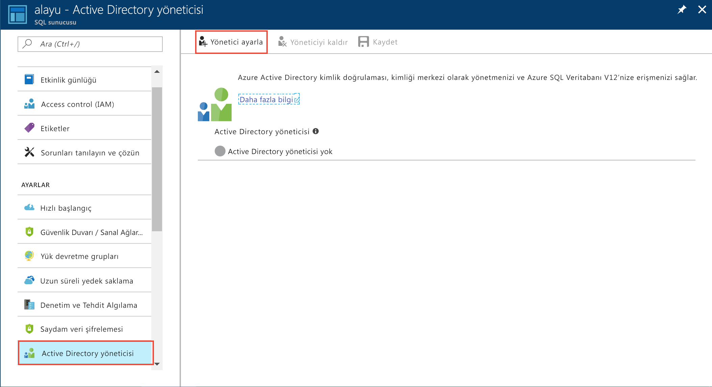
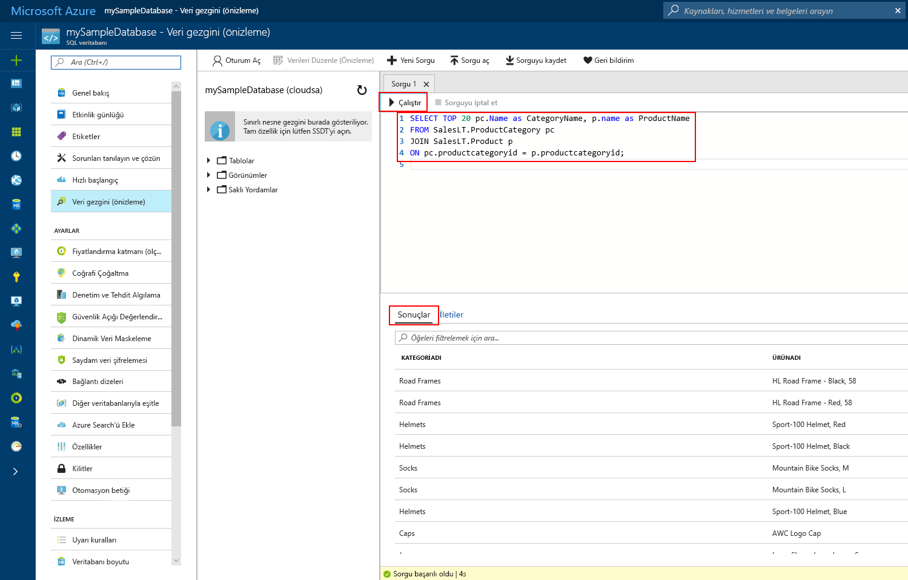

# <a name="quickstart-use-the-azure-portals-sql-query-editor-to-connect-and-query-data"></a>Hızlı Başlangıç: Bağlanmak ve veri sorgulamak için Azure portalında SQL sorgu Düzenleyicisi'ni kullanın

SQL sorgu Düzenleyicisi, Azure SQL veritabanı veya Azure SQL veri ambarı üzerinde SQL sorguları yürütmek için kolay bir yol sağlayarak, Azure portal tarayıcı bir araçtır. Bu hızlı başlangıçta, bir SQL veritabanına bağlanan ve ardından sorgulama, ekleme, güncelleştirme için Transact-SQL deyimleri çalıştırın ve verileri silmek için sorgu Düzenleyicisi'ni kullanacaksınız.

## <a name="prerequisites"></a>Önkoşullar

Bu öğreticiyi tamamlamak için aşağıdakiler gerekir:

- Bir Azure SQL veritabanı. Şu hızlı başlangıçlardan biriyle oluşturmak ve ardından bir veritabanını Azure SQL veritabanı'nda yapılandırmak için kullanabilirsiniz:

  || Tek veritabanı |
  |:--- |:--- |
  | Oluştur| [Portal](sql-database-single-database-get-started.md) | 
  || [CLI](scripts/sql-database-create-and-configure-database-cli.md) | 
  || [PowerShell](scripts/sql-database-create-and-configure-database-powershell.md) | 
  | Yapılandırma | [sunucu düzeyinde IP güvenlik duvarı kuralı](sql-database-server-level-firewall-rule.md)| 
  |||

> [!NOTE]
> Emin olun **Azure hizmetlerine erişime izin ver** seçeneği **ON** SQL server güvenlik duvarı ayarlarınızda. Bu seçenek, SQL sorgu Düzenleyicisi erişimi veritabanlarınıza ve veri ambarlarınıza erişmesini sağlar.

## <a name="sign-in-the-azure-portal"></a>Azure portalında oturum açın

[Azure Portal](https://portal.azure.com/) oturum açın.

## <a name="connect-using-sql-authentication"></a>SQL kimlik doğrulamasını kullanarak bağlanma

1. Seçin **SQL veritabanları** seçin ve sol taraftaki menüden **mySampleDatabase**.

2. Sol taraftaki menüde bulmak ve seçmek **sorgu Düzenleyicisi (Önizleme)**. **Oturum açma** sayfası görüntülenir.

    

3. Gelen **Yetkilendirme türü** açılan menüsünde, select **SQL Server kimlik doğrulamasını** ve kullanıcı kimliği ve veritabanı oluşturmak için kullanılan sunucu yönetici hesabı parolasını girin.

     

4. **Tamam**’ı seçin.


## <a name="connect-using-azure-active-directory"></a>Azure Active Directory kullanarak bağlan

Bir Active Directory (AD) yöneticisinin yapılandırılması, Azure portalı ve SQL veritabanınızda oturum açmak için tek bir kimlik kullanmanıza olanak sağlar. SQL server için bir AD Yöneticisi yapılandırmak için aşağıdaki adımları izleyin.

> [!NOTE]
> * E-posta hesapları (örneğin, outlook.com, gmail.com, yahoo.com vb.) AD yöneticileri olarak henüz desteklenmemektedir. Bir kullanıcı ya da yerel olarak Azure AD'de oluşturulmuş veya Azure AD ile Federasyon seçtiğinizden emin olun.
> * Azure AD Yöneticisi'ni açın 2 faktörlü kimlik doğrulaması etkin olan hesapları ile çalışmaz.

1. Seçin **tüm kaynakları** sol taraftaki menüden ve ardından SQL server'ınızı seçin.

2. SQL server'ın gelen **ayarları** menüsünde **Active Directory Yöneticisi**.

3. AD Yönetim sayfası araç çubuğundan seçin **yönetici Ayarla** ve kullanıcı veya grup, AD Yöneticisi olarak seçin

    

4. AD Yönetim sayfası araç çubuğundan seçin **Kaydet**.

5. Gidin **mySampleDatabase** veritabanı ve sol taraftaki menüden **sorgu Düzenleyicisi (Önizleme)**. **Oturum açma** sayfası görüntülenir. Bir AD, daha sonra sağ tarafta altında yöneticisiyseniz **Active Directory çoklu oturum açma**, açtığınızdan bildiren bir ileti görüntülenir. 
   
6. **Tamam**’ı seçin.


## <a name="view-data"></a>Verileri görüntüleme

1. Doğrulandıktan sonra ilk 20 ürünü kategoriye göre almak için sorgu Düzenleyicisi'nde aşağıdaki SQL yapıştırın.

   ```sql
    SELECT TOP 20 pc.Name as CategoryName, p.name as ProductName
    FROM SalesLT.ProductCategory pc
    JOIN SalesLT.Product p
    ON pc.productcategoryid = p.productcategoryid;
   ```

2. Araç çubuğunda **çalıştırma** ve ardından çıktıyı inceleyin **sonuçları** bölmesi.



## <a name="insert-data"></a>Veri ekleme

Aşağıdaki komutu çalıştırın [Ekle](https://msdn.microsoft.com/library/ms174335.aspx) yeni bir ürün eklemek için Transact-SQL deyimini `SalesLT.Product` tablo.

1. Önceki sorguyu Bununla değiştirin.

   ```sql
   INSERT INTO [SalesLT].[Product]
           ( [Name]
           , [ProductNumber]
           , [Color]
           , [ProductCategoryID]
           , [StandardCost]
           , [ListPrice]
           , [SellStartDate]
           )
     VALUES
           ('myNewProduct'
           ,123456789
           ,'NewColor'
           ,1
           ,100
           ,100
           ,GETDATE() );
   ```


2. Seçin **çalıştırma** yeni bir satır eklemek için `Product` tablo. **İletileri** bölmesini görüntüler **sorgu başarılı oldu: Etkilenen Satırlar: 1**.


## <a name="update-data"></a>Verileri güncelleştirme

Aşağıdaki komutu çalıştırın [güncelleştirme](https://msdn.microsoft.com/library/ms177523.aspx) yeni ürün değiştirmek için Transact-SQL deyimi.

1. Önceki sorguyu Bununla değiştirin.

   ```sql
   UPDATE [SalesLT].[Product]
   SET [ListPrice] = 125
   WHERE Name = 'myNewProduct';
   ```

2. Seçin **çalıştırma** belirtilen satırı güncelleştirmek için `Product` tablo. **İletileri** bölmesini görüntüler **sorgu başarılı oldu: Etkilenen Satırlar: 1**.

## <a name="delete-data"></a>Verileri silme

Aşağıdaki komutu çalıştırın [Sil](https://msdn.microsoft.com/library/ms189835.aspx) Transact-SQL deyimini kullanarak yeni ürünü kaldırmak için.

1. Önceki sorguyu Bununla değiştirin:

   ```sql
   DELETE FROM [SalesLT].[Product]
   WHERE Name = 'myNewProduct';
   ```

2. Seçin **çalıştırma** belirtilen satırı silmek için `Product` tablo. **İletileri** bölmesini görüntüler **sorgu başarılı oldu: Etkilenen Satırlar: 1**.


## <a name="query-editor-considerations"></a>Sorgu Düzenleyicisi konuları

Sorgu Düzenleyicisi ile çalışırken bilmeniz gereken birkaç nokta vardır.

* Sanal ağ içinde sorgu SQL server veritabanları için sorgu Düzenleyicisi'ni kullanamazsınız.

* F5 tuşuna basarak sorgu Düzenleyicisi sayfası yenilenir ve üzerinde çalışılmakta olan herhangi bir sorgu kaybolur.

* Sorgu Düzenleyicisi, bağlanmayı desteklemez `master` veritabanı.

* Sorgu yürütme için 5 dakikalık zaman aşımı yoktur.

* Sorgu Düzenleyicisi, yalnızca coğrafi veri türleri için Silindirik izdüşümü destekler.

* Veritabanı tabloları ve görünümleri için IntelliSense desteği yoktur. Ancak, düzenleyici zaten girilmiş adları otomatik tamamlama desteklemiyor.


## <a name="next-steps"></a>Sonraki adımlar

Azure SQL veritabanlarında desteklenen Transact-SQL hakkında daha fazla bilgi için bkz: [Transact-SQL farklılıklarını çözümleme SQL veritabanına geçiş sırasında](sql-database-transact-sql-information.md).
