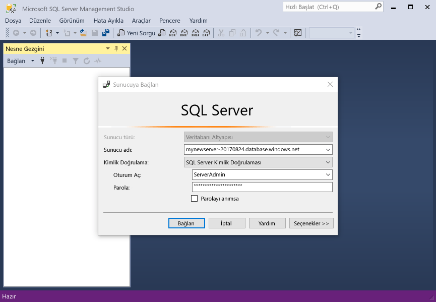
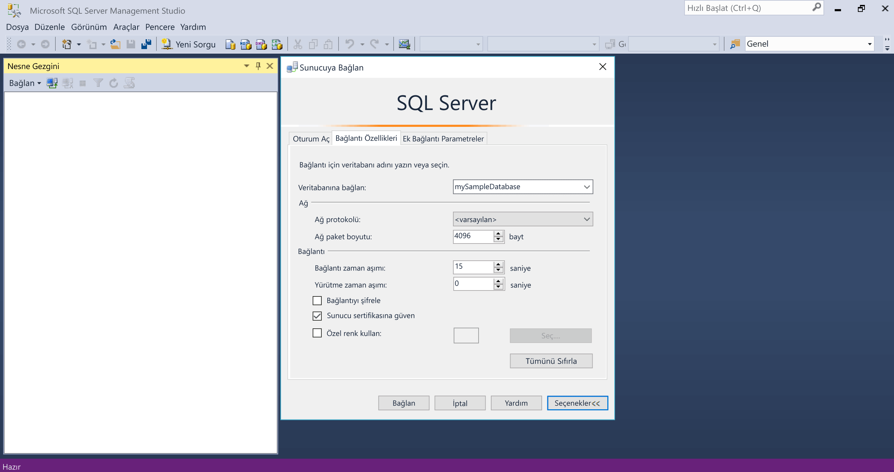
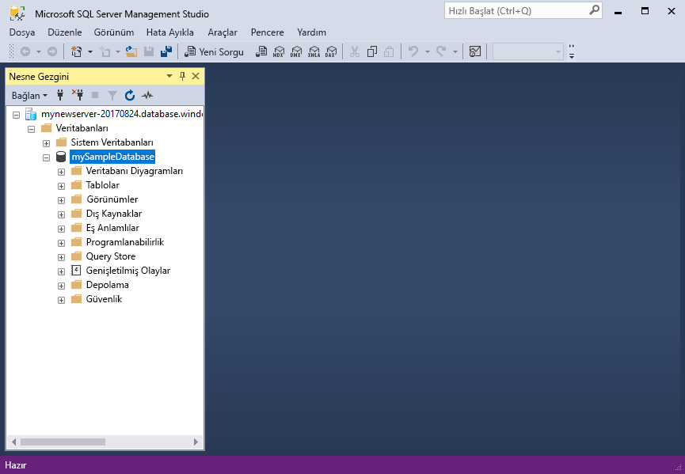

# <a name="quickstart-use-sql-server-management-studio-to-connect-and-query-an-azure-sql-database"></a>Hızlı Başlangıç: Bağlanmak ve bir Azure SQL veritabanı sorgulamak için SQL Server Management Studio'yu kullanın.

Bu hızlı başlangıçta kullanacaksınız [SQL Server Management Studio] [ ssms-install-latest-84g] (SSMS) kullanarak Azure SQL veritabanına bağlanmak için. Ardından, Transact-SQL deyimleriyle sorgulama, ekleme, güncelleştirme ve verileri silmek çalıştıracaksınız. SSMS, SQL Server'dan SQL veritabanı için Microsoft Windows tüm SQL altyapılarını yönetmek için kullanabilirsiniz.  

## <a name="prerequisites"></a>Önkoşullar

- Bir Azure SQL veritabanı. Şu hızlı başlangıçlardan biriyle oluşturmak ve ardından bir veritabanını Azure SQL veritabanı'nda yapılandırmak için kullanabilirsiniz:

  || Tek veritabanı | Yönetilen örnek |
  |:--- |:--- |:---|
  | Oluştur| [Portal](sql-database-single-database-get-started.md) | [Portal](sql-database-managed-instance-get-started.md) |
  || [CLI](scripts/sql-database-create-and-configure-database-cli.md) | [CLI](https://medium.com/azure-sqldb-managed-instance/working-with-sql-managed-instance-using-azure-cli-611795fe0b44) |
  || [PowerShell](scripts/sql-database-create-and-configure-database-powershell.md) | [PowerShell](scripts/sql-database-create-configure-managed-instance-powershell.md) |
  | Yapılandırma | [sunucu düzeyinde IP güvenlik duvarı kuralı](sql-database-server-level-firewall-rule.md)| [Bir VM bağlantısı](sql-database-managed-instance-configure-vm.md)|
  |||[Şirket içi bağlantısı](sql-database-managed-instance-configure-p2s.md)
  |Veri yükleme|Adventure Works hızlı başlangıç yüklendi|[Wide World Importers geri yükleme](sql-database-managed-instance-get-started-restore.md)
  |||Geri yükleme ya da Adventure Works'den içe [BACPAC](sql-database-import.md) dosya [GitHub](https://github.com/Microsoft/sql-server-samples/tree/master/samples/databases/adventure-works)|
  |||

  > [!IMPORTANT]
  > Komut bu makalede, Adventure Works veritabanı kullanmak için yazılır. Yönetilen örnek sayesinde, Adventure Works veritabanı bir örneği veritabanına aktarmak veya betiklerde Wide World Importers veritabanını kullanmak için bu makaleyi değiştirin.

## <a name="install-the-latest-ssms"></a>En son SSMS’yi yükleyin

Başlamadan önce en son yüklediğinizden emin olun [SSMS][ssms-install-latest-84g].

## <a name="get-sql-server-connection-information"></a>SQL server bağlantı bilgilerini alma

Azure SQL veritabanına bağlanmak için gereken bağlantı bilgilerini alın. Yaklaşan yordamlar için tam sunucu adını veya ana bilgisayar adı, veritabanı adını ve oturum açma bilgileri gerekir.

1. [Azure Portal](https://portal.azure.com/) oturum açın.

2. Gidin **SQL veritabanları** veya **SQL yönetilen örnekler** sayfası.

3. Üzerinde **genel bakış** sayfasında, tam sunucu adını gözden **sunucu adı** tek bir veritabanı veya tam sunucu adı yanındaki **konak** yönetilen bir örneği. Sunucu adı veya ana bilgisayar adı kopyalamak için üzerine gelin ve seçin **kopyalama** simgesi.

## <a name="connect-to-your-database"></a>Veritabanınıza bağlanın

SMSS Azure SQL veritabanı sunucunuza bağlanın.

> [!IMPORTANT]
> Azure SQL veritabanı sunucusu 1433 numaralı bağlantı noktasını dinler. Kurumsal bir güvenlik duvarının arkasından bir SQL veritabanı sunucusuna bağlanmak için güvenlik duvarının Bu bağlantı noktası açık olması gerekir.
>

1. SSMS’i açın. **Sunucuya Bağlan** iletişim kutusu görüntülenir.

2. Aşağıdaki bilgileri girin:

   | Ayar      | Önerilen değer    | Açıklama |
   | ------------ | ------------------ | ----------- |
   | **Sunucu türü** | Veritabanı altyapısı | Gerekli değer. |
   | **Sunucu adı** | Tam sunucu adı | Aşağıdakine benzer: **mynewserver20170313.database.windows.net**. |
   | **Kimlik doğrulaması** | SQL Server Kimlik Doğrulaması | Bu öğreticide, SQL kimlik doğrulaması kullanır. |
   | **Oturum açma** | Sunucu yönetici hesabının kullanıcı kimliği | Sunucu oluşturmak için kullanılan sunucu yönetici hesabına ait kullanıcı kimliği. |
   | **Parola** | Sunucu yönetici hesabı parolası | Sunucu oluşturmak için kullanılan sunucu yönetici hesabı parolası. |
   ||||

     

3. Seçin **seçenekleri** içinde **sunucuya Bağlan** iletişim kutusu. İçinde **veritabanına bağlan** açılan menüsünde, select **mySampleDatabase**.

     

4. **Bağlan**’ı seçin. Nesne Gezgini penceresi açılır.

5. Veritabanı nesneleri görüntülemek için genişletin **veritabanları** ve ardından **mySampleDatabase**.

     

## <a name="query-data"></a>Verileri sorgulama

Bu çalıştırma [seçin](https://msdn.microsoft.com/library/ms189499.aspx) Transact-SQL kodunu sorgulamak için ilk 20 ürünü kategoriye göre.

1. Nesne Gezgini'nde sağ **mySampleDatabase** seçip **yeni sorgu**. Veritabanınıza bağlı yeni bir sorgu penceresi açılır.

2. Bu SQL sorgusunu sorgu penceresine yapıştırın.

   ```sql
   SELECT pc.Name as CategoryName, p.name as ProductName
   FROM [SalesLT].[ProductCategory] pc
   JOIN [SalesLT].[Product] p
   ON pc.productcategoryid = p.productcategoryid;
   ```

3. Araç çubuğunda **yürütme** verilerin alınacağı `Product` ve `ProductCategory` tablolar.

    

## <a name="insert-data"></a>Veri ekleme

Bu çalıştırma [Ekle](https://msdn.microsoft.com/library/ms174335.aspx) yeni bir ürün oluşturmak için Transact-SQL kodu `SalesLT.Product` tablo.

1. Önceki sorguyu Bununla değiştirin.

   ```sql
   INSERT INTO [SalesLT].[Product]
           ( [Name]
           , [ProductNumber]
           , [Color]
           , [ProductCategoryID]
           , [StandardCost]
           , [ListPrice]
           , [SellStartDate] )
     VALUES
           ('myNewProduct'
           ,123456789
           ,'NewColor'
           ,1
           ,100
           ,100
           ,GETDATE() );
   ```

2. Seçin **yürütme** yeni bir satır eklemek için `Product` tablo. **İletileri** bölmesini görüntüler **(1 satır etkilendi)**.

## <a name="view-the-result"></a>Görünüm sonucu

1. Önceki sorguyu Bununla değiştirin.

   ```sql
   SELECT * FROM [SalesLT].[Product]
   WHERE Name='myNewProduct'
   ```

2. **Yürüt**’ü seçin. Aşağıdaki sonucu görüntülenir.

   

## <a name="update-data"></a>Verileri güncelleştirme

Bu çalıştırma [güncelleştirme](https://msdn.microsoft.com/library/ms177523.aspx) yeni ürün değiştirmek için Transact-SQL kodu.

1. Önceki sorguyu Bununla değiştirin.

   ```sql
   UPDATE [SalesLT].[Product]
   SET [ListPrice] = 125
   WHERE Name = 'myNewProduct';
   ```

2. Seçin **yürütme** belirtilen satırı güncelleştirmek için `Product` tablo. **İletileri** bölmesini görüntüler **(1 satır etkilendi)**.

## <a name="delete-data"></a>Verileri silme

Bu çalıştırma [Sil](https://msdn.microsoft.com/library/ms189835.aspx) Transact-SQL kodunu yeni ürün kaldırmak için.

1. Önceki sorguyu Bununla değiştirin.

   ```sql
   DELETE FROM [SalesLT].[Product]
   WHERE Name = 'myNewProduct';
   ```

2. Seçin **yürütme** belirtilen satırı silmek için `Product` tablo. **İletileri** bölmesini görüntüler **(1 satır etkilendi)**.

## <a name="next-steps"></a>Sonraki adımlar

- SSMS hakkında daha fazla bilgi için bkz: [SQL Server Management Studio](https://msdn.microsoft.com/library/ms174173.aspx).
- Azure portalını kullanarak bağlanmak ve sorgulamak için bkz. [Azure Portal SQL Sorgusu düzenleyicisiyle bağlanma ve sorgulama](sql-database-connect-query-portal.md).
- Visual Studio Code’u kullanarak bağlanmak ve sorgulamak için bkz. [Visual Studio Code ile bağlanma ve sorgulama](sql-database-connect-query-vscode.md).
- .NET kullanarak bağlanıp sorgulamak için bkz. [.NET ile bağlanma ve sorgulama](sql-database-connect-query-dotnet.md).
- PHP kullanarak bağlanıp sorgulamak için bkz. [PHP ile bağlanma ve sorgulama](sql-database-connect-query-php.md).
- Node.js kullanarak bağlanıp sorgulamak için bkz. [Node.js ile bağlanma ve sorgulama](sql-database-connect-query-nodejs.md).
- Java kullanarak bağlanıp sorgulamak için bkz. [Java ile bağlanma ve sorgulama](sql-database-connect-query-java.md).
- Python kullanarak bağlanıp sorgulamak için bkz. [Python ile bağlanma ve sorgulama](sql-database-connect-query-python.md).
- Ruby kullanarak bağlanıp sorgulamak için bkz. [Ruby ile bağlanma ve sorgulama](sql-database-connect-query-ruby.md).

<!-- Article link references. -->

[ssms-install-latest-84g]: https://docs.microsoft.com/sql/ssms/sql-server-management-studio-ssms