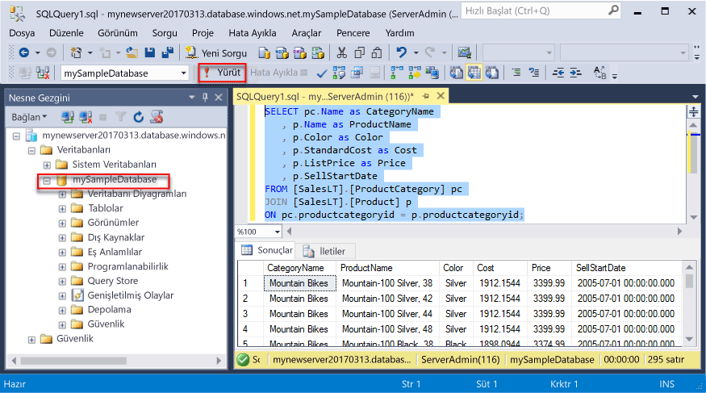
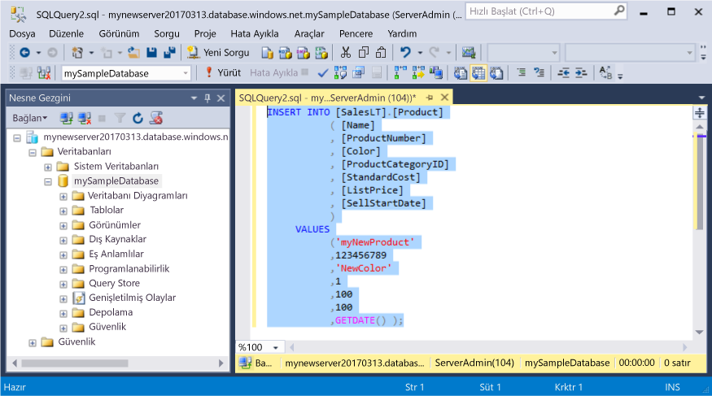
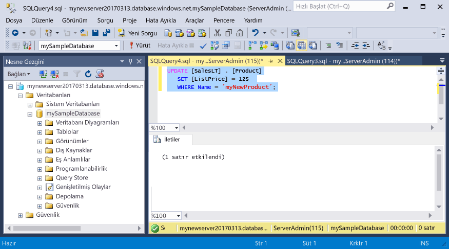
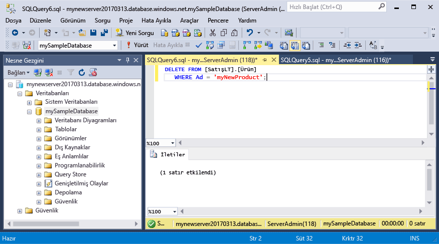

# <a name="azure-sql-database-use-sql-server-management-studio-to-connect-and-query-data"></a>Azure SQL Veritabanı: SQL Server Management Studio kullanarak verileri bağlama ve sorgulama

[SQL Server Management Studio][ssms-install-latest-84g] (SSMS) Microsoft Windows için SQL Server’dan SQL Veritabanı’na tüm SQL altyapılarını yönetebileceğiniz tümleşik bir ortamdır. Bu hızlı başlangıçta SSMS kullanarak bir Azure SQL veritabanına bağlanma ve daha sonra Transact-SQL deyimlerini kullanarak veritabanındaki verileri sorgulama, ekleme, güncelleştirme ve silme işlemlerinin nasıl yapılacağı açıklanır. 

## <a name="prerequisites"></a>Ön koşullar

Bu hızlı başlangıçta başlangıç noktası olarak bu hızlı başlangıçlardan birinde oluşturulan kaynaklar kullanılır:

[!INCLUDE [prerequisites-create-db](../../includes/sql-database-connect-query-prerequisites-create-db-includes.md)]

#### <a name="install-the-latest-ssms"></a>En son SSMS’yi yükleyin

Başlamadan önce, en yeni [SSMS][ssms-install-latest-84g] sürümünü yüklediğinizden emin olun. 

## <a name="sql-server-connection-information"></a>SQL Server bağlantı bilgileri

[!INCLUDE [prerequisites-server-connection-info](../../includes/sql-database-connect-query-prerequisites-server-connection-info-includes.md)]

## <a name="connect-to-your-database"></a>Veritabanınıza bağlanın

SQL Server Management Studio’yu kullanarak Azure SQL Veritabanı sunucunuzla bağlantı kurun. 

> [!IMPORTANT]
> Azure SQL Veritabanı mantıksal sunucusu 1433 numaralı bağlantı noktasında dinler. Azure SQL Veritabanı mantıksal sunucusuna bir şirket ağından bağlanmaya çalışıyorsanız, bu bağlantı noktası başarıyla bağlanmanız için şirket güvenlik ağında açık olmalıdır.
>

1. SQL Server Management Studio’yu açın.

2. **Sunucuya Bağlan** iletişim kutusuna şu bilgileri girin:

   | Ayar      | Önerilen değer    | Açıklama | 
   | ------------ | ------------------ | ----------- | 
   | **Sunucu türü** | Veritabanı altyapısı | Bu değer gereklidir. |
   | **Sunucu adı** | Tam sunucu adı | Ad şunun gibi olmalıdır: **mynewserver20170313.database.windows.net**. |
   | **Kimlik doğrulaması** | SQL Server Kimlik Doğrulaması | Bu öğreticide yapılandırdığımız tek kimlik doğrulaması türü SQL Kimlik Doğrulamasıdır. |
   | **Oturum açma** | Sunucu yöneticisi hesabı | Bu, sunucuyu oluştururken belirttiğiniz hesaptır. |
   | **Parola** | Sunucu yöneticisi hesabınızın parolası | Bu, sunucuyu oluştururken belirttiğiniz paroladır. |
   ||||

     

3. **Sunucuya bağlan** iletişim kutusunda **Seçenekler**’e tıklayın. **Veritabanına bağlan** bölümünde bu veritabanına bağlanmak için **mySampleDatabase** yazın.

     

4. **Bağlan**'a tıklayın. SSMS’te Nesne Gezgini penceresi açılır. 

     

5. Nesne Gezgini’nde **Veritabanları**’nı ve ardından **mySampleDatabase** öğesini genişleterek nesneleri örnek veritabanında görüntüleyin.

## <a name="query-data"></a>Verileri sorgulama

[SELECT](https://msdn.microsoft.com/library/ms189499.aspx) Transact-SQL deyimini kullanarak ilk 20 ürünü kategoriye göre sorgulamak için aşağıdaki kodu kullanın.

1. Nesne Gezgini’nde **mySampleDatabase** öğesine sağ tıklayıp **Yeni Sorgu**’ya tıklayın. Veritabanınıza bağlı boş bir sorgu penceresi açılır.
2. Sorgu penceresine aşağıdaki sorguyu girin:

   ```sql
   SELECT pc.Name as CategoryName, p.name as ProductName
   FROM [SalesLT].[ProductCategory] pc
   JOIN [SalesLT].[Product] p
   ON pc.productcategoryid = p.productcategoryid;
   ```

3. Araç çubuğunda **Yürüt**’e tıklayarak Product ve ProductCategory tablolarından verileri alın.

    

## <a name="insert-data"></a>Veri ekleme

[INSERT](https://msdn.microsoft.com/library/ms174335.aspx) Transact-SQL deyimini kullanarak SalesLT.Product tablosuna yeni ürün eklemek için aşağıdaki kodu kullanın.

1. Sorgu penceresinde önceki sorguyu aşağıdaki sorguyla değiştirin:

   ```sql
   INSERT INTO [SalesLT].[Product]
           ( [Name]
           , [ProductNumber]
           , [Color]
           , [ProductCategoryID]
           , [StandardCost]
           , [ListPrice]
           , [SellStartDate]
           )
     VALUES
           ('myNewProduct'
           ,123456789
           ,'NewColor'
           ,1
           ,100
           ,100
           ,GETDATE() );
   ```

2. Araç çubuğunda **Yürüt**’e tıklayarak Product tablosuna yeni bir satır ekleyin.

    

## <a name="update-data"></a>Verileri güncelleştirme

[UPDATE](https://msdn.microsoft.com/library/ms177523.aspx) Transact-SQL deyimini kullanarak daha önce eklemiş olduğunuz yeni ürünü güncelleştirmek için aşağıdaki kodu kullanın.

1. Sorgu penceresinde önceki sorguyu aşağıdaki sorguyla değiştirin:

   ```sql
   UPDATE [SalesLT].[Product]
   SET [ListPrice] = 125
   WHERE Name = 'myNewProduct';
   ```

2. Araç çubuğunda **Yürüt**’e tıklayarak Product tablosunda belirtilen satırı güncelleştirin.

    

## <a name="delete-data"></a>Verileri silme

[DELETE](https://msdn.microsoft.com/library/ms189835.aspx) Transact-SQL deyimini kullanarak daha önce eklemiş olduğunuz yeni ürünü silmek için aşağıdaki kodu kullanın.

1. Sorgu penceresinde önceki sorguyu aşağıdaki sorguyla değiştirin:

   ```sql
   DELETE FROM [SalesLT].[Product]
   WHERE Name = 'myNewProduct';
   ```

2. Araç çubuğunda **Yürüt**’e tıklayarak Product tablosunda belirtilen satırı silin.

    

## <a name="next-steps"></a>Sonraki adımlar

- Transact-SQL ile sunucu oluşturma ve yönetme hakkında daha fazla bilgi için bkz. [Azure SQL Veritabanı sunucuları ve veritabanları hakkında bilgi edinin](sql-database-servers-databases.md).
- SSMS hakkında bilgi için bkz. [SQL Server Management Studio'yu Kullanma](https://msdn.microsoft.com/library/ms174173.aspx).
- Azure portalını kullanarak bağlanmak ve sorgulamak için bkz. [Azure Portal SQL Sorgusu düzenleyicisiyle bağlanma ve sorgulama](sql-database-connect-query-portal.md).
- Visual Studio Code’u kullanarak bağlanmak ve sorgulamak için bkz. [Visual Studio Code ile bağlanma ve sorgulama](sql-database-connect-query-vscode.md).
- .NET kullanarak bağlanıp sorgulamak için bkz. [.NET ile bağlanma ve sorgulama](sql-database-connect-query-dotnet.md).
- PHP kullanarak bağlanıp sorgulamak için bkz. [PHP ile bağlanma ve sorgulama](sql-database-connect-query-php.md).
- Node.js kullanarak bağlanıp sorgulamak için bkz. [Node.js ile bağlanma ve sorgulama](sql-database-connect-query-nodejs.md).
- Java kullanarak bağlanıp sorgulamak için bkz. [Java ile bağlanma ve sorgulama](sql-database-connect-query-java.md).
- Python kullanarak bağlanıp sorgulamak için bkz. [Python ile bağlanma ve sorgulama](sql-database-connect-query-python.md).
- Ruby kullanarak bağlanıp sorgulamak için bkz. [Ruby ile bağlanma ve sorgulama](sql-database-connect-query-ruby.md).


<!-- Article link references. -->

[ssms-install-latest-84g]: https://docs.microsoft.com/en-us/sql/ssms/sql-server-management-studio-ssms

