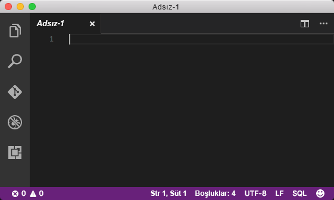
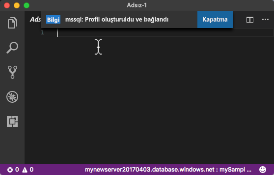
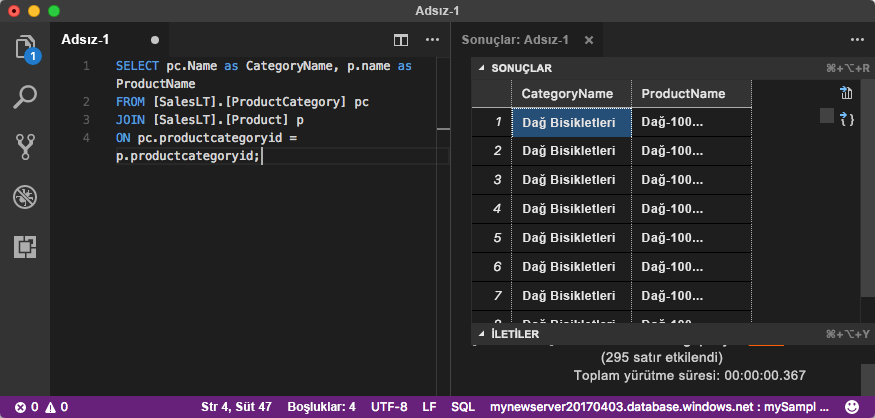

# <a name="azure-sql-database-use-visual-studio-code-to-connect-and-query-data"></a>Azure SQL Veritabanı: Visual Studio Code kullanarak verileri bağlama ve sorgulama

Linux, macOS ve Windows’a yönelik bir grafik kod düzenleyicisi olan [Visual Studio Code](https://code.visualstudio.com/docs); Microsoft SQL Server, Azure SQL Veritabanı ve SQL Veri Ambarı’nı sorgulamak için kullanılabilen [mssql uzantısı](https://aka.ms/mssql-marketplace) gibi uzantıları destekler. Bu hızlı başlangıçta Visual Studio Code’u kullanarak bir Azure SQL veritabanına bağlanma ve daha sonra Transact-SQL deyimlerini kullanarak veritabanındaki verileri sorgulama, ekleme, güncelleştirme ve silme işlemlerinin nasıl yapılacağı açıklanır.

## <a name="prerequisites"></a>Ön koşullar

Bu hızlı başlangıçta başlangıç noktası olarak bu hızlı başlangıçlardan birinde oluşturulan kaynaklar kullanılır:

[!INCLUDE [prerequisites-create-db](../../includes/sql-database-connect-query-prerequisites-create-db-includes.md)]

#### <a name="install-vs-code"></a>VS Code yükleme

Başlamadan önce en yeni [Visual Studio Code](https://code.visualstudio.com/Download) sürümünü yüklediğinizden [mssql uzantısının](https://aka.ms/mssql-marketplace) yüklü olduğundan emin olun. mssql uzantısına ilişkin yükleme yönergeleri için bkz. [VS Code Yükleme](https://docs.microsoft.com/sql/linux/sql-server-linux-develop-use-vscode#install-vs-code) ve [Visual Studio Code için mssql](https://marketplace.visualstudio.com/items?itemName=ms-mssql.mssql). 

## <a name="configure-vs-code"></a>VS Code'u yapılandırma 

### <a name="mac-os"></a>**Mac OS**
macOS için, mssql uzantısının kullandığı DotNet Core’a yönelik bir ön koşul olan OpenSSL’yi yüklemeniz gerekir. **brew** ve **OpenSSL**’yi yüklemek için terminalinizi açın aşağıdaki komutları girin. 

```bash
ruby -e "$(curl -fsSL https://raw.githubusercontent.com/Homebrew/install/master/install)"
brew update
brew install openssl
mkdir -p /usr/local/lib
ln -s /usr/local/opt/openssl/lib/libcrypto.1.0.0.dylib /usr/local/lib/
ln -s /usr/local/opt/openssl/lib/libssl.1.0.0.dylib /usr/local/lib/
```

### <a name="linux-ubuntu"></a>**Linux (Ubuntu)**

Hiçbir özel yapılandırma gerekmez.

### <a name="windows"></a>**Windows**

Hiçbir özel yapılandırma gerekmez.

## <a name="sql-server-connection-information"></a>SQL Server bağlantı bilgileri

Azure SQL veritabanına bağlanmak için gereken bağlantı bilgilerini alın. Sonraki yordamlarda tam sunucu adına, veritabanı adına ve oturum açma bilgilerine ihtiyacınız olacaktır.

[!INCLUDE [prerequisites-server-connection-info](../../includes/sql-database-connect-query-prerequisites-server-connection-info-includes.md)]

## <a name="set-language-mode-to-sql"></a>Dili modunu SQL’e ayarlama

mssql komutlarını ve T-SQL IntelliSense’i etkinleştirmek için dil modunu Visual Studio Code’da **SQL** olarak ayarlayın.

1. Yeni bir Visual Studio Code penceresi açın. 

2. Durum çubuğunun sağ alt köşesindeki **Düz Metin**’e tıklayın.
3. Görüntülenen **Dil modu seç** açılır menüsüne **SQL** yazın ve **ENTER** tuşuna basarak dil modunu SQL’e ayarlayın. 

   

## <a name="connect-to-your-database"></a>Veritabanınıza bağlanın

Visual Studio Code’u kullanarak Azure SQL Veritabanı sunucunuzla bağlantı kurun.

> [!IMPORTANT]
> Devam etmeden önce sunucu, veritabanı ve oturum açma bilgilerinizin hazır olduğundan emin olun. Bağlantı profili bilgilerini girmeye başladıktan sonra, odağınızı Visual Studio Code’dan değiştirirseniz bağlantı profili oluşturma işlemini yeniden başlatmanız gerekir.
>

1. VS Code’da **CTRL+SHIFT+P** (veya **F1**) tuşlarına basarak Komut Paletini açın.

2. **sqlcon** yazıp **ENTER** tuşuna basın.

3. **ENTER** tuşuna basarak **Bağlantı Profili Oluştur**’u seçin. Bu işlem, SQL Server örneğiniz için bir bağlantı profili oluşturur.

4. Yeni bağlantı profilinin bağlantı özelliklerini belirtmek için istemleri izleyin. Her bir değeri belirttikten sonra **ENTER** tuşuna basarak devam edin. 

   | Ayar       | Önerilen değer | Açıklama |
   | ------------ | ------------------ | ------------------------------------------------- | 
   | **Sunucu adı | Tam sunucu adı | Ad şunun gibi olmalıdır: **mynewserver20170313.database.windows.net**. |
   | **Veritabanı adı** | mySampleDatabase | Bağlanılacak veritabanının adı. |
   | **Kimlik doğrulaması** | SQL Oturum Açma| Bu öğreticide yapılandırdığımız tek kimlik doğrulaması türü SQL Kimlik Doğrulamasıdır. |
   | **Kullanıcı adı** | Sunucu yöneticisi hesabı | Bu, sunucuyu oluştururken belirttiğiniz hesaptır. |
   | **Parola (SQL Oturum Açma)** | Sunucu yöneticisi hesabınızın parolası | Bu, sunucuyu oluştururken belirttiğiniz paroladır. |
   | **Parola kaydedilsin mi?** | Evet veya Hayır | Her defasında parolayı girmek istemiyorsanız Evet seçeneğini belirleyin. |
   | **Bu profil için bir ad girin** | **mySampleDatabase** gibi bir profil adı | Profil adını kaydetmek, sonraki oturum açma işlemlerinizde daha hızlı bağlantı kurmanızı sağlar. | 

5. Profilin oluşturulup bağlandığını bildiren bilgi iletisini kapatmak için **ESC** tuşuna basın.

6. Durum çubuğunda bağlantınızı doğrulayın.

   

## <a name="query-data"></a>Verileri sorgulama

[SELECT](https://msdn.microsoft.com/library/ms189499.aspx) Transact-SQL deyimini kullanarak ilk 20 ürünü kategoriye göre sorgulamak için aşağıdaki kodu kullanın.

1. **Düzenleyici** penceresinde boş sorgu penceresine aşağıdaki sorguyu girin:

   ```sql
   SELECT pc.Name as CategoryName, p.name as ProductName
   FROM [SalesLT].[ProductCategory] pc
   JOIN [SalesLT].[Product] p
   ON pc.productcategoryid = p.productcategoryid;
   ```

2. **CTRL+SHIFT+E** tuşlarına basarak Product ve ProductCategory tablolarından verileri alın.

    

## <a name="insert-data"></a>Veri ekleme

[INSERT](https://msdn.microsoft.com/library/ms174335.aspx) Transact-SQL deyimini kullanarak SalesLT.Product tablosuna yeni ürün eklemek için aşağıdaki kodu kullanın.

1. **Düzenleyici** penceresinde önceki sorguyu silip aşağıdaki sorguyu girin:

   ```sql
   INSERT INTO [SalesLT].[Product]
           ( [Name]
           , [ProductNumber]
           , [Color]
           , [ProductCategoryID]
           , [StandardCost]
           , [ListPrice]
           , [SellStartDate]
           )
     VALUES
           ('myNewProduct'
           ,123456789
           ,'NewColor'
           ,1
           ,100
           ,100
           ,GETDATE() );
   ```

2. Product tablosuna yeni bir satır eklemek için **CTRL+SHIFT+E** tuşlarına basın.

## <a name="update-data"></a>Verileri güncelleştirme

[UPDATE](https://msdn.microsoft.com/library/ms177523.aspx) Transact-SQL deyimini kullanarak daha önce eklemiş olduğunuz yeni ürünü güncelleştirmek için aşağıdaki kodu kullanın.

1.  **Düzenleyici** penceresinde önceki sorguyu silip aşağıdaki sorguyu girin:

   ```sql
   UPDATE [SalesLT].[Product]
   SET [ListPrice] = 125
   WHERE Name = 'myNewProduct';
   ```

2. Product tablosunda belirtilen satırı güncelleştirmek için **CTRL+SHIFT+E** tuşlarına basın.

## <a name="delete-data"></a>Verileri silme

[DELETE](https://docs.microsoft.com/sql/t-sql/statements/delete-transact-sql) Transact-SQL deyimini kullanarak daha önce eklemiş olduğunuz yeni ürünü silmek için aşağıdaki kodu kullanın.

1. **Düzenleyici** penceresinde önceki sorguyu silip aşağıdaki sorguyu girin:

   ```sql
   DELETE FROM [SalesLT].[Product]
   WHERE Name = 'myNewProduct';
   ```

2. Product tablosunda belirtilen satırı silmek için **CTRL+SHIFT+E** tuşlarına basın.

## <a name="next-steps"></a>Sonraki adımlar

- SQL Server Management Studio kullanarak bağlanmak ve sorgu yürütmek için bkz. [SSMS ile bağlanma ve sorgu yürütme](sql-database-connect-query-ssms.md).
- Azure portalını kullanarak bağlanmak ve sorgulamak için bkz. [Azure Portal SQL sorgusu düzenleyicisiyle bağlanma ve sorgulama](sql-database-connect-query-portal.md).
- Visual Studio Code'u kullanmaya ilişkin MSDN dergisi makalesi için bkz. [MSSQL uzantısı blog gönderisinden yararlanarak veritabanı IDE'si oluşturma](https://msdn.microsoft.com/magazine/mt809115).
