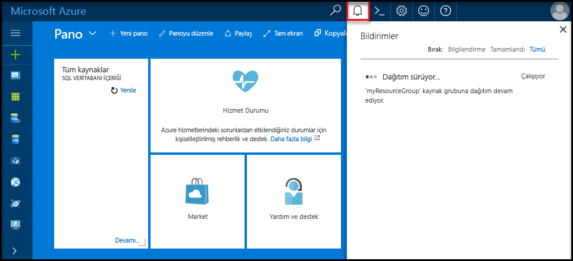

# <a name="design-your-first-azure-sql-database"></a>İlk Azure SQL veritabanınızı tasarlama

Azure SQL Veritabanı, Microsoft Bulut’ta (Azure) ilişkisel bir hizmet olarak veritabanıdır (DBaaS). Bu öğreticide, Azure portalını ve [SQL Server Management Studio](https://msdn.microsoft.com/library/ms174173.aspx)'yu (SSMS) kullanarak şu işlemleri gerçekleştirmeyi öğreneceksiniz: 

> [!div class="checklist"]
> * Azure portalında veritabanı oluşturma
> * Azure portalında sunucu düzeyinde güvenlik duvarı kuralı ayarlama
> * SSMS ile veritabanına bağlanma
> * SSMS ile tablo oluşturma
> * BCP ile toplu veri yükleme
> * Bu verileri SSMS ile sorgulama
> * Veritabanını Azure portalında [önceki bir zaman noktasına](sql-database-recovery-using-backups.md#point-in-time-restore) geri yükleme

Azure aboneliğiniz yoksa başlamadan önce [ücretsiz bir hesap oluşturun](https://azure.microsoft.com/free/).

## <a name="prerequisites"></a>Ön koşullar

Bu öğreticiyi tamamlamak için şunları yüklediğinizden emin olun:
- [SQL Server Management Studio](https://msdn.microsoft.com/library/ms174173.aspx)’nun (SSMS) en yeni sürümü.
- [BCP ve SQLCMD](https://www.microsoft.com/download/details.aspx?id=36433)’nin en yeni sürümü.

## <a name="log-in-to-the-azure-portal"></a>Azure portalında oturum açma

[Azure Portal](https://portal.azure.com/)’da oturum açın.

## <a name="create-a-blank-sql-database"></a>Boş bir SQL veritabanı oluşturma

Azure SQL veritabanı bir dizi [işlem ve depolama kaynağı](sql-database-service-tiers.md) ile oluşturulur. Veritabanı bir [Azure kaynak grubu](../azure-resource-manager/resource-group-overview.md) ve bir [Azure SQL Veritabanı mantıksal sunucusu](sql-database-features.md) içinde oluşturulur. 

Boş bir SQL veritabanı oluşturmak için aşağıdaki adımları izleyin. 

1. Azure portalının sol üst köşesinde bulunan **Kaynak oluştur** öğesine tıklayın.

2. **Yeni** penceresinden **Veritabanları**’nı seçin ve **Yeni** sayfasında **SQL Veritabanı**'nın altından **Oluştur**’u seçin.

   

3. SQL Veritabanı formunu, önceki görüntüde gösterildiği gibi aşağıdaki bilgilerle doldurun:   

   | Ayar       | Önerilen değer | Açıklama | 
   | ------------ | ------------------ | ------------------------------------------------- | 
   | **Veritabanı adı** | mySampleDatabase | Geçerli veritabanı adları için bkz. [Veritabanı Tanımlayıcıları](https://docs.microsoft.com/sql/relational-databases/databases/database-identifiers). | 
   | **Abonelik** | Aboneliğiniz  | Abonelikleriniz hakkında daha ayrıntılı bilgi için bkz. [Abonelikler](https://account.windowsazure.com/Subscriptions). |
   | **Kaynak grubu** | myResourceGroup | Geçerli kaynak grubu adları için bkz. [Adlandırma kuralları ve kısıtlamalar](https://docs.microsoft.com/azure/architecture/best-practices/naming-conventions). |
   | **Kaynak seçme** | Boş veritabanı | Boş bir veritabanı oluşturulması gerektiğini belirtir. |

4. Yeni veritabanınız için yeni bir sunucu oluşturup yapılandırmak üzere **Sunucu**’ya tıklayın. **Yeni sunucu formu**’nu aşağıdaki bilgilerle doldurun: 

   | Ayar       | Önerilen değer | Açıklama | 
   | ------------ | ------------------ | ------------------------------------------------- | 
   | **Sunucu adı** | Genel olarak benzersiz bir ad | Geçerli sunucu adları için bkz. [Adlandırma kuralları ve kısıtlamalar](https://docs.microsoft.com/azure/architecture/best-practices/naming-conventions). | 
   | **Sunucu yöneticisi oturum açma bilgileri** | Geçerli bir ad | Geçerli oturum açma adları için bkz. [Veritabanı Tanımlayıcıları](https://docs.microsoft.com/sql/relational-databases/databases/database-identifiers).|
   | **Parola** | Geçerli bir parola | Parolanızda en az 8 karakter bulunmalı ve parolanız şu üç kategoriden karakterler içermelidir: büyük harf karakterler, küçük harf karakterler, sayılar ve alfasayısal olmayan karakterler. |
   | **Konum** | Geçerli bir konum | Bölgeler hakkında bilgi için bkz. [Azure Bölgeleri](https://azure.microsoft.com/regions/). |

   

5. **Seç**'e tıklayın.

6. Hizmet katmanını, DTU'ların sayısını ve depolama alanı miktarını belirtmek için **Fiyatlandırma katmanı**’na tıklayın. Her hizmet katmanı için kullanılabilir DTU sayısı ve depolama alanı seçeneklerini araştırın. 

7. Bu öğreticide, **standart** hizmet katmanını seçip kaydırıcıyı kullanarak **100 DTU (S3)** ve **400** GB depolama alanını seçin.

   

8. **Ek Depolama** seçeneğini kullanmak için önizleme koşullarını kabul edin. 

   > [!IMPORTANT]
   > \* Mevcut depolama alanından büyük depolama alanları önizleme aşamasındadır ve ek maliyetler uygulanır. Ayrıntılar için bkz. [SQL Veritabanı fiyatlandırması](https://azure.microsoft.com/pricing/details/sql-database/). 
   >
   >\* Premium katmanında şu anda şu bölgelerde 1 TB’den fazla depolama mevcuttur: Avustralya Doğu, Avustralya Güneydoğu, Brezilya Güney, Orta Kanada, Doğu Kanada, Orta ABD, Fransa Orta, Orta Almanya, Doğu Japonya, Batı Japonya, Orta Kore, Kuzey Orta ABD, Kuzey Avrupa, Güney Orta ABD, Güneydoğu Asya, UK Güney, UK Batı, Doğu ABD2, Batı ABD, ABD Devleti Virginia ve Batı Avrupa. Bkz. [P11 P15 Geçerli Sınırlamalar](sql-database-resource-limits.md#single-database-limitations-of-p11-and-p15-when-the-maximum-size-greater-than-1-tb).  
   > 

9. Sunucu katmanını, DTU'ların sayısını ve depolama alanı miktarını seçtikten sonra **Uygula**’ya tıklayın.  

10. Boş veritabanı için bir **harmanlama** seçin (bu öğretici için varsayılan değeri kullanın). Harmanlamalar hakkında daha fazla bilgi için bkz. [Harmanlamalar](https://docs.microsoft.com/sql/t-sql/statements/collations)

11. SQL Veritabanı formunu tamamladıktan sonra veritabanını sağlamak için **Oluştur**’a tıklayın. Sağlama birkaç dakika sürer. 

12. Araç çubuğunda **Bildirimler**’e tıklayarak dağıtım işlemini izleyin.
    
     

## <a name="create-a-server-level-firewall-rule"></a>Sunucu düzeyinde bir güvenlik duvarı kuralı oluşturma

SQL Veritabanı hizmeti, güvenlik duvarını belirli IP adreslerine açmaya yönelik bir güvenlik duvarı kuralı oluşturulmadıkça, dış uygulama ve araçların sunucuya ya da sunucu üzerindeki herhangi bir veritabanına bağlanmasını engelleyen sunucu düzeyinde bir güvenlik duvarı kuralı oluşturur. SQL Veritabanı güvenlik duvarı üzerinden yalnızca IP adresinize yönelik dış bağlantıları etkinleştirmek üzere istemcinizin IP adresi için bir [SQL Veritabanı sunucu düzeyi güvenlik duvarı kuralı](sql-database-firewall-configure.md) oluşturmak için bu adımları izleyin. 

> [!NOTE]
> SQL Veritabanı 1433 numaralı bağlantı noktası üzerinden iletişim kurar. Bir kurumsal ağ içerisinden bağlanmaya çalışıyorsanız, ağınızın güvenlik duvarı tarafından 1433 numaralı bağlantı noktası üzerinden giden trafiğe izin verilmiyor olabilir. Bu durumda BT departmanınız 1433 numaralı bağlantı noktasını açmadığı sürece Azure SQL Veritabanı sunucunuza bağlanamazsınız.
>

1. Dağıtım tamamlandıktan sonra, soldaki menüden **SQL veritabanları**'na ve ardından **SQL veritabanları** sayfasında **mySampleDatabase** öğesine tıklayın. Veritabanınıza ilişkin genel bakış sayfası açılır ve tam sunucu adı (örneğin, **mynewserver-20170824.database.windows.net**) görüntülenerek daha fazla yapılandırma seçeneği sunulur. 

2. Sonraki hızlı başlangıçlarda sunucunuza ve veritabanlarına bağlanmak için bu tam sunucu adını kopyalayın. 

    

3. Araç çubuğunda **Sunucu güvenlik duvarını ayarla**’ya tıklayın. SQL Veritabanı sunucusu için **Güvenlik duvarı ayarları** sayfası açılır. 

    

4. Geçerli IP adresinizi yeni bir güvenlik duvarı kuralına eklemek için araç çubuğunda **İstemci IP’si Ekle** öğesine tıklayın. Güvenlik duvarı kuralı, 1433 numaralı bağlantı noktasını tek bir IP adresi veya bir IP adresi aralığı için açabilir.

5. **Kaydet**’e tıklayın. Geçerli IP adresiniz için mantıksal sunucuda 1433 numaralı bağlantı noktası açılarak sunucu düzeyinde güvenlik duvarı kuralı oluşturulur.

6. **Tamam**’a tıklayın ve sonra **Güvenlik duvarı ayarları** sayfasını kapatın.

Artık SQL Server Management Studio’yu veya seçtiğiniz başka bir aracı kullanarak, daha önce oluşturduğunuz sunucu yöneticisi hesabıyla bu IP adresinden SQL Veritabanı sunucusuna ve sunucuya ait veritabanlarına bağlanabilirsiniz.

> [!IMPORTANT]
> Varsayılan olarak, SQL Veritabanı güvenlik duvarı üzerinden erişim tüm Azure hizmetleri için etkindir. Tüm Azure hizmetleri için devre dışı bırakmak isterseniz bu sayfadaki **KAPALI** öğesine tıklayın.

## <a name="sql-server-connection-information"></a>SQL Server bağlantı bilgileri

Azure SQL Veritabanı sunucunuzun tam sunucu adını Azure portaldan alabilirsiniz. SQL Server Management Studio kullanarak sunucunuza bağlanmak için tam sunucu adını kullanırsınız.

1. [Azure Portal](https://portal.azure.com/)’da oturum açın.
2. Soldaki menüden **SQL Veritabanları**’nı seçin ve **SQL veritabanları** sayfasında veritabanınıza tıklayın. 
3. Veritabanınızın Azure portal sayfasındaki **Temel Bilgiler** bölmesinde, **Sunucu adını** bulup kopyalayın.

   

## <a name="connect-to-the-database-with-ssms"></a>SSMS ile veritabanına bağlanma

[SQL Server Management Studio](https://docs.microsoft.com/sql/ssms/sql-server-management-studio-ssms)’yu kullanarak Azure SQL Veritabanı sunucunuzla bağlantı kurun.

1. SQL Server Management Studio’yu açın.

2. **Sunucuya Bağlan** iletişim kutusuna şu bilgileri girin:

   | Ayar       | Önerilen değer | Açıklama | 
   | ------------ | ------------------ | ------------------------------------------------- | 
   | Sunucu türü | Veritabanı altyapısı | Bu değer gereklidir |
   | Sunucu adı | Tam sunucu adı | Ad şunun gibi olmalıdır: **mynewserver20170824.database.windows.net**. |
   | Kimlik Doğrulaması | SQL Server Kimlik Doğrulaması | Bu öğreticide yapılandırdığımız tek kimlik doğrulaması türü SQL Kimlik Doğrulamasıdır. |
   | Oturum Aç | Sunucu yöneticisi hesabı | Bu, sunucuyu oluştururken belirttiğiniz hesaptır. |
   | Parola | Sunucu yöneticisi hesabınızın parolası | Bu, sunucuyu oluştururken belirttiğiniz paroladır. |

   

3. **Sunucuya bağlan** iletişim kutusunda **Seçenekler**’e tıklayın. **Veritabanına bağlan** bölümünde bu veritabanına bağlanmak için **mySampleDatabase** yazın.

     

4. **Bağlan**'a tıklayın. SSMS’te Nesne Gezgini penceresi açılır. 

5. Nesne Gezgini’nde **Veritabanları**’nı ve ardından **mySampleDatabase** öğesini genişleterek nesneleri örnek veritabanında görüntüleyin.

     

## <a name="create-tables-in-the-database"></a>Veritabanında tablo oluşturma 

[Transact-SQL](https://docs.microsoft.com/sql/t-sql/language-reference) kullanarak üniversiteler için bir öğrenci yönetim sistemi modelleyen dört tablo ile bir veritabanı şeması oluşturun:

- Kişi
- Ders
- Öğrenci
- Üniversiteler için öğrenci yönetim sistemi modelleyen kredi

Aşağıdaki diyagramda bu tabloların birbirleriyle nasıl ilişkili olduğu gösterilmektedir. Bu tablolardan bazıları başka tablolardaki sütunlara başvurur. Örneğin Öğrenci tablosu, **Kişi** tablosundaki **Kişi Kimliği** sütununa başvurur. Bu öğreticideki tabloların birbirleriyle ilişkisini anlamak için diyagram üzerinde çalışın. Etkili veritabanı tabloları oluşturmaya ilişkin ayrıntılı bir bakış için bkz. [Etkili veritabanı tabloları oluşturma](https://msdn.microsoft.com/library/cc505842.aspx). Veri türleri seçme hakkında bilgi için bkz. [Veri türleri](https://docs.microsoft.com/sql/t-sql/data-types/data-types-transact-sql).

> [!NOTE]
> Tablolarınızı oluşturup tasarlamak için [SQL Server Management Studio’daki tablo tasarımcısını](https://msdn.microsoft.com/library/hh272695.aspx) da kullanabilirsiniz. 


1. Nesne Gezgini’nde **mySampleDatabase** öğesine sağ tıklayıp **Yeni Sorgu**’ya tıklayın. Veritabanınıza bağlı boş bir sorgu penceresi açılır.

2. Sorgu penceresinde aşağıdaki sorguyu yürüterek veritabanınızda dört tablo oluşturun: 

   ```sql 
   -- Create Person table

   CREATE TABLE Person
   (
   PersonId   INT IDENTITY PRIMARY KEY,
   FirstName   NVARCHAR(128) NOT NULL,
   MiddelInitial NVARCHAR(10),
   LastName   NVARCHAR(128) NOT NULL,
   DateOfBirth   DATE NOT NULL
   )
   
   -- Create Student table
 
   CREATE TABLE Student
   (
   StudentId INT IDENTITY PRIMARY KEY,
   PersonId  INT REFERENCES Person (PersonId),
   Email   NVARCHAR(256)
   )
   
   -- Create Course table
 
   CREATE TABLE Course
   (
   CourseId  INT IDENTITY PRIMARY KEY,
   Name   NVARCHAR(50) NOT NULL,
   Teacher   NVARCHAR(256) NOT NULL
   ) 

   -- Create Credit table
 
   CREATE TABLE Credit
   (
   StudentId   INT REFERENCES Student (StudentId),
   CourseId   INT REFERENCES Course (CourseId),
   Grade   DECIMAL(5,2) CHECK (Grade <= 100.00),
   Attempt   TINYINT,
   CONSTRAINT  [UQ_studentgrades] UNIQUE CLUSTERED
   (
   StudentId, CourseId, Grade, Attempt
   )
   )
   ```

   

3. Oluşturduğunuz tabloları görmek için SQL Server Management Studio Nesne gezginindeki 'tablolar' düğümünü genişletin.

   

## <a name="load-data-into-the-tables"></a>Tablolara veri yükleme

1. Veritabanınızın örnek verilerini depolamak için İndirilenler klasörünüzde **SampleTableData** adlı bir klasör oluşturun. 

2. Aşağıdaki bağlantılara sağ tıklayın ve **SampleTableData** klasörüne kaydedin. 

   - [SampleCourseData](https://sqldbtutorial.blob.core.windows.net/tutorials/SampleCourseData)
   - [SamplePersonData](https://sqldbtutorial.blob.core.windows.net/tutorials/SamplePersonData)
   - [SampleStudentData](https://sqldbtutorial.blob.core.windows.net/tutorials/SampleStudentData)
   - [SampleCreditData](https://sqldbtutorial.blob.core.windows.net/tutorials/SampleCreditData)

3. Bir komut istemi penceresi açın ve SampleTableData klasörüne gidin.

4. Tablolara örnek veriler eklemek için **ServerName**, **DatabaseName**, **UserName** ve **Password** değerlerini ortamınızın değerleriyle değiştirerek aşağıdaki komutları yürütün.
  
   ```bcp
   bcp Course in SampleCourseData -S <ServerName>.database.windows.net -d <DatabaseName> -U <Username> -P <password> -q -c -t ","
   bcp Person in SamplePersonData -S <ServerName>.database.windows.net -d <DatabaseName> -U <Username> -P <password> -q -c -t ","
   bcp Student in SampleStudentData -S <ServerName>.database.windows.net -d <DatabaseName> -U <Username> -P <password> -q -c -t ","
   bcp Credit in SampleCreditData -S <ServerName>.database.windows.net -d <DatabaseName> -U <Username> -P <password> -q -c -t ","
   ```

Daha önce oluşturduğunuz tablolara örnek veriler yüklediniz.

## <a name="query-data"></a>Verileri sorgulama

Veritabanı tablolarından bilgi almak için aşağıdaki sorguları yürütün. SQL sorguları yazma hakkında daha fazla bilgi almak için bkz. [SQL Sorguları Yazma](https://technet.microsoft.com/library/bb264565.aspx). İlk sorgu, 'Dominick Pope'tan ders alıp sınıfın %75’inden yüksek not alan tüm öğrencileri bulmak için dört tablonun tamamını birleştirir. İkinci sorgu dört tablonun tamamını birleştirir ve 'Noe Coleman'ın herhangi bir zamanda kaydolduğu tüm dersleri bulur.

1. SQL Server Management Studio sorgu penceresinde aşağıdaki sorguyu yürütün:

   ```sql 
   -- Find the students taught by Dominick Pope who have a grade higher than 75%

   SELECT  person.FirstName,
   person.LastName,
   course.Name,
   credit.Grade
   FROM  Person AS person
   INNER JOIN Student AS student ON person.PersonId = student.PersonId
   INNER JOIN Credit AS credit ON student.StudentId = credit.StudentId
   INNER JOIN Course AS course ON credit.CourseId = course.courseId
   WHERE course.Teacher = 'Dominick Pope' 
   AND Grade > 75
   ```

2. SQL Server Management Studio sorgu penceresinde aşağıdaki sorguyu yürütün:

   ```sql
   -- Find all the courses in which Noe Coleman has ever enrolled

   SELECT  course.Name,
   course.Teacher,
   credit.Grade
   FROM  Course AS course
   INNER JOIN Credit AS credit ON credit.CourseId = course.CourseId
   INNER JOIN Student AS student ON student.StudentId = credit.StudentId
   INNER JOIN Person AS person ON person.PersonId = student.PersonId
   WHERE person.FirstName = 'Noe'
   AND person.LastName = 'Coleman'
   ```

## <a name="restore-a-database-to-a-previous-point-in-time"></a>Bir veritabanını daha önceki bir noktaya geri yükleme

Bir tabloyu yanlışlıkla sildiğinizi düşünün. Bu işlemi kolayca geri alamazsınız. Azure SQL Veritabanı, son 35 günde zamanın herhangi bir noktasına geri dönmenize ve bu zaman noktasını yeni bir veritabanına geri yüklemenize olanak tanır. Bu veritabanını kullanarak silinen verilerinizi kurtarabilirsiniz. Aşağıdaki adımlar, örnek veritabanını tablolar eklenmeden önceki bir noktaya geri yükler.

1. Veritabanınızın SQL Veritabanı sayfasında, araç çubuğundaki **Geri Yükle**’ye tıklayın. **Geri Yükle** sayfası açılır.

   

2. **Geri Yükleme** formunu gerekli bilgiler ile doldurun:
    * Veritabanı adı: Bir veritabanı adı sağlayın 
    * Zaman noktası: Geri Yükleme formunda **Zaman noktası** sekmesini seçin 
    * Geri yükleme noktası: Veritabanı değiştirilmeden önce gerçekleşen bir zaman seçin
    * Hedef sunucu: Bir veritabanını geri yüklerken bu değeri değiştiremezsiniz 
    * Elastik veritabanı havuzu: **Yok**’u seçin  
    * Fiyatlandırma katmanı: **20 DTU** ve **40 GB** depolamayı seçin.

   

3. Veritabanını tablolar eklenmeden önceki [bir zaman noktasına geri yüklemek](sql-database-recovery-using-backups.md#point-in-time-restore) için **Tamam**’a tıklayın. Veritabanının farklı bir zaman noktasına geri yüklenmesi, [hizmet katmanınızın](sql-database-service-tiers.md) elde tutma dönemi içinde olmak şartıyla, belirttiğiniz zaman noktasından itibaren özgün veritabanı ile aynı sunucuda bir kopya veritabanı oluşturur.

## <a name="next-steps"></a>Sonraki adımlar 
Bu öğreticide, veritabanı ve tablo oluşturma, veri yükleme ve sorgulama ve veritabanını önceki bir zaman noktasına geri yükleme gibi temel veritabanı görevlerini öğrendiniz. Şunları öğrendiniz:
> [!div class="checklist"]
> * Veritabanı oluşturma
> * Güvenlik duvarı kuralı ayarlama
> * [SQL Server Management Studio](https://msdn.microsoft.com/library/ms174173.aspx) (SSMS) kullanarak veritabanına bağlanma
> * Tablo oluşturma
> * Toplu veri yükleme
> * Bu verileri sorgulama
> * SQL Veritabanı [zaman noktası geri yükleme](sql-database-recovery-using-backups.md#point-in-time-restore) özelliklerini kullanarak veritabanını önceki bir noktaya geri yükleme

Visual Studio ve C# kullanarak veritabanı tasarlama hakkında bilgi edinmek için sonraki öğreticiye geçin.

> [!div class="nextstepaction"]
>[C# ve ADO.NET ile bir Azure SQL veritabanı tasarlama ve bağlama](sql-database-design-first-database-csharp.md)
