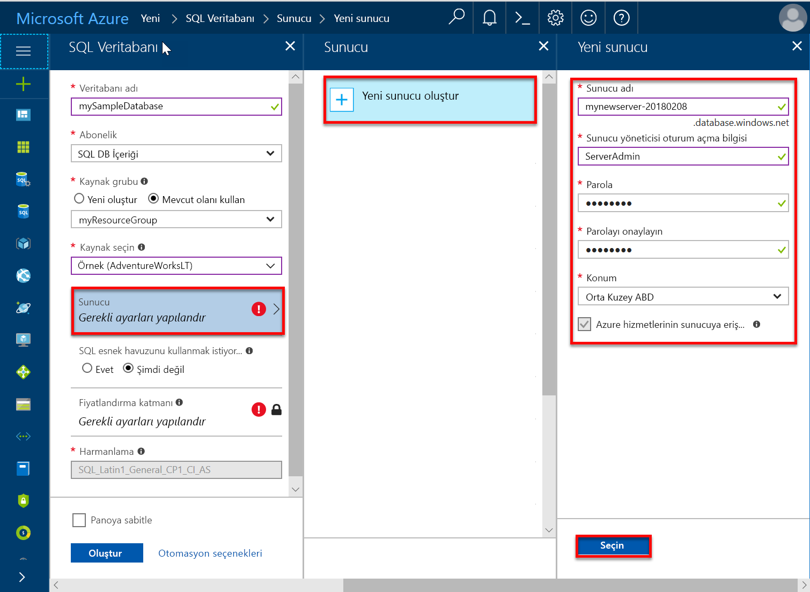
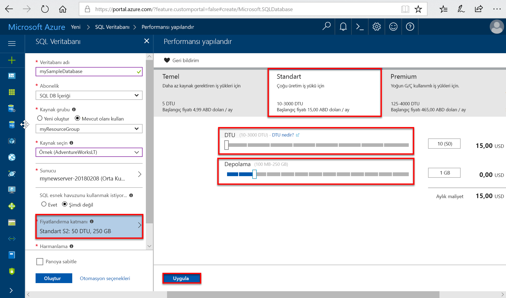

# <a name="quickstart-create-an-azure-sql-database-in-the-azure-portal"></a>Hızlı Başlangıç: Azure portalında Azure SQL veritabanı oluşturma

Azure SQL veritabanı, bir *hizmet olarak veritabanı* olanak tanıyan bulutta yüksek oranda kullanılabilir SQL Server veritabanlarını çalıştırıp ölçeklendirmenize. Bu hızlı başlangıçta oluşturmaya ve ardından Azure portalını kullanarak Azure SQL veritabanını sorgulamaya başlayın gösterilmektedir. 

Azure aboneliğiniz yoksa başlamadan önce [ücretsiz bir hesap oluşturun](https://azure.microsoft.com/free/).

Bu hızlı Başlangıçta tüm adımları için oturum açın [Azure portalında](https://portal.azure.com/).

## <a name="create-a-sql-database"></a>SQL veritabanı oluşturma

Bir Azure SQL veritabanı bir dizi tanımlanmış olan [işlem ve depolama kaynaklarını](sql-database-service-tiers-dtu.md). Veritabanında oluşturduğunuz bir [Azure SQL veritabanı mantıksal sunucusu](sql-database-features.md) içinde bir [Azure kaynak grubu](../azure-resource-manager/resource-group-overview.md).

AdventureWorksLT örnek verilerini içeren bir SQL veritabanı oluşturmak için:

1. Azure portalının sol üst köşesinde bulunan **Kaynak oluştur** öğesini seçin.
   
1. Seçin **veritabanları**ve ardından **SQL veritabanı**.
   
1. İçinde **SQL veritabanı** form yazın veya aşağıdaki değerleri seçin: 
   
   - **Veritabanı adı**: Tür *mySampleDatabase*.
   - **Abonelik**: Açılan menü ve görünmüyorsa doğru aboneliği seçin.  
   - **Kaynak grubu**: Seçin **Yeni Oluştur**, türü *myResourceGroup*seçip **Tamam**. 
   - **Kaynak Seç**: Açılır listesine tıklayıp **örnek (AdventureWorksLT)**. 
   
   >[!IMPORTANT]
   >Seçtiğinizden emin olun **örnek (AdventureWorksLT)** bu ve bu verileri kullanan diğer Azure SQL veritabanı hızlı başlangıçları izleyebilmeniz veri. 
   
   
   
1. Seçin **sunucu**ve ardından **yeni sunucu oluştur**. 
   
1. İçinde **yeni sunucu** form yazın veya aşağıdaki değerleri seçin: 
   
   - **Sunucu adı**: Tür *mysqlserver*.
   - **Sunucu Yöneticisi oturum açma**: Tür *azureuser*. 
   - **Parola**: Tür *Azure1234567*. 
   - **Parolayı onaylayın**: Parolayı yeniden yazın.
   - **Konum**: Açılan menü ve herhangi bir geçerli konumu seçin.  
   
   >[!IMPORTANT]
   >Sunucu Yöneticisi oturum açma ve parola, sunucu ve veritabanları için bu ve diğer hızlı başlangıçlar oturum açabilmek kaydetmek veya unutmayın. Oturum açma veya parolayı unutursanız, oturum açma adı veya parola sıfırlamasına **SQL server** sayfası. Açmak için **SQL server** sayfasında, veritabanı sunucu adını seçin **genel bakış** veritabanı oluşturulduktan sonra sayfa.
   
1. Seçin **seçin**.
   
   
   
1. Üzerinde **SQL veritabanı** form, select **fiyatlandırma katmanı**. Dtu ve her hizmet katmanı için kullanılabilir depolama miktarını keşfedin.
   
   >[!NOTE]
   >Bu hızlı başlangıçta kullanılmaktadır [DTU tabanlı satın alma modeli](sql-database-service-tiers-dtu.md), ancak [sanal çekirdek tabanlı satın alma modeli](sql-database-service-tiers-vcore.md) de kullanılabilir.
   
   >[!NOTE]
   >1 TB'den fazla depolama Premium katmanında şu anda tüm bölgelerde kullanılabilir: UK Kuzey, Batı Orta ABD, Birleşik Krallık South2, Çin Doğu, USDoDCentral, Almanya Orta, USDoDEast, ABD Devleti Southwest, ABD Devleti Güney Orta, Almanya Kuzeydoğu, Çin Kuzey ve ABD Devleti Doğu. Bu bölgelerde Premium katmanda depolama için 1 TB üst sınırı uygulanır. Daha fazla bilgi için [P11 P15 geçerli sınırlamalar](sql-database-dtu-resource-limits-single-databases.md#single-database-limitations-of-p11-and-p15-when-the-maximum-size-greater-than-1-tb).  
   
1. Bu hızlı başlangıçta seçin **standart** Hizmet katmanını ve seçip kaydırıcıyı kullanarak **10 Dtu (S0)** ve **1** GB depolama alanı.
   
1. **Uygula**’yı seçin.  
   
   
   
1. Üzerinde **SQL veritabanı** form, select **Oluştur** dağıtma ve kaynak grubu, sunucu ve veritabanı sağlama. 
   
   Dağıtım birkaç dakika sürer. Seçebileceğiniz **bildirimleri** dağıtım ilerlemesini izlemek için araç çubuğunda.

   

## <a name="query-the-sql-database"></a>SQL veritabanını sorgulama

Yerleşik sorgu aracını Azure portalında bir Azure SQL veritabanı oluşturduğunuza göre veritabanına bağlanmak ve verileri sorgulamak için kullanın.

1. Üzerinde **SQL veritabanı** seçin, veritabanı için sayfa **sorgu Düzenleyicisi (Önizleme)** soldaki menüde. 
   
   
   
1. Oturum açma bilgilerinizi yazın ve seçin **Tamam**.
   
1. Aşağıdaki sorguyu girin **sorgu Düzenleyicisi** bölmesi.
   
   ```sql
   SELECT TOP 20 pc.Name as CategoryName, p.name as ProductName
   FROM SalesLT.ProductCategory pc
   JOIN SalesLT.Product p
   ON pc.productcategoryid = p.productcategoryid;
   ```
   
1. Seçin **çalıştırma**ve ardından sorgu sonuçlarını gözden **sonuçları** bölmesi.

   
   
1. Kapat **sorgu Düzenleyicisi** sayfasında ve seçin **Tamam** kaydedilmemiş düzenlemelerinizi iptal etmek isteyip istemediğiniz sorulduğunda.

## <a name="clean-up-resources"></a>Kaynakları temizleme

Bu kaynak grubu, SQL server ve SQL veritabanı için gitmek isterseniz tutmak [sonraki adımlar](#next-steps) ve bağlanmak ve birkaç farklı yöntemler kullanarak veritabanını sorgulama hakkında bilgi edinin. 

Bu kaynakları kullanarak tamamladığınızda, aşağıda gösterildiği gibi silebilirsiniz:

1. Azure portalında sol menüden seçim yapın **kaynak grupları**ve ardından **myResourceGroup**.
1. Kaynak grubu sayfanızda seçin **kaynak grubunu Sil**. 
1. Tür *myResourceGroup* alan ve ardından **Sil**.

## <a name="next-steps"></a>Sonraki adımlar

- Şirket içi veya uzak Araçlar, Azure SQL veritabanınıza bağlanmak için bir sunucu düzeyinde güvenlik duvarı kuralı oluşturmanız gerekir. Daha fazla bilgi için [sunucu düzeyinde güvenlik duvarı kuralı oluşturma](sql-database-get-started-portal-firewall.md).
- Sunucu düzeyinde güvenlik duvarı kuralı oluşturduktan sonra [bağlanma ve sorgulama](sql-database-connect-query.md) birkaç farklı araçları ve dilleri kullanarak veritabanınızı. 
  - [SQL Server Management Studio kullanarak bağlanma ve sorgulama](sql-database-connect-query-ssms.md)
  - [Azure Data Studio kullanarak bağlanma ve sorgulama](https://docs.microsoft.com/sql/azure-data-studio/quickstart-sql-database?toc=/azure/sql-database/toc.json)
- Azure CLI kullanarak Azure SQL veritabanı oluşturmak için bkz [Azure CLI örnekleri](sql-database-cli-samples.md).
- Azure PowerShell kullanarak Azure SQL veritabanı oluşturmak için bkz [Azure PowerShell örnekleri](sql-database-powershell-samples.md).
