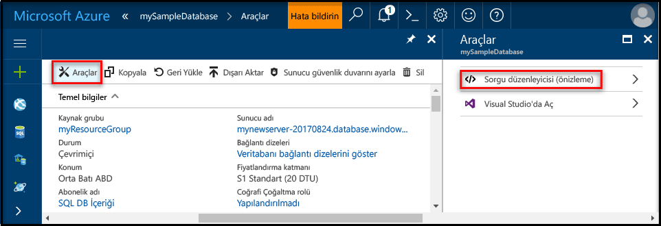
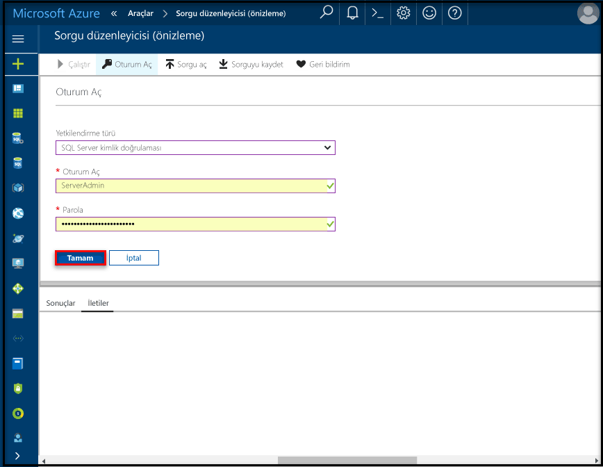

# <a name="create-an-azure-sql-database-in-the-azure-portal"></a>Azure portalında Azure SQL veritabanı oluşturma

Bu hızlı başlangıç öğreticisinde, Azure’da SQL veritabanı oluşturma adımlar gösterilmektedir. Azure SQL Veritabanı, bulutta yüksek oranda kullanılabilir SQL Server veritabanlarını çalıştırıp ölçeklendirmenize olanak tanıyan bir “Hizmet Olarak Veritabanı” teklifidir. Bu hızlı başlangıç, Azure portalını kullanarak bir SQL veritabanı oluşturma işlemini göstermektedir.

Azure aboneliğiniz yoksa başlamadan önce [ücretsiz](https://azure.microsoft.com/free/) bir hesap oluşturun.

## <a name="log-in-to-the-azure-portal"></a>Azure portalında oturum açma

[Azure Portal](https://portal.azure.com/)’da oturum açın.

## <a name="create-a-sql-database"></a>SQL veritabanı oluşturma

Azure SQL veritabanı bir dizi [işlem ve depolama kaynağı](sql-database-service-tiers.md) ile oluşturulur. Veritabanı bir [Azure kaynak grubu](../azure-resource-manager/resource-group-overview.md) ve bir [Azure SQL Veritabanı mantıksal sunucusu](sql-database-features.md) içinde oluşturulur. 

Adventure Works LT örnek verilerini içeren bir SQL veritabanı oluşturmak için bu adımları izleyin. 

1. Azure portalının sol üst köşesinde bulunan **Yeni** düğmesine tıklayın.

2. **Yeni** penceresinden **Veritabanları**’nı seçin ve **Veritabanları** penceresinden **SQL Veritabanı**’nı seçin.

   

3. SQL Veritabanı formunu, önceki görüntüde gösterildiği gibi aşağıdaki bilgilerle doldurun:   

   | Ayar       | Önerilen değer | Açıklama | 
   | ------------ | ------------------ | ------------------------------------------------- | 
   | **Veritabanı adı** | mySampleDatabase | Geçerli veritabanı adları için bkz. [Veritabanı Tanımlayıcıları](https://docs.microsoft.com/en-us/sql/relational-databases/databases/database-identifiers). | 
   | **Abonelik** | Aboneliğiniz  | Abonelikleriniz hakkında daha ayrıntılı bilgi için bkz. [Abonelikler](https://account.windowsazure.com/Subscriptions). |
   | **Kaynak grubu**  | myResourceGroup | Geçerli kaynak grubu adları için bkz. [Adlandırma kuralları ve kısıtlamalar](https://docs.microsoft.com/azure/architecture/best-practices/naming-conventions). |
   | **Kaynak** | Örnek (AdventureWorksLT) | AdventureWorksLT şemasını ve verilerini yeni veritabanınıza yükler |

   > [!IMPORTANT]
   > Bu hızlı başlangıcın geri kalanında kullanılacağı için bu formdaki örnek veritabanını seçmeniz gerekir.
   > 

4. **Sunucu** altında **Gerekli ayarları yapılandır**’a tıklayıp, aşağıdaki görüntüde gösterildiği gibi SQL sunucusu (mantıksal sunucu) formunu aşağıdaki bilgilerle doldurun:   

   | Ayar       | Önerilen değer | Açıklama | 
   | ------------ | ------------------ | ------------------------------------------------- | 
   | **Sunucu adı** | Genel olarak benzersiz bir ad | Geçerli sunucu adları için bkz. [Adlandırma kuralları ve kısıtlamalar](https://docs.microsoft.com/azure/architecture/best-practices/naming-conventions). | 
   | **Sunucu yöneticisi oturum açma bilgileri** | Geçerli bir ad | Geçerli oturum açma adları için bkz. [Veritabanı Tanımlayıcıları](https://docs.microsoft.com/en-us/sql/relational-databases/databases/database-identifiers). |
   | **Parola** | Geçerli bir parola | Parolanızda en az 8 karakter bulunmalı ve parolanız şu üç kategoriden karakterler içermelidir: büyük harf karakterler, küçük harf karakterler, sayılar ve alfasayısal olmayan karakterler. |
   | **Abonelik** | Aboneliğiniz | Abonelikleriniz hakkında daha ayrıntılı bilgi için bkz. [Abonelikler](https://account.windowsazure.com/Subscriptions). |
   | **Kaynak grubu** | myResourceGroup | Geçerli kaynak grubu adları için bkz. [Adlandırma kuralları ve kısıtlamalar](https://docs.microsoft.com/azure/architecture/best-practices/naming-conventions). |
   | **Konum** | Geçerli bir konum | Bölgeler hakkında bilgi için bkz. [Azure Bölgeleri](https://azure.microsoft.com/regions/). |

   > [!IMPORTANT]
   > Burada belirttiğiniz sunucu yöneticisi kullanıcı adı ve parolası, bu hızlı başlangıcın sonraki bölümlerinde sunucuda ve veritabanlarında oturum açmak için gereklidir. Bu bilgileri daha sonra kullanmak üzere aklınızda tutun veya kaydedin. 
   >  

   

5. Formu tamamladığınızda **Seç**’e tıklayın.

6. Yeni veritabanınıza ait hizmet katmanını ve performans düzeyini belirtmek için **Fiyatlandırma katmanı**’na tıklayın. **20 DTU** ve **250** GB depolama seçmek için kaydırıcıyı kullanın. DTU hakkında daha fazla bilgi için bkz. [DTU nedir?](sql-database-what-is-a-dtu.md).

   

7. DTU miktarını seçtikten sonra **Uygula**’ya tıklayın.  

8. SQL Veritabanı formunu tamamladıktan sonra veritabanını sağlamak için **Oluştur**’a tıklayın. Sağlama birkaç dakika sürer. 

9. Araç çubuğunda **Bildirimler**’e tıklayarak dağıtım işlemini izleyin.

   

## <a name="create-a-server-level-firewall-rule"></a>Sunucu düzeyinde bir güvenlik duvarı kuralı oluşturma

SQL Veritabanı hizmeti, güvenlik duvarını belirli IP adreslerine açmaya yönelik bir güvenlik duvarı kuralı oluşturulmadıkça, dış uygulama ve araçların sunucuya ya da sunucu üzerindeki herhangi bir veritabanına bağlanmasını engelleyen sunucu düzeyinde bir güvenlik duvarı kuralı oluşturur. SQL Veritabanı güvenlik duvarı üzerinden yalnızca IP adresinize yönelik dış bağlantıları etkinleştirmek üzere istemcinizin IP adresi için bir [SQL Veritabanı sunucu düzeyi güvenlik duvarı kuralı](sql-database-firewall-configure.md) oluşturmak için bu adımları izleyin. 

> [!NOTE]
> SQL Veritabanı 1433 numaralı bağlantı noktası üzerinden iletişim kurar. Bir kurumsal ağ içerisinden bağlanmaya çalışıyorsanız, ağınızın güvenlik duvarı tarafından 1433 numaralı bağlantı noktası üzerinden giden trafiğe izin verilmiyor olabilir. Bu durumda BT departmanınız 1433 numaralı bağlantı noktasını açmadığı sürece Azure SQL Veritabanı sunucunuza bağlanamazsınız.
>

1. Dağıtım tamamlandıktan sonra, soldaki menüden **SQL veritabanları**'na ve ardından **SQL veritabanları** sayfasında **mySampleDatabase** öğesine tıklayın. Veritabanınıza ilişkin genel bakış sayfası açılır ve tam sunucu adı (örneğin, **mynewserver20170313.database.windows.net**) görüntülenerek daha fazla yapılandırma seçeneği sunulur. Daha sonra kullanmak üzere bu tam sunucu adını kopyalayın.

   > [!IMPORTANT]
   > Sonraki hızlı başlangıçlarda sunucunuza ve veritabanlarına bağlanmak için bu tam sunucu adı gerekir.
   > 

    

2. Önceki görüntüde gösterildiği gibi araç çubuğundaki **sunucu güvenlik duvarı ayarla** öğesine tıklayın. SQL Veritabanı sunucusu için **Güvenlik duvarı ayarları** sayfası açılır. 

    

3. Geçerli IP adresinizi yeni bir güvenlik duvarı kuralına eklemek için araç çubuğunda **İstemci IP’si Ekle** öğesine tıklayın. Güvenlik duvarı kuralı, 1433 numaralı bağlantı noktasını tek bir IP adresi veya bir IP adresi aralığı için açabilir.

4. **Kaydet** düğmesine tıklayın. Geçerli IP adresiniz için mantıksal sunucuda 1433 numaralı bağlantı noktası açılarak sunucu düzeyinde güvenlik duvarı kuralı oluşturulur.

    

4. **Tamam**’a tıklayın ve sonra **Güvenlik duvarı ayarları** sayfasını kapatın.

Artık SQL Server Management Studio’yu veya seçtiğiniz başka bir aracı kullanarak, daha önce oluşturduğunuz sunucu yöneticisi hesabıyla bu IP adresinden SQL Veritabanı sunucusuna ve sunucuya ait veritabanlarına bağlanabilirsiniz.

> [!IMPORTANT]
> Varsayılan olarak, SQL Veritabanı güvenlik duvarı üzerinden erişim tüm Azure hizmetleri için etkindir. Tüm Azure hizmetleri için devre dışı bırakmak isterseniz bu sayfadaki **KAPALI** öğesine tıklayın.
>

## <a name="query-the-sql-database"></a>SQL veritabanını sorgulama

Azure’da bir örnek veritabanı oluşturduktan sonra, veritabanına bağlanabildiğinizi ve verileri sorgulayabildiğinizi onaylamak üzere Azure portalındaki yerleşik sorgu aracını kullanın. 

1. Veritabanınız için SQL Veritabanı sayfasında, araç çubuğundaki **Araçlar**’a tıklayın. **Araçlar** sayfası açılır.

    

2. **Sorgu düzenleyicisi (önizleme)**’ye tıklayın, **Önizleme koşulları** onay kutusuna tıklayın ve ardından **Tamam**’a tıklayın. Sorgu düzenleyicisi sayfası açılır.

3. **Oturum aç**’a tıklayın ve istendiğinde **SQL Server kimlik doğrulamasını** seçin ve daha önce oluşturduğunuz sunucu yöneticisi oturum açma bilgilerini ve parolayı girin.

    

4. Oturum açmak için **Tamam**’a tıklayın.

5. Kimlik doğrulaması yaptıktan sonra sorgu düzenleyici bölmesine aşağıdaki sorguyu yazın.

   ```sql
   SELECT TOP 20 pc.Name as CategoryName, p.name as ProductName
   FROM SalesLT.ProductCategory pc
   JOIN SalesLT.Product p
   ON pc.productcategoryid = p.productcategoryid;
   ```

6. **Çalıştır**’a tıklayın ve **Sonuçlar** bölmesindeki sorgu sonuçlarını gözden geçirin.

   

7. **Sorgu düzenleyicisi** sayfasını ve **Araçlar** sayfasını kapatın.

## <a name="clean-up-resources"></a>Kaynakları temizleme

Bu kaynaklara başka bir hızlı başlangıç kılavuzu/öğretici (bkz. [Sonraki adımlar](#next-steps)) için gereksinim duymuyorsanız, aşağıdaki yaparak bu kaynakları silebilirsiniz:


1. Azure portalında sol taraftaki menüden, **Kaynak grupları**’na tıklayın ve ardından **myResourceGroup**’a tıklayın. 
2. Kaynak grubu sayfanızda, **Sil**’e tıklayın, metin kutusuna **myResourceGroup** yazın ve ardından **Sil**’e tıklayın.

## <a name="next-steps"></a>Sonraki adımlar

Artık bir veritabanınız olduğuna göre, sık kullandığınız araçlarla bağlanabilir ve sorgulayabilirsiniz. Aşağıdan aracınızı seçerek daha fazla bilgi edinin:

- [SQL Server Management Studio](sql-database-connect-query-ssms.md)
- [Visual Studio Code](sql-database-connect-query-vscode.md)
- [.NET](sql-database-connect-query-dotnet.md)
- [PHP](sql-database-connect-query-php.md)
- [Node.js](sql-database-connect-query-nodejs.md)
- [Java](sql-database-connect-query-java.md)
- [Python](sql-database-connect-query-python.md)
- [Ruby](sql-database-connect-query-ruby.md)

