<properties
    pageTitle="SQL Database öğreticisi: SQL veritabanı oluşturma | Microsoft Azure"
    description="SQL Veritabanı mantıksal sunucusu, sunucu güvenlik duvarı kuralı, SQL veritabanı ve örnek veriler oluşturma hakkında bilgi edinin. Ayrıca, istemci araçlarına bağlanma, kullanıcıları yapılandırma ve bir veritabanı güvenlik duvarı kuralı oluşturma hakkında bilgi alın."
    keywords="sql veritabanı öğreticisi, sql veritabanı oluşturma"
    services="sql-database"
    documentationCenter=""
    authors="CarlRabeler"
    manager="jhubbard"
    editor=""/>

<tags
    ms.service="sql-database"
    ms.workload="data-management"
    ms.tgt_pltfrm="na"
    ms.devlang="na"
    ms.topic="hero-article"
    ms.date="09/07/2016"
    ms.author="carlrab"/>

# SQL Veritabanı öğreticisi: Azure portalını kullanarak dakikalar içinde bir SQL veritabanı oluşturma

> [AZURE.SELECTOR]
- [Azure Portal](sql-database-get-started.md)
- [C#](sql-database-get-started-csharp.md)
- [PowerShell](sql-database-get-started-powershell.md)

Bu öğreticide, Azure portalını kullanarak şu işlemleri gerçekleştirmeyi öğreneceksiniz:

- Örnek verilerle bir Azure SQL veritabanı oluşturun.
- Tek bir IP adresi veya bir IP adresi aralığı için sunucu düzeyinde bir güvenlik duvarı kuralı oluşturma.

Aynı görevleri [C#](sql-database-get-started-csharp.md) veya [PowerShell](sql-database-get-started-powershell.md) kullanarak gerçekleştirebilirsiniz.

[AZURE.INCLUDE [Login](../../includes/azure-getting-started-portal-login.md)]

## İlk Azure SQL veritabanınızı oluşturma 

1. O anda bağlı değilseniz [Azure portal](http://portal.azure.com)’a bağlanın.
2. **Yeni**'ye ve **Veri + Depolama**'ya tıklayın; ardından, **SQL Veritabanı**'nı bulun.

    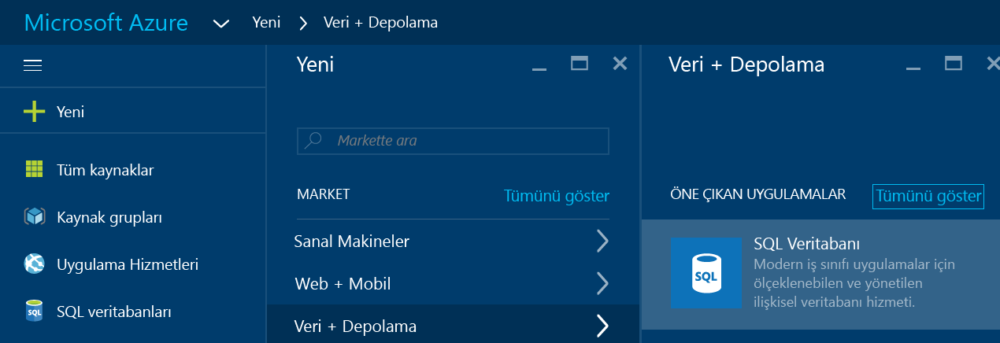

3. SQL Veritabanı dikey penceresini açmak için **SQL Veritabanı**'na tıklayın. Bu dikey penceredeki içerik, abonelik sayınıza ve var olan nesne (örneğin, var olan sunucular) sayınıza göre değişir.

    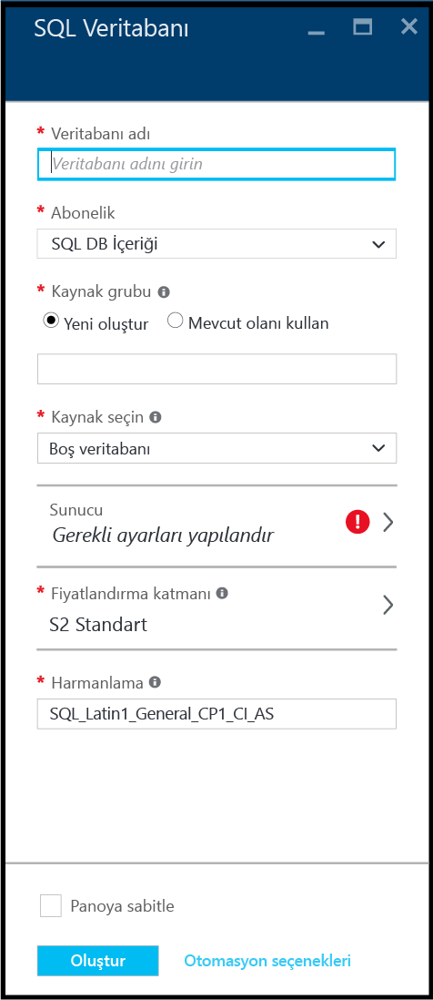

4. **Veritabanı adı** metin kutusunda, ilk veritabanınız için bir ad (örneğin, "veritabanım") sağlayın. Yeşil onay işareti, geçerli bir ad sağladığınızı gösterir.

    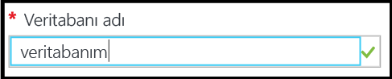

5. Birden çok aboneliğiniz varsa bir abonelik seçin.
6. **Kaynak grubu** altındaki **Yeni oluştur** seçeneğine tıklayıp ilk kaynak grubunuz için bir ad (örneğin, "kaynak grubum") sağlayın. Yeşil onay işareti, geçerli bir ad sağladığınızı gösterir.

    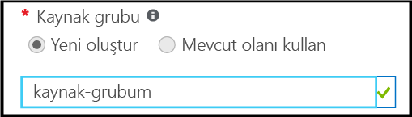

7. **Kaynak seç** altındaki **Örnek**'e tıklayın ve ardından **Örnek seç** altındaki **AdventureWorksLT [V12]** öğesine tıklayın.

    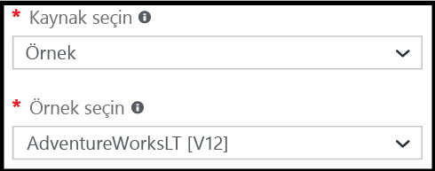

8. **Sunucu** altındaki **Gerekli ayarları yapılandır**'a tıklayın.

    

9. Sunucu dikey penceresinde, **Yeni sunucu oluştur**'a tıklayın. Sunucu nesnesinde bir Azure SQL veritabanı oluşturulur. Bu, yeni bir sunucu veya var olan bir sunucu olabilir.

    

10. Yeni sunucunuz için sağlamanız gereken bilgileri öğrenmek üzere **Yeni sunucu** dikey penceresini inceleyin.

    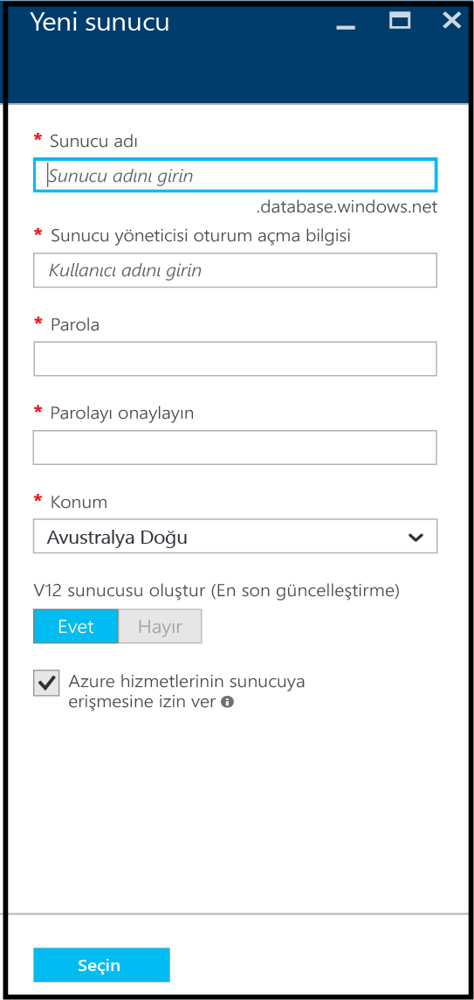

11. **Sunucu adı** metin kutusunda, ilk sunucunuz için bir ad (örneğin, "yeni sunucu nesnem") sağlayın. Yeşil onay işareti, geçerli bir ad sağladığınızı gösterir.

    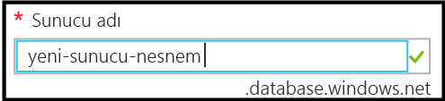
 
12. **Sunucu yöneticisi oturum açma** altında, bu sunucu için bir yönetici oturum açma kullanıcı adı (örneğin, "yönetici hesabım") sağlayın. Bu oturum açma işlemi, asıl sunucu oturum açma işlemi olarak bilinir. Yeşil onay işareti, geçerli bir ad sağladığınızı gösterir.

    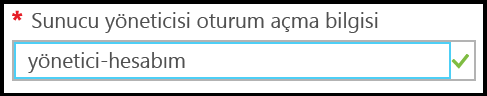

13. **Parola** ve **Parolayı onayla**'nın altında, asıl sunucu oturum açma hesabı için bir parola (örneğin, "p@ssw0rd1") sağlayın. Yeşil onay işareti, geçerli bir parola sağladığınızı gösterir.

    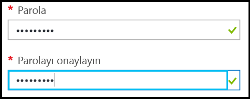
 
14. **Konum**'un altında, konumunuza uygun bir veri merkezi (örneğin, "Avustralya Doğu") seçin.

    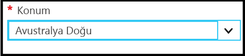

15. **V12 sunucusu oluştur (Son güncelleştirme) seçeneğinin altında, yalnızca Azure SQL sunucusunun geçerli sürümünü oluşturma seçeneğinizin olduğuna dikkat edin.

    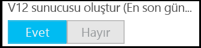

16. **Azure hizmetlerinin sunucuya erişmesine izin ver** seçeneği için onay kutusunun varsayılan olarak seçili olduğuna ve bu seçimin burada değiştirilemeyeceğine dikkat edin. Bu gelişmiş bir seçenektir. Çoğu senaryo için gerekli olmasa da sunucu güvenlik duvarı ayarlarına giderek ilgili ayarı bu sunucu nesnesi için değiştirebilirsiniz.

    

17. Yeni sunucu dikey penceresinde, seçimlerinizi gözden geçirin ve ardından yeni veritabanınız için bu sunucuyu belirlemek üzere **Seç**'e tıklayın.

    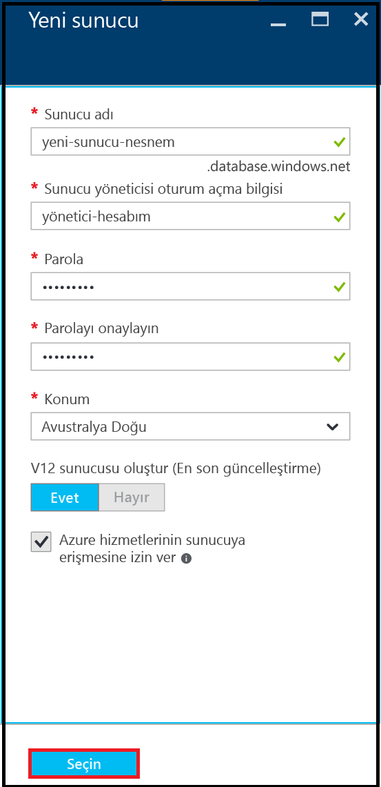

18. SQL Veritabanı dikey penceresindeki **Fiyatlandırma katmanı** seçeneğinin altında, ilk veritabanınız için en uygun maliyetli fiyatlandırma katmanını seçmek üzere **S2 Standard (S2 Standart)** seçeneğine ve ardından **Temel**'e tıklayın. Fiyatlandırma katmanını daha sonra istediğiniz zaman değiştirebilirsiniz.

    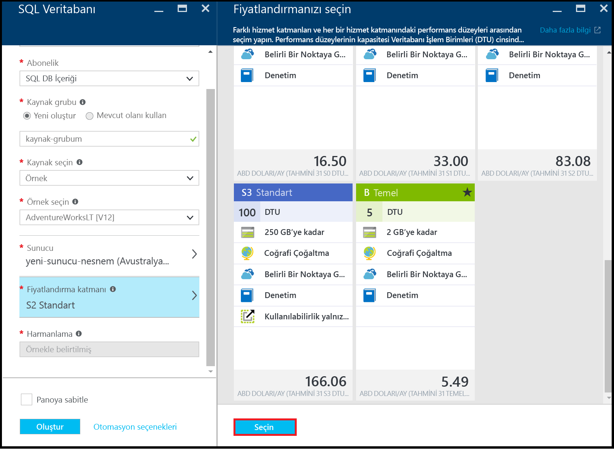

19. SQL Veritabanı dikey penceresinde, seçimlerinizi gözden geçirin ve ardından ilk sunucunuzu ve veritabanınızı oluşturmak için **Oluştur**'a tıklayın. Sağladığınız değerler doğrulandı ve dağıtım başlıyor.

    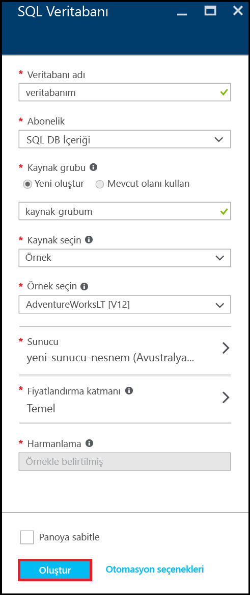

20. Dağıtımınızın durumunu denetlemek için Portal araç çubuğunda **Bildirimler** öğesine tıklayın.

    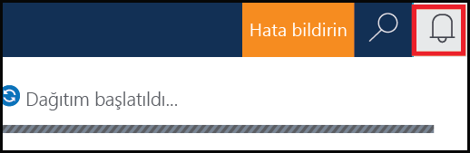

>[AZURE.IMPORTANT]Dağıtım tamamlandığında, Azure'da yeni Azure SQL sunucunuz ve veritabanınız oluşturulur. SQL Veritabanı güvenlik duvarını Azure dışındaki bağlantılara açmak için bir sunucu güvenlik duvarı kuralı oluşturana kadar, SQL Server araçlarını kullanarak yeni sunucunuza ve veritabanınıza bağlanamazsınız.

[AZURE.INCLUDE [Create server firewall rule](../../includes/sql-database-create-new-server-firewall-portal.md)]

## Sonraki adımlar
Bu SQL Veritabanı öğreticisini tamamladığınıza ve bazı örnek verilerle bir veritabanı oluşturduğunuza göre sık kullandığınız araçları kullanarak araştırmaya hazırsınız.

- Transact-SQL ve SQL Server Management Studio'yu (SSMS) daha önce kullandıysanız [SSMS ile bir SQL veritabanına bağlanma ve veritabanını sorgulama](sql-database-connect-query-ssms.md) işlemini nasıl gerçekleştireceğinizi öğrenin.

- Excel kullanmayı biliyorsanız [Excel ile Azure’da SQL veritabanına bağlanma](sql-database-connect-excel.md) işlemini nasıl gerçekleştireceğinizi öğrenin.

- Kodlamaya başlamak için hazırsanız [SQL Veritabanı ve SQL Server için bağlantı kitaplıkları](sql-database-libraries.md) konu başlığına göz atarak programlama dilinizi belirleyin.

- Şirket içi SQL Server veritabanlarınızı Azure'a taşımak istiyorsanız daha fazla bilgi edinmek için bkz. [Bir veritabanını SQL Veritabanı’na geçirme](sql-database-cloud-migrate.md).

- BCP komut satırı aracını kullanarak yeni bir tabloya bir CSV dosyasından bazı veriler yüklemek istiyorsanız bkz. [BCP kullanarak bir CSV dosyasından SQL Veritabanına veri yükleme](sql-database-load-from-csv-with-bcp.md).

- Azure SQL Veritabanı güvenliğini keşfetmeye başlamak istiyorsanız bkz. [Güvenliğe giriş](sql-database-get-started-security.md)

## Ek kaynaklar

[SQL Database nedir?](sql-database-technical-overview.md)

<!--HONumber=sep14_HO2-->

